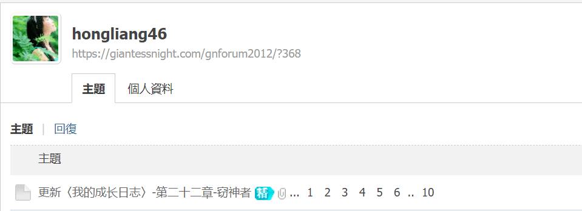

# 媛媛女神彻底失去对小人的兴趣了吗

作者：devil145

TID：30576

<title>1</title> <link href="../Styles/Style.css" type="text/css" rel="stylesheet">

# 1

*本帖最後由 lzp159 於 2021-3-28 12:50 編輯*

媛媛女神彻底失去对小人的兴趣了吗 QAQ……
时间定格在了2014年11月的第二十二章。
<ignore_js_op>

**媛媛.png** *(43.16 KB, 下載次數: 0)*

[下載附件](forum.php?mod=attachment&aid=ODc5OTF8ZTUyYTMzMzZ8MTY3NDA2NjAzNXwxODIzMHwzMDU3Ng%3D%3D&nothumb=yes)

2021-3-21 22:12 上傳

<title>2</title> <link href="../Styles/Style.css" type="text/css" rel="stylesheet">

# 2

可能只是没动力了

毕竟还是有登录的 <title>3</title> <link href="../Styles/Style.css" type="text/css" rel="stylesheet">

# 3

> [leo1223 發表於 2021-3-21 22:21](https://giantessnight.cf/gnforum2012/forum.php?mod=redirect&goto=findpost&pid=463403&ptid=30576)
> 可能只是没动力了
> 
> 毕竟还是有登录的

都长大了，物是人非了。可能她也没有以前的感觉了，我们的感觉也一直变化。
<title>4</title> <link href="../Styles/Style.css" type="text/css" rel="stylesheet">

# 4

> [诸君我喜欢 發表於 2021-3-22 13:09](https://giantessnight.cf/gnforum2012/forum.php?mod=redirect&goto=findpost&pid=463459&ptid=30576)
> 这圈人数本来就在逐渐流失，看看墙内的贴吧就知道了

贴吧情况复杂，首先就是受到大陆法律的限制和一些无脑举报二傻子的攻击，然后就是有段时间大超萌吧没有吧务，圈内不同党派的人之间又在互相攻伐，导致圈外来自五湖四海的老流氓（主要是某些失去亲人的gt党，还有少部分看不出成分的反串黑）开始爆吧，因此用户尽数流失。
看在各论坛人数增长并不明显的情况下，所以现在的情况是有可能大部分浅层用户已退坑，另一些人转到QQ群等不公开的地方，最后一些忠实用户才去到了各个论坛。

<title>5</title> <link href="../Styles/Style.css" type="text/css" rel="stylesheet">

# 5

所以你有网盘全集资源嘛？？我好久没看了 <title>6</title> <link href="../Styles/Style.css" type="text/css" rel="stylesheet">

# 6

> [诸君我喜欢 發表於 2021-3-22 18:08](https://giantessnight.cf/gnforum2012/forum.php?mod=redirect&goto=findpost&pid=463474&ptid=30576)
> 国家法律限制也是一方面，但是你不可否认的是这个圈子正在逐渐萎缩，本来就是小众xp圈子，人口基数就不多 ...

有时看着其他小众论坛有点羡慕啊，整个中国那么大可是gts这么小众

希望有一天墙可以撤掉让跟多新鲜血液进来吧

（其实gts海外还算不上那么小众……就是中文这里不知为啥挺小众的……）
<title>7</title> <link href="../Styles/Style.css" type="text/css" rel="stylesheet">

# 7

还是太期待媛媛的作品了，写的太有感觉了 <title>8</title> <link href="../Styles/Style.css" type="text/css" rel="stylesheet">

# 8

我感觉了解gts的人在增多，但圈子本身的核心人群在减少。考虑到年龄段，其实我感觉gts作品的产出者多是在二十岁左右，过了这个年纪基本就渐渐淡出了。 <title>9</title> <link href="../Styles/Style.css" type="text/css" rel="stylesheet">

# 9

毕竟GTS群体隐藏的比较深，这个癖好也不好公开哈哈哈哈，现在都习惯在论坛上看看，连个Q群都没有 <title>10</title> <link href="../Styles/Style.css" type="text/css" rel="stylesheet">

# 10

确实  这东西已经越来越萎缩了
就感觉好像这类xp在被治愈一样
也不知道为什么
我P站关注的很多画师也都停止更新了
那个FREE的最大外颜色网站也把国内的gts视频全部下架 <title>11</title> <link href="../Styles/Style.css" type="text/css" rel="stylesheet">

# 11

有好多以前的大佬都不咋更新了，但是也有好多新人做的也很好，反正墙外是这样的，墙内的人应该也不少，就是不好找到资源吧。 <title>12</title> <link href="../Styles/Style.css" type="text/css" rel="stylesheet">

# 12

做模拟觉生的dalao也消失好久了 现在漫画也越来越少 害 <title>13</title> <link href="../Styles/Style.css" type="text/css" rel="stylesheet">

# 13

这个我真感觉是残忍系的巅峰了，真希望有生之年还能再看到更新，不过大概应该也不可能了唉唉 <title>14</title> <link href="../Styles/Style.css" type="text/css" rel="stylesheet">

# 14

有生之年吧，或者等下一个大佬来续写吧。 <title>15</title> <link href="../Styles/Style.css" type="text/css" rel="stylesheet">

# 15

> 晋越时空 發表於 2021-4-18 20:57
> 确实  这东西已经越来越萎缩了
> 就感觉好像这类xp在被治愈一样
> 也不知道为什么

你说最大颜色网站是指pH吗？那其实是一堆都下架了不止gts</ignore_js_op>