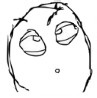

# 对Gonzres的小小吐槽……

作者：Cirno7Lover

TID：28944

<title>1</title> <link href="../Styles/Style.css" type="text/css" rel="stylesheet">

# 1

*本帖最後由 Cirno7Lover 於 2020-6-28 23:02 編輯*

Gonzres今年发的几个MMD，
给我的刺激都比起去年的MMD略逊一筹……

破坏的效果是越来越赞，也越来越简单粗暴……
其实相比单纯的破坏，我更喜欢他对GTS表情和肢体动作的描绘。
特别是3000倍小傘和3000倍海风那两期，看着太有感觉了！
有了这些我甚至都觉得那些台词都有点多余。

哎……
1分钟的那些不是说不好，只能说我有点审美疲劳了吧……
就我个人还是希望他能专心沉浸一两个月做个3分钟的MMD的。

其实能用爱发电到这种程度，我还是挺敬佩他的。
他开始发布视频的那两年，MMD的质量真的是飞跃般的上升。

可能还是我对他的期待太多了吧？
与其寄望于别人，不如自己做点什么。
暑假将至，说不定会填点自己挖的坑。
就这样，匿了……
<title>2</title> <link href="../Styles/Style.css" type="text/css" rel="stylesheet">

# 2

我觉得gts作者都要学学寺田的分镜 <title>3</title> <link href="../Styles/Style.css" type="text/css" rel="stylesheet">

# 3

别人做这个又不是说要追求什么排名,也不是要提升什么自己的技术啥的.更不是拿来恰饭
肯定是自己喜欢做啥做啥,不会有迷茫的说法的.
我认为他去年的MMD对你的刺激比今年的好,更有可能是你或者他口味变了,对你来说没那味了而已. <title>4</title> <link href="../Styles/Style.css" type="text/css" rel="stylesheet">

# 4

个人觉得最近的几部的确有点令人失望，但是细节有很大提升。既然他是根据自己的想法意愿去做，也没拿来恰饭什么的，所以我觉得我们也不能过多的说。
<title>5</title> <link href="../Styles/Style.css" type="text/css" rel="stylesheet">

# 5

凭兴趣做的东西质量起伏大很正常 <title>6</title> <link href="../Styles/Style.css" type="text/css" rel="stylesheet">

# 6

关心作者是好事，不过还需注意下用词，不然很容易被旁人解读成否定作者 <title>7</title> <link href="../Styles/Style.css" type="text/css" rel="stylesheet">

# 7

我觉得挺好的 就是视频有一点点短，但是他属于用爱发电的吧， 我印象中不记得他有Patreon或者fantia之类的东西

不过他更新算很稳定的 一个月大概是两部左右，估计也没时间做那么长的视频。

不像一些憋大招的 Azmaybe那种，几个月不出 然后一口气发一个接近十分钟的。

所以我觉得问题不大啦~ <title>8</title> <link href="../Styles/Style.css" type="text/css" rel="stylesheet">

# 8

主要是最近gonzres的视频内容变简单了，基本上就是一jio下去就完事。
但gonzres的视频最大特色本身就是对体型差的细节描写。这点来看到目前为止几乎是前无古人后无来者。几个经典镜头(皋月用脚趾分层夹断大厦，长月用一根手指压塌大楼，戳篮球场时比篮球架还高的多手指甲，江风抬腿撞烂飞机，秋月用手指碾碎楼房，皋月和长月把玩不及她们手指长的东京铁塔，还有被多次压成纸条的火车等等)重温几遍也依然看的人血脉喷张。。换言之，他的视频是真真切切用人们熟悉的身边的庞大物体在GTS手上的渺小与脆弱来进一步增强巨大的体型差的绝望感。 <title>9</title> <link href="../Styles/Style.css" type="text/css" rel="stylesheet">

# 9

gonzres我一直很喜欢他的作品，我感觉mmd很少有做得像他这么精致的了。 <title>10</title> <link href="../Styles/Style.css" type="text/css" rel="stylesheet">

# 10

本来是有点反对楼主的观点的，看了今天的更新，有点赞同了....今天这作也太没意思了... <title>11</title> <link href="../Styles/Style.css" type="text/css" rel="stylesheet">

# 11

*本帖最後由 Cirno7Lover 於 2020-6-28 23:11 編輯*

统一回复。
之前的发言是我失态了，在此给各位抱个歉。
一楼及标题我都大改了波，应该没那么多怨气了。
原文放这了，我会以此为戒的。
—————————————————————————
标题：总觉得Gonzres这半年来有点迷茫？

Gonzres今年发的几个MMD，
给我的刺激比起去年的MMD略逊一筹啊……

除了破坏的效果变好了以外就没什么特别吸引人的地方了……
看着他前天的投票，我都有点怕他是不是把GTS的size看得太重了。

其实相比单纯的破坏，我更喜欢他对GTS表情和肢体动作的描绘。
特别是3000倍小傘和3000倍海风那两期，看着太有感觉了！
有了这些我甚至都觉得那些台词都有点多余。

哎……
还是希望他能专心沉浸两个月做个3分钟的MMD。
毕竟对着1分钟的那些MMD我实在是没法提起兴致看……

<title>12</title> <link href="../Styles/Style.css" type="text/css" rel="stylesheet">

# 12

> [o_0MorToy 發表於 2020-6-27 20:55](https://giantessnight.cf/gnforum2012/forum.php?mod=redirect&goto=findpost&pid=440437&ptid=28944)
> 本来是有点反对楼主的观点的，看了今天的更新，有点赞同了....今天这作也太没意思了... ...

既视感太强了，有一种复刻的感觉。不过也只能继续期待下一部了
<title>13</title> <link href="../Styles/Style.css" type="text/css" rel="stylesheet">

# 13

质量有起伏很正常的，不过我个人感觉他的作品一直都挺不错的 <title>14</title> <link href="../Styles/Style.css" type="text/css" rel="stylesheet">

# 14

对的 虽然是用爱发电（他的推特都是刚刚创的 在里面汇报进度啥的）不过确实有几期质量不太行....想着两星期一下上ytb看看他又没有更新 然后一看更了不到一分钟也挺难受的（话说他下一期1w倍 虽然他3周没更了但是场景什么都是新的感觉有点期待）不过我感觉还是这样好 保证质量最重要 <title>15</title> <link href="../Styles/Style.css" type="text/css" rel="stylesheet">

# 15

dalao新作出了 别说了 太顶了