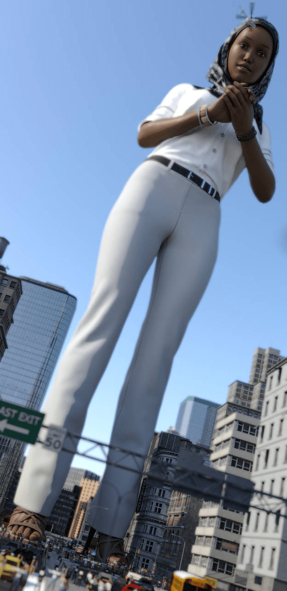
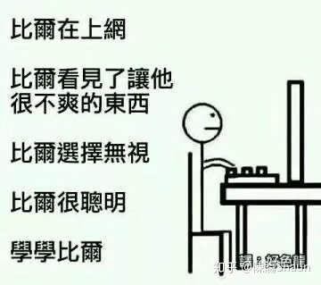

# 对政治正确的无语

作者：斯巴达

TID：26717

<title>1</title> <link href="../Styles/Style.css" type="text/css" rel="stylesheet">

# 1

最近D站画师UnseenHarbinger在他的主页po上了一张gts站在城市街道中的图，对一个专门画gts的优秀画师来说本是日常操作，然而不同寻常的是，这一次，画中的gts，是一位MSL（专指某教教徒）女性。Po主不仅在文字中明确表示主人公是一位MSL，还在作画的细节上突出了这一点，中东风的头巾、遮住腿部的长裤。至于为啥要画这个，po主解释说第一是因为时常收到画MSLgts的请求，第二是他觉得也应该包容更多的群体到这一个圈子里。
这我就搞不明白了，崇尚女性强大的gts圈，和一个把女性当牛做马视为男性附属品的宗教怎么可能包容到一块儿，自然地，po主也承认这张图可能引发争议，下面的评论也毫无意外地出现了撕逼和嘲讽。

由此可以想见白左政治正确的影响之深，连gts这种小圈子也受到了污染，首先这个世界上还有很多MSL女性是不带头巾不遮腿的，刻意遮掩人体美是某些愚昧落后的群体控制和压迫女性的手段，在这个本就是为了释放人的原始欲望而存在的圈子里简直滑稽，和在PronHub里头宣扬禁欲一样滑稽；其次在现时的背景下，要求画师去画MSL（为啥不请求画印度教徒、锡克教徒、飞天拉面神教徒？），这些对画师提出请求的粉丝也真是脑抽，说真的，一看见这张图，我的脑海里就止不住地蹦出但大的《炸弹嘉年华》里的种种boomboomboom的情节场景，这些脑抽的人真合适像小说中那样被boom掉。

这位po主是我非常喜欢的画师，但对于这种图我真是无语，我认为画师们不是不可以发表政治观点，比如同在D站的AlloyRabbit就时常画画嘲讽米国的川大统领，然而人家从来没在gts画作中加入政治方面的东西。因为被那张图着实恶心到了，因此想在咱们网站发泄一下感想，大家见谅。真心希望全世界的gts圈能纯净一点，少去掺和那些白左的政治正确。

<ignore_js_op>

**A7AEE588-45A0-4809-9302-5E8D78E45175.jpeg** *(87.33 KB, 下載次數: 1)*

[下載附件](forum.php?mod=attachment&aid=Nzc3NTF8Y2FiOTA2N2J8MTY3NDA2NjgzMnwxODIzMHwyNjcxNw%3D%3D&nothumb=yes)

2019-4-13 02:53 上傳

附上该图链接：
[https://www.deviantart.com/unsee ... Nightmare-789559134](https://www.deviantart.com/unseenharbinger/art/The-Frogman-s-Worst-Nightmare-789559134)

<title>2</title> <link href="../Styles/Style.css" type="text/css" rel="stylesheet">

# 2

反正鍵盤魔人哪裡都有，基本上笑笑帶過就算了，很多時候其實也不太會發生大ˋ問題 <title>3</title> <link href="../Styles/Style.css" type="text/css" rel="stylesheet">

# 3

GTS跟伊斯兰文化中的女性都算两个极端，这作者哪壶不开提哪壶。。。 <title>4</title> <link href="../Styles/Style.css" type="text/css" rel="stylesheet">

# 4

我寻思着这个画师是想政治正确，然后被政治正确了，严格意义上讲伊斯兰宗教也不是完全看不起女性，比如法蒂玛就是个例子 <title>5</title> <link href="../Styles/Style.css" type="text/css" rel="stylesheet">

# 5

不是很明白你的逻辑。是想说性癖的乐园里不应该出现衣服，还是男权的国度里不应该出现女尊幻想？
或许从我们的角度来看，作者为了体现MSL女性特点选而用的头巾也好长裤也好，是作者的偏见；或许提出request的人被政治正确所影响，思想并没有太开放。但把这些人形容为脑抽，有了这种图gts圈子就不纯净，这是为何？又是谁没有分清政治与爽图，受到了政治正确的影响？
确实你也说了“发泄感想，大家见谅”，很想见谅一下；但恕我直言，只能感受到你深深的傲气，所以我也不吐不快了。请见谅 <title>6</title> <link href="../Styles/Style.css" type="text/css" rel="stylesheet">

# 6

说起来 你有follow作者的Patreon吗？大更新过后Mrs Flowers的身材比例可以说是非常美国了。为了另一波口味独特的人所作出的调整。如此肥胖的体型，request的人是不是脑子也抽了？但就算是再奇怪的对象，也有人看着有感觉啊。这不是我们小圈子的人更容易明白的事情么 <title>7</title> <link href="../Styles/Style.css" type="text/css" rel="stylesheet">

# 7

这个图很好啊?没觉得有什么不同啊,这个接受不了,扶他怎么办? <title>8</title> <link href="../Styles/Style.css" type="text/css" rel="stylesheet">

# 8

老实说，我在D站经常见着各种为了政治正确或是少数人的爱好而绘制的奇怪的giantess，比如肥胖得跟一团肉球似得身体。。。
将心比心，我们这种爱好本来就是小众，如果你希望能被别人理解，那么同样地也要去理解别人。
但是。。。能不能TMD加个屏蔽功能或者不感兴趣功能，我不反对各人有各人得爱好，但是我真的不想看到那种肉球GTS。。。 <title>9</title> <link href="../Styles/Style.css" type="text/css" rel="stylesheet">

# 9

*本帖最後由 3213213210 於 2019-4-13 18:22 編輯*

呃，說實話，我完全看不懂你的點在哪

這張圖可能帶有歧視成分沒錯，他拿一些具有象徵意義的符號灌到一個人身上，
角色的存在意義就只是大量符號的集合體，這種毫無立體感的刻劃法可能會「加深弱勢族群的負面形象」，也就是一般定義下的歧視

可是，嗯，你提供的論點比他的「尊重多元文化」還弱啊

「崇尚女性權威 跟 不把女性當人看的文化，怎麼能擺在一起」
有一堆圖也是讓巨女當受的，有劇情是讓被霸凌的人復仇的，這種反差拿來當題材有問題嗎?

你怎麼會覺得人家包頭包腳就是「白人左膠的幻想」?
我翻了一下他的作品，他很喜歡拿服裝當角色的重點，真的要說的話他一堆圖都是建立在對特定服裝的刻板印象之上的
「刻意掩飾人體美是父權壓迫」，靠，這句才是超經典的父權台詞好不好，就像「運動選手不展現女體美是不尊敬社會」一樣的鬼話

他這樣是很不尊重穆斯林，他這樣是很自我感覺良好，
但是你用來攻擊的論點基本上只證明了你的政治正確跟他的不一樣

「如果沒有傳達多元價值不如不做、牽扯到壓抑女性主體性的創作不該出現」，
結論叫「GTS創作不該牽扯政治正確」……
[https://www.deviantart.com/unseenharbinger/art/Merry-Christmas-2017-8-722831637](https://www.deviantart.com/unseenharbinger/art/Merry-Christmas-2017-8-722831637)
那你能不能跟我講一下，這張刻板亞洲臉孔穿著聖誕老人服裝，算不算政治正確的產物?
如果今天他決定「為了避免引起不悅，我放棄做牽扯到種族的創作」，這不就會是超級純正的政治正確行為?

講白點，我覺得在文化包容方面這傢伙就是個智障沒錯，
但是你這種「保衛純潔性」的堅持，比什麼都想容納的正義魔人還要不得啊
<title>10</title> <link href="../Styles/Style.css" type="text/css" rel="stylesheet">

# 10

我觉得这个画师挺有创意的，，这么多年能yy的我都试过了，唯独没考虑过中东特色，， <title>11</title> <link href="../Styles/Style.css" type="text/css" rel="stylesheet">

# 11

哎，说好的色情面前世界和平呢？
有些硬不起来的人只能靠政治正确找存在感发泄欲望，实在是太可悲了。 <title>12</title> <link href="../Styles/Style.css" type="text/css" rel="stylesheet">

# 12

可能是我理解力太差
我看了完全不覺得有問題
如果你覺得穆斯林女性就該怎樣怎樣
那你就是把個人的認知套用在別人身上
再說，這圈子本來就是幻想
你把它想成是平行世界的穆斯林就好

很多人表面上開罵，私底下還不是真香？ <title>13</title> <link href="../Styles/Style.css" type="text/css" rel="stylesheet">

# 13

……拋開一切政治傾向來說，這世上總有令人不爽的事。
鍵政往往只會導致自己心情不好……

<title>14</title> <link href="../Styles/Style.css" type="text/css" rel="stylesheet">

# 14

 <ignore_js_op>[IMG_20190414_193628.jpg](forum.php?mod=attachment&aid=Nzc3NzV8NDlhMjUwYTZ8MTY3NDA2Njg0MHwxODIzMHwyNjcxNw%3D%3D&nothumb=yes) *(23.48 KB, 下載次數: 0)*

[下載附件](forum.php?mod=attachment&aid=Nzc3NzV8NDlhMjUwYTZ8MTY3NDA2Njg0MHwxODIzMHwyNjcxNw%3D%3D&nothumb=yes)

2019-4-14 19:36 上傳  

</ignore_js_op> <title>15</title> <link href="../Styles/Style.css" type="text/css" rel="stylesheet">

# 15

这个……见仁见智吧，其实只要内容充实的话政治正确也没啥</ignore_js_op>