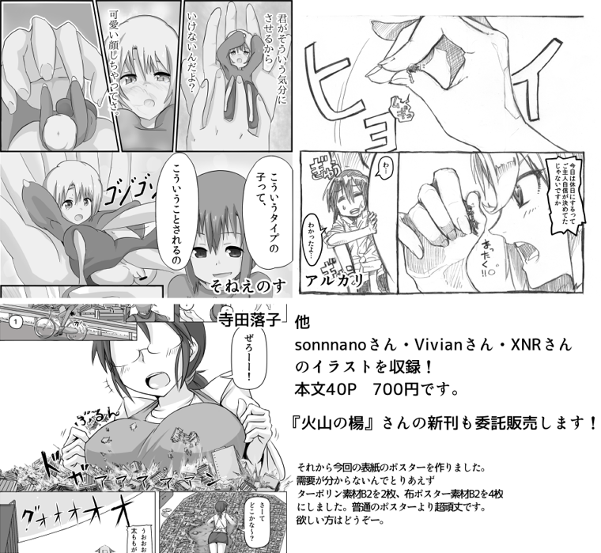

# 寺田C83同人本的华人外援！

作者：xnr

TID：13744

<title>1</title> <link href="../Styles/Style.css" type="text/css" rel="stylesheet">

# 1

*本文章最後由 xnr 於 2012-12-25 22:27 編輯*

终于就要迎来冬季的CM同人漫画展了，而其中的GTS同人志更是让人望眼欲穿啊！
因为是实体本，必须要挤入会场排队才能买到，而且数量极为有限，其入手难度可想而知。

还记得去年冬季C81的时候，但丁承受着高昂的机票和食宿费，孤身一人来到东京...
在寒冷的冬天挤在人山人海的会场去买GTS本（顺便跟寺田握个手，送盒凤梨酥啥的）
身为GN站长，如此身体力行，真是让人可歌可泣啊！

那个时候我就对但丁说，乖不哭，放心吧，今后一定不会让你孤♂单，我会打入他们内♂部的！

于是今年八月C82夏季同人展，寺田GTS本子里就有了我的身影： [http://gs-uploader.jpn.org/documents/ochiko/2012summer.jpg?dl=LVpTEtd3XNQ&t=1356442702&r=1f](http://gs-uploader.jpn.org/documents/ochiko/2012summer.jpg?dl=LVpTEtd3XNQ&t=1356442702&r=1f)

随后就是与寺田合作，出版日文化的V姐漫画，成功打入了日本GTS市场，且获得了空前的成功！

有了这样一次成功的合作开端，在大家的共同努力下，我将跟寺田的合作更进了一步！

于是今年冬季的C83同人展当中，在寺田的本子里有了：
Sonnano（浮云RP）插画一张
Vivian 插画一张
XNR 插画两张
与此同时，hte222 （火山の楊）也在寺田摊位寄售自己的同人本

<ignore_js_op></ignore_js_op> **2012huyu.png** *(493.96 KB, 下載次數: 10)*

[下載附件](forum.php?mod=attachment&aid=MzE5MzR8ODMzZDdmZTh8MTY3NDA2OTEwNXwxODIzMHwxMzc0NA%3D%3D&nothumb=yes)

2012-12-25 21:56 上傳

以上，外援都是华人啊有木有！GTS界最成功的跨国合作之一啊有木有！充分展现了华人的才华与智慧啊有木有！

短短一年的时间，我们就彻底扭转了孤立无援的局面，从独立创作、各自为战走向了合作共赢的舞台！

末日已去，新年即来，望诸位满怀对GTS爱与激情的同好，一起投入到我们伟大的事业中，再接再厉，创造GTS文化更美好的未来！ <title>2</title> <link href="../Styles/Style.css" type="text/css" rel="stylesheet">

# 2

x大这话的风格，这这变化太大啦。不过看起来倒是很有一番欣慰之感啊，嗯嗯继续努力啊啊啊 <title>3</title> <link href="../Styles/Style.css" type="text/css" rel="stylesheet">

# 3

恭喜恭喜！跨国合作。 <title>4</title> <link href="../Styles/Style.css" type="text/css" rel="stylesheet">

# 4

.
哼哼哼……你現在才發現你就是我對著日本放出去的一枝箭嗎？
看來這枝箭不僅命中紅心，甚至都在箭靶上生根發芽了呢。
所以說我才是功勞最大的人。

（系統提示：但丁遭到了痛毆，失去500點生命值）

OK……不開玩笑，這次參與支援的繪師確實都是一時之選。
能夠說服他們畫圖交稿應該也挺不容易的，就這點我要給你大力鼓掌。
當然也是很期待看見你用怎樣的圖去參與寺田的本子。

今年我是去不了了，廉價航空到了台灣就變成高價航空，台灣果然是凱子王國無誤。
不過像這樣的聯繫總是一件好事，也辛苦在這些交涉過程中提供翻譯服務的同好。
這些都是靠了各位的力量才能夠達到的，感謝各位。
結果今年我貌似只能在位子上咬著手帕看各位的偉業呢……

<title>5</title> <link href="../Styles/Style.css" type="text/css" rel="stylesheet">

# 5

> Dante 發表於 2012-12-25 23:46 
> .
> 哼哼哼……你現在才發現你就是我對著日本放出去的一枝箭嗎？
> 看來這枝箭不僅命中紅心，甚至都在箭靶上生 ...

連我的心都射穿啦(刺眼)
能跟外國人合作出本真是嫉妒死,事業……還是打機去
<title>6</title> <link href="../Styles/Style.css" type="text/css" rel="stylesheet">

# 6

CM...有机会的话真想去一次啊 <title>7</title> <link href="../Styles/Style.css" type="text/css" rel="stylesheet">

# 7

感谢Xnr同学的牵线搭桥开辟新战线！ <title>8</title> <link href="../Styles/Style.css" type="text/css" rel="stylesheet">

# 8

好我精神上支持!