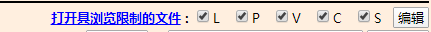

# 寺田的游戏一般都发在哪啊？

作者：gfktxds

TID：31644

<title>1</title> <link href="../Styles/Style.css" type="text/css" rel="stylesheet">

# 1

寺田我只知道推特，piviv，patreon，fantia和enty，但是呢，据我是知道的有些寺田游戏有些我并没有找到，比如科学部，根本毫无踪迹，找不到哪来的，很让我费解
寺田是不是还会别的地方发布游戏呢？

<title>2</title> <link href="../Styles/Style.css" type="text/css" rel="stylesheet">

# 2

[https://gs-uploader.jinja-modoki.com/upld-index.php?uname=ochiko](https://gs-uploader.jinja-modoki.com/upld-index.php?uname=ochiko) <title>3</title> <link href="../Styles/Style.css" type="text/css" rel="stylesheet">

# 3

> [紫色欧石楠 發表於 2021-9-9 02:04](https://giantessnight.cf/gnforum2012/forum.php?mod=redirect&goto=findpost&pid=479092&ptid=31644)
> https://gs-uploader.jinja-modoki.com/upld-index.php?uname=ochiko

这个都好久没更新了不知道是不是他懒得在这传了
<title>4</title> <link href="../Styles/Style.css" type="text/css" rel="stylesheet">

# 4

> [紫色欧石楠 發表於 2021-9-9 02:04](https://giantessnight.cf/gnforum2012/forum.php?mod=redirect&goto=findpost&pid=479092&ptid=31644)
> [https://gs-uploader.jinja-modoki.com/upld-index.php?uname=ochiko](https://gs-uploader.jinja-modoki.com/upld-index.php?uname=ochiko)

还真不知道这个，我看里面大多是散图，比较大的收获就是15年之前的作品不少，之前确实找不到那些，但那个限制级是什么意思呢
还有一个疑问，15年以前寺田发作品都是发哪的呢，现在网页还在吗
<title>5</title> <link href="../Styles/Style.css" type="text/css" rel="stylesheet">

# 5

> [gfktxds 發表於 2021-9-9 10:06](https://giantessnight.cf/gnforum2012/forum.php?mod=redirect&goto=findpost&pid=479110&ptid=31644)
> 还真不知道这个，我看里面大多是散图，比较大的收获就是15年之前的作品不少，之前确实找不到那些，但那个 ...

<ignore_js_op>

**搜狗截图21年09月09日1125_1.png** *(2.74 KB, 下載次數: 0)*

[下載附件](forum.php?mod=attachment&aid=OTA4OTh8YzZlN2RiZjJ8MTY3NDA2NTg3MXwxODIzMHwzMTY0NA%3D%3D&nothumb=yes)

2021-9-9 11:26 上傳

在右上角把这些点开就行，因为不是所有XP都符合每个人喜好
<title>6</title> <link href="../Styles/Style.css" type="text/css" rel="stylesheet">

# 6

> [紫色欧石楠 發表於 2021-9-9 11:26](https://giantessnight.cf/gnforum2012/forum.php?mod=redirect&goto=findpost&pid=479115&ptid=31644)
> 在右上角把这些点开就行，因为不是所有XP都符合每个人喜好

原来如此还以为限制是有付费内容呢，没注意，谢谢了</ignore_js_op>