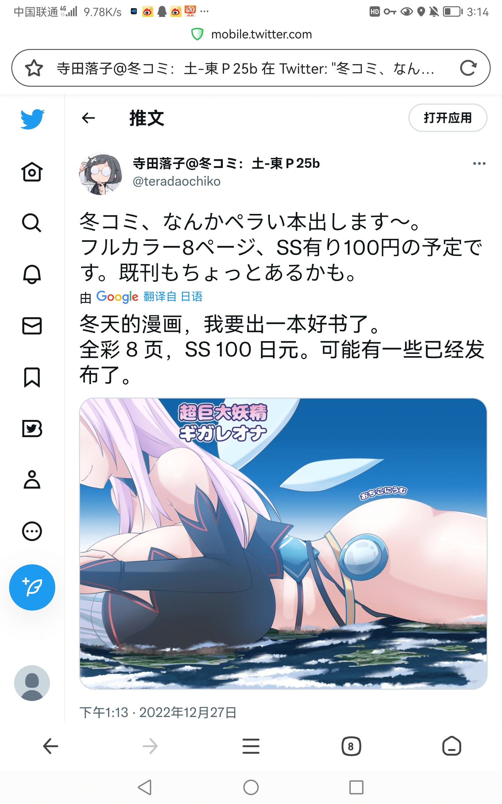

# 寺田落子新漫画？

作者：尤格萨隆

TID：34629

<title>1</title> <link href="../Styles/Style.css" type="text/css" rel="stylesheet">

# 1

好像是八页，看预览图貌似还是很顶的
<title>2</title> <link href="../Styles/Style.css" type="text/css" rel="stylesheet">

# 2

 <ignore_js_op>[Screenshot_20221227_151428_com.qihoo.browser.jpg](forum.php?mod=attachment&aid=MTAxMTg3fGU0NjU1ODJhfDE2NzQwNjkyMjB8MTgyMzB8MzQ2Mjk%3D&nothumb=yes) *(1022.46 KB, 下載次數: 5)*

[下載附件](forum.php?mod=attachment&aid=MTAxMTg3fGU0NjU1ODJhfDE2NzQwNjkyMjB8MTgyMzB8MzQ2Mjk%3D&nothumb=yes)

2022-12-27 15:24 上傳  

</ignore_js_op> <title>3</title> <link href="../Styles/Style.css" type="text/css" rel="stylesheet">

# 3

好像寺田老师已经好久没更新漫画了，一般都是更图为主。(:≡ <title>4</title> <link href="../Styles/Style.css" type="text/css" rel="stylesheet">

# 4

giga巨乳的新作品啊，可以期待一下诶 <title>5</title> <link href="../Styles/Style.css" type="text/css" rel="stylesheet">

# 5

看多了怎么看都像是旧的了，是我的错觉吗？ <title>6</title> <link href="../Styles/Style.css" type="text/css" rel="stylesheet">

# 6

希望里面不要出现snp等奇怪的东西，真的接受不了 <title>7</title> <link href="../Styles/Style.css" type="text/css" rel="stylesheet">

# 7

看样子今年的C100巨大娘漫画有保证了，很多都还是全彩的 <title>8</title> <link href="../Styles/Style.css" type="text/css" rel="stylesheet">

# 8

> [咕咕的攸栗 發表於 2022-12-28 09:18](https://giantessnight.cf/gnforum2012/forum.php?mod=redirect&goto=findpost&pid=522956&ptid=34629)
> 看样子今年的C100巨大娘漫画有保证了，很多都还是全彩的

c100现在是什么情况啊？
记得挺久以前 寺田说这次c100上有发布
不过感觉已经过去好久了，最近找漫画都能看见[c101]的字样了

<title>9</title> <link href="../Styles/Style.css" type="text/css" rel="stylesheet">

# 9

c100应该已经是夏天的事了，冬天要举办的是c101 <title>10</title> <link href="../Styles/Style.css" type="text/css" rel="stylesheet">

# 10

哎哎感觉好棒诶，光看图都很不错 <title>11</title> <link href="../Styles/Style.css" type="text/css" rel="stylesheet">

# 11

其实我更希望他能像冬野老师一样填以前的坑，以前有两个设定挺好的但是断了 <title>12</title> <link href="../Styles/Style.css" type="text/css" rel="stylesheet">

# 12

确实，以前还有好多坑没填，我也希望填点以前的坑 <title>13</title> <link href="../Styles/Style.css" type="text/css" rel="stylesheet">

# 13

我有买到这本，8页全彩100日元内容是压路机剧情，没有任何特殊play，甚至连点都没露c101巨大娘作品蛮少的，大概只占到半排，挤在铁道/旅行区的角落里，而且新刊也只有几部而已

<ignore_js_op>

**IMG_5895.JPG** *(1.77 MB, 下載次數: 0)*

[下載附件](forum.php?mod=attachment&aid=MTAxMzg1fGZlNGE5ZDk3fDE2NzQwNjkyMzF8MTgyMzB8MzQ2Mjk%3D&nothumb=yes)

2023-1-4 22:11 上傳

<ignore_js_op>

**IMG_5796.jpg** *(3.47 MB, 下載次數: 0)*

[下載附件](forum.php?mod=attachment&aid=MTAxMzg2fDQ1YjA1ZjFifDE2NzQwNjkyMzF8MTgyMzB8MzQ2Mjk%3D&nothumb=yes)

2023-1-4 22:11 上傳

（还有要到签名）
<title>14</title> <link href="../Styles/Style.css" type="text/css" rel="stylesheet">

# 14

.
看樓上有到現場的，很是羨慕，我跑comiket的時候壓根沒有以GTS為主題的社團。
不過現在現場擺攤大概只剩情懷了，大佬們基本都改在網路上發表，沒有截稿壓力，又不必在最熱or最冷的時候拖著一箱書出門。
尤其三年疫情，對漫展文化的影響還是很大，後續能恢復多少仍有待觀察。</ignore_js_op></ignore_js_op>