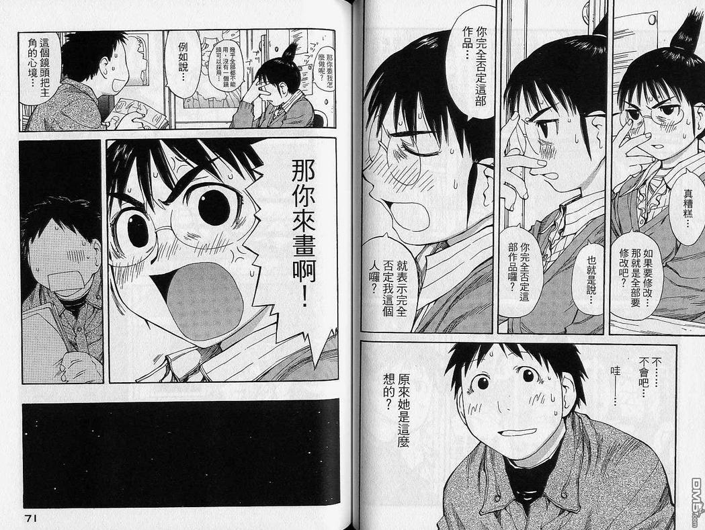

# 對於GTS畫師的小建議

作者：LiKNaRbCsFr

TID：15698

<title>1</title> <link href="../Styles/Style.css" type="text/css" rel="stylesheet">

# 1

很~簡單的建議，就是努力製造出屬於「GTS畫」的獨特性
意思是：做出些普通人用合成作不出的東西。
[http://giantessbooru.com/post/list/favorited_by%3D3213213210/1](http://giantessbooru.com/post/list/favorited_by%3D3213213210/1)
剛踏入GTS圈時用Booru收藏的圖片，仔細看看大概一半都是網友合出來的
只要有心，大家都能上pixiv或紳e站，找張唯美帶感的圖，把圖片合成小人
或把女生剪下來貼到城市上，修點亮度，登登~~~一張(可能很好可能爛到極點的)GTS圖~~~~~
不過那些圖終究不是為了GTS創造出來的，所以有作畫能力的圈內人!!!!
就必須!!!!!!創造點只有圈內人會創造(想創造)的東西!!!!!!!!!!!
說實話，GTS畢竟是個小文化圈，平常每天關注日本畫師更新，
看到畫的非常棒的畫師通常也比不上e站隨便點開來的連結，
在如此.....師資匱乏的情況下，圈內畫家就應創造只有自己能製作(想製作)的畫!!!!!!
我所謂「獨特性」是指：小人視角和互動性。
「從城市往上看到GTS某部位逼近」的合成畫絕對比(平常被用爛的)「從好遠好遠好高好高的地方看到坐在城市上的GTS向自己微笑」難作，「看見自己正抓著GTS某部位」或「小人抓著GTS某部位的特寫」也相對比「某個女生XX中，仔細看看她身上有小人」難合成許多。沒有甚麼圈外畫師會幫器官照超級特寫還附帶「從這個位置看出去的感覺」，舉例，大家都能隨便找到
「乳頭露出來的女孩」和「抓著懸崖邊快掉下去的男人」合成成「某男抓著某女孩乳頭」，但是如果要作出「抓著乳頭的男人看著女孩表情」的視角，相信只有圈內畫家做得到。
互動性是指GTS對小人坐的事，像是踩時看著腳(眼睛方向)，還有拿小人作甚麼事之類的(但不要忘了小人視角).........
如果有人有其他想法，請留言
<title>2</title> <link href="../Styles/Style.css" type="text/css" rel="stylesheet">

# 2

完全没听懂是什么建议？

这个建议有别于圈内画师所做过的吗？

请问能举个例子吗？谢谢。 <title>3</title> <link href="../Styles/Style.css" type="text/css" rel="stylesheet">

# 3

> xnr 發表於 2013-12-4 20:14 
> 完全没听懂是什么建议？
> 
> 这个建议有别于圈内画师所做过的吗？

就像......pixiv上有些人將自己畫作因為背景是城市而標上「巨大娘」
而畫面構圖是可以用「女孩」和「城市」直接合成出來的
第三人稱視角基本上將兩張以上的圖幾乎都合的出來
說句實話........前面廢話這麼多都只為了一句話：
多用第一人稱視角，不然可能被合成畫比下去。
<title>4</title> <link href="../Styles/Style.css" type="text/css" rel="stylesheet">

# 4

<ignore_js_op>

**E13122g.jpg** *(416.6 KB, 下載次數: 0)*

[下載附件](forum.php?mod=attachment&aid=Mzg1NTR8YTcwZTQ3MTR8MTY3NDA2ODQ0NXwxODIzMHwxNTY5OA%3D%3D&nothumb=yes)

2013-12-4 20:44 上傳

當然還是有例外，不過互動性要夠高 <title>5</title> <link href="../Styles/Style.css" type="text/css" rel="stylesheet">

# 5

耶 我覺得沒有實際創作的人很難給創作者意見
創作者多少有一定的自尊與自信，老實說如果你沒拿出多少切確的實力跟本事
基本上對方會聽進去多少都是個問題，只希望樓主給建議是好事
但千萬不要因此碰到某些人的逆鱗就有點壞了最初的美意

<title>6</title> <link href="../Styles/Style.css" type="text/css" rel="stylesheet">

# 6

 <ignore_js_op>[4454.JPG](forum.php?mod=attachment&aid=Mzg1NTV8NGQzMzhkODd8MTY3NDA2ODQ0NXwxODIzMHwxNTY5OA%3D%3D&nothumb=yes) *(213.92 KB, 下載次數: 2)*

[下載附件](forum.php?mod=attachment&aid=Mzg1NTV8NGQzMzhkODd8MTY3NDA2ODQ0NXwxODIzMHwxNTY5OA%3D%3D&nothumb=yes)

2013-12-4 20:51 上傳  

</ignore_js_op> <title>7</title> <link href="../Styles/Style.css" type="text/css" rel="stylesheet">

# 7

我大概明白楼主的意思了，其实就是一句话：

“作为圈内画家的作品，一定要有足够的GTS属性，注重凸显GTS的巨大感和小人的互动，这样的GTS作品才具有足够的实用性和收藏价值。不然就像烂大街的平平淡淡的合成图一样无趣了”。

这样一句话概括会不会完整清楚一些？ <title>8</title> <link href="../Styles/Style.css" type="text/css" rel="stylesheet">

# 8

没有互动还怎么看啊。。。 <title>9</title> <link href="../Styles/Style.css" type="text/css" rel="stylesheet">

# 9

畫完人物，興頭一來背景直接填城市的當GTS圖，是人物練習。
下筆時就規劃好構圖、人物動作、視角、背景、互動感的第一人稱圖，就是透視角兼GTS創作練習。

能投入心力做出後者作品的，要時間，要能力，或者有毅力的作家，就和金字塔頂端一樣少...

當然，高成本的作品會帶來高度成就感，
金字塔頂端以外廣大體積的支持，就是創作者動力的來源...

話說，前者該是"建築物"練習，比較貼切 <title>10</title> <link href="../Styles/Style.css" type="text/css" rel="stylesheet">

# 10

＂就应该＂＂就必须＂

大家加油咯（ <title>11</title> <link href="../Styles/Style.css" type="text/css" rel="stylesheet">

# 11

大概理解了楼主的意思，只是你说的这种素材实在是不好找，用照片拼出来的感觉实际上我感觉比不上用软件做出来的，光论互动性这一方面，poser摆个pose这种拍出来人摆的话总是感觉差点啥。 <title>12</title> <link href="../Styles/Style.css" type="text/css" rel="stylesheet">

# 12

大概理解了楼主的意思，只是你说的这种素材实在是不好找，用照片拼出来的感觉实际上我感觉比不上用软件做出来的，光论互动性这一方面，poser摆个pose这种拍出来人摆的话总是感觉差点啥。</ignore_js_op>