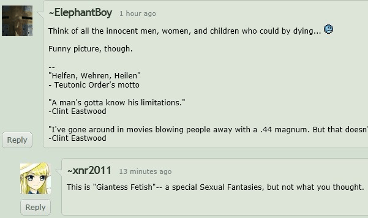

# 對殘酷系GTS創作者的一些疑問

作者：qweaaaaa

TID：11914

<title>1</title> <link href="../Styles/Style.css" type="text/css" rel="stylesheet">

# 1

.
先說好，這是**強者我朋友**對我提出的問題。

「你喜歡的東西都好可怕，城市甚至星球整個被女生消滅掉。」
「我忍不住會去想城市裡面那些無辜的男女老少耶，太殘酷了吧。」
「你跟我說覺得這很有趣，我也無法理解啊。」

好的，以上談話是有點情境模擬的成份在，不過我的確有點想與各位交流這個問題。

**『在殘酷系GTS創作上有傑出成就的創作者，是不是內心就存在著反社會人格呢？』**

因為厭惡社會、厭惡人群，加上人性本能對美麗事物的喜愛，融合並衍生出「**讓可愛的巨大女生將毀滅城市與殺害民眾當成快樂的遊戲**」這種興趣。
這個問題，不曉得為什麼，今晚特別想問呢…。

論壇上也有不少傑出的創作者，挺想與各位交流這方面想法的。
為了怕干擾各位的想法，我就不作更多的贅述。
請用直觀的判斷來回答這個問題。當然，據說某人要給我一篇關於此議題的論文，我也非常期待。

那麼以下就開放各位回答。 <title>2</title> <link href="../Styles/Style.css" type="text/css" rel="stylesheet">

# 2

我可以用縮小女的角度來回答這問題嗎XD

好吧...別趕我...我自己走... <title>3</title> <link href="../Styles/Style.css" type="text/css" rel="stylesheet">

# 3

这个问题没有绝对的标准答案，每个人看问题的角度和重点都不同。

以下是今天我在DA上遇到了一个圈外人的发问：(个人判定应该是圈外人，但不排除温柔系GTS同好)
<ignore_js_op>

**xx.jpg** *(38.36 KB, 下載次數: 0)*

[下載附件](forum.php?mod=attachment&aid=Mjc4NDh8NDJmMzQwM2N8MTY3NDA2ODY1M3wxODIzMHwxMTkxNA%3D%3D&nothumb=yes)

2012-3-1 23:55 上傳

他的大意是：这张图片伴随了大量男女老幼的死亡，很有趣是么。
我很礼貌的回应了：这是GTS图，一种特殊的性幻想而已，并非你所想的那样。

我见过有评论说日本之所以流行哥斯拉奥特曼题材的片子，毁灭大片大片的城市，是日本人生活在工作压力下的情感释放，毁灭高楼大厦（让自己劳累的写字楼）能带来某种程度上的快感。
有人会把重点放在那些路人甲乙丙丁的生离死别上吗？
那些拍摄哥斯拉、奥特曼的编剧、导演、演员有反社会反人类的倾向吗？
喜欢玩SM的情侣，是否都想复辟奴隶制呢？

其实就是这个道理，一切为了自己开心而已，GTS作品本来就是属于个人心中的性幻想题材，某种意义上的意淫而已，谁没有意淫过呢？ <title>4</title> <link href="../Styles/Style.css" type="text/css" rel="stylesheet">

# 4

.
嗯……樓上提了日本那隻大恐龍，但我看到的說法是這類作品的出現與日本是唯一被核彈炸過的國家有關。
哥斯拉原始設定就是被輻射搞出來的，後來翻拍的美版也沿用這個設定（儘管內容表現上根本是不同作品）。

不過其實，老美也有巨大怪物的片子，黑白片年代一堆，從巨大蜘蛛到巨大螃蟹什麼都有。
如果單純看末日情節與大量死傷，那些受歡迎的殭屍片不也是一樣？病毒一擴散誰管你男女老幼。
再把格調降低一點，那些B級賣血肉的校園恐怖片呢？高中生、大學生被殺掉，就可以是愉快的樂趣嗎？
把 innocent 與 children 當關鍵字特地提出來，對不起，這太噁心了，雙重標準的道德觀太噁心了。

說到底，人的本性就兩種吧，性慾與暴力。
結合起來就是殘酷系的GTS了，虛擬虐殺也只是滿足人的欲望，現代社會的確不該連人腦子裡想的東西都要管。
當然如果這個發問者來自奧斯陸或者曾就讀維州理工大學的話，我多少可以理解他為啥有這想法啦。

言歸正傳，所以XNR覺得我那句問題的論點不成立就是了，沒錯吧？ <title>5</title> <link href="../Styles/Style.css" type="text/css" rel="stylesheet">

# 5

個人是覺得這還是一種喜好，
不排除有反社會人格的原因，
但這也只是一種可能，因為我不是殘酷系的，不太清楚，
以旁觀者來說，我只能說有可能，而不是確定就是那樣，
喜好是由人心所生成的，然而因為人心太複雜，
我們也很難細究，有些喜好還是莫名其妙出現的，
在這裡的人我想產生出GTS這興趣的人，
方式都不盡相同吧！個性也都不一樣（廢話= =），
所以我認為那是一種喜好，
如果有殘酷系的朋友不介意可以分享他的想法，
我們才能真正聊解，因為其實我也很好奇∼∼∼ <title>6</title> <link href="../Styles/Style.css" type="text/css" rel="stylesheet">

# 6

> 原帖由 *Dante* 於 2012-3-2 00:13 發表 
> .
> 嗯……樓上提了日本那隻大恐龍，但我看到的說法是這類作品的出現與日本是唯一被核彈炸過的國家有關。
> 哥斯拉原始設定就是被輻射搞出來的，後來翻拍的美版也沿用這個設定（儘管內容表現上根本是不同作品）。
> 
> 不 ...

回但丁，这个问题还是有一定的讨论价值的，毕竟自己的作品是人的心境的真实写照，而且大家对所谓“残酷”、“反社会”的评价标准也不一致。
彼此交流下自己的观点和心中的想法也挺好的。 <title>7</title> <link href="../Styles/Style.css" type="text/css" rel="stylesheet">

# 7

> 原帖由 *Dante* 於 2012-3-2 00:13 發表 
> 奧斯陸或者曾就讀維州理工大學

但大用的梗還真隱晦。一個是諾貝爾和平獎頒獎城市，另一個是發生槍擊掃射的學校。

我雖然不是一個殘酷系文章的創作者，但作為一個讀者的觀點，我想提供一點看法：

從我讀到的有城市破壞的創作來說，有些的確有著反社會的氛圍，但也有些沒有。

而沒有的那個部分，城市的角色也許只是一個很好用的背景環境，為什麼這樣說呢，因為有寫文章的城市只作為一個場景，讀者在閱讀的時候並不會覺得它是一個有文化、有情感的人生活的城市，這樣的城市好像換成什麼別的也是可以，也不會損於殘酷系的娛樂性。因此是沒有反社會氛圍的。

而另一種稍微有反社會氛圍的。巨大少女對城市來說是一個主宰的角色，城市作為一個襯托她的角色，可以提供軍隊彰顯巨大少女的力量，有著摩天大樓、名勝古蹟用這些曠日耗時的人類文明精神指標去點出這些人類引以為傲的精神在巨大少女面前是隨時會消失的，此外當然還有人類的生命、情感、信念。

說這樣的城市被巨大少女破壞，有著反社會氛圍的原因是這樣的城市是有社會感的，而這樣的社會卻在一個巨大少女底下是無力的，甚至不能稱呼為社會。但同樣的，如果只是這樣還不能稱為反社會，只能稱為強調巨大少女在故事中世界的主宰性，而人類社會在巨大少女的世界中的無力，是理所當然的，也是大多數讀者期望看到的。

而究竟什麼樣的故事，會被我這樣的一個讀者認為是反社會的殘酷系巨大少女文章？

我想但大的文章可以做為很好的例子。在但大的文章中，人類的社會不只是無力，還扮演無知、迫害人民、盲目的信念，甚至是作為邪惡的角色。DGU的世界中，不知道有多少情節是：人類內戰滅亡自己的世界受到神女的救援。人類組織或國家出賣自己的人民最後是神女側解決了問題。人類的組織有著過分激進的信念最後導致悲劇發生，想當然又是神女救了他們。

在DGU的故事中，神女不只是作為一個破壞者，而更像是一個「必要」的破壞者，這個必要不是情節上的必要，而是故事中人類世界成立的必要。我記得有幾位神女就有提過：如果沒有神女，這個宇宙早就滅亡了。而法雷爾雖然在DGU被稱為是惡魔，天原商社被人類視作惡魔，但他們都是有著一貫的信念，或者說是忠於自我的。這樣的角色，在精神上是比那些愚昧的人類組織更令人所喜的。

這就說到重點了，究竟什麼透露出了反社會氛圍。我認為是：比人類社會全然超然的存在，那個存在是不出於人類社會的，而且不止於力量上的超然，還有精神、信念、知識的超然。透過全然的超然，人類社會相較之下是不值一提、不屑一顧的。更甚的，人類社會還「不得不」倚賴這外在於人類的對立存在進行生活，在這樣的狀況下人類社會不只是無力、無知，還是在精神上全面的妥協。

簡而言之，我心中對反社會的門檻就是：非內在於社會的存在比社會還要更理想，就是所謂的反社會。

難怪在基督社會建立前，基督所指的神也被視為反社會。而在DGU的世界中，神女作為主流社會本身，所以其實也不是什麼反社會的象徵，雖然在中央象限是啦XD。

但從讀者的眼光來看，是看不到作者在真實世界中的主張。所以以讀者來說作者反社會是太過的，讀者只能說到作品具有反社會性，而不能上及作者，除非作者在文章中闡述就是作者他自己奉行的價值觀。

如果要更進一步，說說我對反社會情結的看法。我會覺得：反社會不是很正常的事嗎？畢竟現在的社會，也是從反（前一個）社會來的。

[ *本帖最後由 Lastato 於 2012-3-2 02:36 編輯* ] <title>8</title> <link href="../Styles/Style.css" type="text/css" rel="stylesheet">

# 8

樓上最後一句的論點好特別-w-b

不過追根究柢 人類組織的愚昧是一種必然性不是嗎

> 這就說到重點了，究竟什麼透露出了反社會氛圍。我認為是：比人類社會全然超然的存在，那個存在是不出於人類社會的，而且不止於力量上的超然，還有精神、信念、知識的超然。透過全然的超然，人類社會相較之下是不值一提、不屑一顧的。更甚的，人類社會還「不得不」倚賴這外在於人類的對立存在進行生活，在這樣的狀況下人類社會不只是無力、無知，還是在精神上全面的妥協。

這句....好像有點過於宗教性質,我也就不多做評論了

不過我同意樓上最後幾句的論點, 在DGU的社會裡,主角本身就不是人類社會,只是一個世界觀.

...要遲到了 晚點再來繼續>> <title>9</title> <link href="../Styles/Style.css" type="text/css" rel="stylesheet">

# 9

我是認為實際上有些女生也都有這種意識吧！但先決條件是，人類並不是人類，而是像小的很小的蟲子或螞蟻！

像一些小女生，看到螞蟻時也會用腳踩踏，還有些女生看到小蟲子也會用腳撥弄小蟲，甚至踩死

我之前寫的文章大概巨大少女描述的心境就是人類在眼前是非常小的動物，一些女生會認為縮小的東西會比較可愛，所以小人的動作在巨大少女眼前是可愛的，且當做玩具玩弄著

不畏言，我比較欣賞女王系的感覺，應該也知道平常女生力量是比男生弱，但在青春期發育，女生比男生快，在學校的新聞不就看過女生欺侮男生了嗎？女生也是會欺侮玩弄比她還弱小的東西

當然，如果人類是那麼弱小的東西，在那種女生面前，你想，他會怎麼做呢？呵呵 <title>10</title> <link href="../Styles/Style.css" type="text/css" rel="stylesheet">

# 10

其实就像各种天灾人祸造成大量人物死亡一样，GTS只是其中一种而已，不必特别在意是否因此就是特殊的。也就是说，我们不能说《后天》《2012》的编导人员是反人类的。
当然，我觉得像我这种追求非日常的人，渴望逃避现实的人本身就已经是十分污秽的存在了，不过能意识到这一点也说明自己的理性还是存在的，只是去在网络，非现实中追求而不去影响现实中的自己的生活方式。
所以说，只要是自己能意识到“那可能是不对的”。就说明我们还是有作为人生活下去的资格。
所以，GTS残酷系还是温柔系，只是一种特殊幻想，癖好而已。
就如很多我们也许不太了解的幻想癖好（比如尸体控，女装癖）那样，因为我们都在对现实的“不敢”才能去任意的在非现实中“幻想”。 <title>11</title> <link href="../Styles/Style.css" type="text/css" rel="stylesheet">

# 11

诶？难道不是因为抖M体质吗？ <title>12</title> <link href="../Styles/Style.css" type="text/css" rel="stylesheet">

# 12

从中获取快感和生活中没有同情心完全是两回事。
如果好莱坞灾难片一个人都不死观众会满意吗？那么他们也都没有同情心？ <title>13</title> <link href="../Styles/Style.css" type="text/css" rel="stylesheet">

# 13

「如果這世界上有魔法少女還是鋼彈就好了，因為這樣感覺會很有趣。」
「魔法少女和鋼彈什麼的好幼稚，宅宅好噁心都喜歡這種東西。」
「嗯......如果這世界上有死亡筆記本就好了，世界上的爛人實在太多了。」
「這世界上根本沒有死亡筆記本，醒醒吧阿宅。」
「在戰場上揮舞軍刀、陷陣血戰感覺真是超帥的，如果發生戰爭什麼的好像也不錯。」
「就是因為有你這種暴力傾向的軍武宅，才會有什麼持槍掃射學校的事件。」

以上的對話，大家是不是耳熟能詳呢？
這些話語經常充斥在我們的周遭生活，而很可悲的是，有更多喜歡ACG的人因為這種古板的印象，而只能偷偷摸摸的不敢讓自己的興趣見光
深怕自己的興趣曝光之後，就被眾人貼上"**宅宅**"的標籤
最近幾年，御宅族文化開始慢慢抬頭，宅經濟所帶動的購買力也逐漸獲得重視
這時候就有很多專家學者開始用放大鏡分析起所謂的"**御宅族**"到底是什麼東西
結果反而讓"御宅族"這三個字被貼上了"**不務正業**"、"**儀容不整**"、"**反社會人格**"......等等更多負面標籤
然後有更多衛道人士莫名其妙的瞎起鬨

其實，我一直很想問問那些所謂專家學者，或是自命清高的衛道人士
**敢問閣下的腦袋是有洞嗎？**

ACG也好，乃至GTS也好
我們可以把它想得更簡單一些，或者是回歸原點
其實說穿了，就只是很單純的"喜歡"或是"有趣"而已
就像我們從來不會去說運動員滿身臭汗好噁心
或是專家學者其實就只是出張嘴的草包
更甚至所謂衛道人士其實私底下搞不好比我們還變態

那麼，讓我們切入主題吧
為什麼會去把「**讓可愛的巨大女生將毀滅城市與殺害民眾當成快樂的遊戲**」當成興趣
其實這個問題，就像是在問林書豪「**你為什麼喜歡打籃球**」是同樣的意思

所以，其實我們已經得到答案了，不是嗎？
<title>14</title> <link href="../Styles/Style.css" type="text/css" rel="stylesheet">

# 14

召喚烏雞蛋，他肯定喜歡這類話題。
因為我在QQ上經常被迫或者不被迫地被他拉進類似的討論之中……

7樓的說法灰常棒，其實如果從文章區裏對號入座，其實也有少量文章是具備「近似或者不成熟」的否定社會觀點。不過……這真的不是什麼大不了的事兒，意淫無罪，就算腦子YY宇宙大爆炸一萬次都沒所謂。

至於人類本性啥啥啥的……我從不認為人有什麼本性可言，性欲也好暴力也好，最多只能說是「本能」。真要說的話，生物的本性都是生存，只不過猴子恰好進化了，有了文明，溫飽解決後開始蛋疼了，追求越來越高端化而已，變成「快樂地生存」了，老少鹹宜的打牌下棋也好，死宅玩GAL打遊戲也好，R18的SEXY獵奇也好，也只是獲得快樂的一種手段。

總之還是召喚烏雞蛋。 <title>15</title> <link href="../Styles/Style.css" type="text/css" rel="stylesheet">

# 15

.
我講奧斯陸其實是因為那個極右派殺人魔事件。
不過在和平獎的頒獎城市發生這種慘案，也許正說明了人類社會本質上不可改變的餛飩吧，好吃。（我故意打這樣的）

Q群上有人以為這個主題是我在自問自答，我不承認也不否認。
這是我一時心血來潮想到而發問，這是沒錯，但那三句話的確是我從一個國中同學的嘴裡聽來的。
至於我這興趣是怎麼被他發現的，就不關這題目的事，我只能說不要邀請那種會把你抽屜打開來找東西的王八蛋到自己家作客。

說起來，Lastato 的論述邏輯非常結實，給人富含法學素養的感覺。
我寫文章時自己都沒想過這麼多，大體上我創作的動力僅僅來自於一件事：洩慾
但洩慾包括很多層面，其一是性衝動方面的發洩，其二是說教欲望的發洩，其三是尋求自我認同的發洩。
我所有的創作都基於洩慾這回事而進行，大家認為精彩的那幾篇，大概是性衝動方面的發洩多了點。
不怎麼精彩的就是說教欲望及尋求自我認同的成份多了點……大概吧。

言歸正傳。反社會算是個什麼東西？
『非內在於社會的存在比社會還要更理想』，我倒不覺得這叫反社會，這更像一種烏托邦幻想。
現實上人類是不能離開社會而生存的，因此什麼叫非內在於社會的存在呢？
我舉個例子，今天我住的社區整個被外星來的巨大美女綁架走了，用飛碟射一下光束咻咻地就載走了。
然後所有人成了這個外星GTS的寵物，不用工作不用交友，從此茶來張口飯來伸手，只要對女主人撒嬌一下就成了。
而我這社區有一個家裡蹲，這個人本來過得非常之悲慘，大概快跳樓了。
現在他什麼事都不用幹（其實也就是照他以前那樣的生活方式去過），人生卻有保障了。
那麼這叫反社會嗎？可能社區中其他人成天哭哭啼啼的，但這個死NEET卻很快樂，那他算是一個反社會人格者嗎？

我覺得不是，他就只是一個死NEET，外加一個隱性的GTS愛好者。

反社會應該是對現在既有的社會型態強烈感到不滿，至少我自己的定義著重在「反」這個字上。
（詳細的學術定義，請各位自己去看百科全書吧）
我覺得這個社會不好，譬如說我認為政府的權力太大了，或者我認為貧富不均的情況太嚴重了。
也可能我根本沒那麼高尚，我單純覺得通勤搭車時太擠了，找工作時太多人跟我競爭了。
社會上人這麼多，壞事這麼多，太討厭了，所以我怎麼想呢？我想像這些人與事通通消失。
被我最喜歡的，也就是可愛的巨大少女們，弄到消失不見，然後我想像中的自己滿足了。
這從頭到尾就是一件事：意淫，或者套時下流行的，叫YY。
YY的穿越小說我們看得多了，一個廢柴穿越到古代就忽然成了大將軍、甚至皇帝。
這麼離譜又可笑的東西都大大流行了，同樣是意淫，只是方式變更一下，就得被人這樣說「你反社會啊」。
我去，那我得講穿越「反科學」哩！甚至是「反智商」的。
廢柴跑到哪都是廢柴，就像小叮噹有個短篇所描寫的，大雄拿了收音機與火柴去原始人社會，想得到原始人崇拜。
結果是火柴弄濕了點不著，收音機在古代也收不到電波，大雄只是被原始人當更蠢的猴子去看待。
這個就是有智商的，穿越一下就會變強？這是沒智商的。
若真有那種人，那他在現代也是能成功的，這種人就更不會是那些千千萬萬的廢柴讀者們有資格代入的了。

我是不是有點電波發作了？抱歉，這都說到哪去了真是。
可見我是多麼沒有邏輯學養的一個人，簡直是想到什麼就說什麼。
我只是單純用文字去填滿讀者們眼前的網頁罷了。

再次試著言歸正傳。
殘酷系的GTS作品，單純看每個作品的表現方式，也是很多樣的。
很多作者畫出城市被破壞時，不會把受害的居民也畫出來，不知道是否他們有意規避這個反社會的指責？
然而近年來，至少是比起之前很長的一段時間，一些作品開始強調GTS行為下的犧牲者了。
寺田有一張上班女郎的GTS圖，赤腳踩到了一節電車，電車爆出了滿滿的血然後黏在GTS腳下。
畫到這種地步應該算「強調」了，但寺田本人我好歹是見過面、握過手的。
他可是一點精神病的樣子都沒有，正常得很，也許他從來就沒有思考過這個主題所問的問題。
因為這就是個意淫、是個興趣。縱然表現手法偏向殘酷，卻沒有人會以為這是真的。
然而這對一些旁觀者來說，他看到的就只是我們喜歡這些作品，就像我同學看到我在寫這些東西。
這些旁觀者自然是沒必要站在我們的立場幫我們辯護，他們就應該站在旁觀者的立場、
露出一臉「你在搞什麼」的懷疑視線，然後不聽我們的任何解釋，片面指控我們反社會。

坦白講，我雖然不爽，但我確實有股優越感湧上來，至少我知道我比這個人多懂一點東西。

似乎說得太長了，後面如果我還想到什麼想說，之後再補。 <title>16</title> <link href="../Styles/Style.css" type="text/css" rel="stylesheet">

# 16

呃，关于哲学和社会一类的东西，我自己懂的并不是很多，所以只能随便说两句了。

首先看到前面有提到关于老美和日本的B级片一类的电影，
日本的哥斯拉和加美拉一类的影片，倒是没有怎么看过，不过倒是看过美国50s-70s的N多B级片。
如果非要说这种影片为什么会在50年代之后火起来，往深层探索的话，可能有冷战的原因。在一种压抑的气氛下，面对随时可能到来的末日与灾难，人们将其以各种形式在银幕上表现出来，从巨大怪兽到地球裂缝、月球撞击等等，最后又总是以各种狗血的形式拯救世界、消灭怪兽，由此与人们的心理相对应。

不过我觉得没有必要做这么深层的考虑。小成本的怪兽影片百分之九十九是处于骗钱的目的而拍摄的，50-60年代影片的视觉技术有了一个很大的发展，尽管电脑CG还比较遥远，但是化装、场景等等已经有了很大进步，拍摄门槛也随之降低，因此大量同质化严重的影片集中涌现，很多这种电影甚至是在影院其他大片放映前后贴片上映的，或者用来在垃圾时段凑数。到了现在，随着电脑和数字拍摄技术的成熟，这种电影的数目更是有增无减。不能在院线上映，就发行DVD，只要有人看，就能小赚一笔。90年代末期，独立日这种大片开始风行。其实这种影片和小成本灾难片从本质上来讲没有什么区别，只不过CG技术和各种视效大量运用，使得影片看上去更加震撼，这当然是后话了。

从观众的心理来说，一些观众喜欢大量震撼的特效，所以像2012这种片一直风行不衰，一些人喜欢追求刺激和恐怖，挑战自己的胆量，所以死神来了这种电影也层出不穷。生物巨大化和怪兽，只是这些电影中的一种表现形式，人们在观看哥斯拉的时候看的是怪兽与直升机、潜艇对抗时的场面，主角在下水道及充满怪兽的楼中求生的惊险情节，体验肾上腺素狂飙的快感，观看电锯惊魂的时候是在不断的血浆中寻求对感官的冲击所带来的刺激感，他们并不会去考虑被杀死的人会怎样怎样，其快感也不是从杀戮的本质，即终结生命得到的。

所以说影片里面的生物巨大化并不能单拿出来讨论，它们只是和其他灾难电影一样，人们不关心灾难摧毁生命这种本质，只会关心特效与场面的震撼感。

有点扯得太远了。。。下面来说正题。
『在殘酷系GTS創作上有傑出成就的創作者，是不是內心就存在著反社會人格呢？』
这个...大体整理了一下思路，得到的答案是不唯一的.....
嗯，以下的所有只是个人观点，仅供参考。

残酷系作者的意图和分类：
A.
把GTS当成载体或一种工具。对于这种人而言，上述问题的答案也许是『Yes』。GTS的角色，只是他们心中的一个类似发泄工具，或者说是一个清理世界的工具。它可以是GTS，可以是巨大的食人怪物，也可以是各种毁灭武器。因为混入了心中对Sexual的渴望，于是这个位置就理所当然地由少女代替。
但是....它只拥有一个少女的躯壳，或者说是一个少女模样的机器人，中枢坐着的是作者本人。可能因为长期积累的愤怒或生活的不公，他们仇视生活中的一切，觉得自己应该是一切的主导者与审判者。他们既喜欢毁灭的过程，又追求毁灭的结果，希望以尽可能邪恶无情的方式，彻底粉碎他人的生命，甚至是整个社会。我不敢说他们心中全是恶；但是这种人常常会做出一些极端的事情，这一点倒是很有可能。

呃，我想在我熟悉的作者当中，应该没有这种恐怖的存在。天知道是否真的有这种人...

B.
=这一种应该是我熟悉的，因为自己大体可以纳入这一类= =、 尽管我不是作者，也不是很喜欢残酷系，但是如果有稍微比我重口一点的，也应该能说得通...
这就是，将毁灭性的力量，加在娇弱的少女身上，产生的一种难以阻挡的魅力。
想像一个少女，只需轻轻做一个可爱的动作，就能造成无比巨大的破坏，甚至轻松毁灭掉整个城市.....
娇小的身体中蕴藏的巨大能量，就是她们致命诱惑的来源...
从某种意义上说，这种GTS，是以少女真实的躯体与灵魂为载体，加上各种不同的，令人难以置信的能力。而各种能力的塑造，最重要的是能够让她显示出自身力量的强大，但这种力量也并非越大越好，只有在合适的范围内，才能使少女的魅力最大化。力量的体现是需要对比才能完成的，少女的属性并不能太高，如同巨大的星魂，由于缺少适当的参照物，无法展开合适的想象，其能力之巨大反而无法体现。这种情况下，如果加入残酷系的描写，弱小的人类与『娇弱』的少女对比，那么效果当然不言自明。
这一类对于上述问题的答案，应该是『No』。他们绝不想去毁灭生命，只是希望有一个展现少女力量的『参照物』而已，把人类换成其他的东西也是绝对可以，不过代入感肯定没有我们熟知的东西强。
这一种GTS的创作者，对于性和暴力并不会很敏感，只是表达心中对这种少女的热爱罢了。

呃，这就是我喜欢DGU中妮菲儿的缘由。
我自己是不喜欢残酷系的.....如果这里『残酷系』的定义专指对人类的话。

C.这一种情况应该还算普遍，总体来说就是，因为一时的烦闷或压力而创作出GTS故事的作者。
就像我们平时累了一天喜欢躺床上看大片或者是打游戏的道理是一样的，看上去和A有几分相像，但实际上当然没有那么严重= =
每个人都会有这种时候，只是我们用来排解的方式不一样罢了。
这一种作者可能喜欢即兴创作，而且温柔系和残酷系兼有，完全依自己心情而定，（或许创作之中也带有一些上面B类型的影子？？）
答案是：『No』。这个题目似乎在这里太过言重了......

D.最后这一种类型，我不知道该怎么说比较好。
『在殘酷系GTS創作上有傑出成就的創作者，是不是內心就存在著反社會人格呢？』
反社会人格，所指的应该是对社会一味仇恨的人。
但是我想说的这种作者，书写GTS故事，是在『反『反社会』』。
比如蛋丁大叔的文章。
写残酷系GTS的同时，也写出人性与社会中丑陋、邪恶与恐怖的一面。无声的批判。
所以觉得蛋丁大叔应该就是属于D类的。

不过，有时也许会有一点C类的表现呢.....

ok，我觉得如果再说下去就超出自己语言表达能力的范围了。
以上无责任吐槽

[ *本帖最後由 Cod1945 於 2012-3-2 22:23 編輯* ] <title>17</title> <link href="../Styles/Style.css" type="text/css" rel="stylesheet">

# 17

反社会反人类是神马 可以吃吗
打心里爱看灾难片末日片惊悚片怪兽片 那太棒了！ <title>18</title> <link href="../Styles/Style.css" type="text/css" rel="stylesheet">

# 18

> 这种作者，书写GTS故事，是在『反『反社会』』

我很認同這樣的說法，或是說，我認為的反社會就像是D這樣。而不只是A對社會仇視。
但對我來說B才是GTS的主菜，算是一種反差萌吧：

> 娇小的身体中蕴藏的巨大能量，就是她们致命诱惑的来源

結合D起來會變得有深度，但是不見得要結合D，結合其他的也可以是很好的殘酷系文章啊。

＝＝＝

大家對反社會人格的門檻都在不同的位置，這裡稍稍歸結一下好了：

甲
Cod1945認為的：

> 长期积累的愤怒或生活的不公，他们仇视生活中的一切。

乙
但大認為的：

> 對現在既有的社會型態強烈感到不滿。

丙
我個人認為的：

> 非內在於社會的存在比社會還要更理想。

這裡會這樣說，是就故事中的世界與現實比較而得的。

但如果要針對人格，那我換個表達方式好了，
應該是：**崇拜一種與現有社會對立的生活型態。**
我是覺得如果僅止於不滿跟仇視，只能說是討厭，不能說是反。
在我心中反社會應該是要做到，與社會對立、否定社會、反對社會，甚至崇拜另一個價值觀才是。

這種不常用的名詞，每個人有不同認識是很正常的事。但是如果要討論，還是要協調一下比較好。

剛剛很無聊去查了一下，心理學的反社會人格規模好像沒有我們想像的大：

> 损害社会和他人之后没有愧疚之心。又叫做悖德狂。

如果從這個觀點來看，那**寫寫字要損害社會好像不太可能**。（寫的太傷眼不知悔改，或許是傷害罪。）

＝＝＝

對於那個NEET的例子，我也是覺得那個NEET的確沒有反社會人格。
但是那樣故事有反社會氛圍，理由是讀者會覺得：
那樣不照原有社會規範還活得比較好，那就不要照原有社會規範吧。
不過NEET的例子有些超現實。

較現實的例子是：在一個代代相傳數十代的王國，寫一個沒有國王的國家比較好的故事，就是反社會思想。反過來，在一個民主社會中，寫一個故事諷刺民主一事無成也是反社會思想。說出：「天生萬物以養人，人無一善以報天」的張獻忠也是反社會思想嘛。

這樣的話反社會好像同時具有**不滿、仇視、鄙視、改善**社會。

說到這個地步的話，甲乙丙其實都是在說同一件事嘛，只是強調不同面相。但說到這個地步，卻又跟心理學上的悖德越來越遠了。

而如果只是用圍觀鄉民或隨便媒體的態度，

> 這些旁觀者自然是沒必要站在我們的立場幫我們辯護，他們就應該站在旁觀者的立場、
> 露出一臉「你在搞什麼」的懷疑視線，然後不聽我們的任何解釋，片面指控我們反社會。

那反社會定義**根本就是莫須有，只要有點奇怪就可以上火刑架了吧**。就像支持日心說的布魯諾，說人類是猴子的達爾文，被認為有幻聽的貞德，說人都有罪的耶穌。

[ *本帖最後由 Lastato 於 2012-3-3 01:04 編輯* ] <title>19</title> <link href="../Styles/Style.css" type="text/css" rel="stylesheet">

# 19

[quote]原帖由 *Dante* 於 2012/3/2 20:36 發表 [url=http://giantessnight.com/gnforum/redirect.php?goto=findpost&pid=158978&ptid=11914]

原來這個問題的始源就是客人來亂翻抽屜啊XD...雖然有猜是管理員為了nights的人氣所設的問題..

不過從國中到現在...想必是很好的朋友吧!!把他洗腦成為巨大女愛好者吧

說到這個問題,我的喜愛也常被翻出來呢,而且次數是多到我想起來都有點誇張,畢竟是從小就喜歡縮小女的...

第一次是在國中電腦教室偷偷看"燈世我舞"老師的創作,被隔壁同學發現,從此知道我的怪僻
第二次是在國中教室裡,寫著縮小女的YY文章(以前買好多本筆記本,就是為了寫縮小女文章,還不時拿給我旁邊的同學看,現在想想...我那時怎麼會那麼大膽...)後來被同學看到,下課時張貼在後面公布欄,因此全班都知道了,還有人不時跑到我旁邊表演縮小的片段,那時記得超慘的...連暗戀的女孩子都不敢正眼看我
第三次是邀請國小同學來我家玩電腦,後來翻到我當時整理的縮小女圖片
第四次是邀請國中同學來我家住,跟我弟兩人玩遊戲玩到累時,偷翻我的資料夾,發現大量縮小女圖片...
第五次是在家裡上網看縮小女時,不小心被母親看到
第六次是在偷用網路時,被父親看到瀏覽紀錄,發現我都在偷偷上縮小女網站
第七次高中隔壁同學發現我在上縮小女網站跟NIGHTS論壇
等等...

其實一路走來,發現我有縮小女僻好的人真的不在少數,高中後,換我主動跟好友傳輸縮小女,雖然接受人在少數,不過還是偶而會寒暄問暖:「欸,你上次說的那個縮小女,還有甚麼特別的嗎?」

而發現我有縮小女愛好的人,大多也都能接受,父親也只淡淡的說:「別看太多縮小娘,要節制一點,那沒甚麼營養」,那位偷翻到我電腦的小學同學,甚至想更深入了解我為何會有這愛好,國中就算被發現,大家還是繼續嬉鬧,不把我當異類看,現在每年還會找我出去聚餐,我弟知道後,有段時間每天在床邊跟他洗腦縮小女...

這也是為何我一直認為,推廣縮小女其實不是甚麼難事(其實滿多同好反對我推廣縮小女,也有人舉例推廣GTS失敗的例子)加上我個性單純,認為只要努力,就可以讓縮小女擴張化,所以對GTS愛好者悲觀的想法很不以為然(不是貶意,只是說說罷了)

現在...多奇怪的愛好都能變成一個屬性了,男娘、屍女、黑肉獸人、小馬等等,所以我實在不認為這兩個屬性有甚麼不能推廣的...

說了這麼多...好像是徹底離題了...還是無視我吧 <title>20</title> <link href="../Styles/Style.css" type="text/css" rel="stylesheet">

# 20

.
打完遊戲正準備去睡，看到L兄又有回應，於是怎樣也要來回一下。
希望本串可以成為一個有內容的討論串的典範。

欸，對，說穿了我覺得反社會的定義就是**莫須有**。
我沒有刻意去看本串發言者的所處地區，我就講我自己的環境吧，台灣是一個非常理盲、濫情的小島。
尤其在今年，一連串的事件填滿了這個島上幾乎所有的新聞頻道，媒體帶頭發動社會性的公審活動。
在這個情境下，只要能營造二元對立，什麼都可以炒，什麼都可以攻擊，而且不知底限。
從留日男學生殺害兩名台灣女留學生的案件開始，到某女藝人攜男伴酒後鬧事毆傷司機，再到最近電車癡漢事件，
我根本不必懷疑這個社會是不是病態的，因為它就是病態的。
我不管學理上對社會的定義是什麼，但社會要求一個人必須具備一定的形象、外在與行為。
倘若一個人的表現不是社會所熟悉的那個樣子，好比我們GTS同好，社會不知道什麼叫GTS，所以社會就來攻擊我們了。
我不知道其他地方的包容心是否大些，但我住的地方就是天殺的這個鬼樣，無誤。
所以要討論什麼叫反社會，只要弄清楚社會要求一個人是什麼樣子，然後反證得到：不是這樣子的人都是反社會。

所以我認為，這中間不存在絲毫的道德與期望，只是單純不過的集體暴力罷了。
坦白講，我經營這論壇也信守這想法，所以一直以來不敢高調，更不敢商業化。
現代人的獵巫行動可是非常恐怖的。

對不起，似乎完全沒有照L兄其他的發言在回應，只有對著那一句而已。

不過我挺喜歡 Cod1945 所說的「反」反社會。
說到底，如果不希望這個世界變好，也就不會為了這些妖魔鬼怪的現象生氣了。
維基百科對「反社會型人格異常」的描述有這麼一句：
『反社會人格患者在初識時，往往予人聰明、人緣佳的印象，但實際上他們會殘酷無情的利用他們身邊的人，以達到他們的目的。此種人格傾向常見於狡猾的政客、黑幫或犯罪組織頭目等人士之中。他們的社會化不足，因此缺乏對人、社會、團體的認同與忠誠。』

可見反社會人格者並不非得是拿槍濫射的瘋子。

-----------------扭轉鬼扯的分隔線-----------------

回到正題。
為什麼作者要創造出殘酷系的GTS作品？這個原因，我就這樣分好了：
一、滿足讀者的喜好
二、滿足作者的欲望

我認為就這麼簡單，任何元素當然都不會是憑空冒出來的，但我也想不到第三種理由了。
前者的例子有 commission，作者自己通常不懂GTS，但接受同好的委託在拿取報酬的前提下創作。
神社連結中的「街破壊巨大少女幻想」、「巨大娘美術館」…等部落格的圖片，大抵都是這樣誕生。
但也有作為社群一分子想獲得認同的，版上很多創作者都是如此，甚至包括了我在內。
至於後者，本討論串基本也講得很多了，作者基於自己的願望與需要進行的創作。
欸……所以讓我們繼續分得更細試試看怎樣？

一、滿足讀者的喜好
　1.想獲得報酬而進行創作
　2.想得到社群的認同而進行創作
　3.想參與活動為了符合要件而進行創作（這情況的確是出現過的）

二、滿足作者的欲望（我稍微不要臉的在前四項借用 Cod1945 的分類）
　1.作者將自己代入GTS的破壞者身份而進行創作
　2.作者對可愛及毀滅性強大的反差感到萌而進行創作
　3.作者為了排解自己的精神壓力而進行創作
　4.作者想用GTS故事來說教
　5.作者將毀滅世界的願望寄託在虛幻的GTS身上而進行創作

首先是二之1，不用懷疑，真的有這種人，以為沒有就太天真了，但他們並不會真的想幹出一些可怕的事情。
再來二之2，這也沒啥好講的，可愛及毀滅性強大的反差其實算很普通的一個萌點，不然兵器娘系列打哪冒出來的？
二之3，我覺得就算是這樣，也沒有人能去指責作者吧？不然是不是該把販售小針人等舒壓道具的商店也取締一下？
二之4，這個類型應該挺罕見的，大多數人並不想在討個休閒樂趣時還接受作者的說教。
遑論說教也沒有任何的意義，現況並不會因為一堆文字而改變。
二之5，中二病罷了，結束。

那麼，請問以上哪一種組合叫反社會？坦白說，我認為每一種都不算。
原本我會認為二之5算，但經過L兄的釋疑，我也漸漸接受那個看法，也就是「崇拜一種與現有社會對立的生活型態」。
畢竟整串到目前為止，L兄的邏輯是最完整的，很難不去信服他的說法。
意圖毀滅一個東西並不等於反這個東西，反要有一套反的邏輯，一昧想破壞那就只是中二病。
到目前為止我的想法變成是這樣了。

後話。
我與當時擅自打開我抽屜的朋友，大概三年沒見面了，只有去年他結婚時我打了個電話祝賀，也沒去他婚禮。
他當時會給我那些話，也有可能是我自己慌了手腳、結果反而解釋得更糟。
端茶進門就看到自己印下小說及圖片的檔案夾被人拿在手上看，那個震撼力真的很強。

打了一堆字，好累，睡覺去。 <title>21</title> <link href="../Styles/Style.css" type="text/css" rel="stylesheet">

# 21

我是覺得那個質問但丁的人口中的詞不該是【反社會】而是【反人類】才對吧
我覺得這個問題很討厭，因為它攻擊了幻想創作的根本
一個人腦中構思了一下整個城市被人力不可阻止的災難（包括GTS入侵）破壞，死傷慘重的情境，這個人就心裡陰暗邪惡？
一個人的作品中出現虐殺與破壞，這個人就反人類了？
有點可笑
這個觀點下好萊塢的導演們基本都是冷血屠夫，那些群眾喜愛的大牌巨星也都是幫兇
幻想是幻想，現實是現實，正由於幻想不可能成為現實，我們才可以安心放飛自己的大腦
一個殘酷系的創作者，可能現實中連雞都不忍心殺害
更何況，出現殘酷場景的文章本身，如果從全文來看，也很少有作者的價值觀是【反人類】的，充其量不過是在寫到反派們的行為時多花了筆墨而已
就像DGU，難道沒有正派人士？沒有中立人士？沒有人權主義者？

葛優他父親當年也是演員，專演反派，黃世仁之類的，演技精湛，有一次在部隊演出時還被一名士兵開槍射擊了，當然沒射中。
這樣的士兵心理和文化上都有欠缺，某些人也是

從別人作品中的一個片段推斷出他有反人類反社會心態的人，本身往往有文化或心理上的問題

我還想說，就算一個作者的作品中毫無救贖，全是死亡與黑暗，世界觀也是混亂與邪惡的，這又怎樣？
就算我是個真正的變態，以殺人為樂，反對一切愛與正義，無時無刻不在想像世界毀滅，那也只是想像，對別人對社會毫無影響，也許我寫了東西，在一群和我一樣的變態中名聲大噪，那又與他人何干？不喜歡這種東西的人根本不會來看，如果來看自然是有同樣興趣的人。如果某人把這些【令他噁心】的文章看完后再大放厥詞，質疑作者的人格，那麼抱著惡意去閱讀他人作品這行為本身也是一種心理變態——居然看完了只會給自己帶來噁心的文章，看來屬於M領域的範疇

我一直在想，那種說暴力遊戲、影視會導致一些人犯法殺人的專家腦子里基本除了漿糊沒別的了。一個會被遊戲影視影響犯下殺人罪的人，肯定會因為任何其他的因素犯罪，其中包括打牌、籃球、甚至是別人多看他一眼或者居然不看他一眼

集體暴力是可怕而可惡的，總把自己站在大多數人一邊利用集體暴力的人是可悲可鄙的
被他們攻擊的人，只是在想像，而他們自己則真真正正的在對旁人進行傷害 <title>22</title> <link href="../Styles/Style.css" type="text/css" rel="stylesheet">

# 22

以前也有類似的新聞
就是出現有女生把貓和兔子慢慢凌虐踩死的影片
我覺得GTS界真的被發現的話也許真會被連在一起也說不定
如果是我的話我會很好反駁
我會問女生
妳們不是喜歡比你們高的男生嗎？
我們也是一樣
只是size有點差距而已
我本身只是想探索與探險罷了
跟死不死和噴不噴血是不相干的
所以踩蟲的影片我自己也是不太喜歡的
我只是單存喜歡欣賞女人巨體的美而已
那種感覺跟拿著放大鏡去欣賞女孩子各個部位的意思是一樣的
就好像去森林和洞穴探險那樣
我只是想變得小小的去妳穿過的鞋子裡探險
去妳的腳趾縫探險
去明白妳細微的美麗罷了
巨大的高跟鞋內就好像是個小巨蛋罷了
當巨大的腳在伸近來的那一刻
讓人覺得很興奮和刺激
想辦法從妳的鞋子攀爬到鞋裡
那就跟攀岩是一樣的
只是我喜歡攀的東西不同罷了
只是我想攀爬女體而已
就這麼簡單
一般男生也曾經稍為幻想過女體吧
不管大或小
不然怎麼會有那種女巨人的廣告出現
被巨大的女體包圍住
就有如被水給包圍住一般
讓人覺得很舒暢∼ <title>23</title> <link href="../Styles/Style.css" type="text/css" rel="stylesheet">

# 23

我虽然不知道其它的论坛同好是怎么想的。但是以我的观点来看，这讲到底还是一种心底的M属性啊。

至于这种M属性怎么产生的也许每个人都不同。但是我们在这个论坛里无论是看文章还是看同人画，何尝不是以
一种带入作者所营造的“绝望场景”中去呢？

大言不惭地以我自己为例。

我总是特别喜欢这样的场景：天使般的少女，银铃般的笑声，好像一切都是天经地义————哪怕她的脚下就是毁灭的城市，手里就是瑟瑟发抖的人群。而我他妈的就是这其中的一份子，我想逃，但无论怎样翻滚都只不过像是小丑一样在少女脚边进行一场滑稽的表演。哈哈哈，多么屈辱啊，可笑啊！无助啊！

你肯定会厌恶地看着我！好变态的男人！

但是很有意思的是，我却又极其厌恶这一幕：我在其他的抖M论坛里看到的一些同人本里，女主角用各种残忍的方式虐杀着奴隶，高跟鞋搓破头颅和眼睛，鲜血溅射着淹没了地板。残肢与恐惧弥漫在地下室里，女王在屠杀着男奴们，一样啊！一样是虐杀啊！

从某种程度上看，前者可是一座城市。后者不过是死了几个杯具的男人而已啊。

我想来想去，也去这就是GTS真正地魅力所在吧。

无论是被缩小的同班同学，还是死在少女足下的千万市民。无论是被压碎，吞噬，甚至屈辱地死于秽物中。

我在读这些文章，看这些漫画时，其实我潜意识中一直告诉自己，这是————不——可——能——的。

我告诉自己，这些反社会的暴行，这些扭曲人形的恐惧，这些少女邪恶内心带来的死亡，这些不公平，这些无辜，这一切的一切，没有发生，不可能发生！没有人真的死了，没有人这般残暴。

这也正是为什么，我喜欢踩踏，却永远接受不了虐猫，虐动物。
这也正是为什么。

也正如但大的签名：这一切，只是NIGHT中的幻想。
也正是如此，我才能原谅自己，因为我内心深处从来都是这般善良，我知道这点，这便也够了。

”‘ <title>24</title> <link href="../Styles/Style.css" type="text/css" rel="stylesheet">

# 24

我覺得是因為無力抵抗(或抵抗無用)的絕望感讓人有興奮的感覺吧

相信無論是多有愛的人都會儘量避免自己被搞死才是</ignore_js_op>