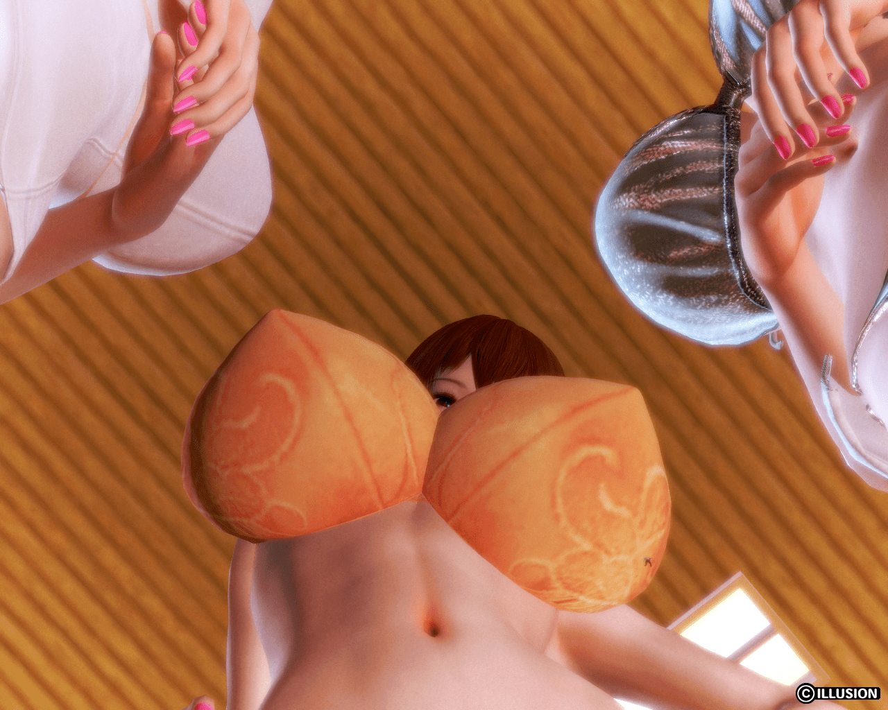

# 小人面對女巨人時的可視範圍

作者：麻婆豆腐

TID：21968

<title>1</title> <link href="../Styles/Style.css" type="text/css" rel="stylesheet">

# 1

*本帖最後由 BAss926 於 2016-10-9 17:10 編輯*

**(本文討論僅以男方縮小比例1:100為準)**

姑且假設小人的視力完全正常，也沒有什麼眼睛所佔比例太小導致光線不足之類的現實問題

那他有辦法看到女巨人的臉甚至全身的樣貌嗎？

或者只能看到比方說腰部以下、膝蓋以下、甚至是腳踝以下的部位呢？
參考比例如下

<title>2</title> <link href="../Styles/Style.css" type="text/css" rel="stylesheet">

# 2

大概只能看见臀部及以下，腰以上应该很难看见，要看见只有离远去看或者视线平行 <title>3</title> <link href="../Styles/Style.css" type="text/css" rel="stylesheet">

# 3

裙子挡着了，应该能看见内裤 <title>4</title> <link href="../Styles/Style.css" type="text/css" rel="stylesheet">

# 4

還可以看到下乳←重點
臉就很難了.當然要是距離而定

<title>5</title> <link href="../Styles/Style.css" type="text/css" rel="stylesheet">

# 5

> [葬儀社 發表於 2016-10-9 17:42](https://giantessnight.cf/gnforum2012/forum.php?mod=redirect&goto=findpost&pid=311060&ptid=21968)
> 還可以看到下乳←重點
> 臉就很難了.當然要是距離而定

不愧是你坛绅士
其实这个比例看下乳←重点   的话就和看天上的云一样模糊，甚至没法判断出这是圆形的，这是下乳←重点
适当缩小比例差距可以拯救下乳爱好者（认真脸
<title>6</title> <link href="../Styles/Style.css" type="text/css" rel="stylesheet">

# 6

找个200米的高楼，挑个没有雾霾的天气 就知道了 <title>7</title> <link href="../Styles/Style.css" type="text/css" rel="stylesheet">

# 7

> [dajiangjiang 發表於 2016-10-9 18:49](https://giantessnight.cf/gnforum2012/forum.php?mod=redirect&goto=findpost&pid=311064&ptid=21968)
> 不愧是你坛绅士
> 其实这个比例看下乳←重点   的话就和看天上的云一样模糊，甚至没法判断出这是圆形的，这 ...

握手（附圖自創的某位小人跟他的巨人老婆與女兒）

隨著呼吸搖擺著的乳房太讚了.光這個角度就可(逼------)←強制消音
不過..蹲下來的超巨大內褲空間也讓人難以取捨啊....

<title>8</title> <link href="../Styles/Style.css" type="text/css" rel="stylesheet">

# 8

 <ignore_js_op>[20161009195628071.png](forum.php?mod=attachment&aid=NjQ4Mzh8N2MxM2ZhZDN8MTY3NDA2Nzg5NnwxODIzMHwyMTk2OA%3D%3D&nothumb=yes) *(1.91 MB, 下載次數: 80)*

[下載附件](forum.php?mod=attachment&aid=NjQ4Mzh8N2MxM2ZhZDN8MTY3NDA2Nzg5NnwxODIzMHwyMTk2OA%3D%3D&nothumb=yes)

2016-10-9 18:57 上傳  

</ignore_js_op> <title>9</title> <link href="../Styles/Style.css" type="text/css" rel="stylesheet">

# 9

正常的话感觉看是看的见但是太远就会视觉模糊话了，不过看天上的云做参考的话感觉应该看的清。 <title>10</title> <link href="../Styles/Style.css" type="text/css" rel="stylesheet">

# 10

其实我要求很简单，可以看到玉足就满足了。 <title>11</title> <link href="../Styles/Style.css" type="text/css" rel="stylesheet">

# 11

我觉得可以看到脸 只要不挡住 <title>12</title> <link href="../Styles/Style.css" type="text/css" rel="stylesheet">

# 12

 可以看到妹子的袜子就够了 <title>13</title> <link href="../Styles/Style.css" type="text/css" rel="stylesheet">

# 13

不要考虑这么严肃的问题吗 <title>14</title> <link href="../Styles/Style.css" type="text/css" rel="stylesheet">

# 14

足控表示你们讨论，我随意。脸大概妹子探出头来总是能看到的吧 <title>15</title> <link href="../Styles/Style.css" type="text/css" rel="stylesheet">

# 15

视野不是很好，觉得小人大小比脚掌小一点最好w <title>16</title> <link href="../Styles/Style.css" type="text/css" rel="stylesheet">

# 16

作为足控表示能看到脚就可以 <title>17</title> <link href="../Styles/Style.css" type="text/css" rel="stylesheet">

# 17

是個很值得研究的問題