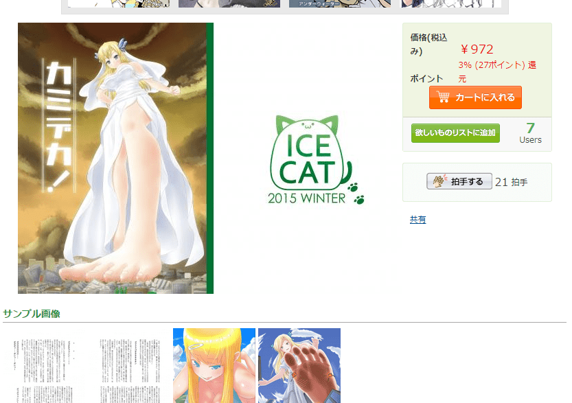

# 小水随便问的，话说Commensalism5和地球3及我的星奈很大续篇

作者：田棒棒

TID：20756

<title>1</title> <link href="../Styles/Style.css" type="text/css" rel="stylesheet">

# 1

前面俩不清楚，我的星奈很大好像没有续了吧。 <title>2</title> <link href="../Styles/Style.css" type="text/css" rel="stylesheet">

# 2

<ignore_js_op>

**QQ图片20160312144535.png** *(328.4 KB, 下載次數: 0)*

[下載附件](forum.php?mod=attachment&aid=NTk5MDV8Y2ZhOTgwOWJ8MTY3NDA2ODAyOHwxODIzMHwyMDc1Ng%3D%3D&nothumb=yes)

2016-3-12 14:46 上傳

我别的不知道只看到某个链接以及这张图
<title>3</title> <link href="../Styles/Style.css" type="text/css" rel="stylesheet">

# 3

> [紫色欧石楠 發表於 2016-3-12 14:47](https://giantessnight.cf/gnforum2012/forum.php?mod=redirect&goto=findpost&pid=286937&ptid=20756)
> 我别的不知道只看到某个链接以及这张图

這個並不是魏老爺HTE222星奈的續作

是另一個作者的作品 主要是小說 有別的配圖
<title>4</title> <link href="../Styles/Style.css" type="text/css" rel="stylesheet">

# 4

=-=我什么也没听说过丫。 要问大婶 <title>5</title> <link href="../Styles/Style.css" type="text/css" rel="stylesheet">

# 5

commensalism要花钱吗，是不是giantessbooru上的那个 <title>6</title> <link href="../Styles/Style.css" type="text/css" rel="stylesheet">

# 6

> [djh10 發表於 2016-3-12 19:36](https://giantessnight.cf/gnforum2012/forum.php?mod=redirect&goto=findpost&pid=287006&ptid=20756)
> commensalism要花钱吗，是不是giantessbooru上的那个

答案是上面这几个都要钱

<title>7</title> <link href="../Styles/Style.css" type="text/css" rel="stylesheet">

# 7

反正总是有人懂的，对我来说像高科技 <title>8</title> <link href="../Styles/Style.css" type="text/css" rel="stylesheet">

# 8

表示坐等出...（检索器坏了的说</ignore_js_op>