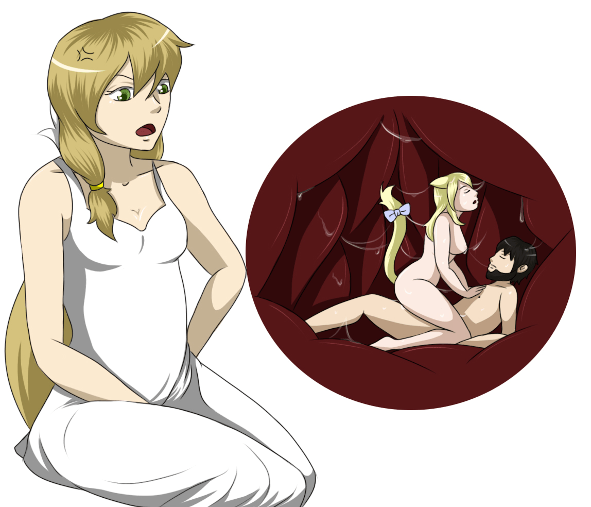
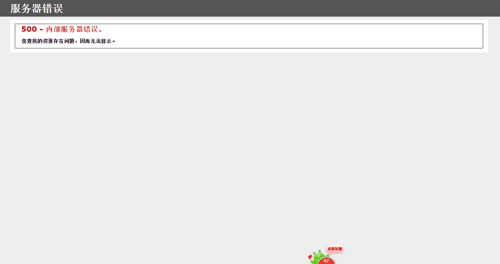

# 小的献上web翻墙网址 求多多金币

作者：a031997

TID：18236

<title>1</title> <link href="../Styles/Style.css" type="text/css" rel="stylesheet">

# 1

**[http://wjk098.jyqun.cn/web](http://wjk098.jyqun.cn/web/index.php)**
额 我个人搭建的web代理 算作个小贡献 那个 有啥问题请留言 然后我在改进  番腔  
不知道为啥cn域名挂载不上 所以智能在网址后面加web了      
<ignore_js_op>

**TheAllSeeingEye-284337-VoraciousRose-284111-Kagero2.jpg** *(360.71 KB, 下載次數: 5)*

[下載附件](forum.php?mod=attachment&aid=NDg4NDZ8NGIyMzJlZDV8MTY3NDA2ODEzOHwxODIzMHwxODIzNg%3D%3D&nothumb=yes)

2014-12-12 23:32 上傳

<title>2</title> <link href="../Styles/Style.css" type="text/css" rel="stylesheet">

# 2

楼主我只想说6666666666666666666666666666666666666666666666 <title>3</title> <link href="../Styles/Style.css" type="text/css" rel="stylesheet">

# 3

楼主，简直好评如潮……！！！ <title>4</title> <link href="../Styles/Style.css" type="text/css" rel="stylesheet">

# 4

试了下，速度挺快的。。。。。。 <title>5</title> <link href="../Styles/Style.css" type="text/css" rel="stylesheet">

# 5

万分感谢，真的很好用！ <title>6</title> <link href="../Styles/Style.css" type="text/css" rel="stylesheet">

# 6

youtube 是可以上
但是 视频 看不成
视频 加载不出来 <title>7</title> <link href="../Styles/Style.css" type="text/css" rel="stylesheet">

# 7

那个 我试试  下次记得给我截图哟 <title>8</title> <link href="../Styles/Style.css" type="text/css" rel="stylesheet">

# 8

果断的好评~
奖励点请收下~ <title>9</title> <link href="../Styles/Style.css" type="text/css" rel="stylesheet">

# 9

速度挺快的   感谢大大    _(:_」∠)_ <title>10</title> <link href="../Styles/Style.css" type="text/css" rel="stylesheet">

# 10

简单实用  谢谢楼主 不用下载翻墙软件了 <title>11</title> <link href="../Styles/Style.css" type="text/css" rel="stylesheet">

# 11

好像国外网盘下不了，其他都很快 <title>12</title> <link href="../Styles/Style.css" type="text/css" rel="stylesheet">

# 12

好滴 我会想办法解决 <title>13</title> <link href="../Styles/Style.css" type="text/css" rel="stylesheet">

# 13

呵呵，我怎么弄不了，楼主 <title>14</title> <link href="../Styles/Style.css" type="text/css" rel="stylesheet">

# 14

感觉很多打不开，是时间段的问题吧。 <title>15</title> <link href="../Styles/Style.css" type="text/css" rel="stylesheet">

# 15

能问一下楼主图的出处？ <title>16</title> <link href="../Styles/Style.css" type="text/css" rel="stylesheet">

# 16

唔、除了看生放送之外很少去国外站了U_U <title>17</title> <link href="../Styles/Style.css" type="text/css" rel="stylesheet">

# 17

网址打不开啊   lz修复一下呗 <title>18</title> <link href="../Styles/Style.css" type="text/css" rel="stylesheet">

# 18

樓主呀~現在是這樣一個問題，如果方便的話請解決一下吧~：） ~期待樓主的代理呵~
<title>19</title> <link href="../Styles/Style.css" type="text/css" rel="stylesheet">

# 19

 <ignore_js_op>[新建位图图像.bmp](forum.php?mod=attachment&aid=NTEyMTF8MWRhODE1ODV8MTY3NDA2ODE0NHwxODIzMHwxODIzNg%3D%3D&nothumb=yes) *(2.52 MB, 下載次數: 1)*

[下載附件](forum.php?mod=attachment&aid=NTEyMTF8MWRhODE1ODV8MTY3NDA2ODE0NHwxODIzMHwxODIzNg%3D%3D&nothumb=yes)

2015-3-24 14:33 上傳  

</ignore_js_op> <title>20</title> <link href="../Styles/Style.css" type="text/css" rel="stylesheet">

# 20

不知道可不可以翻色情守門員哈哈 <title>21</title> <link href="../Styles/Style.css" type="text/css" rel="stylesheet">

# 21

唉 来晚了 貌似已经不行了 <title>22</title> <link href="../Styles/Style.css" type="text/css" rel="stylesheet">

# 22

感谢楼主分享本来的app翻墙都被墙了 <title>23</title> <link href="../Styles/Style.css" type="text/css" rel="stylesheet">

# 23

额，为啥我点开就显示服务器错误 <title>24</title> <link href="../Styles/Style.css" type="text/css" rel="stylesheet">

# 24

服务器错误了 不知道还能不能修复 <title>25</title> <link href="../Styles/Style.css" type="text/css" rel="stylesheet">

# 25

我也是...貌似这个网址不能打开了... <title>26</title> <link href="../Styles/Style.css" type="text/css" rel="stylesheet">

# 26

能翻墙真是太好了 很感谢 <title>27</title> <link href="../Styles/Style.css" type="text/css" rel="stylesheet">

# 27

为什么网页打不开？？ <title>28</title> <link href="../Styles/Style.css" type="text/css" rel="stylesheet">

# 28

为什么俺们手机党还是打不开啊 <title>29</title> <link href="../Styles/Style.css" type="text/css" rel="stylesheet">

# 29

我估计这个也被墙了,还真是快啊</ignore_js_op>