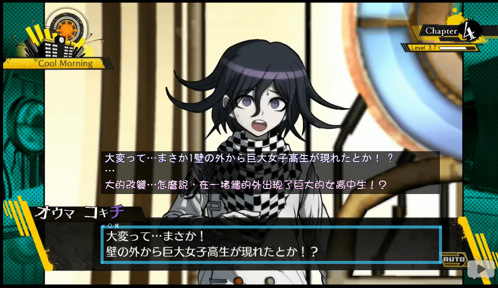

# 小高绝对是业内人士

作者：123pppG

TID：22506

<title>1</title> <link href="../Styles/Style.css" type="text/css" rel="stylesheet">

# 1

不仅弹丸2里的某人巨大化了，新的弹丸V3里头也出现了这个梗。
<title>2</title> <link href="../Styles/Style.css" type="text/css" rel="stylesheet">

# 2

 <ignore_js_op>[捕获～～.PNG](forum.php?mod=attachment&aid=NjY1ODR8MWE5NjBhNTR8MTY3NDA2NzU5MnwxODIzMHwyMjUwNg%3D%3D&nothumb=yes) *(1.19 MB, 下載次數: 82)*

[下載附件](forum.php?mod=attachment&aid=NjY1ODR8MWE5NjBhNTR8MTY3NDA2NzU5MnwxODIzMHwyMjUwNg%3D%3D&nothumb=yes)

2017-1-26 02:17 上傳  

</ignore_js_op> <title>3</title> <link href="../Styles/Style.css" type="text/css" rel="stylesheet">

# 3

天了噜，是个好情报，但法王放成这样简直没王法。

~~YSLM见！~~
<title>4</title> <link href="../Styles/Style.css" type="text/css" rel="stylesheet">

# 4

> [Cae 發表於 2017-1-26 08:19](https://giantessnight.cf/gnforum2012/forum.php?mod=redirect&goto=findpost&pid=321547&ptid=22506)
> 天了噜，是个好情报，但法王放成这样简直没王法。
> 
> ~~YSLM见！~~

我会告诉你法王和YSLM我都是百度后才知道啥意思的吗，nga真可怕
另外感谢@[starcraftorz](http://www.giantessnight.com/gnforum2012/home.php?mod=space&uid=12944)大佬，有生之年能被dalao点评，幸甚至哉。
<title>5</title> <link href="../Styles/Style.css" type="text/css" rel="stylesheet">

# 5

> [123pppG 發表於 2017-1-26 13:39](https://giantessnight.cf/gnforum2012/forum.php?mod=redirect&goto=findpost&pid=321568&ptid=22506)
> 我会告诉你法王和YSLM我都是百度后才知道啥意思的吗，nga真可怕
> 另外感谢@starcraftorz大佬，有 ...

拜你所赐我现在正在下PC端的超级弹丸论破。

NGA明明是个温暖而友好的社区
<title>6</title> <link href="../Styles/Style.css" type="text/css" rel="stylesheet">

# 6

他咋还不上天捏？！又玩这个梗？ <title>7</title> <link href="../Styles/Style.css" type="text/css" rel="stylesheet">

# 7

看来江之岛盾子真的是日常出梗了