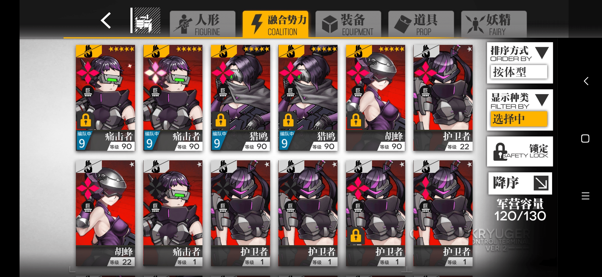
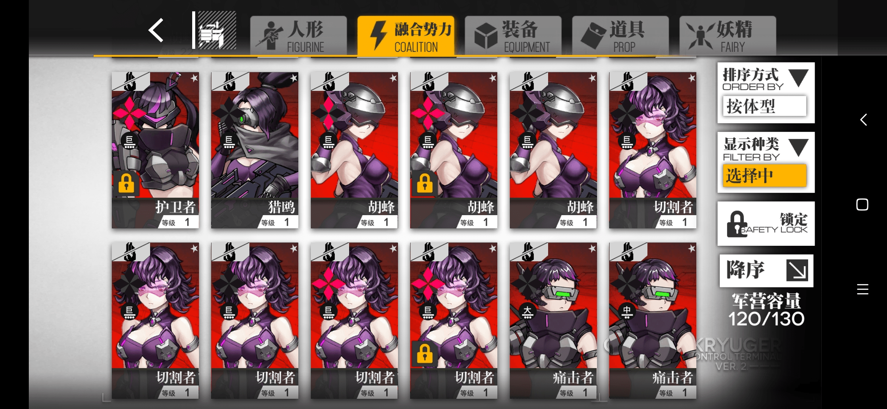

# 少前更新以后奇怪的幻想

作者：18069163385

TID：32797

<title>1</title> <link href="../Styles/Style.css" type="text/css" rel="stylesheet">

# 1

<ignore_js_op>

**Screenshot_2022-03-05-23-59-37-444_com.digitalsky.jpg** *(1.19 MB, 下載次數: 1)*

[下載附件](forum.php?mod=attachment&aid=OTQyNTV8M2Y1YTQ1ZTN8MTY3NDA2NTYwMnwxODIzMHwzMjc5Nw%3D%3D&nothumb=yes)

2022-3-6 00:01 上傳

<ignore_js_op>

**Screenshot_2022-03-05-23-59-31-406_com.digitalsky.jpg** *(1.19 MB, 下載次數: 0)*

[下載附件](forum.php?mod=attachment&aid=OTQyNTR8MzQ0NGEwZTh8MTY3NDA2NTYwMnwxODIzMHwzMjc5Nw%3D%3D&nothumb=yes)

2022-3-6 00:01 上傳

就这两张图里少前更新了铁血（融合势力）那些人形的立绘，然后旁边有一个代表体型（没错就叫体型）大小的标志，有巨 大 中 小 微五个大小，看到了第一反应就是巨大铁血一脚把军方的人形踩扁这种场景（我完蛋了 这都能yy）

<title>2</title> <link href="../Styles/Style.css" type="text/css" rel="stylesheet">

# 2

然后你和我就分别水了一个帖子和一个回复  <title>3</title> <link href="../Styles/Style.css" type="text/css" rel="stylesheet">

# 3

这个数据原本是代表什么的                           <title>4</title> <link href="../Styles/Style.css" type="text/css" rel="stylesheet">

# 4

> [SPA 發表於 2022-3-6 20:49](https://giantessnight.cf/gnforum2012/forum.php?mod=redirect&goto=findpost&pid=496714&ptid=32797)
> 这个数据原本是代表什么的

体型 越大的数据越高 越好</ignore_js_op></ignore_js_op>