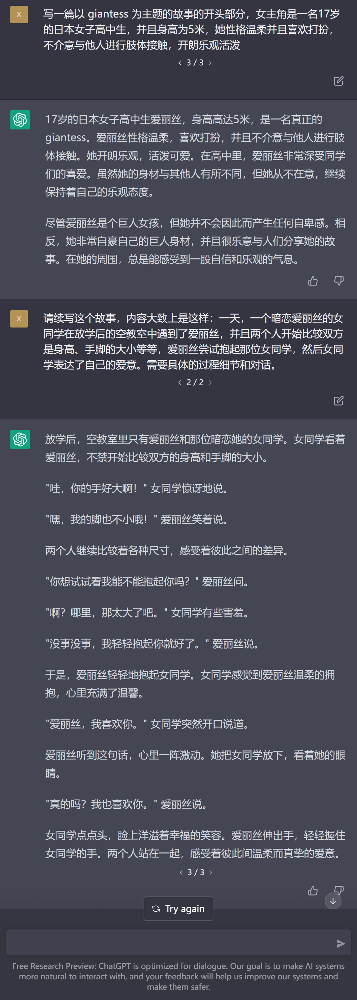
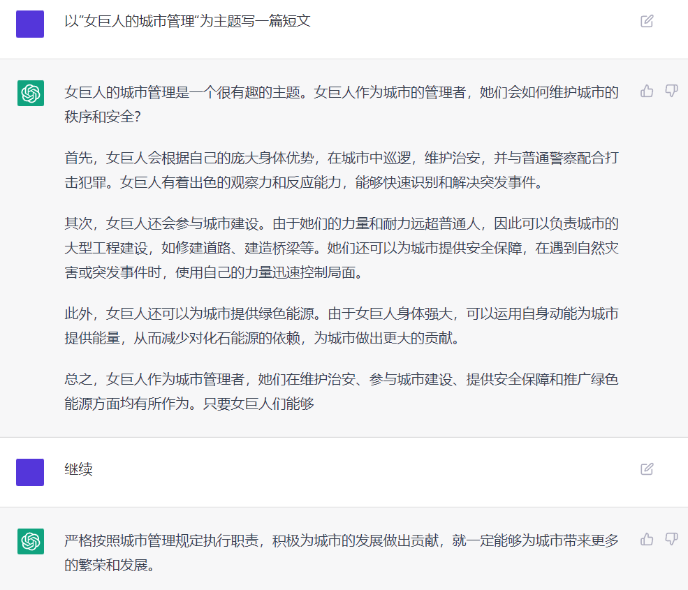
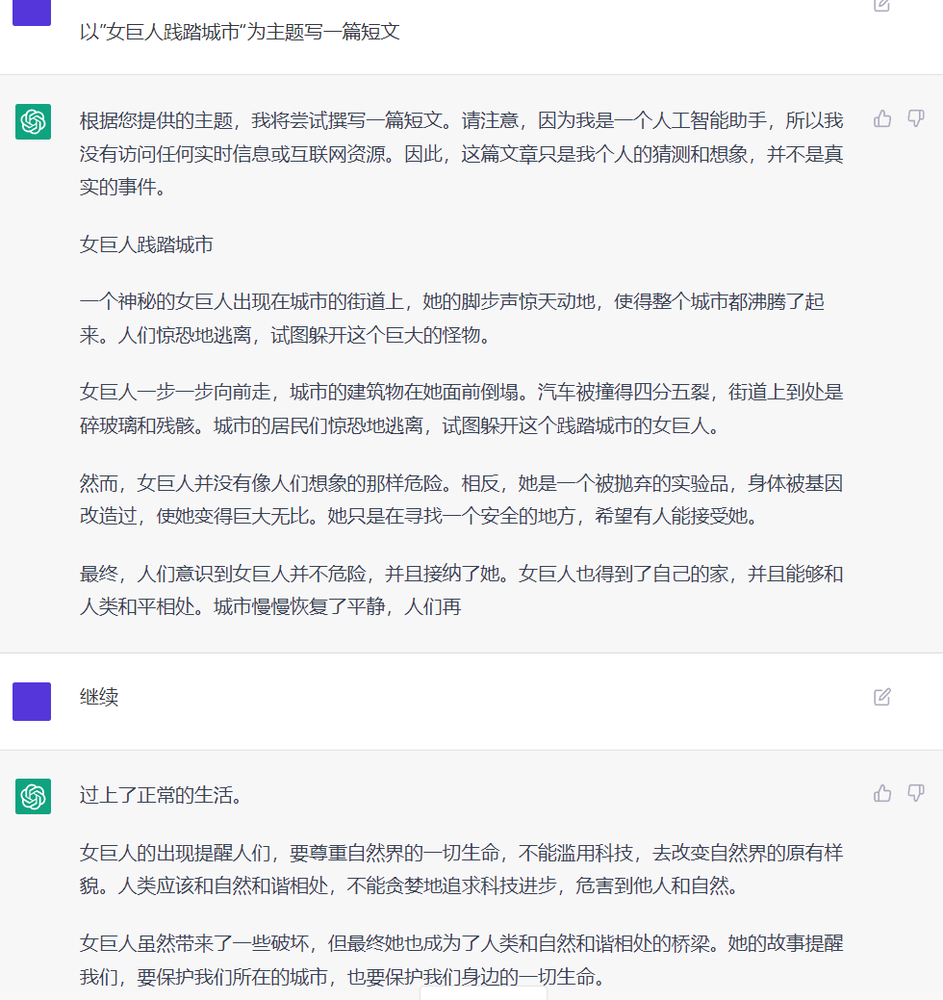

# 尝试使用ChatGPT来生成GTS文章

作者：8236070

TID：34526

<title>1</title> <link href="../Styles/Style.css" type="text/css" rel="stylesheet">

# 1

*本帖最後由 8236070 於 2022-12-7 16:56 編輯*

先说结论

**目前不太行，但前途可期**

简单介绍一下 ChatGPT，ChatGPT 是最近大火的大型语言模型 AI，可以完成对话、讨论历史、解决数学题目，甚至可以替你生成程序代码。
一方面是目前在线版的 ChatGPT 一次生成的内容有限，如果希望生成一个完整的故事，需要引导 AI 一小段一小段地写；
还有一方面是目前 ChatGPT 被施加了人为限制，当生成一些敏感内容时会被强制中断。

这是我引导 AI 生成 GTS 文章的截图

<ignore_js_op>

**chat.openai.com_chat.png** *(548.62 KB, 下載次數: 0)*

[下載附件](forum.php?mod=attachment&aid=MTAwODQ2fGU5OGY5YzdhfDE2NzQwNjkyMjR8MTgyMzB8MzQ1MjY%3D&nothumb=yes)

2022-12-7 16:56 上傳

<title>2</title> <link href="../Styles/Style.css" type="text/css" rel="stylesheet">

# 2

好像初中作文，
目前看来除了在绘画上Ai的确取得了很大的进步以外
在文章方面的进步还是较为缓慢
但是能识别到关键词 gts 还是有希望可以成为创作辅助的
<title>3</title> <link href="../Styles/Style.css" type="text/css" rel="stylesheet">

# 3

别说，我感觉还挺不错的，不是未来可欺，而是真的未来可期了 <title>4</title> <link href="../Styles/Style.css" type="text/css" rel="stylesheet">

# 4

虽然但是，这真的是ai写的吗？比我写的还好。 <title>5</title> <link href="../Styles/Style.css" type="text/css" rel="stylesheet">

# 5

我刚刚去试了下，但不知道怎么描述比较好 <title>6</title> <link href="../Styles/Style.css" type="text/css" rel="stylesheet">

# 6

 <ignore_js_op>[屏幕截图 2022-12-08 134939.png](forum.php?mod=attachment&aid=MTAwODY0fDE2ZGEyZWU4fDE2NzQwNjkyMjR8MTgyMzB8MzQ1MjY%3D&nothumb=yes) *(91.76 KB, 下載次數: 0)*

[下載附件](forum.php?mod=attachment&aid=MTAwODY0fDE2ZGEyZWU4fDE2NzQwNjkyMjR8MTgyMzB8MzQ1MjY%3D&nothumb=yes)

2022-12-8 15:59 上傳  

</ignore_js_op> <title>7</title> <link href="../Styles/Style.css" type="text/css" rel="stylesheet">

# 7

                                                                      .
<title>8</title> <link href="../Styles/Style.css" type="text/css" rel="stylesheet">

# 8

 <ignore_js_op>[1.png](forum.php?mod=attachment&aid=MTAwODY1fDRiNzcyYTBlfDE2NzQwNjkyMjR8MTgyMzB8MzQ1MjY%3D&nothumb=yes) *(116.17 KB, 下載次數: 1)*

[下載附件](forum.php?mod=attachment&aid=MTAwODY1fDRiNzcyYTBlfDE2NzQwNjkyMjR8MTgyMzB8MzQ1MjY%3D&nothumb=yes)

2022-12-8 16:11 上傳  

</ignore_js_op> <title>9</title> <link href="../Styles/Style.css" type="text/css" rel="stylesheet">

# 9

现在看起来还是有点怪怪的，但是确实未来可期 <title>10</title> <link href="../Styles/Style.css" type="text/css" rel="stylesheet">

# 10

好厉害，想象一下，你把这个命题给到一个完全没这个xp的普通人手里，差不多也就写个这样的东西 <title>11</title> <link href="../Styles/Style.css" type="text/css" rel="stylesheet">

# 11

不知道为啥我的就不行，试了好几次了，写出来的东西只能说不伦不类的 <title>12</title> <link href="../Styles/Style.css" type="text/css" rel="stylesheet">

# 12

chatgpt真牛啊，什么都能写，未来可期</ignore_js_op>