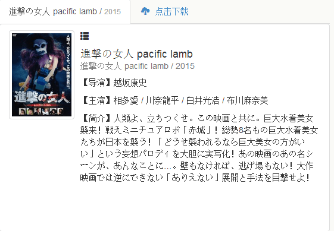

# 岛国奇葩pacific lamb

作者：Hola

TID：20690

<title>1</title> <link href="../Styles/Style.css" type="text/css" rel="stylesheet">

# 1

发现一个奇葩pacific lamb
有谁知道这是什么鬼
<title>2</title> <link href="../Styles/Style.css" type="text/css" rel="stylesheet">

# 2

 <ignore_js_op>[QQ截图20160229145606.png](forum.php?mod=attachment&aid=NTk2ODd8MTVkOWIxZTB8MTY3NDA2ODg3OHwxODIzMHwyMDY5MA%3D%3D&nothumb=yes) *(55.11 KB, 下載次數: 8)*

[下載附件](forum.php?mod=attachment&aid=NTk2ODd8MTVkOWIxZTB8MTY3NDA2ODg3OHwxODIzMHwyMDY5MA%3D%3D&nothumb=yes)

2016-2-29 14:56 上傳  

</ignore_js_op> <ignore_js_op>[QQ截图20160229145606.png](forum.php?mod=attachment&aid=NTk2ODZ8MTQwZDAxNTJ8MTY3NDA2ODg3OHwxODIzMHwyMDY5MA%3D%3D&nothumb=yes) *(55.11 KB, 下載次數: 5)*

[下載附件](forum.php?mod=attachment&aid=NTk2ODZ8MTQwZDAxNTJ8MTY3NDA2ODg3OHwxODIzMHwyMDY5MA%3D%3D&nothumb=yes)

2016-2-29 14:55 上傳  

</ignore_js_op> <title>3</title> <link href="../Styles/Style.css" type="text/css" rel="stylesheet">

# 3

为啥看封面感觉是恐怖系的 <title>4</title> <link href="../Styles/Style.css" type="text/css" rel="stylesheet">

# 4

同感..表情好凶好吓人                <title>5</title> <link href="../Styles/Style.css" type="text/css" rel="stylesheet">

# 5

稍微去看了下預告片
其實還挺喜感的 <title>6</title> <link href="../Styles/Style.css" type="text/css" rel="stylesheet">

# 6

> [joe820502 發表於 2016-2-29 18:19](https://giantessnight.cf/gnforum2012/forum.php?mod=redirect&goto=findpost&pid=285849&ptid=20690)
> 稍微去看了下預告片
> 其實還挺喜感的

请问预告片地址？有GTS吗？
<title>7</title> <link href="../Styles/Style.css" type="text/css" rel="stylesheet">

# 7

我…………到底………………這…………
…………日本正常能量釋放中 <title>8</title> <link href="../Styles/Style.css" type="text/css" rel="stylesheet">

# 8

这算是日本的B级片吗。。。 玩的就是奇葩呀 <title>9</title> <link href="../Styles/Style.css" type="text/css" rel="stylesheet">

# 9

其实预告片挺萌的，好像是A片...... <title>10</title> <link href="../Styles/Style.css" type="text/css" rel="stylesheet">

# 10

应该叫进击的女鬼吧 <title>11</title> <link href="../Styles/Style.css" type="text/css" rel="stylesheet">

# 11

喜欢巨大化的女僵尸    <title>12</title> <link href="../Styles/Style.css" type="text/css" rel="stylesheet">

# 12

呃 貌似还是真人版的= = <title>13</title> <link href="../Styles/Style.css" type="text/css" rel="stylesheet">

# 13

我从未见过有如此前奇葩的玩意2333 <title>14</title> <link href="../Styles/Style.css" type="text/css" rel="stylesheet">

# 14

我还找到了预告片
[http://v.youku.com/v_show/id_XMT ... tml?from=s1.8-1-1.2](http://v.youku.com/v_show/id_XMTQ4MjIzMDEwOA==.html?from=s1.8-1-1.2) <title>15</title> <link href="../Styles/Style.css" type="text/css" rel="stylesheet">

# 15

请问这是gts的漫画吗？ <title>16</title> <link href="../Styles/Style.css" type="text/css" rel="stylesheet">

# 16

> [我只是路过 發表於 2016-8-18 00:46](https://giantessnight.cf/gnforum2012/forum.php?mod=redirect&goto=findpost&pid=304495&ptid=20690)
> 请问这是gts的漫画吗？

其实我也毫无头绪！所以发帖子问问。
<title>17</title> <link href="../Styles/Style.css" type="text/css" rel="stylesheet">

# 17

这个就太逗比了。。。进击的原始人。。。？
果然还是等待的好 <title>18</title> <link href="../Styles/Style.css" type="text/css" rel="stylesheet">

# 18

看起来实在没法接受    <title>19</title> <link href="../Styles/Style.css" type="text/css" rel="stylesheet">

# 19

看图感觉好可怕啊，不知道质量如何了，求链接 <title>20</title> <link href="../Styles/Style.css" type="text/css" rel="stylesheet">

# 20

说起伪娘我只能偶呵呵 <title>21</title> <link href="../Styles/Style.css" type="text/css" rel="stylesheet">

# 21

不知道好不好看才是关键~ <title>22</title> <link href="../Styles/Style.css" type="text/css" rel="stylesheet">

# 22

看了预告片不知道为什么想笑