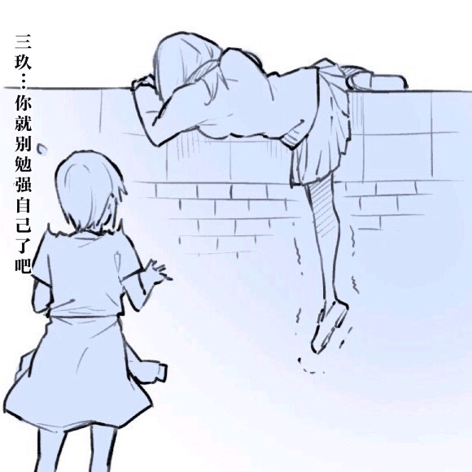
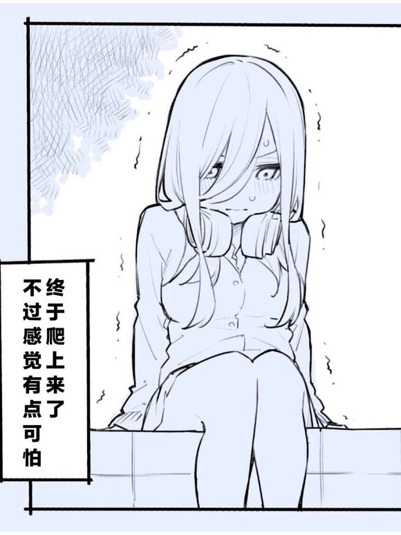
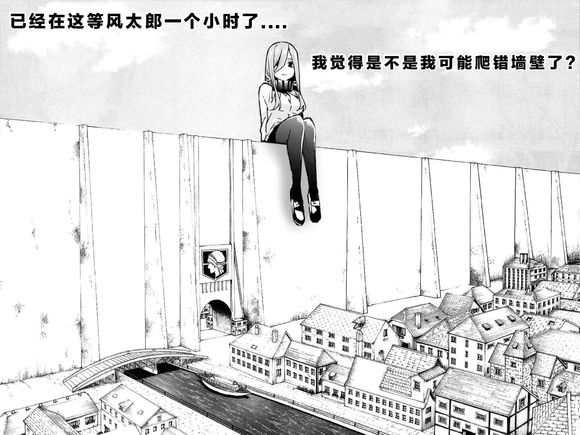

# 巨大化三玖

作者：1229685971

TID：27134

<title>1</title> <link href="../Styles/Style.css" type="text/css" rel="stylesheet">

# 1

贴吧看到的 觉得好好玩
<ignore_js_op>

**ad816210b912c8fc875db723f2039245d78821b8.jpg** *(165.32 KB, 下載次數: 2)*

[下載附件](forum.php?mod=attachment&aid=NzkyMDV8ZDE5YzVkNTB8MTY3NDA2Njc2MXwxODIzMHwyNzEzNA%3D%3D&nothumb=yes)

2019-7-22 02:43 上傳

<ignore_js_op>

**eaf0c3cd7b899e516eae7cfa4ca7d933c9950dc2.jpg** *(66.42 KB, 下載次數: 3)*

[下載附件](forum.php?mod=attachment&aid=NzkyMDN8MDhmOTI5YTF8MTY3NDA2Njc2MXwxODIzMHwyNzEzNA%3D%3D&nothumb=yes)

2019-7-22 02:42 上傳

<ignore_js_op>

**d55f9619ebc4b7453a9af1f8c1fc1e178b8215d8.jpg** *(56.29 KB, 下載次數: 6)*

[下載附件](forum.php?mod=attachment&aid=NzkyMDR8N2RhYmU5NDZ8MTY3NDA2Njc2MXwxODIzMHwyNzEzNA%3D%3D&nothumb=yes)

2019-7-22 02:42 上傳

<title>2</title> <link href="../Styles/Style.css" type="text/css" rel="stylesheet">

# 2

哈哈哈哈要保护后颈锕 <title>3</title> <link href="../Styles/Style.css" type="text/css" rel="stylesheet">

# 3

不是九大巨人之一，就是一個奇行種。
身高在高一點，就幾乎有超大型巨人高 <title>4</title> <link href="../Styles/Style.css" type="text/css" rel="stylesheet">

# 4

可以很强大                               <title>5</title> <link href="../Styles/Style.css" type="text/css" rel="stylesheet">

# 5

喜讯啊，巨人和五等分联动了（才不） <title>6</title> <link href="../Styles/Style.css" type="text/css" rel="stylesheet">

# 6

> [Malph 發表於 2019-7-22 05:57](https://giantessnight.cf/gnforum2012/forum.php?mod=redirect&goto=findpost&pid=410663&ptid=27134)
> 哈哈哈哈要保护后颈锕

39有耳機啊
擋得住的
五等分的花嫁 五等分的掙扎
<title>7</title> <link href="../Styles/Style.css" type="text/css" rel="stylesheet">

# 7

> [超SizeJKGirl 發表於 2019-7-22 18:10](https://giantessnight.cf/gnforum2012/forum.php?mod=redirect&goto=findpost&pid=410716&ptid=27134)
> 39有耳機啊
> 擋得住的
> 五等分的花嫁 五等分的掙扎

签名指ローファー？中文记得是叫乐福鞋吧。
<title>8</title> <link href="../Styles/Style.css" type="text/css" rel="stylesheet">

# 8

咦，这个是跟巨人联动了吗？ <title>9</title> <link href="../Styles/Style.css" type="text/css" rel="stylesheet">

# 9

*本帖最後由 超SizeJKGirl 於 2019-7-23 16:01 編輯*

> [asdfg 發表於 2019-7-23 01:08](https://giantessnight.cf/gnforum2012/forum.php?mod=redirect&goto=findpost&pid=410747&ptid=27134)
> 签名指ローファー？中文记得是叫乐福鞋吧。

感謝你了
其實這個我已經知道很久了
只是我一直忘記改過來...
而且中文的樂福鞋跟日系的不太一樣
後面就放棄找中文的名稱了
而且日系跟其他地方的樂福鞋感覺也不一樣
亞洲地區有些都是比較可愛那種
日本的比較優雅一些
<ignore_js_op>

**72727291_p0.jpg** *(360.45 KB, 下載次數: 0)*

[下載附件](forum.php?mod=attachment&aid=NzkyMDl8MDE2NzZkOGV8MTY3NDA2Njc2MXwxODIzMHwyNzEzNA%3D%3D&nothumb=yes)

日系 五等分的腳腳

2019-7-23 15:59 上傳

其他地方的就比較類似這樣子的
<ignore_js_op>

**dd8yckb-7418460a-6df6-423a-8c83-d54a7af2859c.jpg** *(4.42 MB, 下載次數: 0)*

[下載附件](forum.php?mod=attachment&aid=NzkyMTB8NWUzMjlhNjF8MTY3NDA2Njc2MXwxODIzMHwyNzEzNA%3D%3D&nothumb=yes)

其他地方

2019-7-23 16:00 上傳

<title>10</title> <link href="../Styles/Style.css" type="text/css" rel="stylesheet">

# 10

看到这个图 感觉很有意思 5等分的巨人花嫁 想想都有意思 <title>11</title> <link href="../Styles/Style.css" type="text/css" rel="stylesheet">

# 11

哈哈哈哈，有点有趣的呀 <title>12</title> <link href="../Styles/Style.css" type="text/css" rel="stylesheet">

# 12

点进来之前还以为真有某位大佬画了五等分的gts本</ignore_js_op></ignore_js_op></ignore_js_op></ignore_js_op></ignore_js_op>