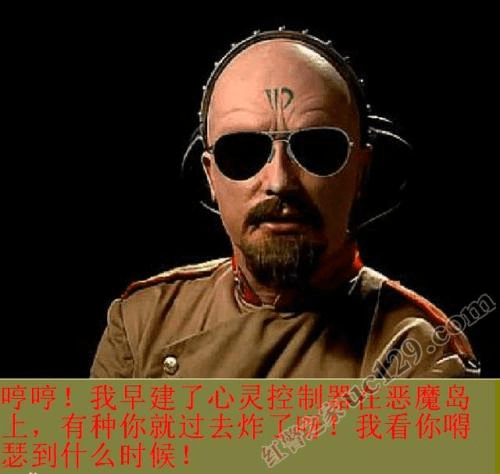

# 巨大娘有意和小人对抗，小人有获胜的机会吗？

作者：zhangwuwen321

TID：24549

<title>1</title> <link href="../Styles/Style.css" type="text/css" rel="stylesheet">

# 1

*本帖最後由 dsa123 於 2018-2-19 03:51 編輯*

不知道大家都能接受哪一种呢 <title>2</title> <link href="../Styles/Style.css" type="text/css" rel="stylesheet">

# 2

要是能贏 我看什麽gts
看爽文得了 <title>3</title> <link href="../Styles/Style.css" type="text/css" rel="stylesheet">

# 3

楼上+10086

PS：真心复议，绝非灌水 <title>4</title> <link href="../Styles/Style.css" type="text/css" rel="stylesheet">

# 4

问能接受哪种的话就不用考虑真实了吧～
不过小人大概多小，有比例吗.. <title>5</title> <link href="../Styles/Style.css" type="text/css" rel="stylesheet">

# 5

感覺上 小人可以像地田仁偷偷拿毒針去刺 巨大娘不警戒的情況下 可能還有一絲機會
但主要在大小差距1/100內 考慮再1/100原因:小人能拿的武器大小OR力量能否刺破皮膚
大多數巨大娘作品隨尺寸變大 防禦更強 之後的1/500 1/1000 感覺上就算巨大娘放水也贏不了 <title>6</title> <link href="../Styles/Style.css" type="text/css" rel="stylesheet">

# 6

如果是金闪闪的话，一个乖离剑下去大概就......
如果巨大少女是千万倍乃至数亿倍的话，小人怎么玩（-_-||）？
如果是十倍或者百倍的话，可以尝试一下。
反抗当然应该有（除了自愿的），至于成功与否那就是另一个问题了。
如果自己是小人的话当然希望能够成功反抗了。
就像Dante大神文章里的法雷尔一样。 <title>7</title> <link href="../Styles/Style.css" type="text/css" rel="stylesheet">

# 7

同上，正面硬刚怎么搞？大多数文章肯定都会体现力量差距的，体型差距太大就没有可比性了，不然也没有什么切入点可以描写。 <title>8</title> <link href="../Styles/Style.css" type="text/css" rel="stylesheet">

# 8

看劇情需要
如果是男高中生到女朋友家給她舔那女的似乎越op越好
但如果是戰爭類或戰鬥類，小人如果沒有任何影響戰局走向的能力那會非常無聊，就想像只有埼玉的一拳超人會多毒吧
當然單方面虐殺的劇情好寫很多啦，但如果不是那種用潮吹滅國的走向，各方的心理刻劃一定要作好
總之就是選項其實不重要，端看你怎麼作發揮
<title>9</title> <link href="../Styles/Style.css" type="text/css" rel="stylesheet">

# 9

看看我写的文然后好好想想
平时弱不禁风的小孩，如果小人只有1厘米，光是脚就是肉山了
到时候就是小孩彻底统治大人
何况巨大娘 <title>10</title> <link href="../Styles/Style.css" type="text/css" rel="stylesheet">

# 10

小人比例，小人智力，战斗环境，巨娘智力，巨娘性格，还有一些其他条件（比如小人的能力和巨娘的能力）都会影响战局走向和结果
具体还是要看剧情需要吧 <title>11</title> <link href="../Styles/Style.css" type="text/css" rel="stylesheet">

# 11

这个就要看小人和巨大娘的比例和大小了 <title>12</title> <link href="../Styles/Style.css" type="text/css" rel="stylesheet">

# 12

我对人类有信心，生物不是越大就很厉害的，巨大娘再大也只是一个萌娘，当然你说的巨大娘要是比地球还大的话就没什么可比性了。 <title>13</title> <link href="../Styles/Style.css" type="text/css" rel="stylesheet">

# 13

大脚骑脸怎么输
到百米都变成怪兽那个规模了感觉 <title>14</title> <link href="../Styles/Style.css" type="text/css" rel="stylesheet">

# 14

必须完败啊，不然就没意思了我想象中的gts就是碾压小人 <title>15</title> <link href="../Styles/Style.css" type="text/css" rel="stylesheet">

# 15

我希望是蚁人那种
随意变小又有力量 <title>16</title> <link href="../Styles/Style.css" type="text/css" rel="stylesheet">

# 16

如果有多选的话我倒是136都想选…… <title>17</title> <link href="../Styles/Style.css" type="text/css" rel="stylesheet">

# 17

我感觉 女巨人是无敌的存在 只有小人被虐 看着 才爽 要不哪来的激情 故意放水 可以 但 最后 一定 是女巨人完虐小人才行 <title>18</title> <link href="../Styles/Style.css" type="text/css" rel="stylesheet">

# 18

*本帖最後由 坎坎坷坷 於 2018-2-21 11:14 編輯*

她们的心灵太脆弱了，现在她们为我服务。心灵控制器早已再全宇宙部署 <title>19</title> <link href="../Styles/Style.css" type="text/css" rel="stylesheet">

# 19

 <ignore_js_op>[u=2916533737,286699576&amp;fm=27&amp;gp=0.jpg](forum.php?mod=attachment&aid=NzA5NjJ8OWJkMTY4Mzl8MTY3NDA2NzIzMHwxODIzMHwyNDU0OQ%3D%3D&nothumb=yes) *(25.99 KB, 下載次數: 0)*

[下載附件](forum.php?mod=attachment&aid=NzA5NjJ8OWJkMTY4Mzl8MTY3NDA2NzIzMHwxODIzMHwyNDU0OQ%3D%3D&nothumb=yes)

2018-2-21 11:12 上傳  

</ignore_js_op> <title>20</title> <link href="../Styles/Style.css" type="text/css" rel="stylesheet">

# 20

参考JOJO第六部绿色婴儿那次 越小胜率越低 <title>21</title> <link href="../Styles/Style.css" type="text/css" rel="stylesheet">

# 21

如果是十倍百倍千倍个人认为借助外物有机会取胜，但要有周密的计划且对方不知情，还要做好人员重大伤亡的准备。
外物：二向箔、死星主炮、反物质炸弹、妖刀村正、病毒、小行星天降正义、SCP-173......
但是...这些外物都不好找... <title>22</title> <link href="../Styles/Style.css" type="text/css" rel="stylesheet">

# 22

巨大娘有碾压级别的属性压制，但是也不是毫无办法 <title>23</title> <link href="../Styles/Style.css" type="text/css" rel="stylesheet">

# 23

怎么对抗= =牙签搅大纲 <title>24</title> <link href="../Styles/Style.css" type="text/css" rel="stylesheet">

# 24

肯定打不过 三岁小孩都打不过一米八的女人 更别说小人对抗巨人了 <title>25</title> <link href="../Styles/Style.css" type="text/css" rel="stylesheet">

# 25

那就得看小人的科技水平了 <title>26</title> <link href="../Styles/Style.css" type="text/css" rel="stylesheet">

# 26

二楼真的真相了，但是个人喜欢温柔系滴！！！！ <title>27</title> <link href="../Styles/Style.css" type="text/css" rel="stylesheet">

# 27

讲真几乎不存在用特殊力量取胜以外的胜利可能，人类如果单纯按比例缩小的话，跟自然界其他同体积生物身体性能一对比你就能看出缩小的人类光是活着就已经很不容易了 <title>28</title> <link href="../Styles/Style.css" type="text/css" rel="stylesheet">

# 28

来来来，我们来玩科学
根据Pressure law 来说
小人只要弄出一个无限幼的剑/绳/毒针
就可以把巨大娘 一刀两断 或者把毒药带进其身体内
体型什么的 皮肤总不能抵挡 F/(0.0000000000215)^2*(3.14) 的压力（以钛为例）
所以只要毒针够锋利
什么巨大娘也是能干掉的
然后要看毒的分量
这个只要毒药的运作机理是以堵塞凝固血液为主的话
这种毒药是不需要理会体型的

基于以上理由，我选二 <title>29</title> <link href="../Styles/Style.css" type="text/css" rel="stylesheet">

# 29

看过刘慈欣大大的《微人》后，我觉得巨大只是一个附加属性，一旦小人科技实力上升后，就有可能颠覆巨人的优势。比如使用脑电波干扰仪。 <title>30</title> <link href="../Styles/Style.css" type="text/css" rel="stylesheet">

# 30

理智一想，外力當然能夠把巨大娘對抗，不過科技力不只存在於小人這邊，認真的不放水真的不太可能