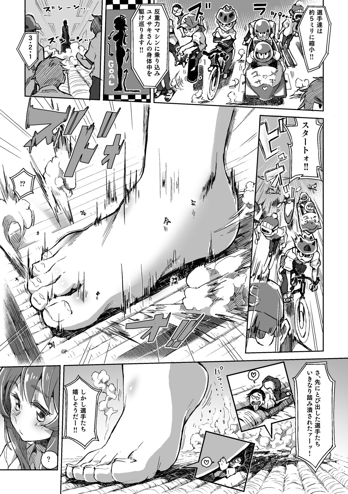
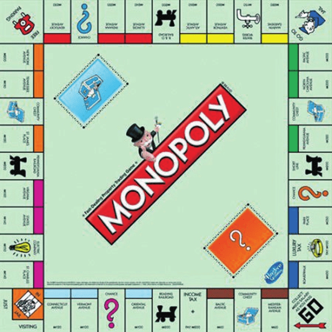

# 巨大娘桌遊計畫

作者：雪鸮吟游诗人

TID：25958

<title>1</title> <link href="../Styles/Style.css" type="text/css" rel="stylesheet">

# 1

深夜腦洞，如果製作巨大娘題材的桌遊，會不會蠻有趣的呢？
如果真的做出來，之後要辦線下聚會也比較有事情能做的感覺。
想來找找有沒有有興趣一起來製作巨大娘桌遊的同好

目前是開了個兩岸三地都沒有被墻擋的QQ群
群號 930943969

目前的點子的話 有想到兩個
1, 分為小人以及巨大娘兩個陣營 以生存/殲滅 為勝利目標的生存類遊戲
2,兩邊都有英雄(巨大娘)以及各種手下 法術 場地 等以破壞對方城市為目標的卡牌遊戲類型的
也歡迎更多想法以及提案
以做出能讓大家在線下聚會開心玩樂的成品為目標吧!

<title>2</title> <link href="../Styles/Style.css" type="text/css" rel="stylesheet">

# 2

我个人觉得如果玩桌游,还不如玩TRPG会简单易行一点（目前第一反应是这样 <title>3</title> <link href="../Styles/Style.css" type="text/css" rel="stylesheet">

# 3

感覺線下總比單純吃飯 交換本子以及聊天好上許多,畢竟我們沒有一個共同的項目,
總不能帶副麻將和撲克吧? 有點圈內特色的話,發展這樣的桌遊大家一起娛樂我想會是很棒的選擇,
線下活動需要的就是有氣氛讓大家更快在現實認識彼此,更多的互動,這比起網路上死死的打字好,
有互動有歡笑有氣氛,大家才更希望有下次吧?

支持樓主也請各位支持他。 <title>4</title> <link href="../Styles/Style.css" type="text/css" rel="stylesheet">

# 4

皇室战争的模板反正已经被拿来主义快餐过好多个游戏了。直接拿来用都行。 <title>5</title> <link href="../Styles/Style.css" type="text/css" rel="stylesheet">

# 5

我记得以前玩过国产的一个手游，名字忘记了但是不是瞎编的
出生有一个大城市，可以发展商业获得收入，发展军事防御，发展科技研究大怪兽，哥斯拉那种
可以把哥斯拉丢到别人城市破坏 <title>6</title> <link href="../Styles/Style.css" type="text/css" rel="stylesheet">

# 6

桌遊要做賽局計算，也就是一直在數值上做調整以防某個角色或道具太OP的情況
有想做事當然是鼓勵，不過先警告一下，這玩意不是你能脫著褲子寫完的 <title>7</title> <link href="../Styles/Style.css" type="text/css" rel="stylesheet">

# 7

在国外不少好评前列的桌游也有很多是爱好者自己整出来的。

不过游戏最后的本质都是提现在数值的变化，桌游更是微缩的游戏，砍掉了游戏画面，音效之类的，那么在这方面就更重要，就需要一个数学特别好的人在其中参与，否则平衡性很难掌握。

你的观点里面第二个不就限定了2人参与？桌游还是强调更多人的游戏过程，人少了岂不是很无趣，其实我觉得共斗类的体系不错啊，像猛汉MH系列，假如把灭尽龙换成巨大娘，通过推到巨大娘获取素材，伤害值和技能采用DND规则 <title>8</title> <link href="../Styles/Style.css" type="text/css" rel="stylesheet">

# 8

*本帖最後由 phone2345 於 2018-10-12 11:48 編輯*

我覺得可以從「只要走到終點就結束」這類簡易的桌游下手，例如蛇梯棋，有各種跳躍前進、原地停留或倒退的規則。
公平性與數據部分則可以用程式(例如python)跑回圈或是EXCEL模擬走到終點的平均回合數做為調整參考。
一些可以應用的規則範例：
起點：GTS房間大門
終點：GTS私處深處

被GTS踩到了，原地停留一回
從GTS頭頂跳入乳溝成功，向前移動5格；被胸部脂肪彈出墜地，回到原點
進入GTS私處時遇到高潮，倒退5格
劇情參考圖：

<ignore_js_op>

**Page_19_object_72_X.jpg** *(541.57 KB, 下載次數: 0)*

[下載附件](forum.php?mod=attachment&aid=NzUxMDF8OTVlMjQzNGJ8MTY3NDA2Njk4N3wxODIzMHwyNTk1OA%3D%3D&nothumb=yes)

2018-10-12 11:05 上傳

<title>9</title> <link href="../Styles/Style.css" type="text/css" rel="stylesheet">

# 9

单纯的gts而不带有成人情节做成游戏以后感觉吸引力没那么大啊(重度gts控另说)。
<title>10</title> <link href="../Styles/Style.css" type="text/css" rel="stylesheet">

# 10

感觉做成跑团游戏倒是蛮有趣的 <title>11</title> <link href="../Styles/Style.css" type="text/css" rel="stylesheet">

# 11

感觉如果太重策的话，会变得完全不在意gts的代入感了……（完成沉浸在思考中 <title>12</title> <link href="../Styles/Style.css" type="text/css" rel="stylesheet">

# 12

桌游的话…TRPG剧本（？） <title>13</title> <link href="../Styles/Style.css" type="text/css" rel="stylesheet">

# 13

經過討論後，覺得劇情類的對初次製作來說太難了，所以就想了一個簡單的

**大富翁(地產大亨)GTS版：追逐小人的GTS**

這個遊戲的棋盤可以用現成的大富翁棋盤，或是自己創作
大富翁棋盤的參考圖：
<ignore_js_op>

**1505241896063_1.jpg** *(208.55 KB, 下載次數: 0)*

[下載附件](forum.php?mod=attachment&aid=NzUxNzh8OWUzMzBiNTN8MTY3NDA2Njk5M3wxODIzMHwyNTk1OA%3D%3D&nothumb=yes)

2018-10-14 17:15 上傳

唯一的修改是不屬於機會或命運的格子，均改為可以蓋房子的地點

**遊戲玩家：**
2~多人(個人認為4個人比較適合)

**遊戲規則(流程)：**
1.一開始如同大富翁一樣，大家都是小人，有初始金錢100元，隨著擲出的骰子點數，從起點GO開始逆時針(參考上面的棋盤)繞圈移動。
2.移動到可以蓋房子的地方，可以花手上的金錢建房屋，房屋不分等級只有一種樣式，但不同地段可能不同價格(10~30元)。
3.如果遇到機會或命運，則可以抽卡觸發劇情(後有介紹)。
4.當以小人的狀態通過起點GO時，會變身成GTS，之後擲骰子走的步數以兩倍計算，例如擲出6點可以走12步，若通過原點時有剩餘步數則仍以原步數計算，此外GTS不可以建房。
5.GTS停止移動後，如果所在的格子或前一格有小人，且小人所在的格子沒有房子的話，踩死格子內所有小人(該玩家出局)，若格子內有房子則小人免除被踩死。
6.GTS停止移動後，如果所在的格子或前一格有房子的話，拆毀房屋，使其回復成可建房的空地，並獲得該房屋的建築費用。
7.GTS再次通過原點時，回復成小人身分，之後移動恢復成原倍率，可以繼續在空地建房躲避GTS追殺。
8.最後存活下來的玩家為贏家，這是一個GTS必勝的遊戲，好好體會小人的無力感吧！

**特殊情形：**
1.如果一個有房子的格內有多個小人，這些小人可同時躲避GTS踩踏。
2.如果GTS_A移動到了有小人也有房子的格子並拆毀房子後，在小人沒有移出格子前又來了一位GTS_B移動到同一格，則小人會被GTS_B踩死。
3.如果小人移動到GTS所在的格子，無法進行建房，但可偷拍GTS裙底風光照片賣錢，獲得金錢數量以擲骰子決定，擲出6點60元、5點50元，依此類推。

**機會命運牌可能劇情：**
小人劇情：
1.免死金牌：抵銷一次GTS踩踏
2.高速移動：下一次擲骰子點數乘2
3.偷窺模式：直接移動到前方最近且不超過原點的GTS所在地(觸發偷拍裙底風光規則)，若目前到原點間無GTS則無效果
4.變　身★：直接變身成為GTS狀態

GTS劇情：
1.暴走模式：下次移動時路徑上的房屋全毀，沒有房屋保護的小人全踩死
2.緩步移動：下次擲骰子移動時移動步數不加倍，即擲6點移動6步 (GTS原為12步)
3.追殺小人：直接移動到前方最近且不超過原點的小人所在地(觸發踩人拆房規則)，若目前到原點間無小人則無效果
4.能量耗盡：直接結束GTS狀態，變回小人

共通劇情：
1.腳扭到了：原地停留一回
2.瞬間移動：往前移動到某處
3.再來一次：可再次擲骰子</ignore_js_op></ignore_js_op>