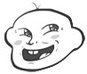

# 巨大娘比小人弱的情节怎么样

作者：2565450884

TID：28301

<title>1</title> <link href="../Styles/Style.css" type="text/css" rel="stylesheet">

# 1

小人比巨大娘强大，但是因为喜欢这个巨大娘，以及害怕巨大娘不开心了，害怕巨大娘不理自己了，害怕降低了好感度了，之类的原因，所以被巨大娘欺负了也不抵抗，这样的情节怎么样？
<title>2</title> <link href="../Styles/Style.css" type="text/css" rel="stylesheet">

# 2

更喜欢巨大娘强大。。 <title>3</title> <link href="../Styles/Style.css" type="text/css" rel="stylesheet">

# 3

白鲸公主和路飞吗

我的第一反应是这个

已经腻歪了巨大娘黑化剧情的我，其实还蛮喜欢巨大娘和小人和谐相处的日常剧情的。。。
<title>4</title> <link href="../Styles/Style.css" type="text/css" rel="stylesheet">

# 4

啊！

这个我懂！

这叫巨大娘vs超性能娘！

……之类的，虽然话是这么说，实际上如果想让小人很强，一般是武侠类的作品……？

在圈外作品里貌似经常看到。类似于七原罪之类的，主角很强，所以相比之下巨大娘没有那么强了。

不过圈内作品一般不这么写，因为会很……怎么说呢，有点南辕北辙吧？

毕竟，如果是弱小的巨大娘，为啥要巨大啊？ <title>5</title> <link href="../Styles/Style.css" type="text/css" rel="stylesheet">

# 5

不过这个话题倒是挺有意思的。

因为，如果我们把“巨大”和“超性能”对比的话。

在日宅系的作品里，超性能娘很多的。

不如说，女主比男主强的作品无比之多。

我想说的是，Femdom可能其实是个主流的东西……？ <title>6</title> <link href="../Styles/Style.css" type="text/css" rel="stylesheet">

# 6

如果小人是女的話 沒問題 香爆 大概就這樣 <title>7</title> <link href="../Styles/Style.css" type="text/css" rel="stylesheet">

# 7

这个可以有，还有比如灵能飞升的种族，巨大娘虽然肉体强大，但是精神弱小，所以被一些精神力强大的人蹂躏。再就是巨大娘和小人和谐相处的社会。都别有一番风味。 <title>8</title> <link href="../Styles/Style.css" type="text/css" rel="stylesheet">

# 8

看过类似格列夫游记的一个文章，女巨人去小人国 结果被绑了虐待最后好像还被小人吃掉了 <title>9</title> <link href="../Styles/Style.css" type="text/css" rel="stylesheet">

# 9

也可以是小人科技达到一种巅峰水平，然后跟巨大娘PK，巨大娘虽然有体型和肉体强度上的绝对优势，但就是不把灰尘般的小人放在眼里，结果最后苦苦求饶也是很不错呢 <title>10</title> <link href="../Styles/Style.css" type="text/css" rel="stylesheet">

# 10

怎么说呢，我觉得，把巨大娘写的很强大，就是想要那种对小人的支配感（抖m），就算是温馨日常，也是巨大娘对小人的绝对支配，而不是双方平等或者小人强过巨大娘什么的，只是巨大娘不愿意去过分伤害小人而已。我个人是对小人很强的文章没什么感觉的。 <title>11</title> <link href="../Styles/Style.css" type="text/css" rel="stylesheet">

# 11

*本帖最後由 8611071528 於 2020-3-18 16:40 編輯*

如果小人強，即使會降低好感度，還是要戲弄一下
比如，身穿一身黑，在昏暗/陰暗的房間裡，在巨大娘面前，快速的跑向傢俱隙縫裡⋯
等因反感而尖叫的聲音傳來，過幾秒，在快速的衝向巨大娘面前！
（老套劇情，為了吸引注意力，而惡作劇...）
接著小人就鼻青臉腫⋯上藥時...
-痛痛痛！輕一點！別那麼大力！
-哼！叫你欺負我！
巨大娘手拿棉籤的手，大力按下...

<title>12</title> <link href="../Styles/Style.css" type="text/css" rel="stylesheet">

# 12

忽然想起来V姐的作品不就很多是这样的吗

经常会出现女巨人因为身体过于淫荡或者科技过于落后，被小人奴役或者操控的情节

<title>13</title> <link href="../Styles/Style.css" type="text/css" rel="stylesheet">

# 13

看情節是怎麼安排的
如何通順合理的話
當然沒問題

另外也喜歡小人雖一時佔了上風
結果之後被再度巨大化的巨大娘反殺的情節 <title>14</title> <link href="../Styles/Style.css" type="text/css" rel="stylesheet">

# 14

emmmm……
我个人倒是不介意，只要剧情没崩就行。甚至在写小说时还会主动考虑这种设定。
准确来讲我很反感那种缺乏铺垫的“巨大娘无敌”的剧情：
我可以接受有作品内解释的刀枪不入，比方说“有科（魔）幻（法）护盾”、“穿着装甲”，也可以接受作品内有解释的再生，比方说“灵魂决定肉体形态的种族”、“某种特殊的科（玄）学（幻）手段”。但是我不能接受一个不能用作品内的世界观解释的“凭空出现的哥斯拉”，因为这种“凭空出现”对我来说就意味着“作者放弃逻辑开始自由”。
反过来说，我觉得“小人有自己的手段反制”是一个非常好的点子，主要是单方面的虐杀可以写成一个片段或者一个比较粗暴的小文，但是很难在这个基础上发展出剧情，因为“无敌”这个大前提非常限制思路，写日常搞笑系的还好（贝吉塔.jpg），如果非要写点带剧情的就必须要考虑如何安排一个“看上去还算合理的冲突”，这里的难点就在于大部分比较容易想到的冲突都是建立在双方各有所长的前提下的，如果一方具有全方位的优势，那么自然就不会存在冲突，所以必须要想办法给在不破坏“无敌”的前提下给“无敌”加上个限制，然后在这方面制造冲突，比较常见的就是用“人性”、“形象”、“舆论”等无形的东西来限制，但这就非常考验作者的剧情安排能力了。这种类型的厕纸倒是不少，能写出彩的作品屈指可数。
但如果从一开始就决定“巨大娘不是无敌的”就会简单很多，只要你能在作品内给出解释就行。比如说个人就很喜欢强调“现代武器对无装甲目标的杀伤能力”：用这个理由可以有效地将巨大娘的行为限制在一个“有限范围内”，因为我们需要“避免引来军队围剿”，此时再引入第三方势力就会显得比较顺理成章。
但是话又说回来，如果要写“巨大娘比小人弱”其实还是挺难的，因为毕竟体积和质量在那里了，巨大娘只是存在就肯定对小人有很大的威胁，只是小人有没有能力反制巨大娘罢了。除非你给小人再安排其它的东西作为制衡（比方说你找来一个穿红外套的骚老头，或者一个带娃的大光头，或者一个不会跳的丑八怪……），这就和日式奇幻比较接近了。
写着写着突然就有动力了，看看这两天能不能摸个这种题材的短篇出来（新建 文本文档.doc） <title>15</title> <link href="../Styles/Style.css" type="text/css" rel="stylesheet">

# 15

不，这样一点点都不M，都不香 <title>16</title> <link href="../Styles/Style.css" type="text/css" rel="stylesheet">

# 16

个人觉得不喜欢，gts的初衷就是要巨大娘比小人强大，如果反过来就没啥意义了 <title>17</title> <link href="../Styles/Style.css" type="text/css" rel="stylesheet">

# 17

但大的作品就是小人比巨大娘强，但不一定会弱。如果强的话，当一名“劲夫”，殴打女人 <title>18</title> <link href="../Styles/Style.css" type="text/css" rel="stylesheet">

# 18

对我来说，两个人能够和谐相处，替他我并不是太在意 <title>19</title> <link href="../Styles/Style.css" type="text/css" rel="stylesheet">

# 19

我还是喜欢巨大娘很强大的那种，那种抖s的感觉让人很爽，像寺田画的吧本子就特别对我胃口 <title>20</title> <link href="../Styles/Style.css" type="text/css" rel="stylesheet">

# 20

巨大娘身体上更为强大，但是精神上依然依附小人的情节也不错呢，巨大娘和小人身体上的差距与精神上的通感带来的矛盾，描写这种矛盾应该能写出不错的文章 <title>21</title> <link href="../Styles/Style.css" type="text/css" rel="stylesheet">

# 21

觉得还是巨大娘强一些比较带感啊 <title>22</title> <link href="../Styles/Style.css" type="text/css" rel="stylesheet">

# 22

虽然我更喜欢Femdom，但想法很不错，只要没有什么鬼畜猎奇就好，说实话比较期待 <title>23</title> <link href="../Styles/Style.css" type="text/css" rel="stylesheet">

# 23

这个想法不错哎，小人有实力反抗可是碍于某方面原因不得不放弃抵抗（各种抖M），巨大娘“得寸进尺”满足私欲，有那味儿了 <title>24</title> <link href="../Styles/Style.css" type="text/css" rel="stylesheet">

# 24

    我觉得这样一点问题都没有，个人还是比较喜欢巨大娘和小人和谐相处的世界（应该说不是小人，而是正常人和巨大娘），两者虽然体型悬殊但依然以自己的方式尽量不让自己改变对方的生活，虽然是有突发事件发生，但大家都能和谐相处，宽容对待，除了体型之外，双方都是平等的存在 <title>25</title> <link href="../Styles/Style.css" type="text/css" rel="stylesheet">

# 25

现实世界中女性由于先天条件因素在力量上相对于男性处于弱势，这是第一层；
一般的gts故事里女性有巨大的身体，力量上反过来处于强势地位，这是第二层；
然后现在大的反而比小的弱，这是第五层，老千层饼了(雾)

言归正传，关于巨大娘和小人强弱对比这个问题，我个人认为，已经触及到大家对gts这个属性认知的分歧上了。
我相信，包括我自己在内的一部分同好，喜欢的gts属性，并不单纯是体型大的女性，而是更深的由体型大这个外在因素所暗示的力量上的优势。
巨大化是展现力量最直观的方法没有之一，甚至可以说，力量上的压倒性优势才是这部分同好渴望看到的(这也是为什么部分人可以接受超性能娘）。
显然，对于这部分同好，巨大娘比小人弱是不可理喻的，是违背自然规律的，是南辕北辙的。
这两种观念的冲突，比残酷系和温柔系的对立更加严重。

当然，目前圈子里巨大娘比小人弱，或者说在互动中处于弱势地位的作品并不少，也不乏优秀之作。
还是希望大家可以互相包容，毕竟圈子小，xp种类多，不喜欢不看就好了，这么多年不是一直这么过来的吗。

不过如果要问我个人对于“巨大娘比小人弱的情节怎么样”，我只能说，歪门邪道，爬！
<title>26</title> <link href="../Styles/Style.css" type="text/css" rel="stylesheet">

# 26

个人觉得比较为老套的巨大娘总是有压倒性优势的情节强，可能是看太多看腻了。尤其的v姐漫画的题材非常适合我的口味。巨大娘被比自己小n倍的高科技小人们调教到沉迷于x快感无法自拔，有时更令人兴奋。 <title>27</title> <link href="../Styles/Style.css" type="text/css" rel="stylesheet">

# 27

完全可以呀，我觉得不一定一方支配另一方，两方平等互动，巨人和小人（超能力）之间的关系反而更有意思 <title>28</title> <link href="../Styles/Style.css" type="text/css" rel="stylesheet">

# 28

过于强大的话，那岂不是（劲夫劲夫，全场欢呼） <title>29</title> <link href="../Styles/Style.css" type="text/css" rel="stylesheet">

# 29

这种只能表现出巨大娘性格弱但是力量巨大，比如说巨大娘不小心踩碎了电车而向大家道歉 听着小人们的谩骂 一直道歉 但是突然忍受不了了，就开始屠杀也是不错的题材 <title>30</title> <link href="../Styles/Style.css" type="text/css" rel="stylesheet">

# 30

果然還是巨大娘所帶來的力量最棒了
受自己指揮的巨大娘，讓我受不了啊....
不論是指揮來虐待自己或是毀滅城市都是很棒很棒的嘿嘿