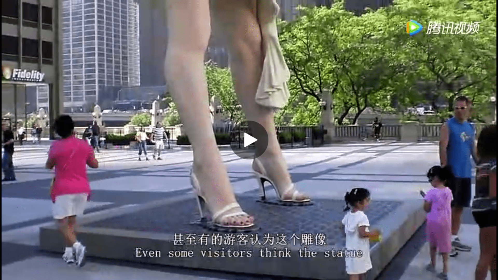
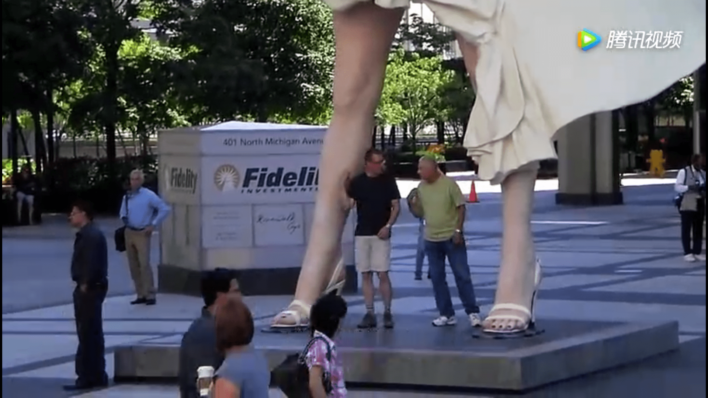

# 巨大玛丽莲梦露雕像，可惜了可惜了

作者：gts000

TID：23826

<title>1</title> <link href="../Styles/Style.css" type="text/css" rel="stylesheet">

# 1

*本帖最後由 gts000 於 2017-9-7 11:53 編輯*

<ignore_js_op>

**IMG_20170907_113647.png** *(2.25 MB, 下載次數: 0)*

[下載附件](forum.php?mod=attachment&aid=Njk0Mjl8Y2ZhMjBlMmJ8MTY3NDA2NzM1MXwxODIzMHwyMzgyNg%3D%3D&nothumb=yes)

2017-9-7 11:39 上傳

<ignore_js_op>

**IMG_20170907_113623.png** *(1.83 MB, 下載次數: 0)*

[下載附件](forum.php?mod=attachment&aid=Njk0Mjh8MTlmZDk1NTN8MTY3NDA2NzM1MXwxODIzMHwyMzgyNg%3D%3D&nothumb=yes)

2017-9-7 11:39 上傳

好想去膜拜一下

[http://post.mp.qq.com/kan/video/ ... d32&time=1503993450](http://post.mp.qq.com/kan/video/200690513-78559a51e45154ae-s0540cjxgh4.html?_wv=2281701505&sig=34ca8262a4f1a023ef893ab13f2d9d32&time=1503993450)

<title>2</title> <link href="../Styles/Style.css" type="text/css" rel="stylesheet">

# 2

总觉得身边都潜伏着我们的同志........ <title>3</title> <link href="../Styles/Style.css" type="text/css" rel="stylesheet">

# 3

很久以前的雕像了，想起了我小时候还对着日本的人体生理科技馆来了一发 <title>4</title> <link href="../Styles/Style.css" type="text/css" rel="stylesheet">

# 4

站在裙子下面向上望是什么景象，不知道有没有内内 <title>5</title> <link href="../Styles/Style.css" type="text/css" rel="stylesheet">

# 5

好像已经被拆了有段时间了，记得有新闻
喔，这就是拆的新闻。。没点进去看，囧。
<title>6</title> <link href="../Styles/Style.css" type="text/css" rel="stylesheet">

# 6

提到梦露，比起这个造型，更喜欢她穿透明的高跟凉鞋那个造型</ignore_js_op></ignore_js_op>