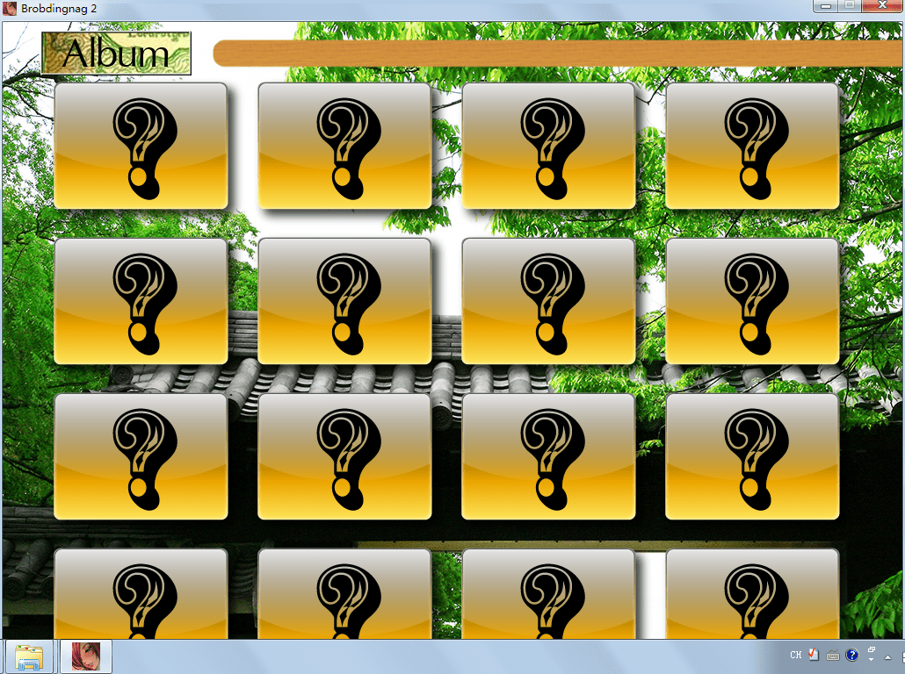
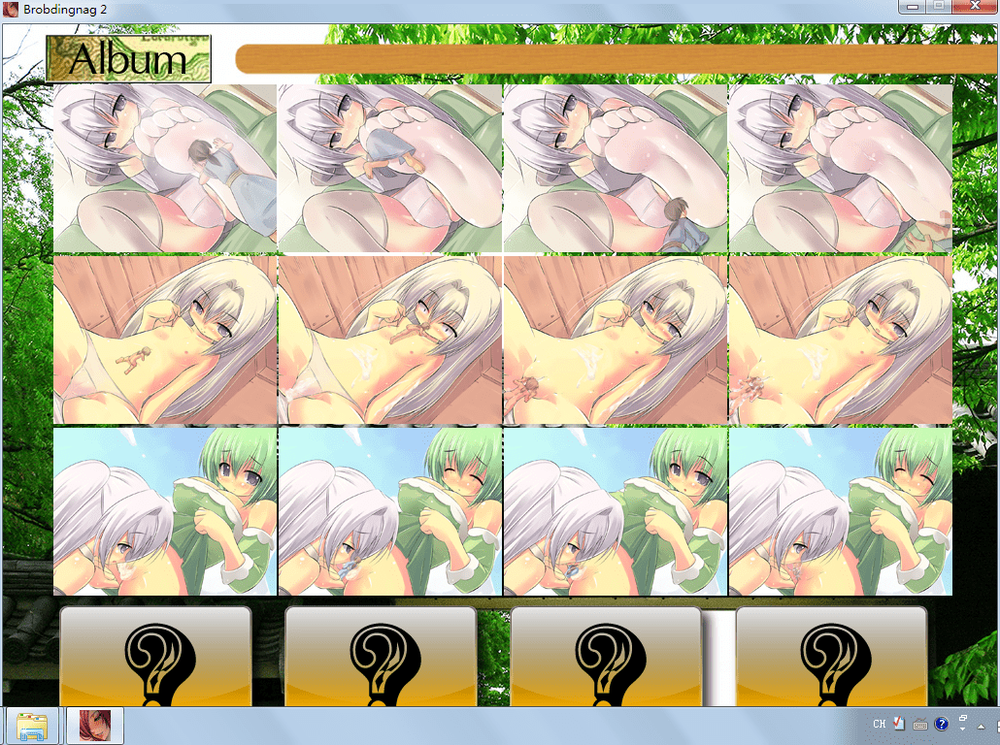
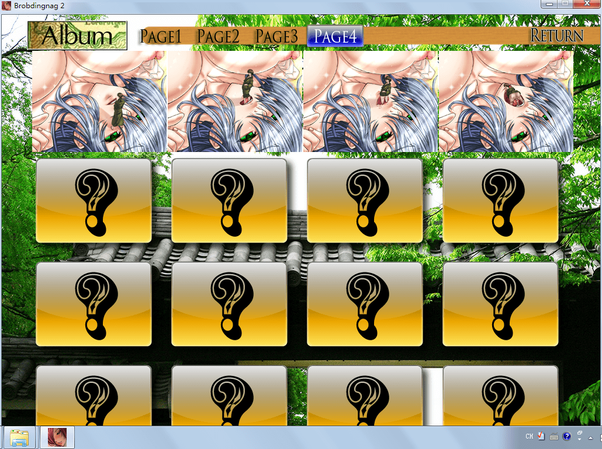
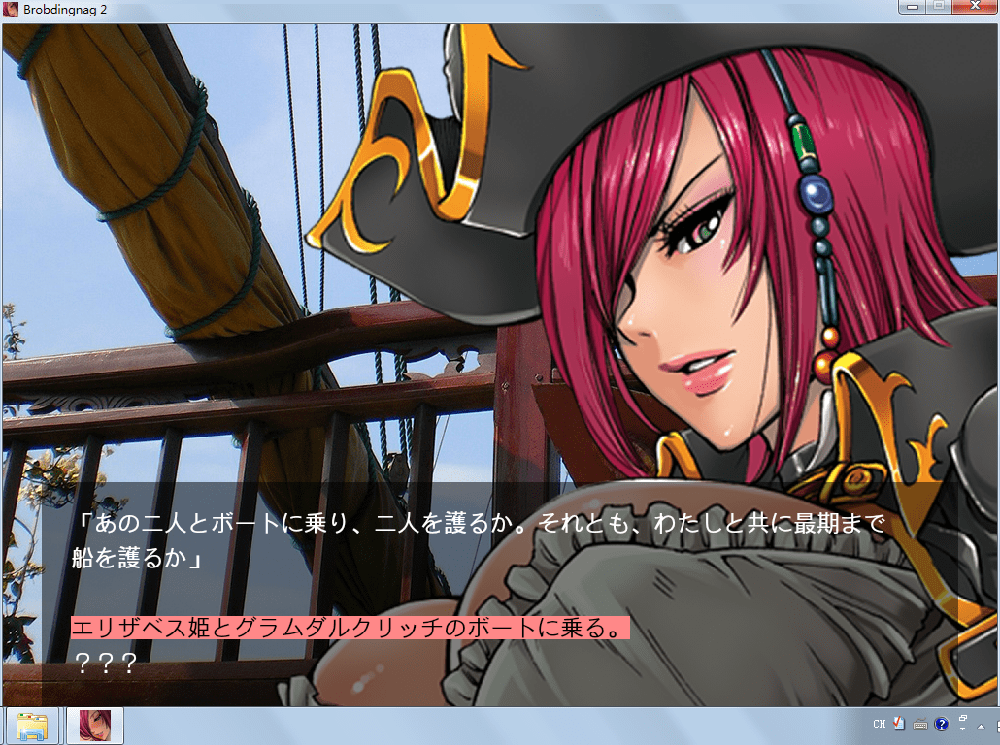
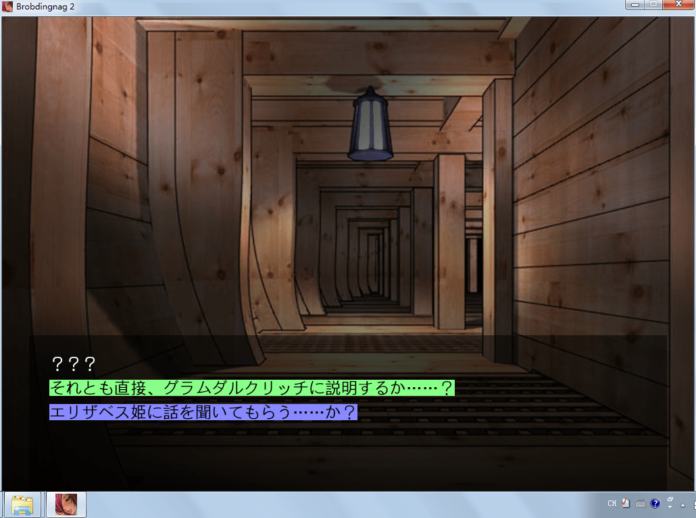
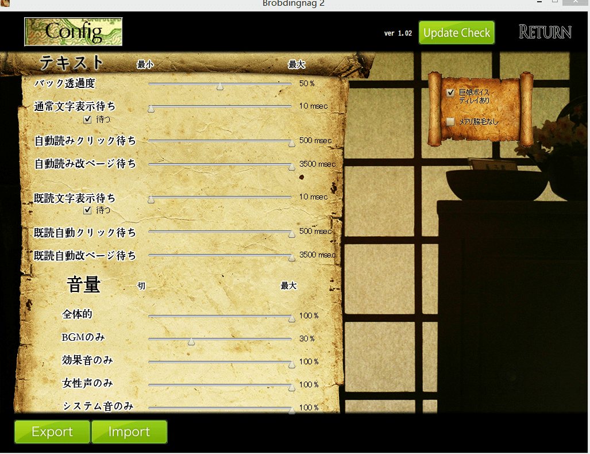
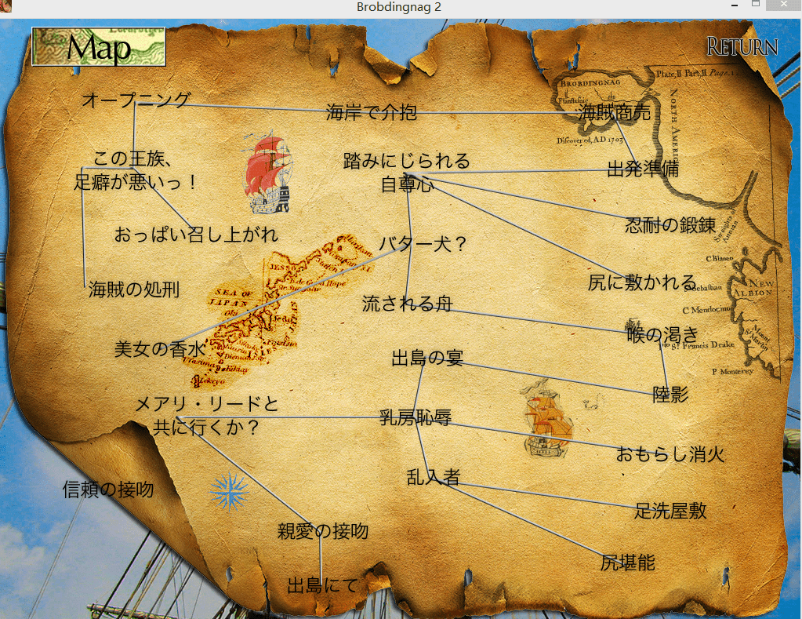

# 巨娘国渡航记2的cg收不全啊。。

作者：常言道子虫

TID：21357

<title>1</title> <link href="../Styles/Style.css" type="text/css" rel="stylesheet">

# 1

下载了个巨娘国渡航记2，可是里面的cg收不全，我把所有的选项都点过一遍还是没用= =而且有的地方还是to be continue。。。难道游戏不是完整版？

<ignore_js_op>

**VCC{(M7R)`$)}9I}YI2K00K.png** *(683.3 KB, 下載次數: 0)*

[下載附件](forum.php?mod=attachment&aid=NjIxNDJ8OWI3YjQ2MmN8MTY3NDA2Nzk0NHwxODIzMHwyMTM1Nw%3D%3D&nothumb=yes)

第一页

2016-7-8 20:18 上傳

<ignore_js_op>

**P1_~F8O7J8YVR1VRDIDP%GO.png** *(760.64 KB, 下載次數: 0)*

[下載附件](forum.php?mod=attachment&aid=NjIxNDF8NGE0Mzk2NDZ8MTY3NDA2Nzk0NHwxODIzMHwyMTM1Nw%3D%3D&nothumb=yes)

第二页

2016-7-8 20:18 上傳

<ignore_js_op>

**VX`C$Q(JK0DR}%FWFL9P`V5.png** *(723.24 KB, 下載次數: 0)*

[下載附件](forum.php?mod=attachment&aid=NjIxNDN8ODdhMzNmNGZ8MTY3NDA2Nzk0NHwxODIzMHwyMTM1Nw%3D%3D&nothumb=yes)

第三页

2016-7-8 20:18 上傳

<ignore_js_op>

**$K7B])IR@JIUP1CS]T7X1YF.png** *(691.52 KB, 下載次數: 0)*

[下載附件](forum.php?mod=attachment&aid=NjIxNDB8MTg3NzRkNjZ8MTY3NDA2Nzk0NHwxODIzMHwyMTM1Nw%3D%3D&nothumb=yes)

第四页

2016-7-8 20:18 上傳

甚至第一页根本没有cg。。。老司机求教

<title>2</title> <link href="../Styles/Style.css" type="text/css" rel="stylesheet">

# 2

还有到后面三个人飘到海上是怎样，被女海盗抛弃到海上了吗？ <title>3</title> <link href="../Styles/Style.css" type="text/css" rel="stylesheet">

# 3

hgame.cn上有完美存档才对，尽管是很久以前去看的。还有，国渡航记的话是有攻略的map的，加上skip功能，其实不超20分钟就能手机全cg了，楼主专心下试试看吧 <title>4</title> <link href="../Styles/Style.css" type="text/css" rel="stylesheet">

# 4

> [luffyoo 發表於 2016-7-8 20:35](https://giantessnight.cf/gnforum2012/forum.php?mod=redirect&goto=findpost&pid=299189&ptid=21357)
> hgame.cn上有完美存档才对，尽管是很久以前去看的。还有，国渡航记的话是有攻略的map的，加上skip功能，其 ...

我是看到map。。但是攻略从何谈起，还有skip是啥。。那个hgame.cn要翻墙吗？
我看有一个选择支全是问号，那是啥，二周目？
<title>5</title> <link href="../Styles/Style.css" type="text/css" rel="stylesheet">

# 5

> [luffyoo 發表於 2016-7-8 20:35](https://giantessnight.cf/gnforum2012/forum.php?mod=redirect&goto=findpost&pid=299189&ptid=21357)
> hgame.cn上有完美存档才对，尽管是很久以前去看的。还有，国渡航记的话是有攻略的map的，加上skip功能，其 ...

该有3个选择支的地方只出现两个。。剩下一个是问号而且点不了。。这是没做完吗
<title>6</title> <link href="../Styles/Style.css" type="text/css" rel="stylesheet">

# 6

> [zhakong 發表於 2016-7-8 20:43](https://giantessnight.cf/gnforum2012/forum.php?mod=redirect&goto=findpost&pid=299191&ptid=21357)
> 我是看到map。。但是攻略从何谈起，还有skip是啥。。那个hgame.cn要翻墙吗？
> 我看有一个选择支全是问号， ...

map里的分支是可以点的，你直接点过去选不同选项就能进行，这比攻略还攻略。
hgame.cn不需要翻墙
skip是加速浏览，还是楼主之前不玩gal的
<title>7</title> <link href="../Styles/Style.css" type="text/css" rel="stylesheet">

# 7

> [luffyoo 發表於 2016-7-8 20:35](https://giantessnight.cf/gnforum2012/forum.php?mod=redirect&goto=findpost&pid=299189&ptid=21357)
> hgame.cn上有完美存档才对，尽管是很久以前去看的。还有，国渡航记的话是有攻略的map的，加上skip功能，其 ...

<ignore_js_op>

**YFSS~DP06OSRIO%Z@B}6X4C.png** *(1017.27 KB, 下載次數: 0)*

[下載附件](forum.php?mod=attachment&aid=NjIxNDV8ZmI2MTViZmV8MTY3NDA2Nzk0NHwxODIzMHwyMTM1Nw%3D%3D&nothumb=yes)

2016-7-8 21:17 上傳

<ignore_js_op>

**K@[KU]S(_ZFGX3B1N%7(}78.png** *(568.81 KB, 下載次數: 0)*

[下載附件](forum.php?mod=attachment&aid=NjIxNDR8Y2MyNjkwMjN8MTY3NDA2Nzk0NHwxODIzMHwyMTM1Nw%3D%3D&nothumb=yes)

2016-7-8 21:17 上傳

就像这样。。。我下载的不是完整版？需要特殊条件才能解开？需要第一部通关存档才能解开？

<title>8</title> <link href="../Styles/Style.css" type="text/css" rel="stylesheet">

# 8

> [luffyoo 發表於 2016-7-8 21:14](https://giantessnight.cf/gnforum2012/forum.php?mod=redirect&goto=findpost&pid=299198&ptid=21357)
> map里的分支是可以点的，你直接点过去选不同选项就能进行，这比攻略还攻略。
> hgame.cn不需要翻墙
> skip是 ...

我是点开map的。。而且还快速浏览过一大段对话才看到的选择支，可还是有问号。。。
<title>9</title> <link href="../Styles/Style.css" type="text/css" rel="stylesheet">

# 9

不知道楼主在困惑什么 <title>10</title> <link href="../Styles/Style.css" type="text/css" rel="stylesheet">

# 10

 <ignore_js_op>[11.png](forum.php?mod=attachment&aid=NjIxNDZ8OTFhYzI4MTN8MTY3NDA2Nzk0NHwxODIzMHwyMTM1Nw%3D%3D&nothumb=yes) *(1.25 MB, 下載次數: 3)*

[下載附件](forum.php?mod=attachment&aid=NjIxNDZ8OTFhYzI4MTN8MTY3NDA2Nzk0NHwxODIzMHwyMTM1Nw%3D%3D&nothumb=yes)

2016-7-8 21:21 上傳  

</ignore_js_op> <ignore_js_op>[12.png](forum.php?mod=attachment&aid=NjIxNDd8MTE1MjFkY2N8MTY3NDA2Nzk0NHwxODIzMHwyMTM1Nw%3D%3D&nothumb=yes) *(993.36 KB, 下載次數: 0)*

[下載附件](forum.php?mod=attachment&aid=NjIxNDd8MTE1MjFkY2N8MTY3NDA2Nzk0NHwxODIzMHwyMTM1Nw%3D%3D&nothumb=yes)

2016-7-8 21:21 上傳  

</ignore_js_op> <ignore_js_op>[13.png](forum.php?mod=attachment&aid=NjIxNDh8MjVkMzZmODB8MTY3NDA2Nzk0NHwxODIzMHwyMTM1Nw%3D%3D&nothumb=yes) *(1.8 MB, 下載次數: 1)*

[下載附件](forum.php?mod=attachment&aid=NjIxNDh8MjVkMzZmODB8MTY3NDA2Nzk0NHwxODIzMHwyMTM1Nw%3D%3D&nothumb=yes)

2016-7-8 21:21 上傳  

</ignore_js_op> <title>11</title> <link href="../Styles/Style.css" type="text/css" rel="stylesheet">

# 11

一些选项是有前置条件的吧。调出攻略地图看看吧。 <title>12</title> <link href="../Styles/Style.css" type="text/css" rel="stylesheet">

# 12

有的选项是后面触发某些情节后回来才能选的 那些有?的都保存一下 等以后打完某些情节再读档选 <title>13</title> <link href="../Styles/Style.css" type="text/css" rel="stylesheet">

# 13

有些剧情要二周目才触发 <title>14</title> <link href="../Styles/Style.css" type="text/css" rel="stylesheet">

# 14

这个好老了吧  好久以前的不记得了 <title>15</title> <link href="../Styles/Style.css" type="text/css" rel="stylesheet">

# 15

你可以在所有有分支选项的地方存个档，然后走完当前的分支之后读取之前有分支的那个存档走另外一个分支，有问号的地方也可以这么办。 <title>16</title> <link href="../Styles/Style.css" type="text/css" rel="stylesheet">

# 16

好吧。。我再多研究一下。gal什么的没玩过，也不知道要这么麻烦。。。多谢各位大佬相助 <title>17</title> <link href="../Styles/Style.css" type="text/css" rel="stylesheet">

# 17

> [luffyoo 發表於 2016-7-8 21:21](https://giantessnight.cf/gnforum2012/forum.php?mod=redirect&goto=findpost&pid=299201&ptid=21357)
> 不知道楼主在困惑什么

终于收全了。。累死了

顺便问问，哪里有第一部？
<title>18</title> <link href="../Styles/Style.css" type="text/css" rel="stylesheet">

# 18

论坛里面有第一部，没有权限发链接呀，搜索魔女的cg问题（内有福利），里面有链接 <title>19</title> <link href="../Styles/Style.css" type="text/css" rel="stylesheet">

# 19

> [zhakong 發表於 2016-7-9 11:53](https://giantessnight.cf/gnforum2012/forum.php?mod=redirect&goto=findpost&pid=299282&ptid=21357)
> 终于收全了。。累死了
> 
> 顺便问问，哪里有第一部？

刚刚又搜一遍搜不到了，我就直接把下载链接复制过来了。第一部的
<title>20</title> <link href="../Styles/Style.css" type="text/css" rel="stylesheet">

# 20

 <ignore_js_op>

[新建文本文档.txt](forum.php?mod=attachment&aid=NjIxOTF8NzE4MjcyY2Z8MTY3NDA2Nzk4OHwxODIzMHwyMTM1Nw%3D%3D)

2016-7-10 14:55 上傳

點擊文件名下載附件

36 Bytes, 下載次數: 13</ignore_js_op> <title>21</title> <link href="../Styles/Style.css" type="text/css" rel="stylesheet">

# 21

> [常言道子虫 發表於 2016-7-10 14:56](https://giantessnight.cf/gnforum2012/forum.php?mod=redirect&goto=findpost&pid=299444&ptid=21357)
> 刚刚又搜一遍搜不到了，我就直接把下载链接复制过来了。第一部的

哦哦哦！多谢这类的cg游戏大概就这几部吧？
<title>22</title> <link href="../Styles/Style.css" type="text/css" rel="stylesheet">

# 22

我好像收集全了。。不过都有马赛克啊。。。 <title>23</title> <link href="../Styles/Style.css" type="text/css" rel="stylesheet">

# 23

> [Hola 發表於 2016-7-11 14:37](https://giantessnight.cf/gnforum2012/forum.php?mod=redirect&goto=findpost&pid=299553&ptid=21357)
> 我好像收集全了。。不过都有马赛克啊。。。

11年的游戏，当然有马赛克
<title>24</title> <link href="../Styles/Style.css" type="text/css" rel="stylesheet">

# 24

话说LZ的2在哪里下的，我找的链接全失效了 <title>25</title> <link href="../Styles/Style.css" type="text/css" rel="stylesheet">

# 25

> [dasers_100 發表於 2016-7-29 16:04](https://giantessnight.cf/gnforum2012/forum.php?mod=redirect&goto=findpost&pid=301422&ptid=21357)
> 话说LZ的2在哪里下的，我找的链接全失效了

好像是gtslover？用我给你连接吗      链接：[http://pan.baidu.com/s/1eSM6JXS](http://pan.baidu.com/s/1eSM6JXS) 密码：d4tn
<title>26</title> <link href="../Styles/Style.css" type="text/css" rel="stylesheet">

# 26

你可以在有分支选项的地方存个档，比如你存档的时候有两条线，可能你两条线都走完了之后就在读取这个档就会再出现第三条线。
或者每次卡了之后都退回到标题，最前面会变成map按照map上的线走，有的线可能要走两次，等你所有线都走完之后cg就收集齐了 <title>27</title> <link href="../Styles/Style.css" type="text/css" rel="stylesheet">

# 27

> [zhakong 發表於 2016-8-1 15:17](https://giantessnight.cf/gnforum2012/forum.php?mod=redirect&goto=findpost&pid=301894&ptid=21357)
> 好像是gtslover？用我给你连接吗      链接：http://pan.baidu.com/s/1eSM6JXS 密码：d4tn
> ...

感谢分享，网上其他的链接确实失效了。</ignore_js_op></ignore_js_op></ignore_js_op></ignore_js_op></ignore_js_op></ignore_js_op>