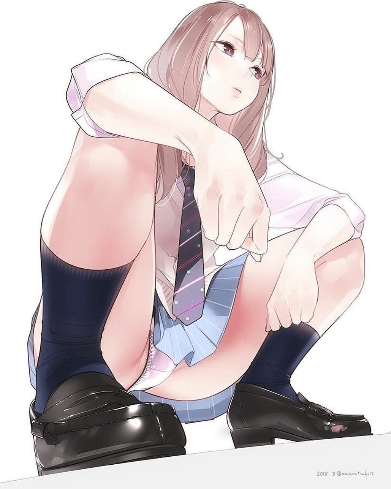
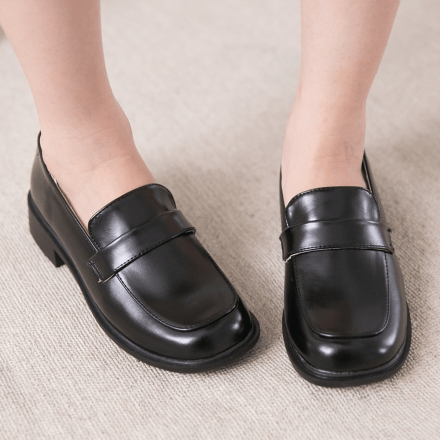
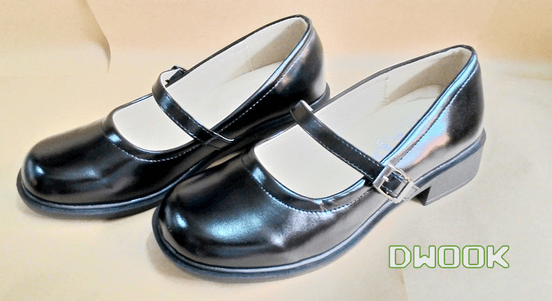

# 帆布鞋vs高跟鞋

作者：fxwan321

TID：25799

<title>1</title> <link href="../Styles/Style.css" type="text/css" rel="stylesheet">

# 1

最近对比了国产的和翻译的gts文，发现（可能是误解）国产的gts更喜欢帆布鞋，而国外的作品一般会选择高跟鞋。这有什么原因吗？
<title>2</title> <link href="../Styles/Style.css" type="text/css" rel="stylesheet">

# 2

小孩子才做选择题             <title>3</title> <link href="../Styles/Style.css" type="text/css" rel="stylesheet">

# 3

> [huhuhu 發表於 2018-9-9 13:37](https://giantessnight.cf/gnforum2012/forum.php?mod=redirect&goto=findpost&pid=386842&ptid=25799)
> 小孩子才做选择题

你可以有多个女人，但不能同时穿两双鞋，所以还是要做选择题的。
<title>4</title> <link href="../Styles/Style.css" type="text/css" rel="stylesheet">

# 4

国内可能更喜欢学生妹，而欧美那边天生比较看中臀部到奶子那部分，高跟鞋不仅使身形更漂亮，也在印象上更容易留下‘s’的气质，最主要的还是看不同地区人们的口味。 来自一个直男的理解 <title>5</title> <link href="../Styles/Style.css" type="text/css" rel="stylesheet">

# 5

> [幸存者 發表於 2018-9-9 13:46](https://giantessnight.cf/gnforum2012/forum.php?mod=redirect&goto=findpost&pid=386844&ptid=25799)
> 你可以有多个女人，但不能同时穿两双鞋，所以还是要做选择题的。

對 但是你可以一隻腳穿一種鞋 不過這個要很喪心病狂才尻的下去
<title>6</title> <link href="../Styles/Style.css" type="text/css" rel="stylesheet">

# 6

为什么我觉得无论国内还是国外，都是不穿鞋的人居多呢，要么是裸足，要么是丝袜
PS：硬要说的话，本人还是不怎么喜欢帆布鞋的 <title>7</title> <link href="../Styles/Style.css" type="text/css" rel="stylesheet">

# 7

*本帖最後由 超SizeJKGirl 於 2018-9-9 16:41 編輯*

> [904904cx 發表於 2018-9-9 16:09](https://giantessnight.cf/gnforum2012/forum.php?mod=redirect&goto=findpost&pid=386859&ptid=25799)
> 为什么我觉得无论国内还是国外，都是不穿鞋的人居多呢，要么是裸足，要么是丝袜
> PS：硬要说的话，本人还是 ...

我本身也是不喜歡帆布鞋派的
我覺得運動系或是休閒系的感覺沒有Sexy的點
要穿運動或休閒的鞋子的話還不如光腳
我不知道為什麼除了日本以外的東方國家大部分學生妹都不是學生鞋
<ignore_js_op>

**29415075_227857144428524_2062370491548565504_n.jpg** *(88.54 KB, 下載次數: 4)*

[下載附件](forum.php?mod=attachment&aid=NzQwNjl8ZjA3ZDViMzB8MTY3NDA2Njk5MXwxODIzMHwyNTc5OQ%3D%3D&nothumb=yes)

2018-9-9 16:26 上傳

大部分女學生鞋子都醜醜的
看習慣日本的以後覺得少數東方的學生鞋算做的好看的
這好像是大部分台灣女學生 打工 女僕會穿的
<ignore_js_op>

**1016480000117_L1.jpg** *(129.68 KB, 下載次數: 0)*

[下載附件](forum.php?mod=attachment&aid=NzQwNzB8MWI5YjIxMDV8MTY3NDA2Njk5MXwxODIzMHwyNTc5OQ%3D%3D&nothumb=yes)

2018-9-9 16:28 上傳

這種都是偏向國中或國小生穿的偏向歌德蘿莉風
可能蘿莉GTS比較少吧
所以這種鞋子出現率低
<ignore_js_op>

**21436141465940_88.jpg** *(70.81 KB, 下載次數: 0)*

[下載附件](forum.php?mod=attachment&aid=NzQwNzF8ODM5MWJiZDN8MTY3NDA2Njk5MXwxODIzMHwyNTc5OQ%3D%3D&nothumb=yes)

2018-9-9 16:28 上傳

高跟鞋我覺得算是基本款
只要是女生穿了至少不會醜
很多問題都解決了
所以大概很多人會選擇高跟鞋吧

我覺得對我來說運動系和休閒系的女生就像一開始三笠有腹肌會讓人尻不太下去一樣(雖然受過洗禮有點習慣了)
畢竟運動系的形象跟Sexy差滿遠的
要我選角色的話活潑還比運動系列跟休閒系好

順便在講一點
偶爾會在GTS屬性的漫畫裡面發現那種浩克肌肉女也算在女巨人類裡面
<ignore_js_op>

**sample_c1a43612a2ccd15986d3095a81669fef.jpg** *(263.34 KB, 下載次數: 0)*

[下載附件](forum.php?mod=attachment&aid=NzQwNzJ8YTgwZjQ0MDJ8MTY3NDA2Njk5MXwxODIzMHwyNTc5OQ%3D%3D&nothumb=yes)

2018-9-9 16:38 上傳

每個人喜好不同
我好奇很久了
帆布鞋雖然有些滿可愛的
但是擼點在哪滿好奇的我除了想到青春跟活力以外想不太出其他的點了
光腳也滿青春的
活力的光腳也不錯

<title>8</title> <link href="../Styles/Style.css" type="text/css" rel="stylesheet">

# 8

> [超SizeJKGirl 發表於 2018-9-9 16:40](https://giantessnight.cf/gnforum2012/forum.php?mod=redirect&goto=findpost&pid=386862&ptid=25799)
> 我本身也是不喜歡帆布鞋派的
> 我覺得運動系或是休閒系的感覺沒有Sexy的點
> 要穿運動或休閒的鞋子的話還不如 ...

我也是认为帆布鞋太过严实，只能体现出一种朴素的感觉，无法体现性感或是美感
然后是那个大部分国家是没有对学生鞋的制式的要求的，大陆这边学校对鞋的要求是不许穿拖鞋，连学生鞋这样的称呼都没有
还有我真的很少见到有女人穿皮鞋

<title>9</title> <link href="../Styles/Style.css" type="text/css" rel="stylesheet">

# 9

可能国内的高中妹不怎么穿高跟鞋吧。。 <title>10</title> <link href="../Styles/Style.css" type="text/css" rel="stylesheet">

# 10

国内的文主人工主要是学生为主吧 所以帆布鞋较多 相比于高跟鞋个人也更喜欢帆布鞋 <title>11</title> <link href="../Styles/Style.css" type="text/css" rel="stylesheet">

# 11

唯一支持帆布鞋哈哈汗較多XD <title>12</title> <link href="../Styles/Style.css" type="text/css" rel="stylesheet">

# 12

*本帖最後由 8611071528 於 2018-10-7 21:37 編輯*

可能文化吧， 不同鞋的差別，我想... 應該是效果吧，雖然對小人的結局都一樣XD
個人覺得在同樣的地板上行走。(高跟鞋、裸足、凡布鞋)
高跟鞋：對小人來講是聲勢浩大，毫不掩飾的，步伐的 喀喀 聲，在小人耳中 彷彿是轟炸聲般，每一個步伐，將震攝小人的心頭(也有可能會產生心跳與步伐的聲音同步的錯覺，如：人聽到鼓的聲音，所產生的錯覺)
裸足：在文中因該是......在正常人的大小下，女孩在走路，輕盈地走過，彷彿感覺不到體重似的，那輕微的 啪啪聲， 對小人來講，有勢小力沉的效果，雖然也很大聲，但比起高跟鞋的 喀喀聲，卻小了很多，但帶來的效果卻不同， 聲音雖小，但力量卻絲毫不減，小人可以不會被聲音吸引太多注意，但注意力都會集中在地板上的震動上。
凡布鞋：大概介於...高跟鞋和裸足之間吧...，聲勢上不會超過高跟鞋，但也不弱於裸足，震動...雖然可能一樣，但小人的注意力會...剛好。

差別在於 小人面臨困境的描訴，不同的鞋，將描訴小人不同的感官 <title>13</title> <link href="../Styles/Style.css" type="text/css" rel="stylesheet">

# 13

都很赞啊 ,为什么要选一个,地上有两百,非捡一百</ignore_js_op></ignore_js_op></ignore_js_op></ignore_js_op>