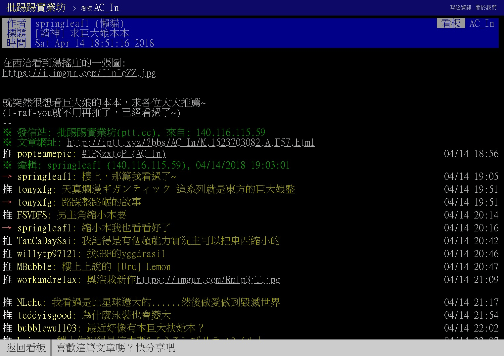

# 希望各位認清一個現實

作者：000000

TID：24940

<title>1</title> <link href="../Styles/Style.css" type="text/css" rel="stylesheet">

# 1

嗯，直接講重點
尺寸控這個癖好只會越來越有名

先上一篇ptt的文章
[https://www.ptt.cc/bbs/AC_In/M.1523703082.A.F57.html](https://www.ptt.cc/bbs/AC_In/M.1523703082.A.F57.html)
這篇文發在AC_In(裡洽板)，一個專門交流A漫的看板
聽說中共有擋ptt，我就直接截圖內容
<ignore_js_op>

**問卦.jpg** *(409.04 KB, 下載次數: 2)*

[下載附件](forum.php?mod=attachment&aid=NzE5OTF8MmNmMDJiMjR8MTY3NDA2Njg2OXwxODIzMHwyNDk0MA%3D%3D&nothumb=yes)

2018-4-15 21:05 上傳

重點不是ptt怎樣或上面的人推的東西，重點是：
沒有人對於有人想看巨人本這件事感到疑惑
剛看到前面討論串說什麼別人留言說不能接受，
鳥他們嘞，他們就無知屁孩啊，你覺得把島風圖傳到長輩聊天群組會收到正面迴響嗎?

在我鼓起勇氣跟平常會聊A漫八卦的朋友說出我的癖好時，他這麼說了
「你覺得像我這樣天天上熊貓看本的人會不知道這個TAG的存在嗎?」
要知道當初MM6出的時候已經登上DL首頁了，
之後很多巨大娘本都會衝上當周甚至當月銷售冠軍

我要說的是，
在18+的ACG領域混的人或多或少都知道尺寸癖好這回事
還什麼「社會還沒準備好」，笑話，真的有料的早就知道我們這些人怎麼取暖的了
所以不需要在那邊成天擔心社會觀感，為甚麼呢?
大家都知道，他們只是不在乎
管好你自己的雞雞就好，沒人對你看什麼打手槍有興趣

但是，隨著創作者和作品越來越多，
我們能讓在乎的人知道這個社群的存在

「可是其他外人看到我的興趣會覺得很噁心！」
沒錯，而且外人看到扶他那裡、獸人、巨乳蘿莉甚至任何ACG圖都可能覺得噁心
他怎麼想干你屁事啊?
兩女一杯不噁心嗎?
獵奇斷肢不噁心嗎?
NTR不噁心嗎?
你覺得噁心又怎麼樣?
同樣的，別人覺得你噁心又如何?
只在乎別人怎麼看，你去結紮好了，畢竟有人覺得看A片和打砲都很噁心

我相信其實很多人了解這點，但他們，或說你們，怕的不是這個
怕的是喜歡的東西被政府抄家抄光光，對吧?
我只覺得，那真的是擔心過頭，想要依此限制相關題材創作更是荒謬

好啦，身為台灣人可能沒什麼立場講，我們政府頂多能惡搞中華電信害我們網路很慢而已，
我的確不懂喜歡的網站或某篇文突然因為公權力指示而消失的感覺，更別說活在這種恐懼下
但大家也得記住，如果你的政府想要捅你一刀是完全不需要正當理由的，你在那邊小心翼翼效益實在不大
再說了，最近不是才發公告禁止BL，請問你有因此看到腐女們銷聲匿跡嗎?
真的要說，A片在多少國家違法，這些國家的人就因此沒看A片嗎?
別小看人類啊，生命會自己找出路的

你因為尷尬或害怕或任何理由不想宣揚自身喜好，這是你的自由
但你不能、不該也沒有能力去阻止別人作自己想做的事，這麼討厭牆自己想辦法移民
並且還是回到開頭講的：
尺寸控這個癖好只會越來越有名，你爽不爽都一樣
成熟點吧，管好自己就好
<title>2</title> <link href="../Styles/Style.css" type="text/css" rel="stylesheet">

# 2

其實貼吧那邊 多少也可以理解為何怕出名過頭的原因 那邊搬家很多次了
往別處想 不相信 只會針對gts這屬性打 是一起打 魔物娘不也遭殃過
準備好vpn 和自律 保佑網路政策不會嚴打吧 <title>3</title> <link href="../Styles/Style.css" type="text/css" rel="stylesheet">

# 3

其实问题在于这边不止是墙的问题啦。。。就像上面说的各种癖好的内容通常都在隐蔽的网站才找得到。。大陆是不会有正经网站给放的。而现在很多人在B站这种地方明目张胆的发很多视频。。就好像在非18+网站发18禁的东西的感觉吧，我估计那个发帖的人是经常待在贴吧的。贴吧被封了无数个了。他可能觉得这很危险。。我是不理解有啥危险的。。连他么白丝吧都能被封有什么奇怪的 <title>4</title> <link href="../Styles/Style.css" type="text/css" rel="stylesheet">

# 4

推"管好你自己的雞雞就好，沒人對你看什麼打手槍有興趣"這句話 <title>5</title> <link href="../Styles/Style.css" type="text/css" rel="stylesheet">

# 5

*本帖最後由 DGustabM 於 2018-4-15 23:50 編輯*

道理都懂，但是也有这么一个事实是：在比例保持不变的情况下，基数越大，出现的ky怪也就越多
所以俗话说人怕出名猪怕壮，这个其实不管在哪都适用的
目前的规模还是可以做到自主规制自扫门前雪，而且也能做到圈子内自产自销的状态下，还是偏向不扩散不宣传的态度的
当然，还有一个比较主要的原因是：因为目前圈子资源的成分大部分都是包含R18要素的，所以摆到台面上就难免出现羞耻心爆炸的情况
以及gts讲真，非常偏向抖M或者说就是抖M的亚种也不为过，我觉得大部分人都还是不希望让外人知道自己是抖M这点吧

<title>6</title> <link href="../Styles/Style.css" type="text/css" rel="stylesheet">

# 6

這文風還以為我又再逛ptt了www <title>7</title> <link href="../Styles/Style.css" type="text/css" rel="stylesheet">

# 7

其实嘴上都在说我们这个圈子被发现啊aabbcc的......什么圈内人圈外人圈内作品圈外作品...其实觉得根本没有什么圈不圈的，都是自己想象出来的...就是个性癖而已，喜欢的人在一起分享，不喜欢的人没人理你的...不要总觉得全世界都在看着自己...自己神神秘秘的 <title>8</title> <link href="../Styles/Style.css" type="text/css" rel="stylesheet">

# 8

單純破壞城市 踩扁汽車之類的根本就是人畜無害好吧.....外人沒聽說過這個圈子就可能覺得獵奇 甚至有些過度解讀的稱這些視頻為：女權 product XD <title>9</title> <link href="../Styles/Style.css" type="text/css" rel="stylesheet">

# 9

靠妖www
覺得看A片和打砲噁心的人這裡就有一位啊w

<title>10</title> <link href="../Styles/Style.css" type="text/css" rel="stylesheet">

# 10

举手！我就是你说的看到a片和打炮就恶心的人。。。当然，我只是单纯的觉得恶心，并没有恶意。 <title>11</title> <link href="../Styles/Style.css" type="text/css" rel="stylesheet">

# 11

就是啊，giantess跟很多其他的题材相比也不是太猎奇恶心啊，也没啥不好说的。只是画这个的确实少（相比其他的圈子而言） <title>12</title> <link href="../Styles/Style.css" type="text/css" rel="stylesheet">

# 12

这么来说，小众一点其实也好。
<title>13</title> <link href="../Styles/Style.css" type="text/css" rel="stylesheet">

# 13

出名还是有可能，只要这圈里有搞大事的不难出名。但我还是不认为人数会增加太多，就算多了在大陆这环境…相关的正常作品也不会多。就比如足控现在也不算小群体了，但在正常轻小说或番里我还没见过主角是足控的小说（也就林农男主有这个倾向） <title>14</title> <link href="../Styles/Style.css" type="text/css" rel="stylesheet">

# 14

其实我觉得想遮遮掩掩的人，并没有事先想过具体的原因，像是什么怕贴吧查封啦都属于“事后归因”，不是因为怕查封而不想传播，而是本能地不想传播，再给自己找怕查封这种理由来试图解释自己的羞耻心态。
大概仅仅只是本能地觉得自己的少数派性癖散播出去非常羞耻而已。就像在大街上裸奔甩屌。。。大家不想这么做是因为本能地觉得这样太羞耻，然后才考虑什么会不会被警察抓呀会不会被人打呀这种事后归因。 <title>15</title> <link href="../Styles/Style.css" type="text/css" rel="stylesheet">

# 15

给你们看个链接。
[http://www.360doc.com/content/16/0217/15/2369606_535269565.shtml](http://www.360doc.com/content/16/0217/15/2369606_535269565.shtml)  《AV产业的最新潮流是“女巨人”》
这篇文章提到了“女巨人”成为近年的最火热搜词，搜索量达到几亿次的事件，并预测未来10年女巨人会成为凌虐片的支柱、
所以、可以说就是现在、GTS文化在全世界如火如荼的发展、youtube随便一个GTS视频都上百万点击量、在这种大趋势下、
再讨论什么“该不该传播”“是否要拒绝传播”“缩在小圈子里就好”....不觉得已经相当过时了吗、
蚂蚁竞走十年了、你们清醒点啊、

<title>16</title> <link href="../Styles/Style.css" type="text/css" rel="stylesheet">

# 16

資訊越來越發達這現象是正常的
很多人只是沒被開發而已
人活久了興趣會變廣
電影 動畫 遊戲 各種類的慢慢都會接觸到
雖然有些作品很噁心但是卻做得很好
好到你的喜好會動搖
或是你本來就喜歡那種屬性
只是沒看過不知道而已
世界開始慢慢在誕生很多新類型的屬性
或是很多舊屬性被挖掘出來

<title>17</title> <link href="../Styles/Style.css" type="text/css" rel="stylesheet">

# 17

> [861861861 發表於 2018-4-16 16:43](https://giantessnight.cf/gnforum2012/forum.php?mod=redirect&goto=findpost&pid=369259&ptid=24940)
> 给你们看个链接。
> http://www.360doc.com/content/16/0217/15/2369606_535269565.shtml  《AV产业的最新潮 ...

AV什麼透明人間 時間暫停已經沒梗了
現在朝GTS發展正常
其實我不希望走虐殺路線...
要虐殺我可能會想去打殭屍比較爽
看作者怎麼拿捏
有些作品可以把不好的東西搞得很藝術 很華麗
這就要看作者的功力了
像是侵爾母之縫！爾等母之穴也！
看起來很潮其實只是X你娘
網路上有才的人很多
看要怎麼把GTS包裝到大眾不會反感反而愛上GTS
這是一個里程碑
undertale雖然是點陣圖
但是卻是神作
世界上的作品只會越來越新奇
現在的世界是什麼都可以娘化什麼都不奇怪
以後搞不好就是巨大娘化什麼都不奇怪
我期待

<title>18</title> <link href="../Styles/Style.css" type="text/css" rel="stylesheet">

# 18

这个圈子暂时不会被人接受，以后就不清楚了 <title>19</title> <link href="../Styles/Style.css" type="text/css" rel="stylesheet">

# 19

发展是肯定要发展的，但问题是如何发展。管好自己是会管好的，但问题有人管不好。我没有能力去管别人，但我希望能号召人们各自管好各自的。 <title>20</title> <link href="../Styles/Style.css" type="text/css" rel="stylesheet">

# 20

这个是2月2日的一篇微博
<title>21</title> <link href="../Styles/Style.css" type="text/css" rel="stylesheet">

# 21

做好自己就是这种问题的唯一办法了
别人怎么样都好，都是没办法的
（顺便抱怨一句人多降智这种格言就该被写进教材）</ignore_js_op>