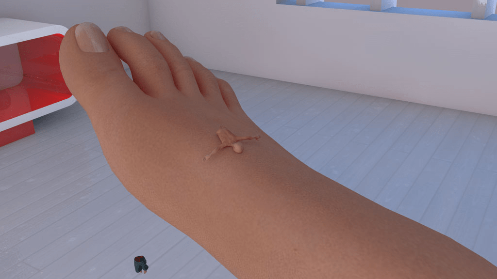

# 希望得到大家帮助 希望与大家共同创作 ps高手来。。。。

作者：eventually

TID：8263

<title>1</title> <link href="../Styles/Style.css" type="text/css" rel="stylesheet">

# 1

由于本人水平有限 有几张的血迹一直做不好 希望得到大家的帮助 希望论坛里的ps高手能帮这个忙！大A在这里感谢大家了！！ 
——————————————————————————————————
我记得XNR兄的某一个作品里的液体做的很赞，我真心希望能够得到帮助，再次感谢大家。
需要处理的图像不多，就下面这几张，感谢了。。。

[ *本帖最後由 awkeygen 於 2010-6-24 22:46 編輯* ] <title>2</title> <link href="../Styles/Style.css" type="text/css" rel="stylesheet">

# 2

 <ignore_js_op>[95.JPG](forum.php?mod=attachment&aid=MjExODB8MjBlYWY5MDB8MTY3NDA2ODg1N3wxODIzMHw4MjYz&nothumb=yes) *(61.07 KB, 下載次數: 0)*

[下載附件](forum.php?mod=attachment&aid=MjExODB8MjBlYWY5MDB8MTY3NDA2ODg1N3wxODIzMHw4MjYz&nothumb=yes)

2010-6-24 22:45 上傳  

</ignore_js_op> <ignore_js_op>[97.JPG](forum.php?mod=attachment&aid=MjExODF8MmM4MmY1YmN8MTY3NDA2ODg1N3wxODIzMHw4MjYz&nothumb=yes) *(87.21 KB, 下載次數: 0)*

[下載附件](forum.php?mod=attachment&aid=MjExODF8MmM4MmY1YmN8MTY3NDA2ODg1N3wxODIzMHw4MjYz&nothumb=yes)

2010-6-24 22:45 上傳  

</ignore_js_op> <ignore_js_op>[98.JPG](forum.php?mod=attachment&aid=MjExODJ8MmY1NjcxNWV8MTY3NDA2ODg1N3wxODIzMHw4MjYz&nothumb=yes) *(84.12 KB, 下載次數: 0)*

[下載附件](forum.php?mod=attachment&aid=MjExODJ8MmY1NjcxNWV8MTY3NDA2ODg1N3wxODIzMHw4MjYz&nothumb=yes)

2010-6-24 22:45 上傳  

</ignore_js_op> <ignore_js_op>[99.JPG](forum.php?mod=attachment&aid=MjExODN8MDhkNjE0NmN8MTY3NDA2ODg1N3wxODIzMHw4MjYz&nothumb=yes) *(92.08 KB, 下載次數: 0)*

[下載附件](forum.php?mod=attachment&aid=MjExODN8MDhkNjE0NmN8MTY3NDA2ODg1N3wxODIzMHw4MjYz&nothumb=yes)

2010-6-24 22:45 上傳  

</ignore_js_op> <ignore_js_op>[100.JPG](forum.php?mod=attachment&aid=MjExODR8ZDA5YmVkNjl8MTY3NDA2ODg1N3wxODIzMHw4MjYz&nothumb=yes) *(74.32 KB, 下載次數: 0)*

[下載附件](forum.php?mod=attachment&aid=MjExODR8ZDA5YmVkNjl8MTY3NDA2ODg1N3wxODIzMHw4MjYz&nothumb=yes)

2010-6-24 22:45 上傳  

</ignore_js_op> <title>3</title> <link href="../Styles/Style.css" type="text/css" rel="stylesheet">

# 3

我会给制作的人加钱加分，并且在帖子中声明感谢的，再次谢谢大家了！！！
  <title>4</title> <link href="../Styles/Style.css" type="text/css" rel="stylesheet">

# 4

修改那個半截小人的立體的顏色不就行了嗎? <title>5</title> <link href="../Styles/Style.css" type="text/css" rel="stylesheet">

# 5

哦 缝合我能办到 现在主要问题是想弄一些血迹上去 我做了许久 可是效果不佳。。。 <title>6</title> <link href="../Styles/Style.css" type="text/css" rel="stylesheet">

# 6

 XNR 在吗？ <title>7</title> <link href="../Styles/Style.css" type="text/css" rel="stylesheet">

# 7

最近工作实在太忙，抽空给你手绘一些血迹。

不过我不是很喜欢太血腥的内容。。。话说这都被腰斩了，玉腿上一定流满了小人的肠子吧。。。 <title>8</title> <link href="../Styles/Style.css" type="text/css" rel="stylesheet">

# 8

呵呵 其实我也不是很喜欢血腥 可是论坛里很多朋友一再要求。。。。
血腥就足够了。。谢谢兄 <title>9</title> <link href="../Styles/Style.css" type="text/css" rel="stylesheet">

# 9

支持樓主啊
血腥大好   <title>10</title> <link href="../Styles/Style.css" type="text/css" rel="stylesheet">

# 10

楼主在血迹方面还是不用这么真实的好 <title>11</title> <link href="../Styles/Style.css" type="text/css" rel="stylesheet">

# 11

照著自己的偏好走，才能更投入啊。
不管怎樣，有人幫就好。期待新作囉

[ *本帖最後由 hubert 於 2010-6-25 08:00 編輯* ] <title>12</title> <link href="../Styles/Style.css" type="text/css" rel="stylesheet">

# 12

专业精神，佩服……

可惜在下只能精神支持

PS盲掩面路过…… <title>13</title> <link href="../Styles/Style.css" type="text/css" rel="stylesheet">

# 13

血迹可以用专门的外挂插件来做……
Bloody啥啥啥的。名字忘记了= = <title>14</title> <link href="../Styles/Style.css" type="text/css" rel="stylesheet">

# 14

  友情提示，我印象中是可以选择模型然后分层渲染的，这样小人出来是一层，GTS出来是一层 地面出来是一层。

也可以用多种不同的分层渲染方式。
这样添加血液容易一点。 <title>15</title> <link href="../Styles/Style.css" type="text/css" rel="stylesheet">

# 15

- -作画什么的。。。
- -PS什么的。。。。
没文化真可怕。。。。