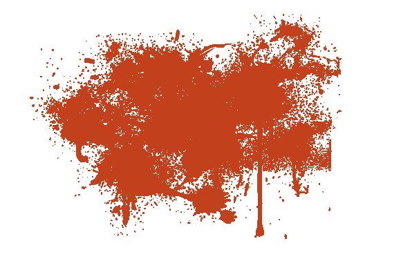
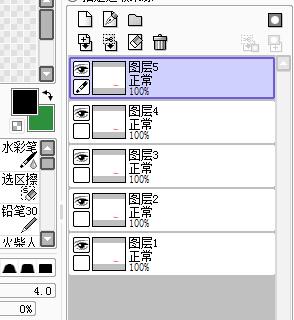

# 幾個透明背景PNG番茄醬 _(：з」∠)_

作者：餃子

TID：16853

<title>1</title> <link href="../Styles/Style.css" type="text/css" rel="stylesheet">

# 1

*本帖最後由 餃子 於 2014-5-13 20:31 編輯*

不知道為啥論壇裡看起來背景黑的o(╯□╰)o另存為應該還是透明的？ <ignore_js_op> 

**f03675061d950a7b624d903b0ad162d9f3d3c990.png** *(351.38 KB, 下載次數: 11)*

[下載附件](forum.php?mod=attachment&aid=NDI5MDJ8YTllNTlhMzV8MTY3NDA2OTY3OXwxODIzMHwxNjg1Mw%3D%3D&nothumb=yes)

2014-5-13 20:04 上傳

<ignore_js_op>

**f03675061d950a7b624c903b0ad162d9f3d3c997.png** *(337.43 KB, 下載次數: 9)*

[下載附件](forum.php?mod=attachment&aid=NDI5MDF8ZmY3NzRhY2N8MTY3NDA2OTY3OXwxODIzMHwxNjg1Mw%3D%3D&nothumb=yes)

2014-5-13 20:04 上傳

<ignore_js_op>

**ce3017f3d7ca7bcb8b8619d0be096b63f724a80b.png** *(306.71 KB, 下載次數: 9)*

[下載附件](forum.php?mod=attachment&aid=NDI5MDB8MWY1ZjUxY2N8MTY3NDA2OTY3OXwxODIzMHwxNjg1Mw%3D%3D&nothumb=yes)

2014-5-13 20:04 上傳

<ignore_js_op>

**89c4fdcd7b899e512bc2e4eb42a7d933c9950dbb.png** *(301.4 KB, 下載次數: 9)*

[下載附件](forum.php?mod=attachment&aid=NDI4OTl8MjA0Njc5YmZ8MTY3NDA2OTY3OXwxODIzMHwxNjg1Mw%3D%3D&nothumb=yes)

2014-5-13 20:03 上傳

<ignore_js_op>

**2e7bcd88d43f8794b40297d1d21b0ef41ad53a0a.png** *(108.55 KB, 下載次數: 8)*

[下載附件](forum.php?mod=attachment&aid=NDI4OTh8Yzg2M2Q5Zjd8MTY3NDA2OTY3OXwxODIzMHwxNjg1Mw%3D%3D&nothumb=yes)

2014-5-13 20:03 上傳

<title>2</title> <link href="../Styles/Style.css" type="text/css" rel="stylesheet">

# 2

*本帖最後由 餃子 於 2014-5-14 19:47 編輯*

順便給個簡陋的拖拉的番茄醬的做法。。。超簡陋
<ignore_js_op>

**O0F7}A%@AWC19PF)MTUY]IJ.jpg** *(188.78 KB, 下載次數: 1)*

[下載附件](forum.php?mod=attachment&aid=NDI5MDV8ZjEzYjM2MjJ8MTY3NDA2OTY3OXwxODIzMHwxNjg1Mw%3D%3D&nothumb=yes)

2014-5-13 20:11 上傳

↓
↓一個血跡圖。。。
↓
<ignore_js_op>

**C0MWLM44V`NAAMX04M2C1B9.jpg** *(60.16 KB, 下載次數: 1)*

[下載附件](forum.php?mod=attachment&aid=NDI5MDR8ZWFiMmI1ODB8MTY3NDA2OTY3OXwxODIzMHwxNjg1Mw%3D%3D&nothumb=yes)

2014-5-13 20:11 上傳

↓
↓ctrl+T壓扁（PS里也是這樣）
↓
<ignore_js_op>

**SS_MTPF)[9SG$U1}X)00]WP.jpg** *(58.08 KB, 下載次數: 0)*

[下載附件](forum.php?mod=attachment&aid=NDI5MDZ8OWEyYWU1Nzh8MTY3NDA2OTY3OXwxODIzMHwxNjg1Mw%3D%3D&nothumb=yes)

2014-5-13 20:11 上傳

↓
↓複製若干份。。。
↓
<ignore_js_op>

**2}U~2K1DLP@6DGMHLIGO92A.jpg** *(72.65 KB, 下載次數: 1)*

[下載附件](forum.php?mod=attachment&aid=NDI5MDN8ZGQ3NjY3M2Z8MTY3NDA2OTY3OXwxODIzMHwxNjg1Mw%3D%3D&nothumb=yes)

2014-5-13 20:10 上傳

_(:з」∠)_ 每一個圖層的血跡稍微錯開一點，用ctrl+T變得都互相之間有些差別，一個簡易的拖拉血跡就好了，多複製幾次，頭尾擦掉效果會比較好

<title>3</title> <link href="../Styles/Style.css" type="text/css" rel="stylesheet">

# 3

呵呵 超喜歡你的蕃茄醬素材還要透明背景的!大讚
謝謝!超有幫助的xD
還是想改名叫辣椒醬 有刺激感 !? <title>4</title> <link href="../Styles/Style.css" type="text/css" rel="stylesheet">

# 4

大陆人表示我们这里的二次元人物即使断成2段都不会有任何液体喷出，更不会有红的。。。 <title>5</title> <link href="../Styles/Style.css" type="text/css" rel="stylesheet">

# 5

現在才看到有素才，謝謝餃子大大提供。 <title>6</title> <link href="../Styles/Style.css" type="text/css" rel="stylesheet">

# 6

真是很棒的素材，可惜我不会用。。 <title>7</title> <link href="../Styles/Style.css" type="text/css" rel="stylesheet">

# 7

这些素材都是很有用的 <title>8</title> <link href="../Styles/Style.css" type="text/css" rel="stylesheet">

# 8

啊。。。。。。。。全都是来要的啊，嘛，我就解释下吧，简单说格式错误，一般图片的格式也会有这方面的问题，建议换个格式保存试试，具体哪个我忘了，然后就看你用到哪里了，有的时候就是做的时候背景透明，通过图片打开不透明，用的时候透明这种（显示不一样）</ignore_js_op></ignore_js_op></ignore_js_op></ignore_js_op></ignore_js_op></ignore_js_op></ignore_js_op></ignore_js_op></ignore_js_op>