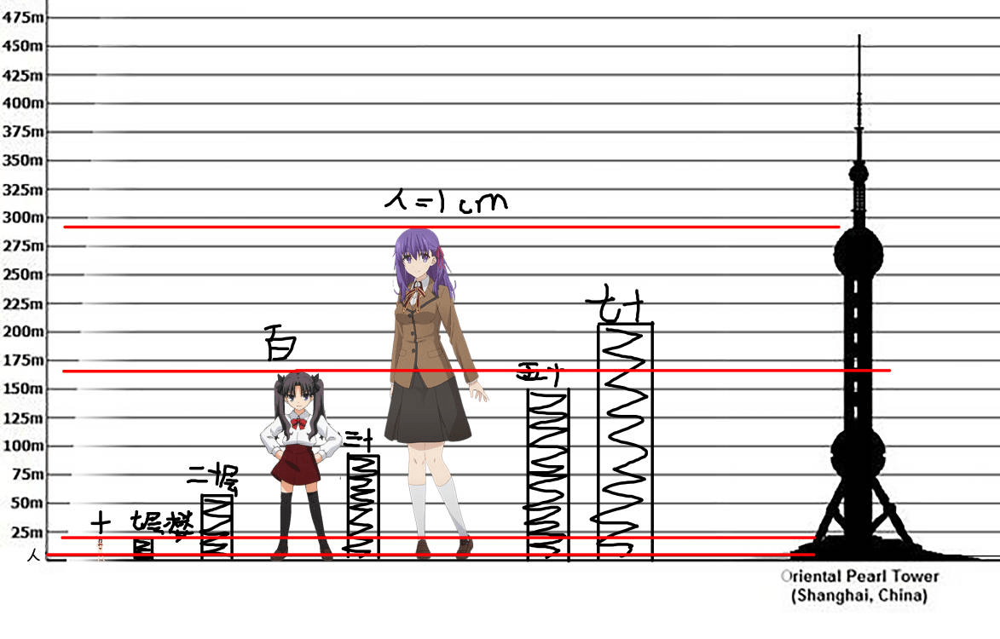
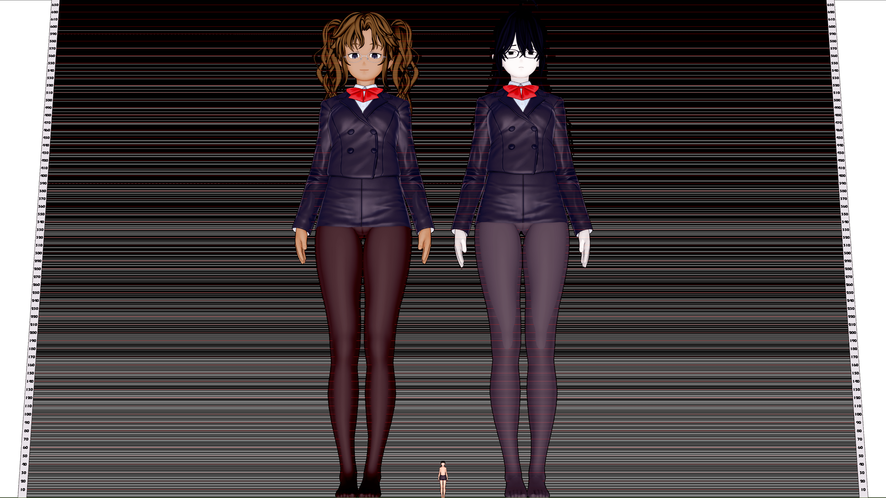

# 弄了个巨大少女身高对比的渣p

作者：恋手

TID：31233

<title>1</title> <link href="../Styles/Style.css" type="text/css" rel="stylesheet">

# 1

码文的时候想到巨大娘身高应该是多少，所以少了点材料p了一下，基本就是十倍百倍和看正常人是1cm大小的对比，还有就是建筑的，感觉排除透视的话，一位看正常人大概只有1cm大小的巨大少女，她要是穿学生圆头皮鞋的话，那么那个皮鞋头的高度基本都有三-五层楼高左右，想想就带感
<title>2</title> <link href="../Styles/Style.css" type="text/css" rel="stylesheet">

# 2

 <ignore_js_op>[[Thumb]640487827554-ab207792-bbae-3ddb-b5b3-f2d96cfbfe28.jpg](forum.php?mod=attachment&aid=ODk1OTN8MzE3ZDg4OWF8MTY3NDA2NTk3MnwxODIzMHwzMTIzMw%3D%3D&nothumb=yes) *(92.72 KB, 下載次數: 7)*

[下載附件](forum.php?mod=attachment&aid=ODk1OTN8MzE3ZDg4OWF8MTY3NDA2NTk3MnwxODIzMHwzMTIzMw%3D%3D&nothumb=yes)

2021-7-9 18:20 上傳  

身高对比

</ignore_js_op> <title>3</title> <link href="../Styles/Style.css" type="text/css" rel="stylesheet">

# 3

> 田棒棒 發表於 2021-7-10 08:12
> 所以是分别什么人物和什么人物的巨大，能不能也讲下？

就是一个对比啊这个，分别是正常人的差不多十倍大小，百倍大小，还有对她来说正常人只有一厘米大小和正常人的大小，也夹了一点各种层数的楼房在里面，头上都有标的 <title>4</title> <link href="../Styles/Style.css" type="text/css" rel="stylesheet">

# 4

最喜欢这种与建筑或者城市比较大小的少女图了 <title>5</title> <link href="../Styles/Style.css" type="text/css" rel="stylesheet">

# 5

反正就類似這樣子的東西是吧？

雖然我只有最大只有做到4倍而且沒有放其他東西做對比就是了

<title>6</title> <link href="../Styles/Style.css" type="text/css" rel="stylesheet">

# 6

 <ignore_js_op>[CharaStudio-2021-07-11-11-26-51-Render.png](forum.php?mod=attachment&aid=ODk2MTh8MmVhNjhkZGR8MTY3NDA2NTk3MnwxODIzMHwzMTIzMw%3D%3D&nothumb=yes) *(2.27 MB, 下載次數: 0)*

[下載附件](forum.php?mod=attachment&aid=ODk2MTh8MmVhNjhkZGR8MTY3NDA2NTk3MnwxODIzMHwzMTIzMw%3D%3D&nothumb=yes)

2021-7-11 11:30 上傳  

</ignore_js_op>