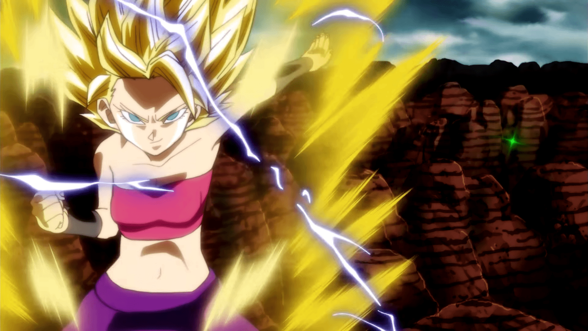

# 强大的GTS在常态用哪种特效区分实力较好？

作者：weikesi

TID：24244

<title>1</title> <link href="../Styles/Style.css" type="text/css" rel="stylesheet">

# 1

<title>2</title> <link href="../Styles/Style.css" type="text/css" rel="stylesheet">

# 2

环绕着的光球数量类似电子围绕着原子核那样

写文的时候因为剧情需要，要在常态时看出2个GTS的实力差距 <title>3</title> <link href="../Styles/Style.css" type="text/css" rel="stylesheet">

# 3

......這種事用投票最好會有結果，你乾脆列戰鬥力好了 <title>4</title> <link href="../Styles/Style.css" type="text/css" rel="stylesheet">

# 4

并不觉得读者会在乎这个............... <title>5</title> <link href="../Styles/Style.css" type="text/css" rel="stylesheet">

# 5

光球数量和颜色都很尬，随便投了一个不尬的光球
但是突然觉得颜色这个可以埋伏笔呀！

你以为我是弱到没有颜色的吗！？
其实是紫外线哒！！！
 <title>6</title> <link href="../Styles/Style.css" type="text/css" rel="stylesheet">

# 6

> [冰西瓜 發表於 2018-1-6 00:46](https://giantessnight.cf/gnforum2012/forum.php?mod=redirect&goto=findpost&pid=354155&ptid=24244)
> 环绕着的光球数量类似电子围绕着原子核那样
> 
> 写文的时候因为剧情需要，要在常态时看出2个GTS的实力差距 ...

用月球繞地球來描述比較合，畢竟電子實際上並不是繞著原子核做圓周運動
目前比較可信的模型，是以電子雲來描述電子出現在原子核周圍的機率分布

另外，個人比較偏好用霸王色霸氣對決
像是海賊王動畫 646 那種，對個拳就可以把旁邊雜魚全部清光

<title>7</title> <link href="../Styles/Style.css" type="text/css" rel="stylesheet">

# 7

...

氣勢和行為吧

弱的一方表現的較為警戒或畏縮

強的一方則顯得比較悠閒且無所畏懼

...

之類的
<title>8</title> <link href="../Styles/Style.css" type="text/css" rel="stylesheet">

# 8

难道不是比较大的那个比较强吗？ <title>9</title> <link href="../Styles/Style.css" type="text/css" rel="stylesheet">

# 9

其实比起这种具体的特效，直接描述GTS的某种超能力会更形象吧。比如说把人缩小的方式，视野所及之处的人变小，或是必须接触才会生效之类~ <title>10</title> <link href="../Styles/Style.css" type="text/css" rel="stylesheet">

# 10

服饰，姿容，气质，身体特征比如瞳孔的颜色形状，身体上的刺青等等
乱飞的球不觉得碍事吗- - <title>11</title> <link href="../Styles/Style.css" type="text/css" rel="stylesheet">

# 11

同觉得尬…
可以用饰品或瞳孔等代替全身发光嘛… <title>12</title> <link href="../Styles/Style.css" type="text/css" rel="stylesheet">

# 12

認真覺得是格調決定強弱，再來直接上來說大小才是最明顯的吧? <title>13</title> <link href="../Styles/Style.css" type="text/css" rel="stylesheet">

# 13

*本帖最後由 超SizeJKGirl 於 2018-1-6 15:49 編輯*

這個表現應該不錯
我看了都快硬了 <ignore_js_op>

**caulifla__super_saiyan_2____dbs_screenshot_by_redfield_1982-dbbl5rg.png** *(2.12 MB, 下載次數: 0)*

[下載附件](forum.php?mod=attachment&aid=NzAyMjV8ZGQ4MjU5MzV8MTY3NDA2NjQ0NXwxODIzMHwyNDI0NA%3D%3D&nothumb=yes)

2018-1-6 15:46 上傳

講錯是快哭了
終於換女的了
遊戲裡面我也會創女賽亞人
不然都男的有點可惜
<title>14</title> <link href="../Styles/Style.css" type="text/css" rel="stylesheet">

# 14

当然是身高了，常态直接高两米，大家都知道这人不一般。
但这种强者也只是一般强者罢了，真正绝顶强者看起来就和普通人没有任何区别 <title>15</title> <link href="../Styles/Style.css" type="text/css" rel="stylesheet">

# 15

我的天？西瓜这是看什么斗罗大陆看多了吧......一个人有不同能力的设定我觉得还好点呢，不要特意有比谁必强的设定 <title>16</title> <link href="../Styles/Style.css" type="text/css" rel="stylesheet">

# 16

在看到標題也想到 西瓜兄呢 xd。看來是腦袋正常運作。強大的巨大娘我覺得是大小吧 強勢的眼神什麼的 說話方式也有影響到。心中的女巨人也沒有會發光呢 感覺怪怪的 <title>17</title> <link href="../Styles/Style.css" type="text/css" rel="stylesheet">

# 17

光芒的颜色比较好吧！ <title>18</title> <link href="../Styles/Style.css" type="text/css" rel="stylesheet">

# 18

或许可以试试...头发的长度，或者瞳孔颜色...如果你乐意的话，可爱程度也是可以的 <title>19</title> <link href="../Styles/Style.css" type="text/css" rel="stylesheet">

# 19

我觉得吧可以数量辨实力，颜色辨属性（？）不过身体上发光环绕光球什么的好像不如凭什么气场啊，威压啊什么的。就好像一些小说里的巨龙就有龙威 <title>20</title> <link href="../Styles/Style.css" type="text/css" rel="stylesheet">

# 20

实力区分不素直接根据身形大小决定吗，不过如果是上面的选项二选一的话咱觉得应该是环绕好点，发光的话会觉得耀眼不能直视，小球环绕的话，还能试试把小人关进球里面（一种捕抓特殊小人激活能力的感觉），或者在上面挂小人（小人储备，宣誓主权，宣誓实力的感觉）和站小人（眷属的感觉）。 <title>21</title> <link href="../Styles/Style.css" type="text/css" rel="stylesheet">

# 21

> [ll392134100 發表於 2018-1-12 15:35](https://giantessnight.cf/gnforum2012/forum.php?mod=redirect&goto=findpost&pid=354971&ptid=24244)
> 实力区分不素直接根据身形大小决定吗，不过如果是上面的选项二选一的话咱觉得应该是环绕好点，发光的话会觉 ...

其实我有几个原因让我觉得有特效是最好的
首先，特效能体现出实力的差距，来更好的叙述故事情节
然后，特效的变化可以体现出角色实力的成长或衰弱
最后，有特效多帅气啊，这就是噪音美感，就像大炮要有硝烟来展示破坏力，蹦弹的弹壳能为机枪加彩，有了特效也是这个道理，大幅度加强表现力
<title>22</title> <link href="../Styles/Style.css" type="text/css" rel="stylesheet">

# 22

同上，这就是“经费在燃烧”和“五毛钱特效”的区别，毕竟特效能显得很高大上，个人觉得发光显得直观（再加个bulingbuling的特效……） <title>23</title> <link href="../Styles/Style.css" type="text/css" rel="stylesheet">

# 23

> [冰西瓜 發表於 2018-1-12 20:45](https://giantessnight.cf/gnforum2012/forum.php?mod=redirect&goto=findpost&pid=354993&ptid=24244)
> 其实我有几个原因让我觉得有特效是最好的
> 首先，特效能体现出实力的差距，来更好的叙述故事情节
> 然后，特 ...

有道理9w9虽然咱觉得嘛，这样直观的实力表现不利于装逼打脸，但想想似乎也不需要装逼打脸。不需要隐藏实力也不需要直觉感知，倒是个展示自己实力威严的方法，也能给别人对这实力有直观的对比。
<title>24</title> <link href="../Styles/Style.css" type="text/css" rel="stylesheet">

# 24

> [ll392134100 發表於 2018-1-15 16:46](https://giantessnight.cf/gnforum2012/forum.php?mod=redirect&goto=findpost&pid=355408&ptid=24244)
> 有道理9w9虽然咱觉得嘛，这样直观的实力表现不利于装逼打脸，但想想似乎也不需要装逼打脸。不需要隐藏实 ...

如果想隐藏实力很简单啊，用低级的特效就可以了
<title>25</title> <link href="../Styles/Style.css" type="text/css" rel="stylesheet">

# 25

> [冰西瓜 發表於 2018-1-15 17:35](https://giantessnight.cf/gnforum2012/forum.php?mod=redirect&goto=findpost&pid=355413&ptid=24244)
> 如果想隐藏实力很简单啊，用低级的特效就可以了

阿噗。。好吧，原来还有这种操作。。（这层不用回复了，看着别人回复了不知道怎么回复回去，而且自己不回复总感觉有种罪恶感心慌的感觉。）
<title>26</title> <link href="../Styles/Style.css" type="text/css" rel="stylesheet">

# 26

Is that still a normal GTS story? <title>27</title> <link href="../Styles/Style.css" type="text/css" rel="stylesheet">

# 27

> [Apache_gunship 發表於 2018-1-15 22:09](https://giantessnight.cf/gnforum2012/forum.php?mod=redirect&goto=findpost&pid=355454&ptid=24244)
> Is that still a normal GTS story?

有可能是混合了的，有时剧情需要就得让女孩以普通尺寸登场
<title>28</title> <link href="../Styles/Style.css" type="text/css" rel="stylesheet">

# 28

就单论光球来说，大小颜色是不是也是特征呢。最后判断实力是要数光球吗，感觉还是用光芒颜色区分更好 <title>29</title> <link href="../Styles/Style.css" type="text/css" rel="stylesheet">

# 29

不管哪个都感觉怪怪的？ <title>30</title> <link href="../Styles/Style.css" type="text/css" rel="stylesheet">

# 30

对女神系感兴趣的应该会更喜欢光环吧 <title>31</title> <link href="../Styles/Style.css" type="text/css" rel="stylesheet">

# 31

对女神系感兴趣的应该会更喜欢光环吧 <title>32</title> <link href="../Styles/Style.css" type="text/css" rel="stylesheet">

# 32

妳以為是超級賽亞人喔QQ <title>33</title> <link href="../Styles/Style.css" type="text/css" rel="stylesheet">

# 33

我觉得可以参照斗罗大陆中的魂环。 <title>34</title> <link href="../Styles/Style.css" type="text/css" rel="stylesheet">

# 34

身高不就证明了实力了吗（笑） <title>35</title> <link href="../Styles/Style.css" type="text/css" rel="stylesheet">

# 35

感觉好呆啊     还是光环吧 <title>36</title> <link href="../Styles/Style.css" type="text/css" rel="stylesheet">

# 36

特效是光芒感觉更爽一些。</ignore_js_op>