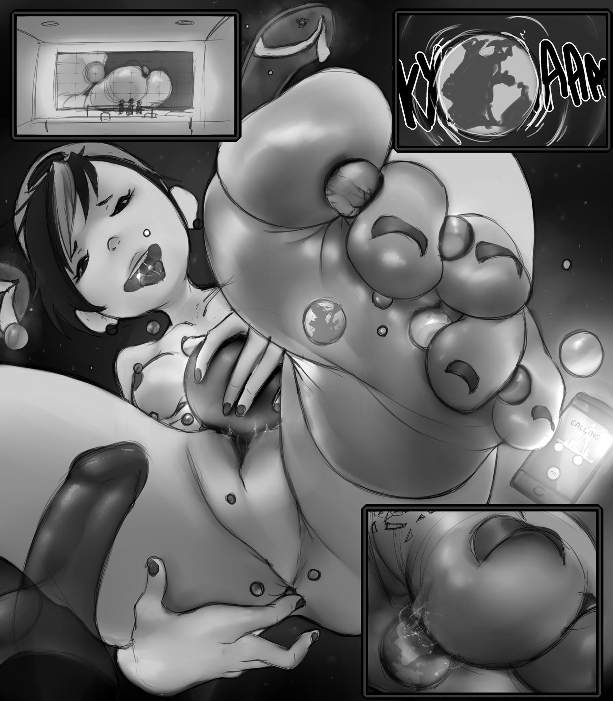

# 從稱呼探究到巨大娘創作

作者：希莶

TID：27465

<title>1</title> <link href="../Styles/Style.css" type="text/css" rel="stylesheet">

# 1

在《寂靜嶺》遊戲系列中，特別是《寂靜嶺2》詹姆斯·桑德蘭的一句話令我印象非常深刻。在詹姆斯幾近瘋狂，殺害了一個人之後，他這樣說：
“I…I kill a human……”
詹姆斯身為“人類”卻說自己殺害了一個“人類”，說明他在這樣的環境中，已經幾乎沒有了理智，失去了正常的思考方式，在里世界中，幾乎到處都是自己記憶形成的怪物，但是當自己殺死了一個人類的時候，得到的“驚喜”顯然更進一步逼瘋了他。
這句台詞也是《寂靜嶺》系列中我認為塑造最成功的的一句台詞，在那種壓抑、黑暗，失去自我的環境中，一句“I kill a human”如同點睛之筆——就好像詹姆斯並不屬於里世界，甚至不屬於寂靜嶺，他是一個外來者，一個外星人，也許只有別的物種或外星人才會說“I kill a human”這樣的話。
同樣的，在很多作品里，巨大娘也會出現對人或其他物種的不同稱呼來體現一種與人類不同的感覺。
例如大部分破壞類的（壓路機）文當中，巨大娘對受虐方的稱呼幾乎無外“人類”、“蟲子”、“細菌”、“微生物”，當巨大娘稱呼“人類”的時候，似乎有一種自己比“人類”更加高貴更加強大的壓迫感在其中，更不用說其他稱呼了，那完全就是將人類貶低置無法與自己相提並論——這裡又回到我之前所提出的論點——對於巨大娘來說，強大是最為重要的。
因為如果巨大娘不夠強大的話，那麼脫口而出的“人類”或者“蟲子”、“細菌”，就好像犯中二病的普通女高中生一樣無力。
而稱呼的話，只能算是調味料，把合格的巨大娘作品比作一道菜的話，那麼主料就是巨大娘的強大、輔料則是巨大娘的魅力，而這稱呼、被施虐的對象等要素僅僅只能算調味料——當然並不是說調味料不重要，如果調味料的比重出問題的話，那麼這道菜同樣也會毀掉，而是如果當一部和巨大娘有關的作品里，巨大娘的“強大”被喧賓奪主的話，這道菜原本的含義就喪失了。
也就像我之前所舉的例子，sonnano氏在天真浪漫3中所畫的插圖，過分提現了巨大娘的美麗，而忽略了“強大”，導致這兩作品反而變成了一種去欣賞少女“美麗”的插畫。
然後這張插圖，是我的友人發送給我讓我觀看的插圖
<ignore_js_op>

**-120fa2b814cab54b.jpg** *(280.78 KB, 下載次數: 2)*

[下載附件](forum.php?mod=attachment&aid=Nzk4NDh8MTUzNDMzZTd8MTY3NDA2NjY3NXwxODIzMHwyNzQ2NQ%3D%3D&nothumb=yes)

2019-10-6 19:19 上傳

魅力的最基本體現就是容貌——可是這張圖當中的巨大娘一幅假小子裝扮，而且按照我的友人所說，這張圖中巨大娘的容貌並不好（我是臉盲，無法分辨好看）。
那麼看到這張圖之後，相信大家也知道我要表達的是什麼意思了。
<title>2</title> <link href="../Styles/Style.css" type="text/css" rel="stylesheet">

# 2

精细度，通常一幅画画得最用心的地方就是画的核心，这一点放到摄影上就是所谓“焦点” <title>3</title> <link href="../Styles/Style.css" type="text/css" rel="stylesheet">

# 3

我倒觉得，巨大娘这种构想出来的事物，本身就被不同的人从现实中寻找到各自青睐的不同女性，加持了各自不同的强大属性。
同好之间彼此分享不同的强大，也相互激活彼此隐藏的不同癖好。
我觉得不必计较是否强大，重要的是，她对你来说值不值得赋予她你所向往的强大属性。
我感觉很多人都在渴求与自己雷同的属性，实在达不到自己的完美标准时，只好自己创作了。 <title>4</title> <link href="../Styles/Style.css" type="text/css" rel="stylesheet">

# 4

> weikesi 發表於 2019-10-6 20:08
> 精细度，通常一幅画画得最用心的地方就是画的核心，这一点放到摄影上就是所谓“焦点” ...

我讨论的并不是焦点，而是“强大”，当然某种意义上来说，强大是巨大娘的焦点没错。 <title>5</title> <link href="../Styles/Style.css" type="text/css" rel="stylesheet">

# 5

绝大多数gts作品的剧情还达不到足矣认真讨论设定的程度 <title>6</title> <link href="../Styles/Style.css" type="text/css" rel="stylesheet">

# 6

> Dawnrise 發表於 2019-10-8 18:36
> 绝大多数gts作品的剧情还达不到足矣认真讨论设定的程度

这并不是设定，只是讨论主旨</ignore_js_op>