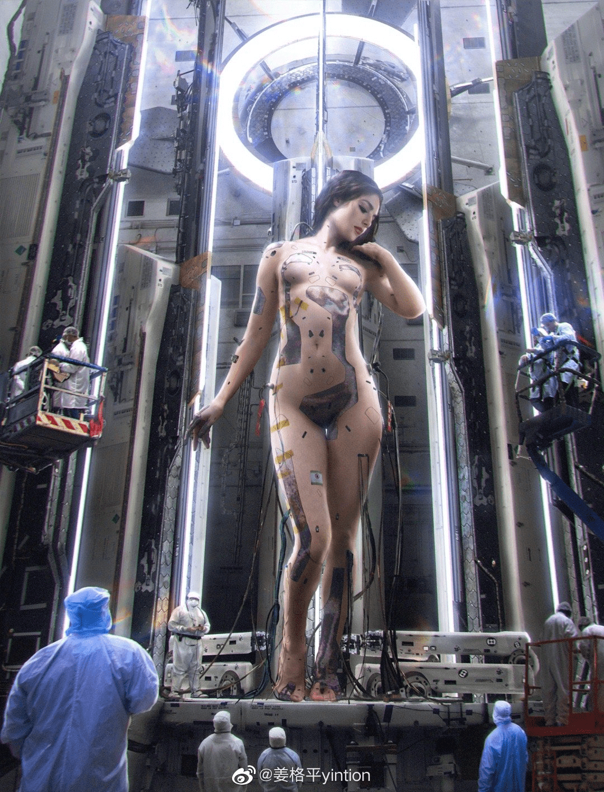

# 微博上看到的图

作者：adsl47535090

TID：32959

<title>1</title> <link href="../Styles/Style.css" type="text/css" rel="stylesheet">

# 1

*本帖最後由 Lisbon_Farrell 於 2022-3-30 11:51 編輯*

[https://m.weibo.cn/1394080341/4751963247609127](https://m.weibo.cn/1394080341/4751963247609127)
很有意境的作品呢，怀疑画师有GTS倾向，评论里也能看到圈内人。可惜A站链接挂了，不知道他其他作品是什么样。 <title>2</title> <link href="../Styles/Style.css" type="text/css" rel="stylesheet">

# 2

 <ignore_js_op>[img-1648612047733671606d2b80107adcd9fb57059290cf8b70be8ce03d8649527981d3ba1164fac.jpg](forum.php?mod=attachment&aid=OTQ5MjV8ZTVjZTE0MWN8MTY3NDA2NTU4NnwxODIzMHwzMjk1OQ%3D%3D&nothumb=yes) *(360.93 KB, 下載次數: 12)*

[下載附件](forum.php?mod=attachment&aid=OTQ5MjV8ZTVjZTE0MWN8MTY3NDA2NTU4NnwxODIzMHwzMjk1OQ%3D%3D&nothumb=yes)

2022-3-30 11:51 上傳  

</ignore_js_op> <title>3</title> <link href="../Styles/Style.css" type="text/css" rel="stylesheet">

# 3

确实有啊，不过画风好写实，我还是喜欢卡通一些。 <title>4</title> <link href="../Styles/Style.css" type="text/css" rel="stylesheet">

# 4

好图，这种画风像是乌合麒麟的那种画加拼贴的风格，不知道具体怎么叫，是概念设计吗？ <title>5</title> <link href="../Styles/Style.css" type="text/css" rel="stylesheet">

# 5

> a3150111 發表於 2022-3-30 17:11
> 好图，这种画风像是乌合麒麟的那种画加拼贴的风格，不知道具体怎么叫，是概念设计吗？ ...

不知道哎。你一说，确实感觉有乌合麒麟风格，而且作者在微博里说的话也挺有意思的。 <title>6</title> <link href="../Styles/Style.css" type="text/css" rel="stylesheet">

# 6

> skyqiling 發表於 2022-3-30 23:59
> 这种写实的风格看着很舒服，作者还有其他的圈内作品吗

微博上好像没有涉及GTS的作品了，但这种风格的画还是挺多的。 <title>7</title> <link href="../Styles/Style.css" type="text/css" rel="stylesheet">

# 7

这个作者A站的不知道为啥挂了，不过他有油管频道，讲解了本图的创作思路。

[https://youtu.be/M0ja7b_mW4k](https://youtu.be/M0ja7b_mW4k)

灵感参考了一些古典的裸体雕塑和油画，作画过程包括3D建模。他的其他作品机娘比较多，有些甚至比较诡异。 <title>8</title> <link href="../Styles/Style.css" type="text/css" rel="stylesheet">

# 8

> dijkstra 發表於 2022-3-31 12:20
> 这个作者A站的不知道为啥挂了，不过他有油管频道，讲解了本图的创作思路。
> 
> https://youtu.be/M0ja7b_mW4k

好的，感谢链接！这个作者要是圈内人该多好啊，画工了得。 <title>9</title> <link href="../Styles/Style.css" type="text/css" rel="stylesheet">

# 9

这原来是画的吗，不说我还以为是某种合成图，太赞了吧 <title>10</title> <link href="../Styles/Style.css" type="text/css" rel="stylesheet">

# 10

看着画风挺棒的，不过微博上一遍没有gts的内容吧 <title>11</title> <link href="../Styles/Style.css" type="text/css" rel="stylesheet">

# 11

可以~画风不错~技术牛,B~看起来很有感觉