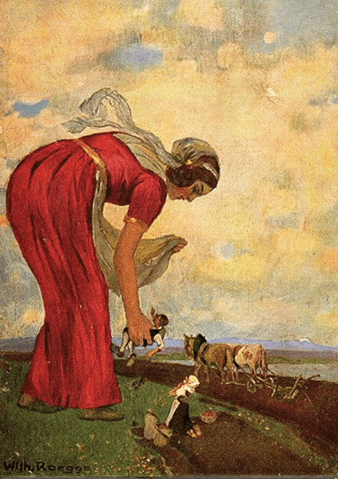
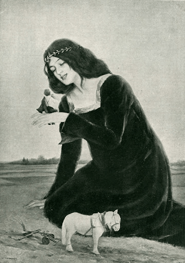
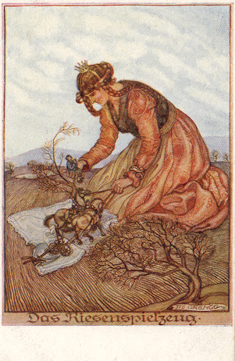
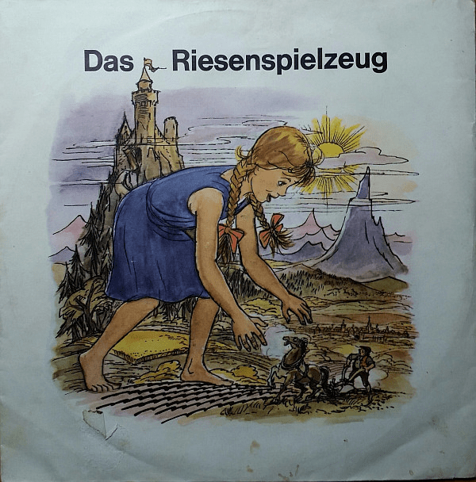
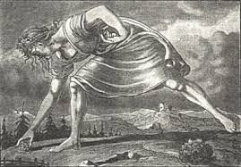
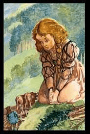
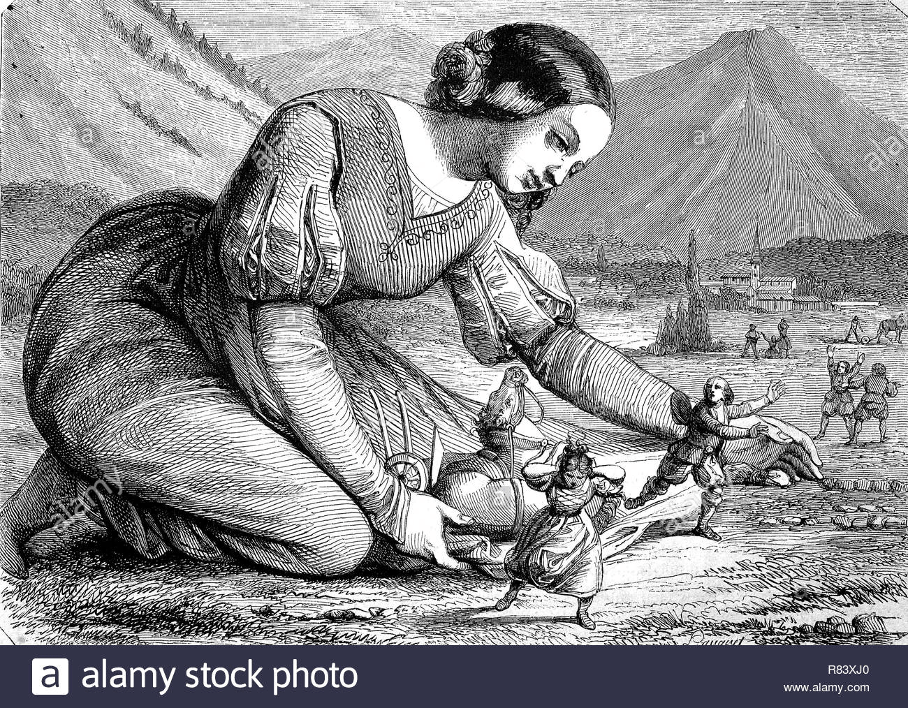
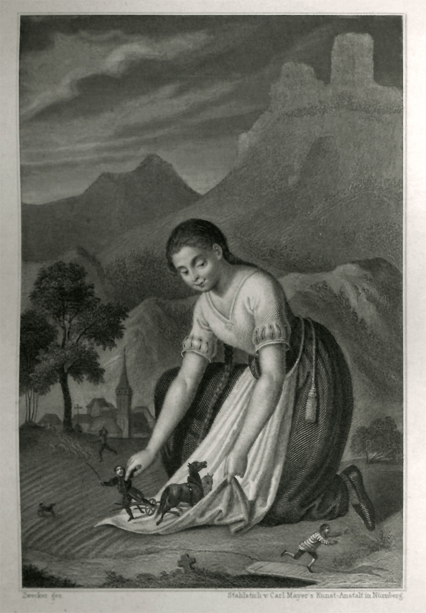
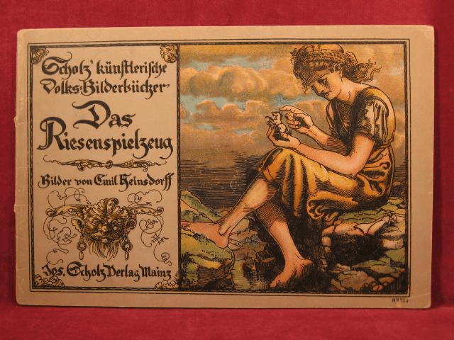

# 德国童话故事＜Das Riesenfräulein＞（少女巨人）

作者：a1236gh

TID：31817

<title>1</title> <link href="../Styles/Style.css" type="text/css" rel="stylesheet">

# 1

**这算是一个很有历史的GTS作品了，由格林兄弟在1816年创作的短篇故事。在原版德语的英文翻译上又翻译成了中文，可能有些不连贯。**

一个巨人家族曾居住在尼德克城堡中。这些美好的时光已经过去，城堡已经毁了一段时间，但人们并没有忘记这些昔日同胞的事迹，仍然谈论他们的体型和非凡的力量。

据传说，他们是远离附近居民的巨大人类。天性善良，没有伤害过任何人。

现在正巧，城堡主人尼德克的小女儿比以往散步的时间久了些。年轻的女巨人走在附近的森林中，来到了广阔的田野和草地。

在那里，她看到一个农夫带着他的马和犁在工作。这对女孩来说是新鲜事！有那么一瞬间，她惊讶地看着正在耕地的人。对此，她充满了孩子般的喜悦，拍了拍手。群山回荡着熙熙攘攘的欢乐，农夫吓得停了下来，他的马也僵住不动了。

——“多好的玩具啊！” - 年轻的女巨人说着 - 。

农夫还不知道这话是什么意思之前，女孩就已经靠近他了；她轻松地把他捡了起来，还有他的马和犁，就像一个在蒂罗尔凿出来的小玩意一样，她光是把他们包在自己的围裙上就能带走。

她兴高采烈地回到了父亲在城堡里的家。

——“看吧！”，她高兴地喊道，把农夫和犁放在桌子上，“看看我刚刚发现了什么样的小模型！一个活的玩具！”。

但父亲却严厉地回答：

"我的女儿，你知道你做了什么、你知道你带来了什么吗？你让农民离开了他的田地，你把他从他的工作中带走了，他是人类中功劳最大的，他不怕日晒又不惧风吹雨打地迫使大地开花结果。如果没有你所谓的玩具，我们这些巨人或整个人类都将因你幼小的的无知而没有面包了。赶紧把那人和他牵着的马和犁带回去；而且一劳永逸地记得：'那些把农民当成玩具的人，一定会受到上天的诅咒。'”

按照她父亲的命令，年轻的女巨人把农民和他的设备放回了她带走他的地方。

曾经矗立着巨大城堡的高处现在已经荒废了。你一下就看得出来原因：这里不再有巨人了。这个传说如今只有一处废墟可以用来回想。

这个故事告诉我们：这个世界上的伟人，无论自身有多么强大，也总是需要并不起眼的人来维护自身。

**格林兄弟和他们写的故事在德国乃至世界也算是家喻户晓了，所以围绕这个故事产生的绘画创作也有不少，也曾被拍成了微电影：**https://vimeo.com/511226122

<ignore_js_op>

**Waldorfshop-Riesenspielzeug.jpg** *(107.43 KB, 下載次數: 0)*

[下載附件](forum.php?mod=attachment&aid=OTE2Mzl8NTFkNGYzZWV8MTY3NDA2ODQxMXwxODIzMHwzMTgxNw%3D%3D&nothumb=yes)

2021-10-8 18:08 上傳

<ignore_js_op>

**unnamed2.jpg** *(47.16 KB, 下載次數: 0)*

[下載附件](forum.php?mod=attachment&aid=OTE2Mzh8NTJkN2Q1NDB8MTY3NDA2ODQxMXwxODIzMHwzMTgxNw%3D%3D&nothumb=yes)

2021-10-8 18:08 上傳

<ignore_js_op>

**unnamed1.jpg** *(106.24 KB, 下載次數: 0)*

[下載附件](forum.php?mod=attachment&aid=OTE2Mzd8YmZmMGU4NmF8MTY3NDA2ODQxMXwxODIzMHwzMTgxNw%3D%3D&nothumb=yes)

2021-10-8 18:08 上傳

<ignore_js_op>

**R-7998145-1453185883-2237.jpeg.jpg** *(125.67 KB, 下載次數: 0)*

[下載附件](forum.php?mod=attachment&aid=OTE2MzZ8YjhmNzJlOGN8MTY3NDA2ODQxMXwxODIzMHwzMTgxNw%3D%3D&nothumb=yes)

2021-10-8 18:08 上傳

<ignore_js_op>

**images2.jpg** *(11.66 KB, 下載次數: 0)*

[下載附件](forum.php?mod=attachment&aid=OTE2MzV8MzEzNjgwMmJ8MTY3NDA2ODQxMXwxODIzMHwzMTgxNw%3D%3D&nothumb=yes)

2021-10-8 18:08 上傳

<ignore_js_op>

**images1.jpg** *(10.71 KB, 下載次數: 0)*

[下載附件](forum.php?mod=attachment&aid=OTE2MzR8NGQwZjAyMjh8MTY3NDA2ODQxMXwxODIzMHwzMTgxNw%3D%3D&nothumb=yes)

2021-10-8 18:08 上傳

<ignore_js_op>

**DIGITA~1.JPG** *(510.99 KB, 下載次數: 0)*

[下載附件](forum.php?mod=attachment&aid=OTE2MzN8MGJhNjIzMGJ8MTY3NDA2ODQxMXwxODIzMHwzMTgxNw%3D%3D&nothumb=yes)

2021-10-8 18:08 上傳

<ignore_js_op>

**Chamisso_Riesenspielzeug__600x862_.jpg** *(152.39 KB, 下載次數: 0)*

[下載附件](forum.php?mod=attachment&aid=OTE2MzJ8MGYxZmI0ZjZ8MTY3NDA2ODQxMXwxODIzMHwzMTgxNw%3D%3D&nothumb=yes)

2021-10-8 18:08 上傳

<ignore_js_op>

**15381472989.jpg** *(63.11 KB, 下載次數: 0)*

[下載附件](forum.php?mod=attachment&aid=OTE2MzF8ODEzMjdjMzl8MTY3NDA2ODQxMXwxODIzMHwzMTgxNw%3D%3D&nothumb=yes)

2021-10-8 18:08 上傳

**当初看到这个故事的时候就在想，写GTS同人文也不一定要从零开始构建一个庞大又新颖的世界观，有的时候回头看看历史上的前人已经写过的故事，然后从已有的东西上进行再创作也不错。毕竟人类历史上和巨人相关的故事传说数不胜数，光是中国古代神话里就有不少。**
<title>2</title> <link href="../Styles/Style.css" type="text/css" rel="stylesheet">

# 2

> [诸君我喜欢 發表於 2021-10-8 19:51](https://giantessnight.cf/gnforum2012/forum.php?mod=redirect&goto=findpost&pid=481663&ptid=31817)
> 可惜的是，中国古代小说或神话里的巨人绝大多数都是gt。。。。不论东西方，古代神话都是男性巨人偏多，这可 ...

避重就轻也可以啊，本来一个种族也不该只有男人，巨人也一样更何况同人本来就是能尽情改编的
<title>3</title> <link href="../Styles/Style.css" type="text/css" rel="stylesheet">

# 3

w我觉得古代gts是现在的雏形，所以人人都在幻想 <title>4</title> <link href="../Styles/Style.css" type="text/css" rel="stylesheet">

# 4

真说起来的话，人类xp的进步也是伴随着科技一起进步的，有些xp在以前也是难以想象 <title>5</title> <link href="../Styles/Style.css" type="text/css" rel="stylesheet">

# 5

不知为什么这故事的道理阐释总有种朴素人民史观的既视感hhh
但绝大多数前人写过的gts故事都太冷门了，在此基础上再创作和新构建世界观来写貌似区别不大...隔壁倒是有个拿山海经原文改成什么长腿国yy了篇文的，不过现在大家普遍缺乏阅读，yy个世界观明显比改编书更舒服 <title>6</title> <link href="../Styles/Style.css" type="text/css" rel="stylesheet">

# 6

简单质朴的早期GTS故事呢
虽然偏向童话但还真是不错（各种意义上） <title>7</title> <link href="../Styles/Style.css" type="text/css" rel="stylesheet">

# 7

格林童话联想到bs（×）
要是真的有这样的噩梦灵还挺带感的</ignore_js_op></ignore_js_op></ignore_js_op></ignore_js_op></ignore_js_op></ignore_js_op></ignore_js_op></ignore_js_op></ignore_js_op>