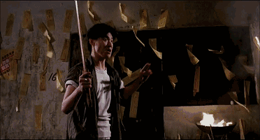

# 怎么消除作者的刻板印象？

作者：CEW

TID：29207

<title>1</title> <link href="../Styles/Style.css" type="text/css" rel="stylesheet">

# 1

我正在写一篇剧情福利文，剧情很福利，福利也很剧情，文章很长，效果很新的作品。
但是之前的文风和情节因为有些人不喜欢，导致看到是我写的就不点进去了，哪怕我这次的风格和以往大有不同
目前写了七千多字了，预计要写到1.5万才能概括的写完。
目前的灵感很多很多，是准备写一个世界观简单易懂的，有些女孩可以巨大化的异世界题材文章，努力描述丰富有趣，让人读起来上头的剧情ing
所以希望能解决刻板印象问题，想要化呱黑为呱粉，但是如果连点进来都做不到，写的再怎么好也是白搭啊，求帮忙

<title>2</title> <link href="../Styles/Style.css" type="text/css" rel="stylesheet">

# 2

*本帖最後由 my94my 於 2020-8-4 17:55 編輯*

本来就是小众xp，有能冲的的文都谢天谢地了，居然还有人挑挑拣拣 <title>3</title> <link href="../Styles/Style.css" type="text/css" rel="stylesheet">

# 3

一看就知道是瓜发的，这种印象已经无法消除了= = <title>4</title> <link href="../Styles/Style.css" type="text/css" rel="stylesheet">

# 4

有自己喜歡的標題 我都會點進去看 <title>5</title> <link href="../Styles/Style.css" type="text/css" rel="stylesheet">

# 5

发一篇能改变刻板印象的文（确信） <title>6</title> <link href="../Styles/Style.css" type="text/css" rel="stylesheet">

# 6

楼主大大加油，搬好小板凳在线持续关注ing
<title>7</title> <link href="../Styles/Style.css" type="text/css" rel="stylesheet">

# 7

好想为楼主做些啥。。我反正是支持西呱大佬的！ <title>8</title> <link href="../Styles/Style.css" type="text/css" rel="stylesheet">

# 8

绝对能解决办法的解决，换号声明自己大号西瓜，建议取冬瓜。 <title>9</title> <link href="../Styles/Style.css" type="text/css" rel="stylesheet">

# 9

所以文人都会有很多个马甲（）
<title>10</title> <link href="../Styles/Style.css" type="text/css" rel="stylesheet">

# 10

可以加一个标志性的tag申明此文和以前的文是不同类型的。 <title>11</title> <link href="../Styles/Style.css" type="text/css" rel="stylesheet">

# 11

放心吧，论坛文虽然多，因为瓜的人气，文还是会点进去看两眼的，如果有什么惊艳的内容便会继续看下去 <title>12</title> <link href="../Styles/Style.css" type="text/css" rel="stylesheet">

# 12

我觉得把头像换一下就可以消除部分刻板印象了,应该有部分的观众是通过头像认人的( <title>13</title> <link href="../Styles/Style.css" type="text/css" rel="stylesheet">

# 13

比如标题加个什么什么文风然后什么情节 然后别人进来就会思考一下（emm好像会少好多看的人hhh） <title>14</title> <link href="../Styles/Style.css" type="text/css" rel="stylesheet">

# 14

啊！这个问题我可以回答！

我一直有关注呱大，从14年的时候开始写文，一直坚持到现在，断断续续不断高产我都注意到了！

但是基本14年之后我就没太看呱文了……

老实说，本质上，我觉得这个问题可能还是不要解决更好。

呱文本身就有自己的风格，比起去试着满足别人的喜好，还是保持自己的风格品牌更好。毕竟很多人是看到“哇，是新的呱文诶”就点进去的。

举个例子，我喜欢的巨大娘作品，是类似于冬野(みかん)那种，基本上剧情非常无脑，只是为了给H做个铺垫用的。

[举个例子，类似于wobuzhidao的作品之类的。](https://giantessnight.com/gnforum2012/forum.php?mod=viewthread&tid=13076&page=1&authorid=354) <title>15</title> <link href="../Styles/Style.css" type="text/css" rel="stylesheet">

# 15

不过仔细又想了想，我会回避呱文，应该并不是因为剧情少了还是多了导致的。

举个例子，说一下《[甥女来住](https://giantessnight.com/gnforum2012/forum.php?mod=viewthread&tid=28787)》吧。

这篇文章按理说是除了H什么都没有的。但是我还是不能接受。原因是什么我也不知道。

大概是因为，剧情里的熊孩子太有胖虎的感觉了……？总觉得不太像是巨大娘的文，更多是以欺负为核心，融入了巨大娘题材的文？

总之男主被欺负的太惨了这点我有点受不了。

明明我很喜欢最后是死亡结局的作品的。就是那种以主角死掉了为收尾的作品。

但是这个被欺压成ATM机的剧情我特别受不了。

另一个例子，是18年的文《[被合租女孩照顾的日记](https://giantessnight.com/gnforum2012/forum.php?mod=viewthread&tid=24691&extra=&authorid=3628&page=1)》。

这篇文章也是，到后半截以后一定会变成以侮辱与欺压、欺负为核心。
就算说是新文风，我觉得这个核心可能是无法改变的。

所以我觉得可能没有必要迎合像我这些接受不了这种内容的读者。
<title>16</title> <link href="../Styles/Style.css" type="text/css" rel="stylesheet">

# 16

总之，其实我觉得没有必要特别说明一篇文章不是呱文。

毕竟大部分人还是会点进来看看的。

虽然必须承认，我是那群不太看呱文的人之一……

至少是，“看到论坛上有新文章 → 脱下裤子 → 啊是呱文 → 提起裤子”的人。
不过的确，我应该还真的是属于“呱文不看”的人群之一。

《甥女来住》我有点开看看，《凛冬》至今没有点开过。《四公主》系列有点开过，但是没认真看过，因为看了看气氛呱味很浓重，就没仔细看了。《被合租女孩照顾的日记》也是看到是呱文就直接快速的扫描到后边，然后发现果然欺负的内容越来越严重，所以也没仔细看……

嗯，不过每次西呱说道关于文风的话题的时候，我都会很认真的把近两年的文看一遍哦！

虽然依然是以提起裤子的状态看就是了orz
<title>17</title> <link href="../Styles/Style.css" type="text/css" rel="stylesheet">

# 17

> [狐乐 發表於 2020-8-6 05:18](https://giantessnight.cf/gnforum2012/forum.php?mod=redirect&goto=findpost&pid=443999&ptid=29207)
> 总之，其实我觉得没有必要特别说明一篇文章不是呱文。
> 
> 毕竟大部分人还是会点进来看看的。

感谢大佬的长评，
原来我写的有欺负的那么严重，实际上我本人在创作的时候并没有对这个有强烈的实感，
侮辱与欺压、欺负不能接受这一点我明白了，这个确实已经写习惯了，
《[甥女来住](https://giantessnight.com/gnforum2012/forum.php?mod=viewthread&tid=28787)》真的是我觉得非常非常轻微的欺负了，但是显然我是当局者迷的那种作者。
显然我在写文的时候，身为作者和身为读者的感受实在是不一样的。
《[被合租女孩照顾的日记](https://giantessnight.com/gnforum2012/forum.php?mod=viewthread&tid=24691&extra=&authorid=3628&page=1)》倒是我刻意重点写欺负的，这也是主题，无从改起的那种根本
大佬有理有据的给我讲明白了呱文的这些情况，意见和建议也都非常中肯且有用，对我的帮助非常大
感谢大佬，希望大佬留个qq，咱们来日方长
5 S6 G2 e  p5 A/ ?1 A0 }  _$ M
<title>18</title> <link href="../Styles/Style.css" type="text/css" rel="stylesheet">

# 18

> [nhbnfn 發表於 2020-8-4 21:54](https://giantessnight.cf/gnforum2012/forum.php?mod=redirect&goto=findpost&pid=443837&ptid=29207)
> 好想为楼主做些啥。。我反正是支持西呱大佬的！

那就留个QQ吧，我需要更多qq好友
<title>19</title> <link href="../Styles/Style.css" type="text/css" rel="stylesheet">

# 19

> [西呱 發表於 2020-8-6 11:09](https://giantessnight.cf/gnforum2012/forum.php?mod=redirect&goto=findpost&pid=444019&ptid=29207)
> 感谢大佬的长评，
> 原来我写的有欺负的那么严重，实际上我本人在创作的时候并没有对这个有强烈的实感，
> 侮 ...

嗯，我刚刚加入呱群了，群号是570544974的对吧？

我的QQ名是Akira，在群里就叫狐乐。

当然，虽然我想来想去说了那么多，但是其实我还是觉得呱文的风格不需要改变的。毕竟“侮辱与欺压”应该是呱文的灵魂的一部分。考虑到巨大娘本身是个抖M向的爱好，习惯“欺负”的剧情的人应该蛮多的。
<title>20</title> <link href="../Styles/Style.css" type="text/css" rel="stylesheet">

# 20

题外话，我之前又想了想，对我来说，我大概不能接受的感觉是“只剩下对女主的杀意”的时候。

就是说，有时候欺负的太过头，所以只剩下了想报仇的想法，没有了对女主尊敬的感觉。

然后因为我的想法跟文章中的男主的想法过于不和，所以感觉就很难带入了，然后就会失去兴趣。

奇怪的，仔细的读的时候，我说不出来呱文的女主有什么行为跟别的文中的女主不一样，让我无法接受。我是说，呱文的女主，如果只是从看脚本的方式来看她的行为的话，其实也没有做什么特别不能接受的。

啊，我可能无法接受的部分，是在呱文里，女主几乎总之在内心里把男主当人看。而行为上又经常做着过于危及生命的行为，以及在对待方式上过于的不当人对待。

虽然可能对很多人来说，这就是呱文的最核心的魅力之一，但是我果然不太接受的了。温柔系的文章里，女主一般会把小人当人，就算是小小的，但也是人。另外的文会把小人当消耗品，随便欺负。但是呱文的核心，感觉经常是女主把小人当成人来对待，但是同时又非常……虐待？

不对，我感觉自己在胡言乱语……不管了，发送。

<title>21</title> <link href="../Styles/Style.css" type="text/css" rel="stylesheet">

# 21

网文大抵是要以读者与作者共同喜爱的目的来的，哪一方的南辕北辙都会在创作上，情感上渐行渐远。
对作者的刻板印象辩证来看就是作者吸引读者的点，能记住的点。或是文风，或是描写，或是XP属性。
我们不妨在好的一面继续发展，在坏的一面进行批判。
关于【是我的文就不点进来看】的问题，没有调查就没有发言权hh。
总之，每一次创作都是一个新的夜空，至于夜空底下有多少人喜欢北斗七星，有多少人喜欢天狼星都不重要，重要的是我们能提供一片什么样的夜空。
以下是正经回复。
大佬加油！ <title>22</title> <link href="../Styles/Style.css" type="text/css" rel="stylesheet">

# 22

> [狐乐 發表於 2020-8-7 15:19](https://giantessnight.cf/gnforum2012/forum.php?mod=redirect&goto=findpost&pid=444153&ptid=29207)
> 题外话，我之前又想了想，对我来说，我大概不能接受的感觉是“只剩下对女主的杀意”的时候。
> 
> 就是说，有时 ...

我的文章的男主的想法，基本就是兄长心态吧，拿女主当孩子的那种，
所以小孩子过分点也要让着小孩子的
毕竟孩子开心是最重要的。
所以我很想知道你在阅读的时候会是什么心情，和男主的区别是什么，这一点我【非常想听你讲一下】，以便了解这方面问题的真相
男主和女主的关系一般是比较亲密或者是至亲的，这一点可能是比其他残酷文实感更高的原因之一
而且我的文章的女主是觉得自己做的对，觉得自己是温柔的，觉得自己是正义的一方，觉得让男主做的一切都是应该的。自己的想法就是合理的
而且如果意识到自己在虐待对方，也会说自己没有虐待，自己没有错，全部都是别人的错
这是我喜欢的，我理想中和妹妹或小外甥之类的孩子们相处时的一种模式，可能也会被人觉得熊了，那这个萌点可能也就是黑点了
小埋都有人觉得太熊，何况呱文的妹妹呢
只是我不知道这是不是主要原因，不知道什么才是关键点，什么才是关键点
我本人是非m，只是喜欢小孩子
危及生命应该是不多的，甥女来住这篇我是注意了不写任何造成男主受伤的情节的
你的叙述我觉得非常通顺，我这边才是语无伦次的
<title>23</title> <link href="../Styles/Style.css" type="text/css" rel="stylesheet">

# 23

*本帖最後由 狐乐 於 2020-8-11 07:16 編輯*

> [西呱 發表於 2020-8-8 11:42](https://giantessnight.cf/gnforum2012/forum.php?mod=redirect&goto=findpost&pid=444280&ptid=29207)
> 我的文章的男主的想法，基本就是兄长心态吧，拿女主当孩子的那种，
> 所以小孩子过分点也要让着小孩子的
> 毕 ...

仔细一想的话，的确，呱文其实没那么多的即死情况出现。尤其是现代背景的那几篇，都没有太多会即死的玩法。
所以其实想一想，我也不知道为啥我不常看呱文。或者说，每次看的时候都会把裤子提起来。

可能有一点是因为我比较年轻（大约25），而且堂表兄弟姐妹中基本没有比我小的人，所以我一直不太能理解那种让着小孩子的感觉。

也有可能是因为我日常生活中接触到的小孩子都不那么熊。印象中过年的时候，亲戚家的熊孩子到我家以后，第一件事是找个沙发，然后掏出一个iPad开始看圣斗士星矢……

啊，这是什么比我还老的番啊。

大概是这种感觉。

关于我读的时候的感觉的话，老实说，我不知道我是什么感觉。

有时候感觉自己在看别的性辟一样的感觉。比如说，没有巨大男爱好的人看巨大男，没有巨大动物爱好的人看巨大动物，没有同大小丸吞爱好的人看同大小丸吞，或没有肢解爱好的人看肢解一样。

就是说，有点类似于与看普通的恐怖小说一样，比如日本的那个《拇指姑娘》，分类就是恐怖电影系列里的。虽然不管怎么看，都可以看出拍那个的导演绝对知道巨大娘的爱好是什么，只是为了大众化才归类为恐怖电影分类的。

啊！我突然想到了有一点，我可能是不喜欢看男主抵抗的样子。

比如说，《从妹妹鞋里生还之后》，男主女主生活中有这些描写：

1.  被亲生妹妹缩小，扔进鞋里3天，最后还要被迫喝下妹妹的洗脚水？

2.  天啊！

3.  忍耐！

4.  忍耐！

5.  呼噜 一大口洗脚水灌进我的嘴里，一半直接进到食道，一半被呛进气管。为了不被呛死和不被憋死！只有大口的喝着。

*複製代碼*
可能是男主挣扎着反抗的样子激起了我自己的好斗心，然后这种心情会凝结成

“只要有机会就一定要杀掉女主或把她无力化！犹豫就会败北，一库走，SEKIRO！”
<ignore_js_op>

**23728sr039074pssn476p0181snoqssq.gif** *(1.72 MB, 下載次數: 0)*

[下載附件](forum.php?mod=attachment&aid=ODQ1NjF8YTFkYTMwODd8MTY3NDA2NjM0NnwxODIzMHwyOTIwNw%3D%3D&nothumb=yes)

2020-8-11 06:58 上傳

或者是

“君可杀，不可辱！你不可能比我自杀还快的杀掉我的！”
<ignore_js_op>

**unnamed.jpg** *(32.54 KB, 下載次數: 0)*

[下載附件](forum.php?mod=attachment&aid=ODQ1NjJ8ZTRmMjU4ZWJ8MTY3NDA2NjM0NnwxODIzMHwyOTIwNw%3D%3D&nothumb=yes)

2020-8-11 06:58 上傳

总之，因为反抗的情绪过于激烈了，所以最后的结局，不管是男主死掉、男主变成奴隶、还是女主最后接受了男主的温柔系结局，我都没法接受。

当然，其实我也不太确信这种心情的来历是什么。也许不是男主的反抗导致这种心情出现的。但总而言之，我觉得男主太把对方当人看了。不管认为对方是神还是恶魔，我应该绝对会把对方当成敌人看待。

题外话，目前我最喜欢的一片呱文应该是《[我可爱的妹妹啊](https://giantessnight.com/gnforum2012/forum.php?mod=viewthread&tid=17669&page=1&authorid=3628)》，一个很老很老，2014年的呱文。

不过我喜欢这篇的原因，就是因为男主和女主之间几乎没有互动……所以没有特别产生强烈的复仇心情，所以很喜欢。

我最喜欢的文章，应该是那种男主一开始主动把自己缩小，然后之后后悔了的剧情。

因为没法怪别人缩小自己，所以感觉很兴奋。

比如《[女孩的玩具](https://giantessnight.com/gnforum2012/forum.php?mod=viewthread&tid=29030&page=1&authorid=9463)》这篇文，男主被缩小以后，把自己跟小人混在一起作为礼物送给女孩子，然后跟小人一起完全失去人权的感觉，我很喜欢。

呱大有没有兴趣写一篇这种设定的，类似于世界上本来就有正常人和小人，男主缩小以后跟小人混在了一起，然后被女主无差别对待？

另一点《[我可爱的妹妹啊](https://giantessnight.com/gnforum2012/forum.php?mod=viewthread&tid=17669&page=1&authorid=3628)》里我喜欢的部分，是最后暗示了男主死亡这点。

不知道为什么，主视角的死亡让我很精神放松。

可能跟多年玩游戏有关，不管游戏里的战斗有多激烈，一点死亡了就可以放松下来了，也算是完成了一个故事。

或者是因为我很喜欢Writing.com的互动文章，在上面的巨大娘文章里，因为互动文章基本收尾的方法只有男主死亡，所以总觉得只有死亡结局才是一个完整的结局。

呱大有兴趣要不要试试看写点有着主视角死亡的结局？

就是说我们一直在扮演的男主，这个个体死亡的结局。
<title>24</title> <link href="../Styles/Style.css" type="text/css" rel="stylesheet">

# 24

题外话，呱你是怎么修改头像的啊……

我每次修改完，清晰度都会变的非常糟糕…… <title>25</title> <link href="../Styles/Style.css" type="text/css" rel="stylesheet">

# 25

注册个小号？不过貌似最近不是很好注册新号 <title>26</title> <link href="../Styles/Style.css" type="text/css" rel="stylesheet">

# 26

emmm真的有人会因为作者而产生刻板印象吗？通常影响更大的是看文章的第一印象吧，像标题什么的，作者名太小第一眼看不到啊… <title>27</title> <link href="../Styles/Style.css" type="text/css" rel="stylesheet">

# 27

> [狐乐 發表於 2020-8-11 07:15](https://giantessnight.cf/gnforum2012/forum.php?mod=redirect&goto=findpost&pid=444672&ptid=29207)
> 仔细一想的话，的确，呱文其实没那么多的即死情况出现。尤其是现代背景的那几篇，都没有太多会即死的玩法 ...

头像我也是改成渣清晰度了啊
我写的《甥女来住重制版》，就是男主并不是把对方当作敌人的，而且也是男主自己导致自己被缩小的，具体就是主动把缩小枪给外甥女对自己自由使用。《甥女来住重制版》也是我目前最新的，最和睦的作品，本觉得是可以推翻刻板印象的一篇文
再看看？真的是觉得那篇文可能需要我重申一下了，和你说的明明就挺符合的啊
<title>28</title> <link href="../Styles/Style.css" type="text/css" rel="stylesheet">

# 28

> [西呱 發表於 2020-8-11 18:21](https://giantessnight.cf/gnforum2012/forum.php?mod=redirect&goto=findpost&pid=444727&ptid=29207)
> 头像我也是改成渣清晰度了啊
> 我写的《甥女来住重制版》，就是男主并不是把对方当作敌人的，而且也是男主 ...

嗯，《甥女来住》其实的确男主没有把对方当敌人。可能关于这篇文章，我唯一不喜欢的就是男主被当成ATM机这点吧……感觉太现实了？

不过嗯，读以前的呱文的时候，我主要不是因为男主把对方当敌人，而是我在带入男主的时候，我把女主当成敌人了。所以有时候在男主有反抗的机会的时候却不反抗的时候，我就看着特别觉得“犹豫就会败北！”什么的。

题外话，我的头像的主要是会出现很多坏点，就是说，那种噪点很多的感觉。不知道怎么解决……
<title>29</title> <link href="../Styles/Style.css" type="text/css" rel="stylesheet">

# 29

> [狐乐 發表於 2020-8-12 02:26](https://giantessnight.cf/gnforum2012/forum.php?mod=redirect&goto=findpost&pid=444806&ptid=29207)
> 嗯，《甥女来住》其实的确男主没有把对方当敌人。可能关于这篇文章，我唯一不喜欢的就是男主被当成ATM机 ...

长辈那种就那样了
确实是有问题，以后可能不会有ATM情节
然后就是噪点，你看我这的噪点不是更多吗
<title>30</title> <link href="../Styles/Style.css" type="text/css" rel="stylesheet">

# 30

> [西呱 發表於 2020-8-12 15:03](https://giantessnight.cf/gnforum2012/forum.php?mod=redirect&goto=findpost&pid=444853&ptid=29207)
> 长辈那种就那样了
> 确实是有问题，以后可能不会有ATM情节
> 然后就是噪点，你看我这的噪点不是更多吗

不知道，主要是我的头像感觉还是看不清到底是什么东西。

你的头像基本一看就知道，啊，是个角色。
<title>31</title> <link href="../Styles/Style.css" type="text/css" rel="stylesheet">

# 31

想騙點閱率就下個吸引人的標題就好啦，硬要貼合主題的標題有時候就是會讓一些人望之卻步 <title>32</title> <link href="../Styles/Style.css" type="text/css" rel="stylesheet">

# 32

瓜大，這就要取捨了，要寫自己想寫的文章還是觀眾想看的文章。
前幾年我也嘗試要寫你說的妹妹屈辱哥哥的文，寫沒幾篇我就投降，你的風格的文要學真的很難。

結論：你的文章跟我風格完全不同，我嘗試看幾篇之後就不再看了，同樣的，我的文也會有人一看到王正念就跳開，這不能強求。

我建議你堅持自我，就當作是為了那些會喜歡你的文的人寫作，別氣餒，到現在還在寫文的大佬不多了。
<title>33</title> <link href="../Styles/Style.css" type="text/css" rel="stylesheet">

# 33

刻板印象难以改变，唯有用刻板印象来打败刻板印象，就是让读者觉得你写出什么文章都感觉不奇怪，都愿意读下去。所以个人愚见，还是要多写。 <title>34</title> <link href="../Styles/Style.css" type="text/css" rel="stylesheet">

# 34

圈子里认识并了解作者的并不是多数，而形成刻板印象的群体估计更少。大多看了爽就完事，不爽不继续看，不会太关注作者是谁的问题。

不过楼主真因此特别困扰的话，那我只能表示就像“女神不会因为舔狗有多舔而对他怎么样，只有能力和性格的改变才能起到一定的作用”。好好出新作，写文就好了，写的好自然会有人帮忙安利。 <title>35</title> <link href="../Styles/Style.css" type="text/css" rel="stylesheet">

# 35

> [六神一 發表於 2020-8-17 04:53](https://giantessnight.cf/gnforum2012/forum.php?mod=redirect&goto=findpost&pid=445299&ptid=29207)
> 圈子里认识并了解作者的并不是多数，而形成刻板印象的群体估计更少。大多看了爽就完事，不爽不继续看，不会 ...

说的好啊朋友，谢谢你，你的话在理啊
<title>36</title> <link href="../Styles/Style.css" type="text/css" rel="stylesheet">

# 36

> [六神一 發表於 2020-8-17 04:53](https://giantessnight.cf/gnforum2012/forum.php?mod=redirect&goto=findpost&pid=445299&ptid=29207)
> 圈子里认识并了解作者的并不是多数，而形成刻板印象的群体估计更少。大多看了爽就完事，不爽不继续看，不会 ...

说的好啊朋友，谢谢你，你的话在理啊
<title>37</title> <link href="../Styles/Style.css" type="text/css" rel="stylesheet">

# 37

> [六神一 發表於 2020-8-17 04:53](https://giantessnight.cf/gnforum2012/forum.php?mod=redirect&goto=findpost&pid=445299&ptid=29207)
> 圈子里认识并了解作者的并不是多数，而形成刻板印象的群体估计更少。大多看了爽就完事，不爽不继续看，不会 ...

说的好啊朋友，谢谢你，你的话在理啊</ignore_js_op></ignore_js_op>