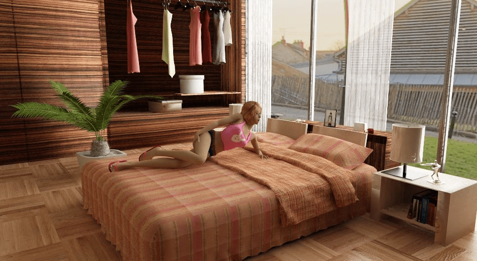
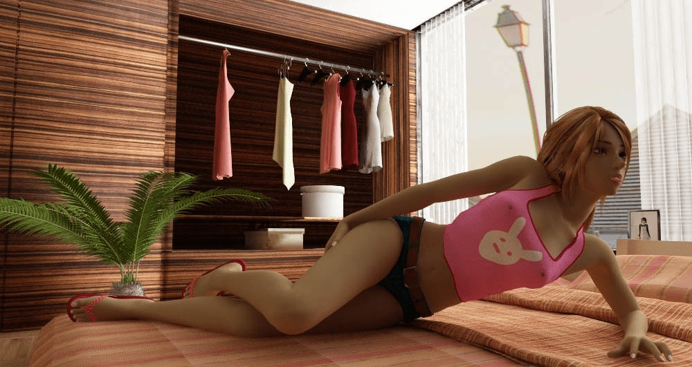

# 总结一下当今GTS方面的3D渲染主要方案

作者：3213213210

TID：16035

<title>1</title> <link href="../Styles/Style.css" type="text/css" rel="stylesheet">

# 1

以下从出图效果，计算机配置和核心技术3方面总结3D作品制作方案。
1.低配电脑
例：[http://www.giantessnight.com/gnf ... viewthread&tid=7886](http://www.giantessnight.com/gnforum2012/forum.php?mod=viewthread&tid=7886)
推荐方案：DAZ
优势：出图快，预览快，对配置要求很低，占用内存小，可以加入很多人物模型尔不要担心卡死，**软件特别简单，适合新手**入门，所以还是极力推荐的。
缺点：渲染效果很一般，如：[http://www.giantessnight.com/gnf ... viewthread&tid=7886](http://www.giantessnight.com/gnforum2012/forum.php?mod=viewthread&tid=7886)，大家可以发现，DAZ出的图细节模糊，人物皮肤质感差，光感差。
2.中等配置的电脑
如：[http://www.giantessnight.com/gnf ... viewthread&tid=7946](http://www.giantessnight.com/gnforum2012/forum.php?mod=viewthread&tid=7946)
推荐方案：Poser Pro
优势：经典软件，功能强大（虽然很多的用不上），有些难度，但是不大，推荐安装poser pro，**poser pro的最大意义在于能与主流3d软件无缝对接**，poser渲染的人物皮肤质感很好，所以，精通poser也能做出好作品，poser内存占用偏大，渲染速度一般，比DAZ慢，但是效果高出DAZ很多。
劣势：除人物之外，渲染效果不尽如人意，poser资源库管理比较混乱，没有DAZ用起来舒服，所以，需要一定时间去熟悉poser的界面。
3.C4D+poser pro方案
例：[http://www.giantessnight.com/gnf ... viewthread&tid=7867](http://www.giantessnight.com/gnforum2012/forum.php?mod=viewthread&tid=7867)
优势：C4D的稳定性强，渲染速度快，占用内存小，界面比较人性化，软件用起来特别舒服，自带的GI已经很棒（本人不才，还没能精通C4D自带的高级渲染），皮肤质感也不错，**推荐进阶者使用**。
劣势：资源比较少，大部分需要自己重新建模，工作量较大。
4.C4D+vray+poser pro
例：mk_cuf的作品
优势：实质上就是**用vray代替C4D的高级渲染**，vray通过简单的设置就能做出比较好的全局光效果，**vray适合做室内和室外建筑**渲染，皮肤细节好。
劣势：vray如果处理不得当，人物的皮肤会产生极强的塑料感，人物会缺乏生动感，就像一个雕像似的，所以，用vray渲染的话需要重新处理人物的皮肤材质。
5.3DS+vray+poser pro
例：[http://www.giantessnight.com/gnf ... iewthread&tid=16028](http://www.giantessnight.com/gnforum2012/forum.php?mod=viewthread&tid=16028)
优势：比较经典的组合，该组合也是**商业渲染的主流方案**，vray在max上的发展有好多年了，所以比C4D上的vray效果要更生动，并且资源众多。
劣势：**渲染速度极慢，对配置要求极高，内存占用很大（如我作品中的场景，内存占用超过3G）,3ds max软件不如C4D稳定，容易死掉**，所以要经常做备份，坐久了会让人很头痛。

<title>2</title> <link href="../Styles/Style.css" type="text/css" rel="stylesheet">

# 2

投票是什么意思呢？
是让我们选择自己喜欢的还是啥？ <title>3</title> <link href="../Styles/Style.css" type="text/css" rel="stylesheet">

# 3

个人比较喜欢3ds...插件众多，兼容性好，资源丰富。C4D也装了，不过还是不太会用...大概是因为第一个接触的就是3ds吧...
Poser做的人物是自带骨骼的吗？以前在3ds上试着绑定了人物一个骨骼，实在太累了...什么封套什么的...反人类啊...
Maya似乎用的人不多？
<title>4</title> <link href="../Styles/Style.css" type="text/css" rel="stylesheet">

# 4

想学习一下DAZ.可下载之后是英文， 暂时没找到中文版……另外也没找到什么教程……感觉不知从何入手啊 <title>5</title> <link href="../Styles/Style.css" type="text/css" rel="stylesheet">

# 5

想学习一下DAZ.可下载之后是英文， 暂时没找到中文版……另外也没找到什么教程……感觉不知从何入手啊 <title>6</title> <link href="../Styles/Style.css" type="text/css" rel="stylesheet">

# 6

> wxy112300 發表於 2014-1-18 14:55 
> 个人比较喜欢3ds...插件众多，兼容性好，资源丰富。C4D也装了，不过还是不太会用...大概是因为第一个接触的 ...

恩，骨骼和蒙皮太恼人，我一般是在poser里做pose，再往3ds里面导，以前用的是机械硬盘，所以模型的reload是一个很耗时间的事，现在换SSD好很多了。所以，做高质量的图，SSD必备啊
<title>7</title> <link href="../Styles/Style.css" type="text/css" rel="stylesheet">

# 7

不知道那么多，个人感觉c4d用着蛮顺手的，大概由于先学的原因吧！
而且其自带的渲染器真的很强大所以每次都感觉不用换vray了，但直觉告诉我还是换吧。于是用了之后发现，我擦，人物好强的塑料感，于是果断用回原自带的。
所以求如何修改人物皮肤贴图 <title>8</title> <link href="../Styles/Style.css" type="text/css" rel="stylesheet">

# 8

好多,可惜我一个都不会。 <title>9</title> <link href="../Styles/Style.css" type="text/css" rel="stylesheet">

# 9

> awkeygen 發表於 2014-1-18 16:36 
> 恩，骨骼和蒙皮太恼人，我一般是在poser里做pose，再往3ds里面导，以前用的是机械硬盘，所以模型的reload ...

原来是这么做的...不搞骨骼绑定倒是省事了不少，不过这种方法是不是就没法做成动画了呢？
不过图文什么的也不需要动画了...也是个好方法..
<title>10</title> <link href="../Styles/Style.css" type="text/css" rel="stylesheet">

# 10

> wxy112300 發表於 2014-1-19 00:46 
> 原来是这么做的...不搞骨骼绑定倒是省事了不少，不过这种方法是不是就没法做成动画了呢？
> 不过图文什么的 ...

如果用的是poser自带的那个插件，你如果导入的文件是一段动画那导入后也依然会是动画
<title>11</title> <link href="../Styles/Style.css" type="text/css" rel="stylesheet">

# 11

（装作什么都知道）好高端，楼主很厉害啊！

我印象中还记得有个叫水杉的软件似乎也能从事上面的工作？ <title>12</title> <link href="../Styles/Style.css" type="text/css" rel="stylesheet">

# 12

*本文章最後由 awkeygen 於 2014-1-22 16:08 編輯*

> chr410445175 發表於 2014-1-18 19:47 
> 不知道那么多，个人感觉c4d用着蛮顺手的，大概由于先学的原因吧！
> 而且其自带的渲染器真的很强大所以每次都 ...

关于修改材质：
对于c4d自带渲染器，皮肤的主要修改在于：
1.尽量让高光趋近于无，且高光颜色越淡越好（高光颜色就是物体受到光照后反射出来的色彩），高光调不好，就会出现塑料感。
2.可以加一点点的自发光，不要太强，5%左右，这样，也会稍微增加皮肤的质感。
3.凹凸不要太强，国外的一些作品，在表现脚趾时，由于凹凸过度，会像石膏，所以凹凸一点点就可以。

对于vray for c4d
1.贴图一定要重新处理，发光层一定要去掉
2.可以尝试快速SSS材质，这个材质是专门为皮肤准备的，用sss代替原来的漫反射层，或者在原来的漫反射层以50%的透明度再叠加一层快速SSS，下面是我很久以前的快速SSS皮肤试图。塑料感基本没有了，当然，这个模型的材质精度很低，但是，用了sss后，基本解决的vray的塑料质感问题。

<ignore_js_op>

**1007202145ff0a6ca944b5a673.jpg** *(117.07 KB, 下載次數: 0)*

[下載附件](forum.php?mod=attachment&aid=Mzk3NjB8Zjg4NTZlNTd8MTY3NDA2OTY5MHwxODIzMHwxNjAzNQ%3D%3D&nothumb=yes)

2014-1-22 15:57 上傳

<ignore_js_op>

**1007202152777be3c33f62dc27.jpg** *(113.42 KB, 下載次數: 0)*

[下載附件](forum.php?mod=attachment&aid=Mzk3NjF8MjZhNTQ2Yjl8MTY3NDA2OTY5MHwxODIzMHwxNjAzNQ%3D%3D&nothumb=yes)

2014-1-22 15:58 上傳

<title>13</title> <link href="../Styles/Style.css" type="text/css" rel="stylesheet">

# 13

> 615825130 發表於 2014-1-18 15:15 
> 想学习一下DAZ.可下载之后是英文， 暂时没找到中文版……另外也没找到什么教程……感觉不知从何入手啊 ...

中英文无所谓的，DAZ掌握资源库的使用、移动和旋转就能作图了。这个软件的确十分的简单，望尝试！ <title>14</title> <link href="../Styles/Style.css" type="text/css" rel="stylesheet">

# 14

> awkeygen 發表於 2014-1-22 16:13 
> 中英文无所谓的，DAZ掌握资源库的使用、移动和旋转就能作图了。这个软件的确十分的简单，望尝试！ ...

刚刚入门的话……什么都看不懂，不知道从哪里入手。还希望教一下基础的东西。我在慢慢摸索。网络不好可能会发两遍。如果这样请见谅
<title>15</title> <link href="../Styles/Style.css" type="text/css" rel="stylesheet">

# 15

> awkeygen 發表於 2014-1-22 16:00 
> 关于修改材质：
> 对于c4d自带渲染器，皮肤的主要修改在于：
> 1.尽量让高光趋近于无，且高光颜色越淡越好（高 ...

感谢，近期会尝试；
不过最近重做系统后试了试poser 2014，但这玩意没有导入的那个破解，所以只好用intereposer pro，感觉好难用，人物没有在poser里调整的方便和快速，求A大有没有试过2014的版本,用过的话求个导入插件。

<title>16</title> <link href="../Styles/Style.css" type="text/css" rel="stylesheet">

# 16

> 615825130 發表於 2014-1-22 19:27 
> 刚刚入门的话……什么都看不懂，不知道从哪里入手。还希望教一下基础的东西。我在慢慢摸索。网络不好可能 ...

最需要学的首先是模型库，女模型的基础模型是V4，男性是M4，这两个需要第一时间安装。之后就是移动，旋转和放大缩小，再下载一些场景，就可以出简单作品。
如果感觉下载基础模型费劲，直接玩poser吧，poser更直观！ <title>17</title> <link href="../Styles/Style.css" type="text/css" rel="stylesheet">

# 17

> chr410445175 發表於 2014-1-24 16:19 
> 感谢，近期会尝试；
> 不过最近重做系统后试了试poser 2014，但这玩意没有导入的那个破解，所以只好用inter ...

模型导入属于经典问题了
我个人用poserfusion，也就是poser pro自带的那个导入插件，我认为这一款插件最稳定，最占资源的插件，因为它是官方的、
以我的经验，这款插件在c4d上表现最稳定，之前在max2009和max2011上使用很不稳定，经常导致无法预览或者文件永久损坏，这款的插件的工作流程是：必须在poser中完成任务建模和pose，然后储存，然后再重新导入，也就是插件的reload功能。所以，建议使用SSD，否则载入速度惨不忍睹。
其他插件略有所闻，但是我不建议使用，因为那些都不是官方的，会出现各种离奇的问题。所以，推荐poserfusion！ <title>18</title> <link href="../Styles/Style.css" type="text/css" rel="stylesheet">

# 18

也想加入可以跟大A請教嗎 !! <title>19</title> <link href="../Styles/Style.css" type="text/css" rel="stylesheet">

# 19

其实，我想学一下下，但看不懂软件和教程 <title>20</title> <link href="../Styles/Style.css" type="text/css" rel="stylesheet">

# 20

这不正是 大A作品的进化史吗？
话说 大仁 跑哪儿去了？ <title>21</title> <link href="../Styles/Style.css" type="text/css" rel="stylesheet">

# 21

個人認為，作品是可能十年後都會有人挖出來看的東西，比起低配置量產還不如努力做出那高品質的一張 <title>22</title> <link href="../Styles/Style.css" type="text/css" rel="stylesheet">

# 22

好复杂  理解不了 <title>23</title> <link href="../Styles/Style.css" type="text/css" rel="stylesheet">

# 23

這還不是真了解~不是說MMD往往是作圖的好工具嗎? <title>24</title> <link href="../Styles/Style.css" type="text/css" rel="stylesheet">

# 24

我后来发现，用vue渲染挺不错的 <title>25</title> <link href="../Styles/Style.css" type="text/css" rel="stylesheet">

# 25

这两年用max的最大感受就是 随时都有可能停止响应 就是保存个渲染图都可能卡个20分钟...
自己最近用的max2016版本 感觉稳定性不如以前的2015和2014
而且自从升了win10后 未响应更频繁了...
max的骨骼绑定的确反人类 什么蒙皮啊一类的 自己这种业余人士真是弄不明白...
不过感觉max的资源蛮适合做gts图的 用daz和poser时感觉没有什么大型的场景资源 而max的各种城市模型真是不少</ignore_js_op></ignore_js_op>