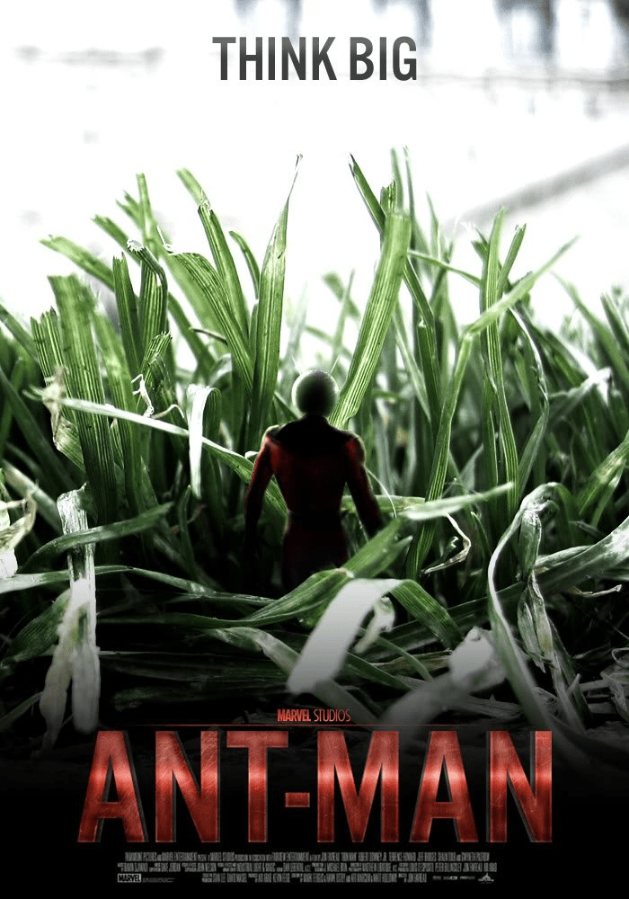

# 惊奇漫画的蚁人，大家知道不？据说要拍成电影了

作者：qweaaaaa

TID：12435

<title>1</title> <link href="../Styles/Style.css" type="text/css" rel="stylesheet">

# 1

生化学家汉克打算用他最新发现的一组亚原子微粒，做一项可以改变大小的创造试验。结果中途出了些问题，拿自己做实验的汉克，竟然能够变得跟蚂蚁一样小。随后，他又发明了一项工具，帮助他跟蚂蚁们进行交流，甚至控制它们为自己所用。
以上出自百度百科。
原版复仇者联盟里有蚁人的，但是电影版不知为啥没了。据说要单独将其拍成电影，希望能有互动 <title>2</title> <link href="../Styles/Style.css" type="text/css" rel="stylesheet">

# 2

 <ignore_js_op>[&#34433;人.jpg](forum.php?mod=attachment&aid=Mjg3Mjh8YjlkZDhhMzd8MTY3NDA2OTEyOHwxODIzMHwxMjQzNQ%3D%3D&nothumb=yes) *(122.8 KB, 下載次數: 1)*

[下載附件](forum.php?mod=attachment&aid=Mjg3Mjh8YjlkZDhhMzd8MTY3NDA2OTEyOHwxODIzMHwxMjQzNQ%3D%3D&nothumb=yes)

2012-6-4 14:35 上傳  

</ignore_js_op> <title>3</title> <link href="../Styles/Style.css" type="text/css" rel="stylesheet">

# 3

不过貌似蚁人很强，别想踩死他 <title>4</title> <link href="../Styles/Style.css" type="text/css" rel="stylesheet">

# 4

问题是他还会变GT啊...
然后那个妹子却不会变GTS.... <title>5</title> <link href="../Styles/Style.css" type="text/css" rel="stylesheet">

# 5

，但愿跟绿巨人一样，有男有女,毕竟惊奇漫画里有5000多个超级英雄呢

[ *本帖最後由 qweaaaaa 於 2012-6-4 19:51 編輯* ] <title>6</title> <link href="../Styles/Style.css" type="text/css" rel="stylesheet">

# 6

> 原帖由 *archer* 於 2012-6-4 18:15 發表 
> 问题是他还会变GT啊...
> 然后那个妹子却不会变GTS....

请参照11年版本的动画地上最强英雄：复仇者集合第一季中的黄蜂女形象，尤其是有一集关于机械生物体的靠近结尾画面
或者在空中监狱大屋出现的时候有几个画面，不多。 <title>7</title> <link href="../Styles/Style.css" type="text/css" rel="stylesheet">

# 7

.
驚奇漫畫玩size梗算不少了，當然蟻人這個復仇者的元老也是一個。

不過蟻人要搬上大螢幕真的不容易，size梗現在已經是對日本怪獸致敬或者搞笑的代名詞了。

光是要設計一個讓蟻人看起來很帥的橋段（而且還得完全凸顯他的能力）我覺得就是個挑戰。

--
話說那張海報是不是粉絲製作的阿？ <title>8</title> <link href="../Styles/Style.css" type="text/css" rel="stylesheet">

# 8

[http://www.youtube.com/watch?v=No5vyL7F7t4](http://www.youtube.com/watch?v=No5vyL7F7t4)
預告片裡沒有什麼互動
片名真的叫做ANT-MAN <title>9</title> <link href="../Styles/Style.css" type="text/css" rel="stylesheet">

# 9

不知道會不會有GTS的場面
如果是Wasp的話那就太好了 <title>10</title> <link href="../Styles/Style.css" type="text/css" rel="stylesheet">

# 10

> 原帖由 *CEW* 於 2012-6-5 01:36 發表 
> [http://www.youtube.com/watch?v=No5vyL7F7t4](http://www.youtube.com/watch?v=No5vyL7F7t4)
> 預告片裡沒有什麼互動
> 片名真的叫做ANT-MAN

这不是真的预告片，只是爱好者拿其他电影的剪辑而已。 <title>11</title> <link href="../Styles/Style.css" type="text/css" rel="stylesheet">

# 11

廸士尼的確買了版權
相信未來會上映
不過他在漫畫經常都是巨大化