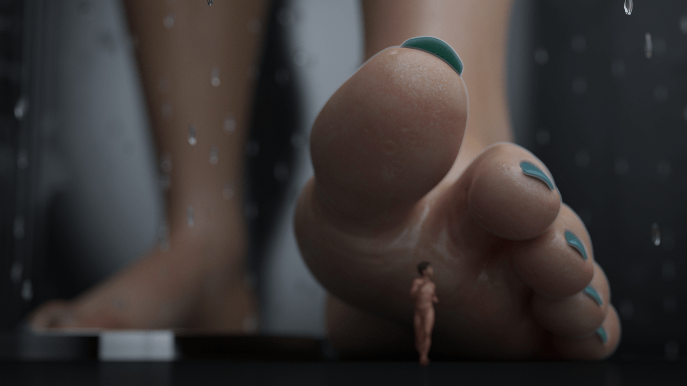

# 想做3D图，有什么教程吗

作者：深巷少女与猫

TID：28299

<title>1</title> <link href="../Styles/Style.css" type="text/css" rel="stylesheet">

# 1

近期换电脑了，想尝试一下做图

上传了一张我很喜欢的图片做参考，因为我也不知道这种图具体叫什么，怕说的太笼统大佬想帮我都不知道我在问什么

按作者Ushi3的说法这些作品他是用DAZ Studio和the Iray render engine一起渲染的，还用了一些别的软件来后期处理

但作为一个电脑白痴，其实我并没有弄懂他在说什么，对做图的认知也只停在需要用到这些软件的层次

**目前的困惑主要集中在两点：**
（1）我只想把自己写过的小故事做成简单直观的图像形式，最简单的方法我应该怎么做。

（2）如果我想做的更好，需要如何系统的学习哪些软件，从易到难的过程是怎么样的。

如果我的想法就像一个学画画的人上来就想画《浪客行》一样幼稚，也请务必告诉我新手入门到底应该怎么做
<title>2</title> <link href="../Styles/Style.css" type="text/css" rel="stylesheet">

# 2

 <ignore_js_op>[足特写004.jpg](forum.php?mod=attachment&aid=ODE5OTd8ZDU1MDFjNWN8MTY3NDA2NjUzOHwxODIzMHwyODI5OQ%3D%3D&nothumb=yes) *(967.28 KB, 下載次數: 0)*

[下載附件](forum.php?mod=attachment&aid=ODE5OTd8ZDU1MDFjNWN8MTY3NDA2NjUzOHwxODIzMHwyODI5OQ%3D%3D&nothumb=yes)

2020-3-17 19:13 上傳  

只是参考，并非我追求的目标

</ignore_js_op> <title>3</title> <link href="../Styles/Style.css" type="text/css" rel="stylesheet">

# 3

我之前做的簡易3D教學
[https://giantessnight.com/gnforu ... hread&tid=28110](https://giantessnight.com/gnforum2012/forum.php?mod=viewthread&tid=28110)
(雖然我沒開，但Blender是有內建中文的)

針對你的問題......
請原諒我懶得翻你的文研究你的場景，
我先講關於難易度演進的問題

首先，最簡單的，跟著我的教學就能做完的，就是從網路抓別人的檔案來拼湊
別人做的室內場景、別人捏好也綁好骨架的模型，丟到軟體裡，加個燈光、加個攝影機，然後等一晚讓圖算完，這應該一個下午就學得會
這個部分主要麻煩的是得找到合適的資源，有門路以後就相當輕鬆

再來進階一點，就是做編輯了
像是要在腳上塗泥巴、把物件變形、把材質換掉，這就得對軟體的運作邏輯有更進一步的理解，
材質是怎麼套用的、不同的專有名詞指的是什麼、要怎麼調整達到你理想的效果

最後就是，從頭開始自己打造自己的資源
如果清楚自己想要的是什麼效果、又不堅持走全寫實路線，從頭打造其實會比想像中簡單
有很多精緻度低但是樂趣度高的影像製作方法，在這邊先不贅述

最後還是強調，如果是要「幫自己寫得東西配圖」，那難易度完全取決於你的故事，還有你要怎麼表現
例如，如果你有一幕是「女主角在走路、地上有個小人」，那只要會擺放、改姿勢、改尺寸就能完成了
但是如果你有一幕是「女主角洗完澡出來把身體擦乾」，那就是噩夢了，
你得在她的皮膚上貼上水滴、把毛巾形狀扭曲到跟手與身體貼合、又得保有布料質感......光想到頭就很痛
但如果你的照片只是「坐在水槽上的男主角看到飄出來的煙霧和滴落的水珠，張大了嘴巴」，瞬間又變得簡單許多了
這取決於故事性質和表現手法，沒有一定的對錯或難易度差別，針對個案探討會比較好

我覺得我能給出最實際的建議還是......
**先做再說**
你一定會遇到各種障礙，同時也會學到各種做法
比起在這邊預先煩惱自己會遇到什麼障礙，還不如馬上增進可以用來創作的手段
下載Blender就只是到Steam安裝、模型和場景也只是瀏覽smutba.se這麼簡單而已
做就對了，有問題再問，我會回的 <title>4</title> <link href="../Styles/Style.css" type="text/css" rel="stylesheet">

# 4

針對daz studio, 我來說一下好了:

1\. 先澄清一下 DAZ Studio 裡面有2種主要內置渲染方式 A. 3Delight 和 B. Iray,
3Delight 我會說是比較簡陋和現在比較非主流，以你提供的圖也可總結成使用DAZ Studio 裡的 Iray 渲染系統(裡面可以選)
基於DAZ Studio本來就是以人物為主的建模軟件, 和blender 相比額外需要的東西會比較少

2.有關使用DAZ Studio, 如果用過建模軟件 像mmd，會比較容易上手。
不過你說沒接觸過，就可以看它本來附帶的英文說明書 或 b站搜DAZ Studio 也看過不少大大有介紹的影片(花一整天看一些感覺會幫助不少)
但要用得好不外乎理論夠和多練習。

3\. 比較注意的是感覺整件事對於翻牆的需求不少 (因為看到你用簡體字)
首先他官方的DAZ Studio 主程式要透過官方的下載器下載 , 如果不能下載就要去跑一些建模論壇看看吧 (我沒這問題所以沒建議可給)
其次DAZ Studio 裡面所有資源都要額外花錢買的, 當然取巧點可以從外國資源網下載，以下為一些網, 而因為資源一般都很大(幾百mb至1gb 一個檔案也不少):
https://3d-load.net/
https://ps-ds.info/

其實我感覺第3點是最重要，畢竟資源庫夠大才能做出想要的圖, 相對電腦設備也需要足夠。

必要時可加我qq 2959879243 討論~
<title>5</title> <link href="../Styles/Style.css" type="text/css" rel="stylesheet">

# 5

> [3213213210 發表於 2020-3-17 20:30](https://giantessnight.cf/gnforum2012/forum.php?mod=redirect&goto=findpost&pid=430280&ptid=28299)
> 我之前做的簡易3D教學
> https://giantessnight.com/gnforum2012/forum.php?mod=viewthread&tid=28110
> (雖然 ...

说实话我没想到我碰到的第一个问题是恐怖谷效应

我下了一个长发公主的模型，我不知道原作者是怎么设置的，反正乐佩的眼睛会随着我的视角移动保持盯着我的状态，然后在极限的角度我能完全感觉到那就是两颗嵌在眼窝里的球，说实话胆子比较小的我被吓到了，上一个让我产生不适的还是《玩具总动员1》中的胡迪

说这些只是为了说明您的回复没有白费，我试着开始熟悉Blender了，感谢您的回复
<title>6</title> <link href="../Styles/Style.css" type="text/css" rel="stylesheet">

# 6

> [kevinsky05 發表於 2020-3-17 20:46](https://giantessnight.cf/gnforum2012/forum.php?mod=redirect&goto=findpost&pid=430285&ptid=28299)
> 針對daz studio, 我來說一下好了:
> 
> 1\. 先澄清一下 DAZ Studio 裡面有2種主要內置渲染方式 A. 3Delight 和 B ...

感谢K神的回复
我真的是看着您的作品长大的.jpg

我现在在尝试Blender，相信我进步的够快的话，将来一定会碰上需要请教您的问题的
<title>7</title> <link href="../Styles/Style.css" type="text/css" rel="stylesheet">

# 7

Blender 虽然我在电脑方面有一些基础 但从没碰过渲染这一方面 最近看了论坛里其他人的作品 自己也尝试用Blender做一些 虽然质量还是和大神有差距 但总体效果还可以 如果花时间研究 还是能做出不错的效果。
下载了一些质量不错的模型 有一些质量低的模型就可能引起恐怖谷效应。。 <title>8</title> <link href="../Styles/Style.css" type="text/css" rel="stylesheet">

# 8

> [深巷少女与猫 發表於 2020-3-17 22:36](https://giantessnight.cf/gnforum2012/forum.php?mod=redirect&goto=findpost&pid=430291&ptid=28299)
> 说实话我没想到我碰到的第一个问题是恐怖谷效应
> 
> 我下了一个长发公主的模型，我不知道原作者是怎么设置的 ...

那個作者的模型品質有點低......

但有努力就是好事，加油