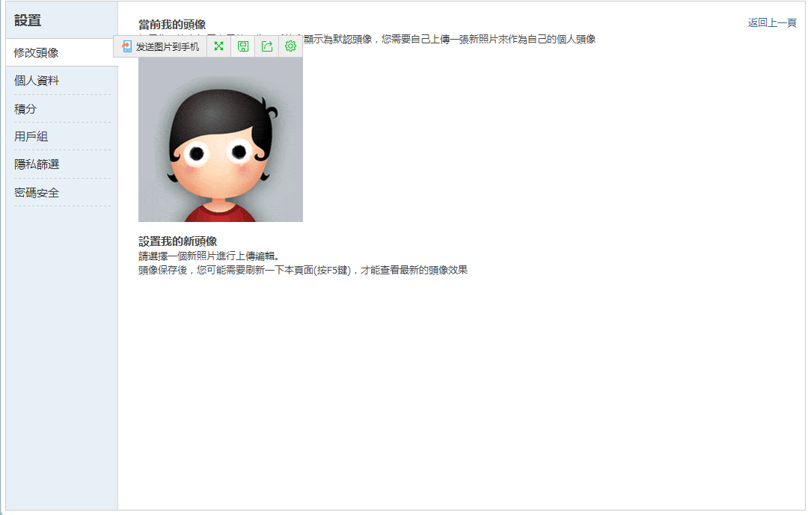

# 想改头像而不能，尴尬！是不是修改头像那有啥问题。

作者：源青之绅

TID：23424

<title>1</title> <link href="../Styles/Style.css" type="text/css" rel="stylesheet">

# 1

如图，我该点哪里.....
求各位大佬指教
<title>2</title> <link href="../Styles/Style.css" type="text/css" rel="stylesheet">

# 2

 <ignore_js_op>[微信截图_20170708163949.png](forum.php?mod=attachment&aid=Njg2ODd8MzQyY2RkN2R8MTY3NDA2NzUxMXwxODIzMHwyMzQyNA%3D%3D&nothumb=yes) *(113.3 KB, 下載次數: 1)*

[下載附件](forum.php?mod=attachment&aid=Njg2ODd8MzQyY2RkN2R8MTY3NDA2NzUxMXwxODIzMHwyMzQyNA%3D%3D&nothumb=yes)

2017-7-8 16:40 上傳  

</ignore_js_op> <title>3</title> <link href="../Styles/Style.css" type="text/css" rel="stylesheet">

# 3

最近必不能换....随时关注一下吧~~ <title>4</title> <link href="../Styles/Style.css" type="text/css" rel="stylesheet">

# 4

这个问题已经很久了... 在这里没有头像是不能装大佬的 <title>5</title> <link href="../Styles/Style.css" type="text/css" rel="stylesheet">

# 5

有好多人都问过这个问题，目前是没法改的…… <title>6</title> <link href="../Styles/Style.css" type="text/css" rel="stylesheet">

# 6

很长时间不能换了，听说贴吧昵称可以换了 <title>7</title> <link href="../Styles/Style.css" type="text/css" rel="stylesheet">

# 7

其实我感觉总是不能换。。 <title>8</title> <link href="../Styles/Style.css" type="text/css" rel="stylesheet">

# 8

> [wwwnwy 發表於 2017-7-8 10:10](https://giantessnight.cf/gnforum2012/forum.php?mod=redirect&goto=findpost&pid=338665&ptid=23424)
> 这个问题已经很久了... 在这里没有头像是不能装大佬的

你可以装dalao的小号啊（
<title>9</title> <link href="../Styles/Style.css" type="text/css" rel="stylesheet">

# 9

N久不能换了，我这台电脑（好像换电脑也没用）在别的用Discuz!的论坛也出现了无法换头像的问题 <title>10</title> <link href="../Styles/Style.css" type="text/css" rel="stylesheet">

# 10

很久之前就不能换头像了,好多人都问过这个问题 <title>11</title> <link href="../Styles/Style.css" type="text/css" rel="stylesheet">

# 11

*本帖最後由 jiachufan1 於 2017-7-9 09:21 編輯*

大不大佬还是要看注册时间和等级
奖励点现在好像没什么用了

<title>12</title> <link href="../Styles/Style.css" type="text/css" rel="stylesheet">

# 12

我来这破站的时候过了一年多才开了换头像，之后又关了，估计要等半年 <title>13</title> <link href="../Styles/Style.css" type="text/css" rel="stylesheet">

# 13

一早就不能換了有bug    <title>14</title> <link href="../Styles/Style.css" type="text/css" rel="stylesheet">

# 14

我也在一直等待着论坛更新到能够更改头像的那一天 <title>15</title> <link href="../Styles/Style.css" type="text/css" rel="stylesheet">

# 15

等待并且心怀希望吧 <title>16</title> <link href="../Styles/Style.css" type="text/css" rel="stylesheet">

# 16

現在不能換的原因之一是之前某些頭像狂魔沒事就換頭像導致論壇的存儲資源被過量消耗。
另外，據說也跟某些頭像圖片里有包含惡意代碼的傳聞有關~

PS：貌似UID也是標準之一了？ <title>17</title> <link href="../Styles/Style.css" type="text/css" rel="stylesheet">

# 17

那还真是令人烦躁啊... <title>18</title> <link href="../Styles/Style.css" type="text/css" rel="stylesheet">

# 18

我发一句话就是一个标准的15字