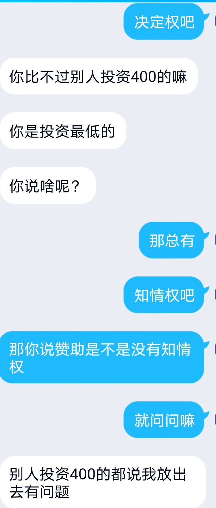

# 想问一下，是不是赞助者一点知情权都没有呢

作者：德玛西亚皇子

TID：31643

<title>1</title> <link href="../Styles/Style.css" type="text/css" rel="stylesheet">

# 1

*本帖最後由 vvawd234567 於 2021-9-9 08:50 編輯*

ps:这事情本来没准备发论坛上，但是神月祭坛友强烈表示建议我发出来，我也不好推辞，如果版务觉得这个帖子不合适，影响大家在论坛上的浏览体验，我态度上接受任何处理。
<ignore_js_op>

**qq_pic_merged_1631116951364.jpg** *(51.55 KB, 下載次數: 0)*

[下載附件](forum.php?mod=attachment&aid=OTA4OTd8YTZiYWRkY2F8MTY3NDA2NTg3MXwxODIzMHwzMTY0Mw%3D%3D&nothumb=yes)

2021-9-9 08:49 上傳

今天在游戏区看到了dre游戏GrimmGlitter的汉化，本来挺高兴的，因为我对这个游戏已经心心念念已久了，但是我点进[https://giantessnight.com/gnforu ... 1642&extra=page%3D1](https://giantessnight.com/gnforum2012/forum.php?mod=viewthread&tid=31642&extra=page%3D1)后，却发现有些不一样的地方，比如说，这个汉化的合作者神月祭。
去年十月，他在论坛发帖（不知道为什么现在那个帖子隐藏了），正在做这个游戏的汉化，当时我加了他qq，询问他汉化的具体情况 <title>2</title> <link href="../Styles/Style.css" type="text/css" rel="stylesheet">

# 2

然后当时的情况是这样的，我向他询问这个的进度，他问我是否要汉化，我说我主要想买，也就是购买的意思。在他向我递交付款码的时候，我表示我手头比较紧，因为那时候我大学还没有毕业，还是用家里钱的学生，所以想要以后再付款，而他则向我建议，以后购买的价格和现在赞助的价格可能不一样 <ignore_js_op>

**Screenshot_20210908_232315.jpg** *(1.01 MB, 下載次數: 0)*

[下載附件](forum.php?mod=attachment&aid=OTA4NjZ8NjNiY2QzYmR8MTY3NDA2NTg3MXwxODIzMHwzMTY0Mw%3D%3D&nothumb=yes)

2021-9-8 23:27 上傳

<title>3</title> <link href="../Styles/Style.css" type="text/css" rel="stylesheet">

# 3

那我觉得按照这个图，80%的正常人类都会理解为，以后购买的价格要比现在赞助的价格高那么一点点，至少没人会认为，以后的购买价格为0，作为同样正常的80%人类，我自然也这么觉得，因此点了付款按钮 <title>4</title> <link href="../Styles/Style.css" type="text/css" rel="stylesheet">

# 4

之后呢，我便开始了无穷尽的等待之旅，因为神月祭坛友，无限给我说下个月，但我依然很有耐心，因为我知道，这个游戏的工程量非常非常的大，如果汉化完成，是需要时间。虽然，在初次见面事，他给我的信息是下个月即将完成，但是毫无疑问，每个人都有自己的生活，都有自己要在生活中忙碌的事情，而汉化这样巨大的一个工程，自然劳心劳力，我也没对此说什么。 <ignore_js_op>

**qq_pic_merged_1631115418254.jpg** *(63.75 KB, 下載次數: 0)*

[下載附件](forum.php?mod=attachment&aid=OTA4Njl8Yjc4MGVhZDl8MTY3NDA2NTg3MXwxODIzMHwzMTY0Mw%3D%3D&nothumb=yes)

2021-9-8 23:39 上傳

<ignore_js_op>

**qq_pic_merged_1631115446977.jpg** *(52.4 KB, 下載次數: 0)*

[下載附件](forum.php?mod=attachment&aid=OTA4Njh8ZTIzOGJkYzJ8MTY3NDA2NTg3MXwxODIzMHwzMTY0Mw%3D%3D&nothumb=yes)

2021-9-8 23:39 上傳

<ignore_js_op>

**qq_pic_merged_1631115461866.jpg** *(48.44 KB, 下載次數: 0)*

[下載附件](forum.php?mod=attachment&aid=OTA4Njd8OWJmMGY5ZjR8MTY3NDA2NTg3MXwxODIzMHwzMTY0Mw%3D%3D&nothumb=yes)

2021-9-8 23:39 上傳

三个月，再一个月，再到今天，2021年九月，无穷无尽，我几乎都要忘记这件事情了。
<title>5</title> <link href="../Styles/Style.css" type="text/css" rel="stylesheet">

# 5

当然，正如上文所说，终于到了今天，我看到了这份汉化的成品，当然，他事前完全没有通知我，只有在8月26号的时候提了一嘴马上汉化好了，没有告诉过我任何什么时候完成程序上的问题，没有告诉我这个汉化现在不需要购买，已经决定可以在论坛上直接放出，也没有给我发送任何这份汉化的文件，决定权我都无所谓了，毕竟40块钱也不算多，但我觉得赞助至少应该稍微提前，哪怕一点点，就算一天，一分钟，都可以，得到这份汉化的文件吧。各位应该都参与过同人志，或者网上fantia或者patreon或者d站的赞助，再或者圈外的众筹，就算没有参加过任何，我觉得大家都能理解，没有告知赞助是彻底的公益性质，没有提过哪怕一嘴，哪怕一句话。甚至，就像我之前的聊天记录所展示的那样，他还在暗示（我觉得是明示），他对游戏的汉化是有偿的，我获得这些游戏的汉化是需要购买的。那我觉得，无论如何，付费赞助的和没有参与金钱往来的人，应该会有哪怕一点点的不同吧。
对我来说，就算这个不同只是比别人提前一点点知道汉化完成的消息，即使我完全不改变他对是否免费放出的决定，只是知道这件事情，我觉得都足够我这40块钱了，于是我向神月祭坛友提出了疑问，并且得到了如下的回答。
<title>6</title> <link href="../Styles/Style.css" type="text/css" rel="stylesheet">

# 6

所以你是认为自己花了钱的东西，被免费放出来，觉得亏了吗。 <title>7</title> <link href="../Styles/Style.css" type="text/css" rel="stylesheet">

# 7

*本帖最後由 vvawd234567 於 2021-9-9 00:48 編輯*

我觉得，对于这种聊天的感觉，有火气也没有问题吧，神月祭先生的回复态度，我也就正常的回应了一下吧
<ignore_js_op>

**Screenshot_20210908_235109.jpg** *(1.86 MB, 下載次數: 0)*

[下載附件](forum.php?mod=attachment&aid=OTA4NzB8NTNiY2ZjMzR8MTY3NDA2NTg3MXwxODIzMHwzMTY0Mw%3D%3D&nothumb=yes)

2021-9-8 23:52 上傳

<ignore_js_op>

**Screenshot_20210908_230758.jpg** *(1.44 MB, 下載次數: 0)*

[下載附件](forum.php?mod=attachment&aid=OTA4NzF8ZmQyYTNmMjV8MTY3NDA2NTg3MXwxODIzMHwzMTY0Mw%3D%3D&nothumb=yes)

2021-9-8 23:53 上傳

<title>8</title> <link href="../Styles/Style.css" type="text/css" rel="stylesheet">

# 8

太长不看，所以他有约定你可以先看到作品之类的吗 <title>9</title> <link href="../Styles/Style.css" type="text/css" rel="stylesheet">

# 9

以上是神月祭坛友对我的回应，他具体以什么样的态度，相信各位只要点开图，大概就能理解我发帖的原因，以下简单说一下我对神月祭坛友观点的的看法的一些回应 <ignore_js_op>

**qq_pic_merged_1631116982828.jpg** *(13.28 KB, 下載次數: 0)*

[下載附件](forum.php?mod=attachment&aid=OTA4ODF8NTQ2MWIwYTF8MTY3NDA2NTg3MXwxODIzMHwzMTY0Mw%3D%3D&nothumb=yes)

2021-9-9 00:10 上傳

<ignore_js_op>

**qq_pic_merged_1631116909746.jpg** *(99.67 KB, 下載次數: 0)*

[下載附件](forum.php?mod=attachment&aid=OTA4ODJ8MWEwZTQ0Mjl8MTY3NDA2NTg3MXwxODIzMHwzMTY0Mw%3D%3D&nothumb=yes)

2021-9-9 00:10 上傳

行吧哥，你说的对，我思考了一下，四十块钱确实屌都不是，现在下楼点个外卖都四十了，去麦当劳都不够塞牙缝，那您既然看不上我这四十，觉得钱太少很不给力，能不能退给我嘛，反正您也不在意是么。

<ignore_js_op>

**qq_pic_merged_1631117073340.jpg** *(15.85 KB, 下載次數: 0)*

[下載附件](forum.php?mod=attachment&aid=OTA4ODN8MTI2ZTk1ZDZ8MTY3NDA2NTg3MXwxODIzMHwzMTY0Mw%3D%3D&nothumb=yes)

2021-9-9 00:10 上傳

我的我的，都是我的问题，我不该上论坛看到我被当傻子整蛊了，我错了，我真错了，下次不去了

<ignore_js_op>

**qq_pic_merged_1631117009618.jpg** *(87.96 KB, 下載次數: 0)*

[下載附件](forum.php?mod=attachment&aid=OTA4ODR8YTQyYmRjNWZ8MTY3NDA2NTg3MXwxODIzMHwzMTY0Mw%3D%3D&nothumb=yes)

2021-9-9 00:10 上傳

我操，那咋办嘛，我玩个游戏，想要个汉化，甚至都不是买游戏，得掏400大洋，而且你也没给我说过400块钱怎么赞助啊，如果您老愿意给我一次机会，我一定从头再来，力争赞助个几万，好吗

<ignore_js_op>

**qq_pic_merged_1631116996195.jpg** *(80.27 KB, 下載次數: 0)*

[下載附件](forum.php?mod=attachment&aid=OTA4ODV8MjUzYmU4MTd8MTY3NDA2NTg3MXwxODIzMHwzMTY0Mw%3D%3D&nothumb=yes)

2021-9-9 00:10 上傳

我是真不懂事，我小屁孩，我未成年，我10后，真没见过世面，为了40块钱的事儿，为了您一句话都没通知这点小事情给弄得部高兴，我太不成熟了哥，您教育的是，我以后一定保持善心，stay good ，love&peace，无论您作甚么我都不敢有一点怨言。

<ignore_js_op>

**qq_pic_merged_1631116951364.jpg** *(58.12 KB, 下載次數: 0)*

[下載附件](forum.php?mod=attachment&aid=OTA4ODh8MTZkZmY1ZDh8MTY3NDA2NTg3MXwxODIzMHwzMTY0Mw%3D%3D&nothumb=yes)

2021-9-9 00:10 上傳

那这不是问问了吗，我一直很有好奇心的，期待来个坛友给我讲解一下，我对我这花钱打水漂的执着，是有多不合理。

<ignore_js_op>

**qq_pic_merged_1631116933731.jpg** *(10.97 KB, 下載次數: 0)*

[下載附件](forum.php?mod=attachment&aid=OTA4ODd8ZDhmYWUzYjd8MTY3NDA2NTg3MXwxODIzMHwzMTY0Mw%3D%3D&nothumb=yes)

2021-9-9 00:10 上傳

真不用，兄弟，40块钱别说入股，抽包烟都不够，您豪横，牛逼！

<ignore_js_op>

**qq_pic_merged_1631116889095.jpg** *(105.91 KB, 下載次數: 0)*

[下載附件](forum.php?mod=attachment&aid=OTA4ODZ8N2U0MThlN2J8MTY3NDA2NTg3MXwxODIzMHwzMTY0Mw%3D%3D&nothumb=yes)

2021-9-9 00:10 上傳

？因为交钱的多，所以您想干嘛就干嘛？我操，乐视网咋就没您这觉悟？贾跃亭应该拜您为师

<ignore_js_op>

**qq_pic_merged_1631116966779.jpg** *(12.41 KB, 下載次數: 0)*

[下載附件](forum.php?mod=attachment&aid=OTA4ODl8MjliZDI4NDF8MTY3NDA2NTg3MXwxODIzMHwzMTY0Mw%3D%3D&nothumb=yes)

2021-9-9 00:10 上傳

我确实小心眼，小到过了一年才理解到我是个傻×

<title>10</title> <link href="../Styles/Style.css" type="text/css" rel="stylesheet">

# 10

> [紫色欧石楠 發表於 2021-9-9 00:13](https://giantessnight.cf/gnforum2012/forum.php?mod=redirect&goto=findpost&pid=479055&ptid=31643)
> 太长不看，所以他有约定你可以先看到作品之类的吗

去年十月的他说下个月汉化就能出来，到时候如果，等成品出来要买的价格和现在赞助的不一样，那我觉得这个话理解起来应该是，这个作品他汉化完是要收费的，而现在赞助，虽然见不到成品，但是可以少付一点钱
<title>11</title> <link href="../Styles/Style.css" type="text/css" rel="stylesheet">

# 11

> [紫色欧石楠 發表於 2021-9-9 00:13](https://giantessnight.cf/gnforum2012/forum.php?mod=redirect&goto=findpost&pid=479055&ptid=31643)
> 太长不看，所以他有约定你可以先看到作品之类的吗

当然，我并不是法学生，法律知识少的有限，也并不觉得这有任何的法律效益，我发到gn聊天区，也不能有任何人帮我讨回这40，或者对他做出任何事情，但我觉得这件事情的经过，作为谈天区是一件很逗乐的事情，他要表达什么意思以及他做了什么应该很明显了吧，并且在这一年期间，我也陆陆续续向他购买过汉化的游戏，我觉得任何人都会觉得这个汉化就像是众筹和提前预购一样，至少和免费有所区别吧
<title>12</title> <link href="../Styles/Style.css" type="text/css" rel="stylesheet">

# 12

> [159623abc 發表於 2021-9-8 23:52](https://giantessnight.cf/gnforum2012/forum.php?mod=redirect&goto=findpost&pid=479051&ptid=31643)
> 所以你是认为自己花了钱的东西，被免费放出来，觉得亏了吗。

首先我当然觉得很亏，但是如果他哪怕询问我一句，或者，至少放出来之前先给我发，或者放的时候告诉我要放了，我都不会有现在这种愤怒的感觉。试想一下，某人没有成品，告诉你很快有成品，询问你是否预购，你掏了钱，等待了一年，收钱的人没有给你任何东西，然后突然某一天，他和别人一起发到免费分享论坛上了，我觉得这不仅是40块钱按的问题，这稍微一点点的诚信和尊重都没有吧，我也给他说了，只要稍微抱歉一下也没啥，或者我问他的时候，他这么说：“哎呦，抱歉抱歉，忘了通知你了，太久没联系我忘了/工作太忙/汉化内容太多，没给你说。”我觉得我都对这件事情无所谓了，毕竟我只是希望花40块钱能够玩到这个游戏的中文版，别人能玩到倒也无所谓，但是我对这个稍有疑问，就得被人一顿乱撅，花钱请了个爹，我觉得正常人都接受不了吧

<title>13</title> <link href="../Styles/Style.css" type="text/css" rel="stylesheet">

# 13

仅从这个帖子表现出来的，我个人认为是关于“赞助”这一行为的具体表现。
V仔这边所认为的“赞助”，类似花钱购买服务，不论花费多少，至少应该与未购买者有所区别，即至少享受到一点“服务”，就如同V仔提到的“知情权”，最通俗的翻译可以是“我花钱了，所以我应该知道的多一点”。
另一边神月祭坛友则认为“赞助”更类似于是筹措开发费，举个例子：一款大型游戏的开发可以向社会募集捐款作为开发的经费，这部分捐了钱了玩家可能会在游戏发布后享有一定特权，但更多时候不会。在这里提供资金的玩家们的意图并不如投资，而是期望能作为玩家更早的享受到游戏，就像是被空头支票吸引来的一群人，他们产生了兴趣，他们会自发的关注游戏的动态，而不会认为开发商应该实时向他们提供进展等资讯。
V仔与神月祭坛友关于这点的分歧从一开始就有些苗头，从第一张聊天记录可以看出，V仔很明确的提出了是购买（服务）；而神月祭坛友虽然也提出了“购买价格和赞助价格不一样”，但其他的言论都是在强调现在是“赞助阶段”（与购买阶段区别），“您看心情给吧”也比较明显的体现出神月祭坛友认为这是筹款。

分析了一通大概就是这个样子，并不打算判个谁对谁错，我愿意相信大家都是基于自己的理解在做事情，而没有“坑”圈友的意思。
我的建议是，V仔换个思路，“我出了些钱，参与到了汉化中，这份汉化有我的一份力”；神月祭坛友也照顾下V仔的感受，可能“道歉”一词有些扎耳，不过我想V仔就是想见到神月祭这边有些软和一点的态度，毕竟是提供了帮助的，不论大小，一句感谢的话语还是能说得出口的吧。
<title>14</title> <link href="../Styles/Style.css" type="text/css" rel="stylesheet">

# 14

*本帖最後由 gfktxds 於 2021-9-9 00:49 編輯*

在你的这一大串吐槽里面，似乎是包含了一肚子火气。（这段是打字打了一半，一不小心按了回车） <title>15</title> <link href="../Styles/Style.css" type="text/css" rel="stylesheet">

# 15

> [hb245705061 發表於 2021-9-9 00:37](https://giantessnight.cf/gnforum2012/forum.php?mod=redirect&goto=findpost&pid=479062&ptid=31643)
> 仅从这个帖子表现出来的，我个人认为是关于“赞助”这一行为的具体表现。
> V仔这边所认为的“赞助”，类似花 ...

主要是他去年10月的意思明显就是购买的意思，这个记录里他也明确表达了，本来要掏钱，后来合作方说不用了
<title>16</title> <link href="../Styles/Style.css" type="text/css" rel="stylesheet">

# 16

*本帖最後由 gfktxds 於 2021-9-9 18:29 編輯*

这里我还是就事论事吧，一点坏话就不讲了，可以试一试分别代入两边，根据两边的人所处的环境和经历，就当于角色扮演，去模拟一下，从情绪的角度出发，毕竟这连争论的观点都是错开的，根本就没有结果的，各自说自己是对的，妥妥的辩论赛。

<title>17</title> <link href="../Styles/Style.css" type="text/css" rel="stylesheet">

# 17

如果觉得我俩之间最早的交流有什么误区，那么以下截图可以表明，神月祭一直在向我售卖他过去游戏的汉化，他从来没有哪怕提一句，这个游戏未来会免费放出，一直以来都在像我售卖游戏，并且赞助意味着游戏的提前购买

<ignore_js_op>

**qq_pic_merged_1631119955685.jpg** *(68.82 KB, 下載次數: 0)*

[下載附件](forum.php?mod=attachment&aid=OTA4OTF8MDgzYWFhOGF8MTY3NDA2NTkyN3wxODIzMHwzMTY0Mw%3D%3D&nothumb=yes)

2021-9-9 00:55 上傳

<ignore_js_op>

**qq_pic_merged_1631119982755.jpg** *(63.54 KB, 下載次數: 0)*

[下載附件](forum.php?mod=attachment&aid=OTA4OTB8YzkyM2M0MTJ8MTY3NDA2NTkyN3wxODIzMHwzMTY0Mw%3D%3D&nothumb=yes)

2021-9-9 00:55 上傳

<title>18</title> <link href="../Styles/Style.css" type="text/css" rel="stylesheet">

# 18

*本帖最後由 vvawd234567 於 2021-9-9 01:07 編輯*

> [gfktxds 發表於 2021-9-9 00:47](https://giantessnight.cf/gnforum2012/forum.php?mod=redirect&goto=findpost&pid=479065&ptid=31643)
> 说实话，对于神月祭，其他我不确定，但是他嘴上说的时间从来都不能相信，他是个优秀的客服，擅长打太极。曾 ...

优秀个毛,优秀客服说两句话就把我今天糊弄过去，也就他能给我整的想发帖喷了，本来我都忘了我还交过40这事儿(他甚至给我气的又花了三十五开个qq会员找记录)
<title>19</title> <link href="../Styles/Style.css" type="text/css" rel="stylesheet">

# 19

唉，最开始我也认为这老哥是个圈内良心个人汉化，结果后面想要以给他充点电做善事的心态拿个maru的合集，我懒得整理，全是网上扒的，甚至没我齐，只能说不太好评价吧，有点黄牛味儿了，虽然不否定人家彳亍，害，虽然但是吧就这样。 <title>20</title> <link href="../Styles/Style.css" type="text/css" rel="stylesheet">

# 20

*本帖最後由 gfktxds 於 2021-9-9 01:46 編輯*

> [vvawd234567 發表於 2021-9-9 01:03](https://giantessnight.cf/gnforum2012/forum.php?mod=redirect&goto=findpost&pid=479071&ptid=31643)
> 优秀个毛,优秀客服说两句话就把我今天糊弄过去，也就他能给我整的想发帖喷了，本来我都忘了我还交过40这 ...

但他跟我说话就半天一句，拖拖拉拉，一个事拖很久，妥妥的打太极，你这聊天记录是我见过话最多的，妈的，我找他有事，都敷衍的一批，一个字说完，我在回就不发消息了，下一个消息就是第二天，对照一下就两个极端，虽然我怀疑你说的话也把他惹毛了，才会话突然这么多，不过我之前也找神月祭要过这个汉化想试试封包的，没想到这游戏有这么多隐藏的背后事件
<title>21</title> <link href="../Styles/Style.css" type="text/css" rel="stylesheet">

# 21

作为这次的一个中心人物，我说一说这一整个事情在我这边的情况吧。

首先是大背景，这游戏去年6 7月出，我当时其实都不知道出了，但跟我开坑贴里写的一样，是在论坛上看到剧情翻译才知道的。
当时看完了翻译，思考了几下，过了几天还是买了。
说实话，我直到今天也不是经常会买这类商品的人，基本上每一次都是要下定决心的。
扯远了，在半猜半不懂通关之后，当时那个帖子里面也有人说是计划要做汉化。我当时也是联系了一个人询问需不需要技术协助，但对方表示不需要，所以我也就作罢了。

然后就是快进到8月，GrimmGlitter周年特价都过完了，整个论坛还是只有当初那一个剧情片段翻译的帖子。所以我就决定，自己来开这个坑。
饼不能空画，于是我就翻译了1到4剧情，然后简略的改了一个版本出来，也就有了开坑贴那张图片。
同时，我也在贴里加粗表示，如果有人有完工的，希望能直接找我。考虑到可能有人坑一半，我就选择了先去翻译第八章和之国mitama的剧情。
在那个google doc里面你可以看到，1-4和80x部分都是标绿的，这部分是我自己翻译的。

然后这个时候，神月祭出现回复表示已经有完工的文本可以提供，那我自然就选择问他具体的情况。过了几天之后，他就交给我了一份word。
不过，遗憾的是，他并没有提过有人进行过有偿赞助寻求翻译的事情。

整理word大概花了两天，然后我就发现缺了更新内容。这个方面也可以印证他告诉我的，很早就翻译完了，但一直找不到人打包放到游戏本身里面去。
于是我就发了截图更新，表示自己会把剩下更新内容翻译完，然后再发布。

两周的时间过去，直到我晚上做完成品，发了帖子之后，他才和我说起了你这个事情。

---
以上是背景叙述，然后是我的一点看法。
首先，我是反对售卖汉化的。
然后，我最初看到神月祭发给我说有过有偿汉化这事，我其实也确实觉得有点，不太合适，如果他是给我了一份别人有偿委托的内容的话。
我在刚看到的时候的想法是，如果确实有很大争议的话，我将直接删掉这个版本的汉化，然后完全由我独立重新做一份。当然，会花多久时间就完全不知道了。
至于我的那一段回复，我的意思可能有点冲，但按照实际商业汉化水准来讲，千字三四十的定价大概也不算多的。
如果换作是我，这么一番事情，可能也是会有些郁闷吧。不过是我的话，确实完全不会去找有偿汉化。

事到如今，在这种两头的断句转发之下，我也不说指望你会对我有什么样的改观或是怎样，但，能聚集在这里，都是同好，都是在各自为中文gts爱好圈添砖。
以上，说的比较乱，就是一点牢骚而已。

另，在这个汉化之中，我收入是0，付出的是三周时间。若是属实介意，那40我也不介意以我的角度补偿。

以下是今晚神月祭突然和我说起有偿汉化这段的完整记录 <ignore_js_op>

**203E3051-F7BB-42B8-9DD3-C89F82344617.png** *(898.23 KB, 下載次數: 0)*

[下載附件](forum.php?mod=attachment&aid=OTA4OTR8NDRkMzlhYTh8MTY3NDA2NTkzMHwxODIzMHwzMTY0Mw%3D%3D&nothumb=yes)

2021-9-9 01:16 上傳

<ignore_js_op>

**101999A7-8F94-406F-BCC1-F18C1DE10142.png** *(1.12 MB, 下載次數: 0)*

[下載附件](forum.php?mod=attachment&aid=OTA4OTV8Y2I0MTg4Nzh8MTY3NDA2NTkzMHwxODIzMHwzMTY0Mw%3D%3D&nothumb=yes)

2021-9-9 01:16 上傳

<ignore_js_op>

**3318CF3A-3A76-4188-AC06-3E1A2CA464CB.png** *(1.21 MB, 下載次數: 0)*

[下載附件](forum.php?mod=attachment&aid=OTA4OTZ8MjU2OGExZGR8MTY3NDA2NTkzMHwxODIzMHwzMTY0Mw%3D%3D&nothumb=yes)

2021-9-9 01:16 上傳

<title>22</title> <link href="../Styles/Style.css" type="text/css" rel="stylesheet">

# 22

我发需要和你说？
我发需要和你说？
我发需要和你说？
草哈哈哈给我整乐了，楼上的兄弟说的还是太客气了，有当客服的潜质，这话术真当客服怕是被人投诉到死哦???? 一句话给路人把血压整起来了
<title>23</title> <link href="../Styles/Style.css" type="text/css" rel="stylesheet">

# 23

刚发完大段话才去前面完整看了截图，如果按图中所说Grimm收了差不多8k⋯⋯emmmmm
还是那句话，我个人反对有偿汉化，但并不是所有人都愿意无偿做贡献这点，我也是可以理解的。

不过，如果在我拿到word的时候，我就知道这是有偿的内容，说不定我会直接选择不要。
依然，我的自辩是，直到我发布出文件的时候，我也并不知道这份翻译背后的故事。 <title>24</title> <link href="../Styles/Style.css" type="text/css" rel="stylesheet">

# 24

> [エスト 發表於 2021-9-9 01:16](https://giantessnight.cf/gnforum2012/forum.php?mod=redirect&goto=findpost&pid=479076&ptid=31643)
> 作为这次的一个中心人物，我说一说这一整个事情在我这边的情况吧。
> 
> 首先是大背景，这游戏去年6 7月出，我 ...

我也觉得千字40很低啊，但问题是，神月祭向我表达的并不是我给他赞助他去汉化，而是我向他购买一份汉化过的游戏，需要向他支付40，就像我们当初所说的“赞助和购买的价格可能不一样”，我觉得这个意思已经很明确的表达了，我是一个消费者，由于他现在没有成品，因而我提前购买这个游戏的一份汉化的价格要比他出了成品之后低。

那么我觉得，40块钱购买一份游戏的汉化版本，应该不能算多便宜吧。

我来还原一下吧，他最早想要做这个游戏的汉化文本，然后我以40块钱的价格提前预购了这个汉化，但是他说要一个月出却最后整整一年什么都没给我。
同时呢，期间他还在不停的向我售卖其他游戏的汉化，那毫无疑问，我们之间是我付钱，他给我汉化包的交易关系，不是我掏钱，让他去给我汉化一个游戏，那么40块钱买个汉化包的价格应该一点也没有问题吧。

然后呢，就像你说的，你们合作了，他找上了你，你作为一个辛勤，有爱的汉化者，愿意无偿放出自己的汉化，我觉得一点问题都没有，如果他给我说哪怕一句“我最近找了个合作者，他想要把汉化作品发到论坛上”，那我绝对他妈的举双手双脚赞成！

但是呢，我什么都不知道，他怕是直接忘了我这个人，即使我们上次聊天记录是在8月26号也就是两周前，并且我向他表示怀疑的时候，表现出来的态度到底恶劣不恶劣这帖子里的图应该够明确了，这种态度让我有想要讨个道歉的想法应该也没有问题吧。

那请问我为什么找他退钱？因为他态度很恶劣，对我一句话都没有告知，并且质疑“40很多？”那你觉得不多，你退了好不？

至于你那个聊天记录里，你觉得这个不高，我觉得也在情理之中，毕竟他的说话，好像是我一上去就找他说
‘rnm，退钱！’

就像之前说的，神月祭就是个兜兜转转的二道贩子，你自己寻思一下，为了这个汉化，你付出了3周时间，我付出了我的钱，并且还要遭到他恶劣的态度，现在我在论坛发帖，确实你在回应，并且他通过周旋，那你来挡抢。

我当然尊重你的汉化成果，我对你一点意见也没有，但无论如何，我并不是找神月祭有偿汉化，而是向他购买一个汉化包。至于那40块钱，见他妈的鬼吧，我找这一堆记录开个会员都已经把40亏回去了，我向他要40就是想看看他想干嘛，看下他那个嘴还能说出啥惊世骇俗之语。可能他觉得自己嘴巴很会说，很会周旋，可惜他碰到我这个傻逼了。
<title>25</title> <link href="../Styles/Style.css" type="text/css" rel="stylesheet">

# 25

> [エスト 發表於 2021-9-9 01:32](https://giantessnight.cf/gnforum2012/forum.php?mod=redirect&goto=findpost&pid=479080&ptid=31643)
> 刚发完大段话才去前面完整看了截图，如果按图中所说Grimm收了差不多8k⋯⋯emmmmm
> 还是那句话，我个人反对有 ...

我对你发布本身一点都不生气，你也是被他给忽悠了，所以请不要删除那个帖子，那个汉化补丁是你的劳动成果，也是你渴望对论坛做贡献的见证，更是他整蛊我的证明，我很喜欢这个游戏，也希望别人都能玩到这个游戏汉化版本，我不会要求任何人不玩这个游戏。
<title>26</title> <link href="../Styles/Style.css" type="text/css" rel="stylesheet">

# 26

*本帖最後由 Lcxzyr 於 2021-9-9 01:41 編輯*

个人意见吧，对方属实干的不是人事
首先，捐赠和赞助应该明确词义的不同。 在程序圈子中，流行的是捐赠，也就是donate，收款方完全不对捐赠方负任何责任。 但在GTS等圈子中，流行赞助。 赞助是需要有回报的，翻译者免费放汉化的行为可以说是严重的违反了契约精神。
其次，既然最早的聊天记录提到了未来的购买，那么就可以理解成未来成品肯定是会出售的（前提是存在成品，但从后面来看，对方似乎更本不具备相关打包技术
）。 那么正常来说应该认为先付的钱应该是用于低价购买未来的成品的。 这种情况下，翻译方的言行就是对于其客户的极度不负责任，可以说是对其客户挑衅和侮辱。
再次，据补丁制作者的说法，汉化者"很早"就做好了汉化的文本，那么为什么文本制作完成后不发给甚至不通知赞助
者？ 是不是对赞助者完全的不负责任？ 个人意见吧，对方属实干的不是人事
首先，捐赠和赞助应该明确词义的不同。 在程序圈子中，流行的是捐赠，也就是donate，收款方完全不对捐赠方负任何责任。 但在GTS等圈子中，流行赞助。 赞助是需要有回报的，翻译者免费放汉化的行为可以说是严重的违反了契约精神。

其次，既然最早的聊天记录提到了未来的购买，那么就可以理解成未来成品肯定是会出售的（前提是存在成品，但从后面来看，对方似乎更本不具备相关打包技术）。 那么正常来说应该认为先付的钱应该是用于低价购买未来的成品的。 这种情况下，翻译方的言行就是对于其客户的极度不负责任，可以说是对其客户挑衅和侮辱。

再次，据补丁制作者的说法，汉化者"很早"就做好了汉化的文本，那么为什么文本制作完成后不发给甚至不通知赞助者？ 是不是对赞助者完全的不负责任？

最后，既然想要购买汉化，自然是想要购买可以运行的汉化补丁。 这位译者根本不具备重新打包的技术实力，就四处收费"赞助汉化"，是不是可以说是没有金刚钻也硬要揽瓷器活？ 就算是程序特殊，技术不足，是不是也应该有所说明？ 这和诈骗有多大区别？

<title>27</title> <link href="../Styles/Style.css" type="text/css" rel="stylesheet">

# 27

> [エスト 發表於 2021-9-9 01:32](https://giantessnight.cf/gnforum2012/forum.php?mod=redirect&goto=findpost&pid=479080&ptid=31643)
> 刚发完大段话才去前面完整看了截图，如果按图中所说Grimm收了差不多8k⋯⋯emmmmm
> 还是那句话，我个人反对有 ...

我服了，你为啥要自辩？我帮你辩！你一点问题都没有，你付出了劳动，付出了时间，没有获得任何的报酬，那我也没有任何权利想你表达任何的愤怒，我的所有言论，都仅针对神月祭一人，我非常希望您能继续汉化下去，如果有任何难题，也欢迎您向我询问。这件事情我也有问题，我的问题就是我脑子太残疾了，当时玩那个游戏玩的入迷，神月祭赞助可以给我汉化，我非常急切的付款了
<title>28</title> <link href="../Styles/Style.css" type="text/css" rel="stylesheet">

# 28

> [Lcxzyr 發表於 2021-9-9 01:38](https://giantessnight.cf/gnforum2012/forum.php?mod=redirect&goto=findpost&pid=479084&ptid=31643)
> 个人意见吧，对方属实干的不是人事
> 首先，捐赠和赞助应该明确词义的不同。 在程序圈子中，流行的是捐赠，也 ...

文本倒是发了，虽然他说10月初，是在第二年6月给我发的文本，但是他无限说没人打包，也就等到了今天
<title>29</title> <link href="../Styles/Style.css" type="text/css" rel="stylesheet">

# 29

精彩，属于是精彩。
按聊天记录和上面回复的结果来看，这么多钱看来是都中饱私囊了，原来可以这么赚钱的。
学到了，下次我也这么赚钱，先把二维码放出来找人资助，然后再找有识之士乐善好施，最后找有能力的人用爱发电。
而这个做法就好像你来找我加工一个稀世珍宝，我拿了你的钱，找到愿意用爱发电的人加工出来之后直接全世界人手一份，确实换了谁都难受。但是我不难受，我有了钱，还有了口碑，大家还会谢谢我加工出了这么好的东西，我双赢（指赢了两次）。
我觉得崽子你不如问问看是所有人都被这么忽悠了还是只有你被这么忽悠了，下次多个心眼好吧。
钱反正是要不回来了，就当花钱买个教训吧。

<title>30</title> <link href="../Styles/Style.css" type="text/css" rel="stylesheet">

# 30

大半夜给我看兴奋了，这还怎么睡觉嘛 <title>31</title> <link href="../Styles/Style.css" type="text/css" rel="stylesheet">

# 31

> [广翼云 發表於 2021-9-9 01:57](https://giantessnight.cf/gnforum2012/forum.php?mod=redirect&goto=findpost&pid=479090&ptid=31643)
> 大半夜给我看兴奋了，这还怎么睡觉嘛

睡不着那我陪你睡好不好嘛
<title>32</title> <link href="../Styles/Style.css" type="text/css" rel="stylesheet">

# 32

贊助不是僱傭關係，是你斗內給他，網上不是一堆人都這麼做嗎?你覺得網紅會認為，當她想要公開的時候還要特別去通知你嗎?反而是你真有熱情，就靜候出品不是，她要是沒動態，也不該去煩他，你可以關心，但不是打擾 <title>33</title> <link href="../Styles/Style.css" type="text/css" rel="stylesheet">

# 33

> [CEW 發表於 2021-9-9 02:54](https://giantessnight.cf/gnforum2012/forum.php?mod=redirect&goto=findpost&pid=479094&ptid=31643)
> 贊助不是僱傭關係，是你斗內給他，網上不是一堆人都這麼做嗎?你覺得網紅會認為，當她想要公開的時候還要特 ...

原本双方的分歧点是这40块钱算赞助还是算购买，如果是赞助你说的没什么问题，但购买就不一样了。
而且现在我怎么闻到。。。。的味道，只能说用爱发电了。
<title>34</title> <link href="../Styles/Style.css" type="text/css" rel="stylesheet">

# 34

*本帖最後由 vvawd234567 於 2021-9-9 07:14 編輯*

> CEW 發表於 2021-9-9 02:54
> 贊助不是僱傭關係，是你斗內給他，網上不是一堆人都這麼做嗎?你覺得網紅會認為，當她想要公開的時候還要特 ...

我们这样的记录不是已经很明确，他所说的赞助显然是购买的含义了嘛。
当然，每个人都有自己的理解，我并没有左右你理解的权力，如果你看完这个帖子所有的记录，觉得这仍然是从头到尾彻底的赞助，那这就是赞助，你完全有权按你的理解，但如果你参与过圈内其他赞助，fania或者别的，赞助显然是要获得什么，并且他之前说要付费的东西现在免费，这如果不是欺骗，那我也没法说
<title>35</title> <link href="../Styles/Style.css" type="text/css" rel="stylesheet">

# 35

吃瓜不过我从来不去赞助，毕竟作者可以想怎么拖更就怎么样，只考虑一次性买断制成品 <title>36</title> <link href="../Styles/Style.css" type="text/css" rel="stylesheet">

# 36

虽然翻译方说的是“赞助”，但是后面又表示之后成品出来 购买 的价格不一样，那这个“赞助”更像是预购而不是捐助的意思。
前面有人拿程序方面上的捐助作比较，但是
造轮子的也不会给捐助方开价吧 <title>37</title> <link href="../Styles/Style.css" type="text/css" rel="stylesheet">

# 37

所以 为爱发电 做免费的最好
一涉及到金钱 就变味了呀
我在自己的开发过程也完全没想过要收费
这样感觉大家都开心 <title>38</title> <link href="../Styles/Style.css" type="text/css" rel="stylesheet">

# 38

> (别）看我的 發表於 2021-9-9 10:44
> 所以 为爱发电 做免费的最好
> 一涉及到金钱 就变味了呀
> 我在自己的开发过程也完全没想过要收费

我觉得收费完全合理，但态度能不能好点？ <title>39</title> <link href="../Styles/Style.css" type="text/css" rel="stylesheet">

# 39

*本帖最後由 vvawd234567 於 2021-9-9 16:33 編輯*

> [神月祭 發表於 2021-9-9 16:25](https://giantessnight.cf/gnforum2012/forum.php?mod=redirect&goto=findpost&pid=479136&ptid=31643)
> 既然都这么说了，我简单回复一下，态度上我个人认为提供这个我翻译的文本没问题，并且现在社会没有白白做事 ...

确实这么长的记录叫直接道歉，你觉得你道歉了那就是道歉了，那我也道歉嘛，都道歉嘛
我抱歉，OK？OK？OK？OK？OK？OK？OK？OK？OK？OK？OK？OK？

<title>40</title> <link href="../Styles/Style.css" type="text/css" rel="stylesheet">

# 40

> [vvawd234567 發表於 2021-9-9 00:25](https://giantessnight.cf/gnforum2012/forum.php?mod=redirect&goto=findpost&pid=479058&ptid=31643)
> 当然，我并不是法学生，法律知识少的有限，也并不觉得这有任何的法律效益，我发到gn聊天区，也不能有任何 ...

这个问题我说一下法律上的问题啊，仅仅是个参考，可能不对。在法律上由于v大对神月作出了有偿赞助的意思表示，这种赞助的方式下，一般来说只要受赞助者把赞助收集来的资金用在之前约定的目的上，就不算违反合同约定，而且由于确实在合同中没有明确限制的意思自治，所以赠送的话应该也是被允许的。不过由于受赞助者毕竟是花了钱的，觉得自己和没花钱的是一个待遇也可以理解，v大有意见也可以理解
<title>41</title> <link href="../Styles/Style.css" type="text/css" rel="stylesheet">

# 41

> [德玛西亚皇子 發表於 2021-9-9 18:03](https://giantessnight.cf/gnforum2012/forum.php?mod=redirect&goto=findpost&pid=479149&ptid=31643)
> 这个问题我说一下法律上的问题啊，仅仅是个参考，可能不对。在法律上由于v大对神月作出了有偿赞助的意思 ...

但显然是他像我表示了购买的意思，并且将两者进行对比，我才进行赞助</ignore_js_op></ignore_js_op></ignore_js_op></ignore_js_op></ignore_js_op></ignore_js_op></ignore_js_op></ignore_js_op></ignore_js_op></ignore_js_op></ignore_js_op></ignore_js_op></ignore_js_op></ignore_js_op></ignore_js_op></ignore_js_op></ignore_js_op></ignore_js_op></ignore_js_op></ignore_js_op></ignore_js_op>