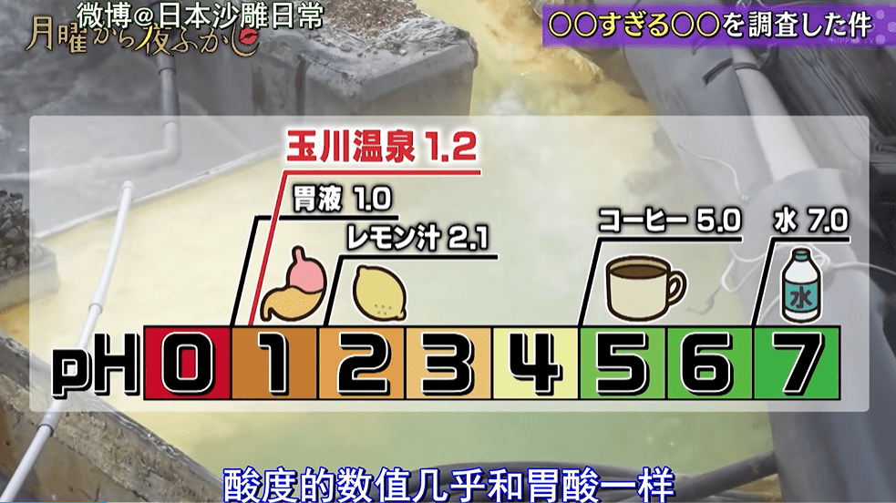

# 意外知道了泡进胃酸里的感受

作者：EIec

TID：34140

<title>1</title> <link href="../Styles/Style.css" type="text/css" rel="stylesheet">

# 1

*本帖最後由 Courant 於 2022-9-20 16:49 編輯*

本周月曜节目采访了一个酸性和胃酸一样的强酸温泉，给丸吞作品提供了更具体的想象(*｀ー´)泡进去火辣辣的，敏感部位像针扎一样短时间的话还有点医疗效果，和刷酸差不多？从这个题材延伸似乎能写个丸吞文...(-ω-)

<title>2</title> <link href="../Styles/Style.css" type="text/css" rel="stylesheet">

# 2

 <ignore_js_op>[QQ截图20220920141050.png](forum.php?mod=attachment&aid=OTkzNjZ8Mjc0NGRkZDl8MTY3NDA2NTMwN3wxODIzMHwzNDE0MA%3D%3D&nothumb=yes) *(645.92 KB, 下載次數: 0)*

[下載附件](forum.php?mod=attachment&aid=OTkzNjZ8Mjc0NGRkZDl8MTY3NDA2NTMwN3wxODIzMHwzNDE0MA%3D%3D&nothumb=yes)

2022-9-20 14:12 上傳  

</ignore_js_op> <ignore_js_op>[QQ截图20220920141126.png](forum.php?mod=attachment&aid=OTkzNjV8MDI5NTNhNjh8MTY3NDA2NTMwN3wxODIzMHwzNDE0MA%3D%3D&nothumb=yes) *(669.38 KB, 下載次數: 0)*

[下載附件](forum.php?mod=attachment&aid=OTkzNjV8MDI5NTNhNjh8MTY3NDA2NTMwN3wxODIzMHwzNDE0MA%3D%3D&nothumb=yes)

2022-9-20 14:12 上傳  

</ignore_js_op> <ignore_js_op>[QQ截图20220920141021.png](forum.php?mod=attachment&aid=OTkzNjR8MmRkYjZlZjd8MTY3NDA2NTMwN3wxODIzMHwzNDE0MA%3D%3D&nothumb=yes) *(666.71 KB, 下載次數: 0)*

[下載附件](forum.php?mod=attachment&aid=OTkzNjR8MmRkYjZlZjd8MTY3NDA2NTMwN3wxODIzMHwzNDE0MA%3D%3D&nothumb=yes)

2022-9-20 14:12 上傳  

</ignore_js_op> <title>3</title> <link href="../Styles/Style.css" type="text/css" rel="stylesheet">

# 3

在这方面不得不说，还是日本人比较会玩。 <title>4</title> <link href="../Styles/Style.css" type="text/css" rel="stylesheet">

# 4

如果真的是胃酸这点酸度，溶解一个活人应该还是要挺久的，稀盐酸本来也不是特别强的酸，但是不妨碍幻想世界里就是可以随便屠戮小人世界，哈哈。 <title>5</title> <link href="../Styles/Style.css" type="text/css" rel="stylesheet">

# 5

> [freepenguin2 發表於 2022-9-21 00:02](https://giantessnight.cf/gnforum2012/forum.php?mod=redirect&goto=findpost&pid=516237&ptid=34140)
> 如果真的是胃酸这点酸度，溶解一个活人应该还是要挺久的，稀盐酸本来也不是特别强的酸，但是不妨碍幻想世界 ...

看节目组在水源放了把菜刀，12小时后刀整个没了。直观感受到了胃酸的强度，睡一觉的时间就能把小人消化的渣都不剩啊(꒪Д꒪)ノ

<title>6</title> <link href="../Styles/Style.css" type="text/css" rel="stylesheet">

# 6

天然环境下PH1.2已经是很强的了，其实就连我们通常认为的弱酸——醋酸放到自然界中都是很能打的了。 <title>7</title> <link href="../Styles/Style.css" type="text/css" rel="stylesheet">

# 7

奇怪的知识增加了
如果真的在短时间有点医疗效果的话岂不能让巨娘开个胃液疗养服务之类的 <title>8</title> <link href="../Styles/Style.css" type="text/css" rel="stylesheet">

# 8

除了强酸，还有更要命的蛋白酶，如果这个也加上估计更刺激hhhh <title>9</title> <link href="../Styles/Style.css" type="text/css" rel="stylesheet">

# 9

> [lv290 發表於 2022-9-21 11:51](https://giantessnight.cf/gnforum2012/forum.php?mod=redirect&goto=findpost&pid=516261&ptid=34140)
> 奇怪的知识增加了
> 如果真的在短时间有点医疗效果的话岂不能让巨娘开个胃液疗养服务之类的 ...

就是这个题材感觉很有意思嘞，不太会写文，不然高低整一篇
<title>10</title> <link href="../Styles/Style.css" type="text/css" rel="stylesheet">

# 10

> [Courant 發表於 2022-9-21 00:27](https://giantessnight.cf/gnforum2012/forum.php?mod=redirect&goto=findpost&pid=516242&ptid=34140)
> 看节目组在水源放了把菜刀，12小时后刀整个没了。直观感受到了胃酸的强度，睡一觉的时间就能把小人消化的 ...

溶解一个人应该还是比一把菜刀难的...估计要更久的煎熬才能消化掉哈哈，不过还有肠子呢。
<title>11</title> <link href="../Styles/Style.css" type="text/css" rel="stylesheet">

# 11

> [Courant 發表於 2022-9-21 00:27](https://giantessnight.cf/gnforum2012/forum.php?mod=redirect&goto=findpost&pid=516242&ptid=34140)
> 看节目组在水源放了把菜刀，12小时后刀整个没了。直观感受到了胃酸的强度，睡一觉的时间就能把小人消化的 ...

菜刀主要成分是铁，属于活泼金属，跟氢离子反应速度很快的。小人不是活泼金属，跟氢离子反应速度慢
<title>12</title> <link href="../Styles/Style.css" type="text/css" rel="stylesheet">

# 12

那啥，你们没有过那种呕吐时感觉食道火辣辣烧得慌的感觉吗？那个就是胃酸的灼烧 <title>13</title> <link href="../Styles/Style.css" type="text/css" rel="stylesheet">

# 13

日本人真的会玩。。。希望某天gts有真人游戏 <title>14</title> <link href="../Styles/Style.css" type="text/css" rel="stylesheet">

# 14

我去还有这样，不过确实胃酸也没有那么强，完整的蛋白质糖类和脂肪都是要小肠胃等一起消化的～～～ <title>15</title> <link href="../Styles/Style.css" type="text/css" rel="stylesheet">

# 15

我们这工厂里的酸性废水其实和胃酸pH就差不多 泼到身上只要马上用水冲洗就没啥事。