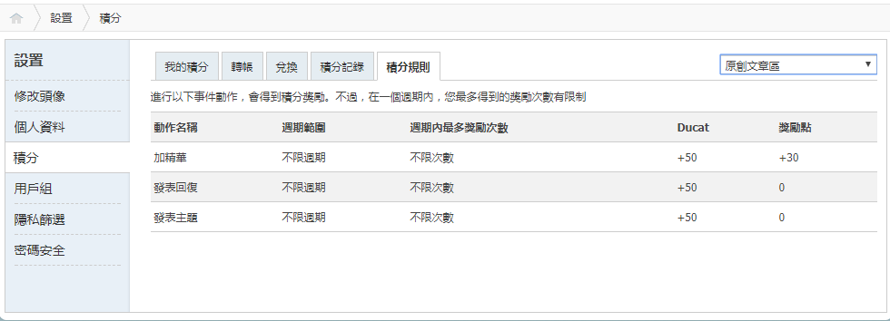

# 感嘆一下

作者：63172215

TID：23682

<title>1</title> <link href="../Styles/Style.css" type="text/css" rel="stylesheet">

# 1

*本帖最後由 ccccccccccc 於 2017-8-14 15:27 編輯*

事先說明 本人並沒有任何對這位朋友的偏見 妒忌之類的 只是單純覺得他很厲害
-----
剛剛看到一個上線時間只有兩小時的用戶 [假髮小王子](http://giantessnight.com/gnforum2012/home.php?mod=space&uid=16693) 可是他已經到了金卡會員 有300+獎勵點 發貼數也不多 我就想說
嘩他到底幹了什麼給了他這麼多獎勵點 然後我去看了看他發了什麼 然後我發現他轉了一篇長文 和 轉了一些圖片
他轉的文章我也有看過 我也感謝他轉過來---然後RL給了他100獎勵點。
我去看了看他轉的圖片 很好 恐龍不錯---然後RL大在這合共給了260獎勵點。
我就WTF了 RL大出手也太多了吧
感覺很可怕
-----
我知道自己是個被動的人 看到這感覺有點增加創作意欲(X
不說了 繼續寫文去(ry
<title>2</title> <link href="../Styles/Style.css" type="text/css" rel="stylesheet">

# 2

证明被dalao看上之后过的会很舒服（大雾）

突然忧伤.jpg <title>3</title> <link href="../Styles/Style.css" type="text/css" rel="stylesheet">

# 3

嘛，加油吧，写文的平时都挺辛苦的，例如说被我这样子的催更 <title>4</title> <link href="../Styles/Style.css" type="text/css" rel="stylesheet">

# 4

这奖励点看得我那个羡慕哟 当然也就只能羡慕一下了 <title>5</title> <link href="../Styles/Style.css" type="text/css" rel="stylesheet">

# 5

得不到的永远在骚动~~~开个玩笑

之前我也有过把奖励点和积分来当做自己创作动力的时候，不过自从没时间后才发现~~~随性而作才是最舒服的~心态放开点吧.

当然，个人认为只是通过搬运而得到这么多奖励点的话确实有失偏颇吧
这样做会让重视这方面的作者很不开心的。 <title>6</title> <link href="../Styles/Style.css" type="text/css" rel="stylesheet">

# 6

原创最重要，一味的搬运反而有挖墙脚的作用，我觉得认真写写文评支持下原创作者贼有成就感 <title>7</title> <link href="../Styles/Style.css" type="text/css" rel="stylesheet">

# 7

既然开头就特意用大号粗体标注出自己的想法，那么依我看来，恐怕这里提到的几点，心里多多少少也都是存在的吧。
能够坦然的正视这种事情的人不多，如果可以做到的话我估计怎么着也得是圣人级别。所以有这种想法，我觉得并不超出正常人的范畴。
倒不如说在这样的情况下还能够保持冷静，理性地提出自己的想法，委婉地表达自己的观点，实在是比大陆的某乎要强的太多。
GN是一个小众向的论坛，人数相比同类的偏僻爱好实在是要少很多。
至于管理起来的难度，因为我没有做过管理员之类的所以并不知情。在我的主观看法里，这样比较小众的论坛，每天上线只有几百人而且大部分还是在潜水，管理起来应该是比较容易才对。
因而在正式的管理制度方面，我们并不需要非常详细的论坛规定。许多东西以人为的方式去处理，比硬要按规定去遵照实行要有效率的多。

论坛现有的规定文件：[【公告】 Giantess Night論壇總版規：（2012.02.28更新）](http://www.giantessnight.com/gnforum2012/forum.php?mod=viewthread&tid=9082&extra=page%3D1)
                                [原創文章區 & 原創圖片區 - 精華帖評定標準](http://www.giantessnight.com/gnforum2012/forum.php?mod=viewthread&tid=9539&extra=page%3D1)
                                [[公告] 論壇自2013年11月起實施權限新制](http://www.giantessnight.com/gnforum2012/forum.php?mod=viewthread&tid=15471&extra=page%3D1)
                                [文章區精華帖評分通則（2011/3/15）](http://www.giantessnight.com/gnforum2012/forum.php?mod=viewthread&tid=9747&extra=page%3D1)
                                [【公告】文章區關於主題字數的新規（2016.10.6追改）](http://www.giantessnight.com/gnforum2012/forum.php?mod=viewthread&tid=21937&extra=page%3D1)

不知道什么地方会不会还有我没有找到的，总之我们论坛在一些方面的规定做的还是非常的详实，令人信服的。
可相对的，另一些方面，像奖励点应该怎么给，给多少，并没有一个明确的标准。
说了这么多，应该会有人认为，你是不是想向中央反映造一个新规啊？
我的回答是：并没有。
如同刚才所说，GN是一个小众向的论坛，不需要过于详细的规定来作为GN会员和管理员们的行事准则。
但管理员必须要执掌好裁决的天平。这是在不依靠法治而依靠人治的条件下最后的保障。

最后放一张图，求别怼……
<ignore_js_op>

**求别怼…….PNG** *(21.13 KB, 下載次數: 0)*

[下載附件](forum.php?mod=attachment&aid=NjkxODJ8OTUxMzM3Yjl8MTY3NDA2NzQyNHwxODIzMHwyMzY4Mg%3D%3D&nothumb=yes)

2017-8-14 21:50 上傳

<title>8</title> <link href="../Styles/Style.css" type="text/css" rel="stylesheet">

# 8

作为游戏区潜水翻腾的咸鱼表示搬运也是可以的手段。 <title>9</title> <link href="../Styles/Style.css" type="text/css" rel="stylesheet">

# 9

人比人害死人啊，这种其实我也看不惯，可谁叫他有dalao撑腰呢 <title>10</title> <link href="../Styles/Style.css" type="text/css" rel="stylesheet">

# 10

注册了大半年时间，因为之前打开的帖子全都是有权限的，而且一直忙，也就不知道怎么攒积分 <title>11</title> <link href="../Styles/Style.css" type="text/css" rel="stylesheet">

# 11

哎。阅读权限一直上不去啊。像我这样级别的会员.发帖还有限制..</ignore_js_op>