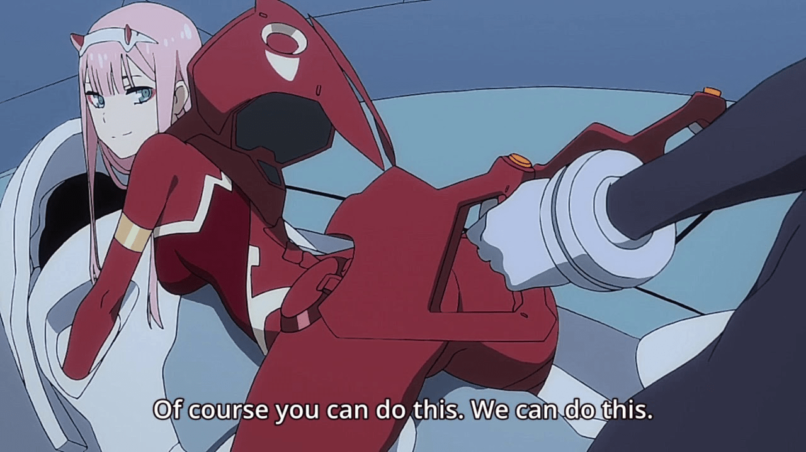

# 感覺普通人對GTS好像沒有什麼反應

作者：超SizeJKGirl

TID：25606

<title>1</title> <link href="../Styles/Style.css" type="text/css" rel="stylesheet">

# 1

因為不想據透所以我就不明講太多了
如果有看過動畫的人就會猜出我在講什麼

最近有一部動畫最後女主變成超大型機娘
當然那應該不是算完全都是機械
而是類似生化肉體+機械那種感覺
但是很網友看完好像很不解或是發表不出言論
我覺得大部分人應該只是沒什麼感覺或是講不出所以然
搞不好以後超巨大機娘或是什麼屬性是新潮流也說不定
我自己是覺得超巨大機娘其實還算可以接受
最好是肉體+類機械的元件比較好
而且看完之後讓我想到如果是類似機械的巨大機娘的話
我們是不是可以住在超巨大機娘身上
雖然外表看是人類肉體
但是實質上是類似機械構造
柔軟的肌膚會流汗但卻是類機械構造
而且身體內可以給人類居住
比方說人類的垃圾就從屁股排出
廢水就從尿道口排出
需要物資就從嘴巴吃進去之類的
雖然這樣演會尺度會太大
大概大部分動漫都沒辦法畫
像大衛特大號裡面就住了一堆外星人
雖然是搞笑片
但是怕尺度太大就只好選男性機器人的身體
這真的很可惜
住在巨大機娘裡面感覺滿合邏輯的
跟超時空要塞的巨大戰艦可以住人又可以變形型成人型
這樣在宇宙航行或戰鬥都沒問題了
順便也可以GTS福利一波

<title>2</title> <link href="../Styles/Style.css" type="text/css" rel="stylesheet">

# 2

只要内容不过激，GTS角色也不过是众多角色类型中的一种，普通人当然会没什么反应（反感）。而在绅士眼中，GTS也就是众多性癖中的一种，一般也不会有什么太大的反应，说白了不是普通人能不能接受GTS，而是作品的内容能不能让普通人接受。就好比同是GTS圈子的同好，每个人能接受的GTS内容也有所不同。 <title>3</title> <link href="../Styles/Style.css" type="text/css" rel="stylesheet">

# 3

我们从小都看过格列佛游记，如果普通人对GTS有没有反应，那个时候就把我们分隔出来了 <title>4</title> <link href="../Styles/Style.css" type="text/css" rel="stylesheet">

# 4

居住巨大娘这让我想到了疯狂怪医芙兰的飞天意面神教了，以维持特定人物“存活”而制造的大型生态系统在将来可能会出现。虽然可能不像楼主想的那样，不过艺术加工一下的话意外的可行？ <title>5</title> <link href="../Styles/Style.css" type="text/css" rel="stylesheet">

# 5

什么动画？愿闻其详，完全不知道 <title>6</title> <link href="../Styles/Style.css" type="text/css" rel="stylesheet">

# 6

> [Lanclot 發表於 2018-7-29 20:27](https://giantessnight.cf/gnforum2012/forum.php?mod=redirect&goto=findpost&pid=383152&ptid=25606)
> 什么动画？愿闻其详，完全不知道

Darling in the franxx <ignore_js_op>

**maxresdefault.jpg** *(127.38 KB, 下載次數: 0)*

[下載附件](forum.php?mod=attachment&aid=NzM0MTl8YzA3MGMzY2N8MTY3NDA2NzAyOHwxODIzMHwyNTYwNg%3D%3D&nothumb=yes)

2018-7-29 21:55 上傳

我本來想貼圖的
不過就不爆料了
反正有巨大娘(大概算吧)
我覺得算好看
但是罵的人滿多的
我覺得有缺點
但我又很難想像出缺點在哪...

<title>7</title> <link href="../Styles/Style.css" type="text/css" rel="stylesheet">

# 7

啊这个啊，传说剧情崩坏的，我去看看哦，谢谢哈 <title>8</title> <link href="../Styles/Style.css" type="text/css" rel="stylesheet">

# 8

格列佛游记算是我的启蒙读物吧（笑） <title>9</title> <link href="../Styles/Style.css" type="text/css" rel="stylesheet">

# 9

DiF最大的缺點大概就是「爛尾」吧
那一集剛出的時候，論壇裡就有人在討論了
看到有人說「劇情太爛，看到這裡也尻不起來」…等類似的感想

<title>10</title> <link href="../Styles/Style.css" type="text/css" rel="stylesheet">

# 10

任何新的东西，都要慢慢的培养的，从无感甚至排斥到最后喜欢，这是一个过程</ignore_js_op>