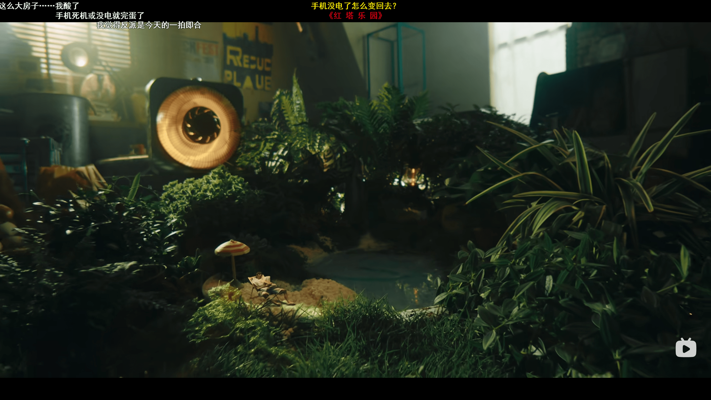
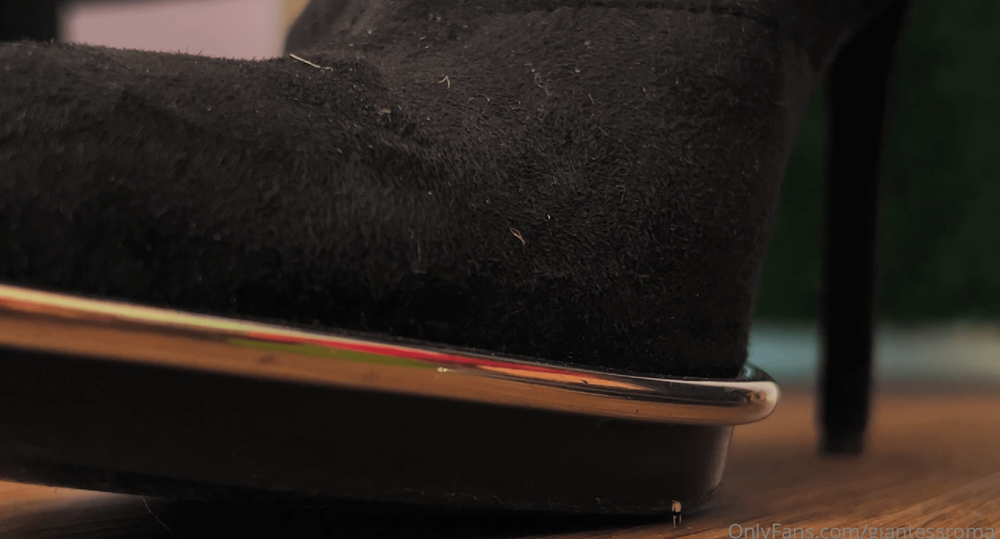
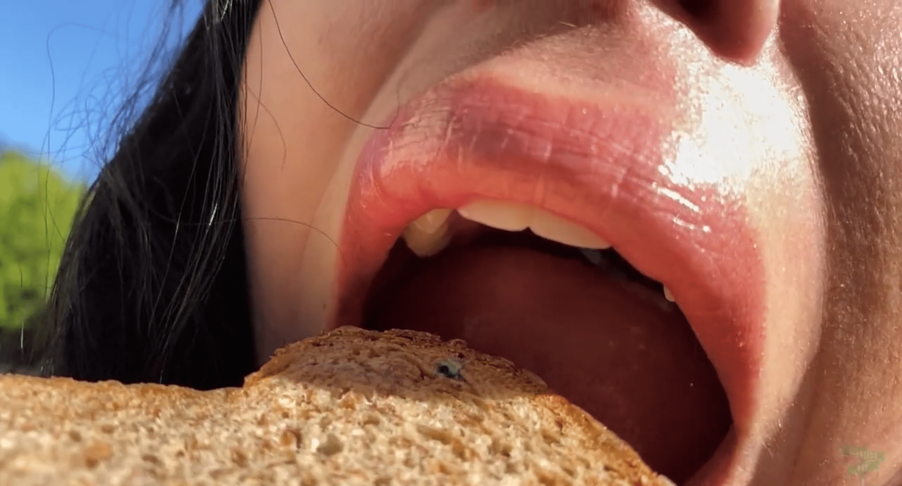

# 感觉拍摄技术真的在不断变好哎

作者：adsl47535090

TID：33939

<title>1</title> <link href="../Styles/Style.css" type="text/css" rel="stylesheet">

# 1

[https://www.bilibili.com/video/B ... 1273e9b312768083533](https://www.bilibili.com/video/BV1LV4y1s74c?spm_id_from=333.851.b_7265636f6d6d656e64.7&vd_source=bae4d88fe08491273e9b312768083533)
昨天刚刚在b站发布的视频，虽然没有gts元素，不过这个场景拍的是真的强，和专业电影没什么两样了
<ignore_js_op>

**QQ截图20220815114305.png** *(2.74 MB, 下載次數: 0)*

[下載附件](forum.php?mod=attachment&aid=OTg2MjB8OTA4NDAzMmR8MTY3NDA2NTM4MXwxODIzMHwzMzkzOQ%3D%3D&nothumb=yes)

2022-8-15 11:46 上傳

看到后面的拍摄细节介绍才知道拍这种题材的视频有多难
感觉目前圈内的作品，综合质量最高的就是giantessave了吧，场景角度极其真实并且更加多样，不像部分影片从头到尾就一两个角度一直拍，而且也没有画面变形
<ignore_js_op>

**QQ截图20220815115207.png** *(1.6 MB, 下載次數: 0)*

[下載附件](forum.php?mod=attachment&aid=OTg2MjR8OWZlMTI3YWN8MTY3NDA2NTM4MXwxODIzMHwzMzkzOQ%3D%3D&nothumb=yes)

2022-8-15 11:52 上傳

啊对还有k姐的也不错
<ignore_js_op>

**QQ截图20220815114959.png** *(1.27 MB, 下載次數: 0)*

[下載附件](forum.php?mod=attachment&aid=OTg2MjN8ZTA0MmYzMjl8MTY3NDA2NTM4MXwxODIzMHwzMzkzOQ%3D%3D&nothumb=yes)

2022-8-15 11:52 上傳

不过单论小人特效的质量似乎hybrid更胜一筹，早期的school_project_pest不知道还有没有人有印象，那里面的小人人群制作直到今天我也没看过更好的
<ignore_js_op>

**QQ截图20220815114150.png** *(2.44 MB, 下載次數: 0)*

[下載附件](forum.php?mod=attachment&aid=OTg2MjF8MTNjN2Y4MGJ8MTY3NDA2NTM4MXwxODIzMHwzMzkzOQ%3D%3D&nothumb=yes)

2022-8-15 11:47 上傳

不知道大家有没有什么高质量的视频站点推荐呢？

<title>2</title> <link href="../Styles/Style.css" type="text/css" rel="stylesheet">

# 2

 <ignore_js_op>[QQ截图20220815114547.png](forum.php?mod=attachment&aid=OTg2MjJ8YWViZDVjYTV8MTY3NDA2NTM4MXwxODIzMHwzMzkzOQ%3D%3D&nothumb=yes) *(1.15 MB, 下載次數: 0)*

[下載附件](forum.php?mod=attachment&aid=OTg2MjJ8YWViZDVjYTV8MTY3NDA2NTM4MXwxODIzMHwzMzkzOQ%3D%3D&nothumb=yes)

2022-8-15 11:47 上傳  

</ignore_js_op> <title>3</title> <link href="../Styles/Style.css" type="text/css" rel="stylesheet">

# 3

影视飓风之前还搞那个移轴拍摄，就拍出小人国那种感觉的拍摄方法，看着也很带感。不过就是没有专业团队做gts内容 <title>4</title> <link href="../Styles/Style.css" type="text/css" rel="stylesheet">

# 4

> [nhbnfn 發表於 2022-8-15 12:11](https://giantessnight.cf/gnforum2012/forum.php?mod=redirect&goto=findpost&pid=513038&ptid=33939)
> 影视飓风之前还搞那个移轴拍摄，就拍出小人国那种感觉的拍摄方法，看着也很带感。不过就是没有专业团队做gt ...

小众爱好但需要的技术力又相当高。。拍摄难度又大，即使有技术的部分团队也不会拿出精力搞这个吧。。唉，高质量作品遥遥无期啊
<title>5</title> <link href="../Styles/Style.css" type="text/css" rel="stylesheet">

# 5

啊楼主说了这么多，能分享一下资源来源吗...想去翻看一下这些来着..然后，小众圈子，耗时耗力耗财的高质量影视作品，确实难咯.. <title>6</title> <link href="../Styles/Style.css" type="text/css" rel="stylesheet">

# 6

然后除了giantesssave，cinematic gts那些感觉也确实不错啊，应该可以放在高质量这栏里了 <title>7</title> <link href="../Styles/Style.css" type="text/css" rel="stylesheet">

# 7

> [freepenguin2 發表於 2022-8-15 18:29](https://giantessnight.cf/gnforum2012/forum.php?mod=redirect&goto=findpost&pid=513070&ptid=33939)
> 啊楼主说了这么多，能分享一下资源来源吗...想去翻看一下这些来着..然后，小众圈子，耗时耗力耗财的高质量 ...

[https://www.giantessave.com/](https://www.giantessave.com/)
[https://www.tinyhybrid.co.uk/store](https://www.tinyhybrid.co.uk/store)
giantessave和hybrid的官网，k姐的太久不上找不到了sorry~
cinematic确实也是高质量呢！把它忘了哈哈哈

<title>8</title> <link href="../Styles/Style.css" type="text/css" rel="stylesheet">

# 8

我看了楼主发的视频链接~看完了~只能说国内的特效技术真的和国外的比差太多太多了。

即使是他们这样拍，我依然感觉很假，假在哪些地方呢？

其实就是假的没有物理碰撞效果，和巨大物体的互动效果，就感觉很假。大脑就会告诉我，这就是在绿幕面前表演的而已，没有物理碰撞和大量的物体互动就是假。

我个人认为，目前技术最好的还是K姐原来和特效师合作的那些片子。
为什么这样说，观察仔细的朋友已经分得清楚，K姐的那些特效效果，小人被压死的镜头有物理碰撞效果，包括被踩死后爆裂出的血都十分的真实，一个小众口味，一个特效师能达到这种出类拔萃的特效效果，我目前依然只承认K姐的特效片，所以我一直说K姐和特效男友分手后，是我们整个圈子的巨大损失，从此以后，K姐迷上了和玩具小人互动无法自拔。。。唉。
至于楼主说的其余2个网站的片子，我都看过，只能说相对其他5毛特效片，他们有的镜头运用和特效做得还是可以看，但是还是感觉假。
为什么大家觉得美国大片的特效那么真实，真实就在于物理碰撞，特效和物体的互动真实，才是真的真实。
我一直以为需要很多很多人来拍这些镜头，直到我看到K姐以前的特效视频。。我相信。。 特效师才是重点 <title>9</title> <link href="../Styles/Style.css" type="text/css" rel="stylesheet">

# 9

> [adsl47535090 發表於 2022-8-15 21:34](https://giantessnight.cf/gnforum2012/forum.php?mod=redirect&goto=findpost&pid=513093&ptid=33939)
> 我看了楼主发的视频链接~看完了~只能说国内的特效技术真的和国外的比差太多太多了。
> 
> 即使是他们这样拍，我 ...

真实了，好多产量特别大的网站要么就是用道具，要么特效粗制滥造的要命，小人奔跑、挣扎、舔舐等等各种动作不光像是太空步一样违和感爆炸，还明显感觉做动作的人根本不走心，甚至那么小的贴图还能看到锯齿，贴图漂移等等、、、即使这样只要场景角度拍得好也算的上好影片了，真不知道什么时候才能看到高质量的gts影片了，唉
<title>10</title> <link href="../Styles/Style.css" type="text/css" rel="stylesheet">

# 10

> [trampled_mono 發表於 2022-8-15 19:38](https://giantessnight.cf/gnforum2012/forum.php?mod=redirect&goto=findpost&pid=513079&ptid=33939)
> https://www.giantessave.com/
> https://www.tinyhybrid.co.uk/store
> giantessave和hybrid的官网，k姐的太 ...

啊这两个确实不错，还有其他的吗，我最近刚好想使劲找真人特效片，然后尽量是micro级别的，唉，有点难度啊.
<title>11</title> <link href="../Styles/Style.css" type="text/css" rel="stylesheet">

# 11

> [trampled_mono 發表於 2022-8-15 12:56](https://giantessnight.cf/gnforum2012/forum.php?mod=redirect&goto=findpost&pid=513046&ptid=33939)
> 小众爱好但需要的技术力又相当高。。拍摄难度又大，即使有技术的部分团队也不会拿出精力搞这个吧。。唉， ...

只能期待某个迪拜王子什么时候入坑，像龙之血一样大撒币拍一部作品。
<title>12</title> <link href="../Styles/Style.css" type="text/css" rel="stylesheet">

# 12

> [412592262 發表於 2022-8-15 22:37](https://giantessnight.cf/gnforum2012/forum.php?mod=redirect&goto=findpost&pid=513108&ptid=33939)
> 其实说白了还是能不能变现，如果能够变现，在贵的技术和设备都可以有，只能说咱这个群体消费能力还是不行 ...

是啊，小众群体毕竟人太少了，消费力不足啊。。。

<title>13</title> <link href="../Styles/Style.css" type="text/css" rel="stylesheet">

# 13

> [freepenguin2 發表於 2022-8-16 01:13](https://giantessnight.cf/gnforum2012/forum.php?mod=redirect&goto=findpost&pid=513142&ptid=33939)
> 啊这两个确实不错，还有其他的吗，我最近刚好想使劲找真人特效片，然后尽量是micro级别的，唉，有点难度 ...

大多数的网站都会在c4s上同步进行贩卖，作品极多
[https://www.clips4sale.com/clips ... lipsPage/1#clip-tab](https://www.clips4sale.com/clips/search/giantess/category/0/storesPage/1/clipsPage/1#clip-tab)
常见的网站都有的，算是一个相当权威的汇总了
还可以加上各种属性进行搜索啥的，有时间可以翻翻，说不定会有不少收获~

<title>14</title> <link href="../Styles/Style.css" type="text/css" rel="stylesheet">

# 14

想问一下giantessave的视频除了订阅怎么能买到啊，没有VISA之类的卡 <title>15</title> <link href="../Styles/Style.css" type="text/css" rel="stylesheet">

# 15

> [trampled_mono 發表於 2022-8-16 09:59](https://giantessnight.cf/gnforum2012/forum.php?mod=redirect&goto=findpost&pid=513176&ptid=33939)
> 大多数的网站都会在c4s上同步进行贩卖，作品极多
> https://www.clips4sale.com/clips/search/giantess/cat ...

艹，看了一下，确实是大杂烩嘛都有，就是搜寻难度有点点大了..还是，先谢楼主！
<title>16</title> <link href="../Styles/Style.css" type="text/css" rel="stylesheet">

# 16

> [devilkin 發表於 2022-8-16 10:45](https://giantessnight.cf/gnforum2012/forum.php?mod=redirect&goto=findpost&pid=513185&ptid=33939)
> 想问一下giantessave的视频除了订阅怎么能买到啊，没有VISA之类的卡

不清楚。。我都是去淘宝上有些店家会租赁visa卡，汇率会稍高一点，比如美金1：7.5这样子，充了钱就可以用他们提供的visa卡号去买了
<title>17</title> <link href="../Styles/Style.css" type="text/css" rel="stylesheet">

# 17

> [trampled_mono 發表於 2022-8-16 11:37](https://giantessnight.cf/gnforum2012/forum.php?mod=redirect&goto=findpost&pid=513191&ptid=33939)
> 不清楚。。我都是去淘宝上有些店家会租赁visa卡，汇率会稍高一点，比如美金1：7.5这样子，充了钱就可以用 ...

贵吗 可以使用不？效果怎么样？那我用那个卡开会员可不可以
<title>18</title> <link href="../Styles/Style.css" type="text/css" rel="stylesheet">

# 18

> [changshazxk 發表於 2022-8-16 14:53](https://giantessnight.cf/gnforum2012/forum.php?mod=redirect&goto=findpost&pid=513203&ptid=33939)
> 贵吗 可以使用不？效果怎么样？那我用那个卡开会员可不可以

说了汇率会高一点嘛~有的还会有一次性的租金之类的，租一年我记得也就几十块的样子，然后没有租金的相对汇率就会更高一点，比如1：8.5甚至1：9.5这样，选哪种看你使用的多不多了；使用大部分是没问题的，如果确实担心可以提前问下有意外能不能退款，开会员买视频啥的当然都可以，就相当于你有了张visa卡可以正常消费
<title>19</title> <link href="../Styles/Style.css" type="text/css" rel="stylesheet">

# 19

> [trampled_mono 發表於 2022-8-15 22:29](https://giantessnight.cf/gnforum2012/forum.php?mod=redirect&goto=findpost&pid=513105&ptid=33939)
> 真实了，好多产量特别大的网站要么就是用道具，要么特效粗制滥造的要命，小人奔跑、挣扎、舔舐等等各种动 ...

唉~有大神制作3D电影，因为是小众口味，成立工作室的很少，技术好的大神又喜欢单干，最后累得自己不想制作了。
比如 ashkiiwolf 大神就是， 他自己说自己太累了，从此不再制作3D动画电影。
就如同你所说，我们这个圈子什么时候才能看到特效十分精致的电影，唉
我有时候在想，自己要是个富翁就好了，我一定会花钱请专业的特效团队来制作好莱坞级别的特效GTS片，满足自己所有对GTS的幻想，可惜。哥是个穷人~~~哈哈哈哈
<title>20</title> <link href="../Styles/Style.css" type="text/css" rel="stylesheet">

# 20

> [412592262 發表於 2022-8-15 22:37](https://giantessnight.cf/gnforum2012/forum.php?mod=redirect&goto=findpost&pid=513108&ptid=33939)
> 其实说白了还是能不能变现，如果能够变现，在贵的技术和设备都可以有，只能说咱这个群体消费能力还是不行 ...

说得不错~
这类电影还是要靠技术好的特效师，那才是关键。
但是这类人才，我们国家很少，估计有这种特效大神，别人都去正规行业找钱了，也不会来跟我们小众合作
<title>21</title> <link href="../Styles/Style.css" type="text/css" rel="stylesheet">

# 21

> [alchemistwh 發表於 2022-8-16 06:30](https://giantessnight.cf/gnforum2012/forum.php?mod=redirect&goto=findpost&pid=513148&ptid=33939)
> 只能期待某个迪拜王子什么时候入坑，像龙之血一样大撒币拍一部作品。

啊哈哈哈~对对~迪拜的公子哥入坑我们，钱的事，都是小事了。哈哈哈
<title>22</title> <link href="../Styles/Style.css" type="text/css" rel="stylesheet">

# 22

> [adsl47535090 發表於 2022-8-17 20:29](https://giantessnight.cf/gnforum2012/forum.php?mod=redirect&goto=findpost&pid=513388&ptid=33939)
> 啊哈哈哈~对对~迪拜的公子哥入坑我们，钱的事，都是小事了。哈哈哈

虽然但是，gts圈是一个崇尚女性强大的幻想圈子，而迪拜属于伊斯兰国家，在他们那边的教义中，真主安拉的教义，女性都是男性的附属品牛马，无论是不是虚拟作品中，是不可能允许像giantess这样比男性强大的存在，也不可能接受gts圈中男性属于被奴役的一方，这和伊斯兰教义和阿拉伯国家人的观念认知有着根本上的冲突
<title>23</title> <link href="../Styles/Style.css" type="text/css" rel="stylesheet">

# 23

> [神父桑 發表於 2022-8-17 20:33](https://giantessnight.cf/gnforum2012/forum.php?mod=redirect&goto=findpost&pid=513390&ptid=33939)
> 虽然但是，gts圈是一个崇尚女性强大的幻想圈子，而迪拜属于伊斯兰国家，在他们那边的教义中，真主安拉的教 ...

那就怪不得了~迪拜的公子哥没入坑我们~ 现在我们圈子的好的作品太有限了~唉~
<title>24</title> <link href="../Styles/Style.css" type="text/css" rel="stylesheet">

# 24

第二张图是那个片?方便提供下不
<title>25</title> <link href="../Styles/Style.css" type="text/css" rel="stylesheet">

# 25

> [hubert 發表於 2022-8-25 12:19](https://giantessnight.cf/gnforum2012/forum.php?mod=redirect&goto=findpost&pid=513998&ptid=33939)
> 第二张图是那个片?方便提供下不

[https://mega.nz/file/K0cCnY5C#Ny ... cSNXzVypgv1Iy53ndFI](https://mega.nz/file/K0cCnY5C#NyzZ1RcE33folgB6JyjjqCOCcSNXzVypgv1Iy53ndFI)
<title>26</title> <link href="../Styles/Style.css" type="text/css" rel="stylesheet">

# 26

> [trampled_mono 發表於 2022-8-25 21:19](https://giantessnight.cf/gnforum2012/forum.php?mod=redirect&goto=findpost&pid=514018&ptid=33939)
> https://mega.nz/file/K0cCnY5C#NyzZ1RcE33folgB6JyjjqCOCcSNXzVypgv1Iy53ndFI

我本来想去看看连结，再买。没想到楼主题供了原片。感谢哈。</ignore_js_op></ignore_js_op></ignore_js_op></ignore_js_op>