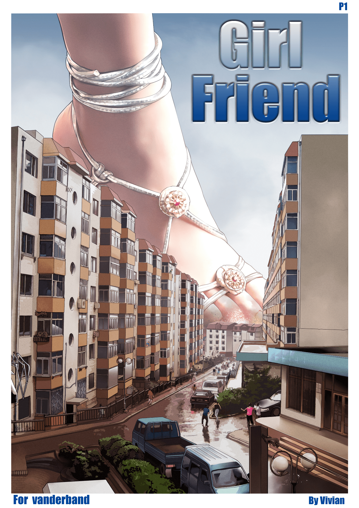

# 愿V姐在天堂永远幸福！

作者：woaivore

TID：28086

<title>1</title> <link href="../Styles/Style.css" type="text/css" rel="stylesheet">

# 1

坦白的说，本性凉薄的我与V姐算不上朋友，开始时，我只知道她是圈子里的名人，画家，能塑造出精湛作品的“大神”。

我也不清楚和她是怎么聊到一起的，可能是当初我总喜欢在群里灌水的原因吧？她叫我妮妮，我喊她V姐，于是熟络了一阵子。

感觉她，有些男孩子气，有些玩世不恭，可能是读书多了吧，经常说着我听不懂的话，有时调侃我两句，明明足码只大我一号，非说我是三寸金莲。。。

她还曾经劝慰和人吵架后的我，至今我还记着她那句话“群里丫头少，个个都是宝”。。。

她发过一张巨足踩踏城市的图，我说感觉像大连的街道，她说我好眼力，问我是不是老乡，可惜我是沈阳人，与她同省不同城。

我们还聊过一些人生哲理，我胡侃了一句逢迎之道在乎自然，她居然大加赞赏。。。

她说她在研究希腊神话，是为了完善雅典娜系列，她还喜欢佛学，她想让佛陀最后出场劝善暴走的雅典娜，不知道完没完成这个心愿。。。

认识她之前，曾经有位朋友发给我雅典娜系列的前四部，嘱咐我不要外传，因为那是V姐的版权，我谢过了，我收藏了，我也没有外传。。。

然而我也没好意思开口向她讨要什么，萍水相逢，得人青睐，但德须配位吧，但大当初把我拉进论坛里，也“特批”了我不少积分，除了感谢，我还能要求什么呢？

我就是这么凉薄的人，终于不声不响的淡出了这里，v姐也是我的人生过客，我所记得的就是这些点点滴滴。

时至今日，天劫降临，竟然带走了V姐，脑子嗡了一阵，心里憋了半晌说不出话。。。。。。

她留下的那张画，让我哽咽了。。。。。虽然我不知道她的相貌，但我能感觉出她灵魂深处的美丽。。。。。。

她走了，但她走的很坦然，我不知道她是否有信仰，我只知道，有信仰的人是能够从容面对死亡的。。。。。。

亲爱的V姐，神与你同在，佛陀也好，上帝也罢，无论极乐还是天堂，回归生命本源的你，一定是一个最美丽的天使！

<title>2</title> <link href="../Styles/Style.css" type="text/css" rel="stylesheet">

# 2

心情很糟糕，不知道該說什麽了……
<title>3</title> <link href="../Styles/Style.css" type="text/css" rel="stylesheet">

# 3

> [freelycat 發表於 2020-2-18 01:19](https://giantessnight.cf/gnforum2012/forum.php?mod=redirect&goto=findpost&pid=426825&ptid=28086)
> 心情很糟糕，不知道該說什麽了……

猫哥，我们都要好好活着
<title>4</title> <link href="../Styles/Style.css" type="text/css" rel="stylesheet">

# 4

> [大金忠臣完颜构 發表於 2020-2-18 01:37](https://giantessnight.cf/gnforum2012/forum.php?mod=redirect&goto=findpost&pid=426829&ptid=28086)
> 希望vivian姐来生幸福！远离疾病与贫穷，真的是伤心死了，我现在做什么都做不下去，越想越伤心，gts女神与v ...

多谢打赏，只愿我们所有人都能善始善终
<title>5</title> <link href="../Styles/Style.css" type="text/css" rel="stylesheet">

# 5

<ignore_js_op>

**01.jpg** *(1001.44 KB, 下載次數: 0)*

[下載附件](forum.php?mod=attachment&aid=ODE0NzV8ZGQ1YWYwYjN8MTY3NDA2ODYyMHwxODIzMHwyODA4Ng%3D%3D&nothumb=yes)

2020-2-18 09:22 上傳

那张大连街道背景的图，或许，这里是她的家？

<title>6</title> <link href="../Styles/Style.css" type="text/css" rel="stylesheet">

# 6

唉   这次病毒还是厉害   还挂了一位工程院院士呢好像，这次疫情伤害真的太大了，事后那些隐瞒疫情的官员绝对要被拉清单，不过大多去世的都是老人吧，圈内我本来认为都比较年轻应该没事儿的，没想到就出了这事儿，真的是世事无常 <title>7</title> <link href="../Styles/Style.css" type="text/css" rel="stylesheet">

# 7

> [sx101 發表於 2020-2-18 09:24](https://giantessnight.cf/gnforum2012/forum.php?mod=redirect&goto=findpost&pid=426874&ptid=28086)
> 唉   这次病毒还是厉害   还挂了一位工程院院士呢好像，这次疫情伤害真的太大了，事后那些隐瞒疫情的官员绝 ...

珍惜每一天吧，还得好好悔悟，毕竟这瘟疫不是某些人的单独责任，是我们这个群体所犯下的罪行导致的 <title>8</title> <link href="../Styles/Style.css" type="text/css" rel="stylesheet">

# 8

唉，实在心痛。希望疫情能早日过去吧。 <title>9</title> <link href="../Styles/Style.css" type="text/css" rel="stylesheet">

# 9

唉。。。在这里听到这个消息，万分感概，万分低落。 <title>10</title> <link href="../Styles/Style.css" type="text/css" rel="stylesheet">

# 10

不可能吧？？？不敢相信 <title>11</title> <link href="../Styles/Style.css" type="text/css" rel="stylesheet">

# 11

希望V姐可以在天堂实现GTSS的愿望 <title>12</title> <link href="../Styles/Style.css" type="text/css" rel="stylesheet">

# 12

> [mkuuuu 發表於 2020-2-18 17:12](https://giantessnight.cf/gnforum2012/forum.php?mod=redirect&goto=findpost&pid=426971&ptid=28086)
> 我pixiv，patreon资助费。。。
> 就T M 的全白瞎勒？！
> 她的漫画还会更新吗？！

我个人感觉你的这番话非常的不合时宜
建议自行删除以免。。。
<title>13</title> <link href="../Styles/Style.css" type="text/css" rel="stylesheet">

# 13

说来惭愧。。我还不知道谁是Vivian。。
但生命的消逝总是令人悲伤。
R.I.P <title>14</title> <link href="../Styles/Style.css" type="text/css" rel="stylesheet">

# 14

我整理了許久情緒,直到現在我才能稍微冷靜下來在此回復,我從前就聽說過並看過V姊的作品,論壇上也有不少她留下的優秀創作,我直到去年才真正與她認識,聊天群中我能感受到她相當好相處,而且有很強的親和力,同時談吐中無不透露出她優秀的知識水平,她是我見過最友善親切的同好了,這並沒有之一,我不敢相信這是真的,抱歉了...現在我的思緒還沒有完全平復,我不知道該怎麼整理詞彙來表達我的哀傷....

V姊,希望您在天堂能夠幸福,那邊並沒有病痛,我很高興能夠與您認識也謝謝您為圈內貢獻了那麼多優秀的創作....謝謝..

我有些任信或自私,我希望大家能注意好平安,能夠注意好防疫和安全,勤洗手切勿隨意觸碰搓揉口鼻眼,注意好健康...拜託了 各位

RIP <title>15</title> <link href="../Styles/Style.css" type="text/css" rel="stylesheet">

# 15

R.I.P
心情沉痛，愿你安息 <title>16</title> <link href="../Styles/Style.css" type="text/css" rel="stylesheet">

# 16

> [斯佳摩妮 發表於 2020-2-18 09:23](https://giantessnight.cf/gnforum2012/forum.php?mod=redirect&goto=findpost&pid=426873&ptid=28086)
> 那张大连街道背景的图，或许，这里是她的家？

RIP. 这是大连第七人民医院附近.... 她其实不在这

<title>17</title> <link href="../Styles/Style.css" type="text/css" rel="stylesheet">

# 17

> [[数据删除] 發表於 2020-2-18 17:29](https://giantessnight.cf/gnforum2012/forum.php?mod=redirect&goto=findpost&pid=426974&ptid=28086)
> 我个人感觉你的这番话非常的不合时宜
> 建议自行删除以免。。。

已經處理了……
<title>18</title> <link href="../Styles/Style.css" type="text/css" rel="stylesheet">

# 18

> [freelycat 發表於 2020-2-19 18:35](https://giantessnight.cf/gnforum2012/forum.php?mod=redirect&goto=findpost&pid=427231&ptid=28086)
> 已經處理了……

他自行删除的还是？
我真的不是灌水
明明有些事几个字就能说明白非要限制长度
有什么办法
<title>19</title> <link href="../Styles/Style.css" type="text/css" rel="stylesheet">

# 19

走好。
R.I.P.
自从知道论坛以来就听过她的传说，也有幸看过雅典娜和僵尸高校，不想时间过得如此之快。感谢她为这个圈子的付出。
致敬。 <title>20</title> <link href="../Styles/Style.css" type="text/css" rel="stylesheet">

# 20

v姐对圈内的贡献真的是无法用语言描述，心乱如麻，我们也没法给她体面的送别，愿v <title>21</title> <link href="../Styles/Style.css" type="text/css" rel="stylesheet">

# 21

天，V姐就走了？！她的那张图和楼主说的像大连这么多年了我都还记得，哎。当年还从淘宝买过v姐的作品。 <title>22</title> <link href="../Styles/Style.css" type="text/css" rel="stylesheet">

# 22

> [[数据删除] 發表於 2020-2-19 22:30](https://giantessnight.cf/gnforum2012/forum.php?mod=redirect&goto=findpost&pid=427263&ptid=28086)
> 他自行删除的还是？
> 我真的不是灌水
> 明明有些事几个字就能说明白非要限制长度

我刪的……
另外，我之前有講過，禁止純表情/標點符號的回覆（包括顏文字）
<title>23</title> <link href="../Styles/Style.css" type="text/css" rel="stylesheet">

# 23

这几天没上我错过了什么？！R.I.P. <title>24</title> <link href="../Styles/Style.css" type="text/css" rel="stylesheet">

# 24

Vivian, may you rest in peace. <title>25</title> <link href="../Styles/Style.css" type="text/css" rel="stylesheet">

# 25

> [freelycat 發表於 2020-2-20 01:31](https://giantessnight.cf/gnforum2012/forum.php?mod=redirect&goto=findpost&pid=427287&ptid=28086)
> 我刪的……
> 另外，我之前有講過，禁止純表情/標點符號的回覆（包括顏文字）
> ...

那好⑧，我知道了。。。

<title>26</title> <link href="../Styles/Style.css" type="text/css" rel="stylesheet">

# 26

一年多没来论坛了，今天上来竟然是这个原因。。哎 <title>27</title> <link href="../Styles/Style.css" type="text/css" rel="stylesheet">

# 27

就是无数个这种时候会觉得，一切灾难其实都离自己并不遥远
我们能够活在世上继续走下去。有很多时候只是因为自己幸运
RIP</ignore_js_op>