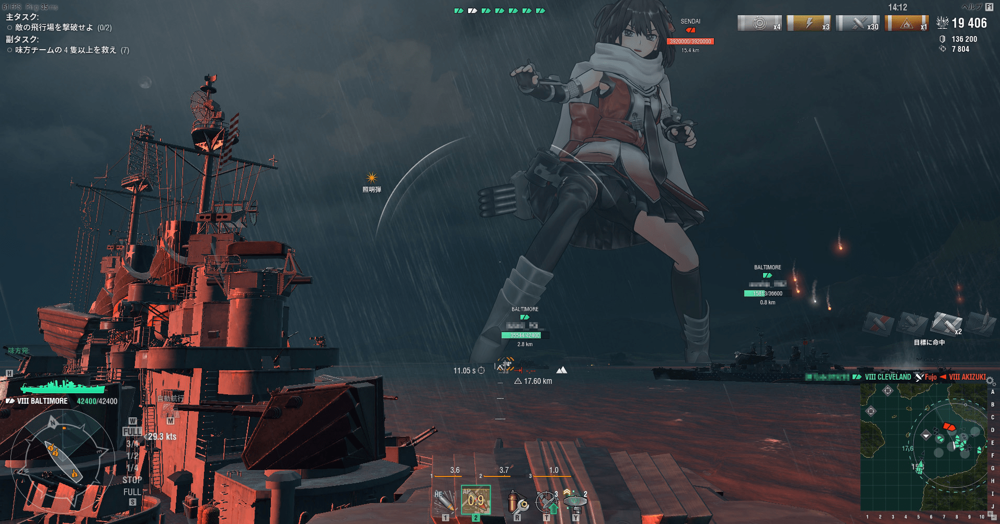
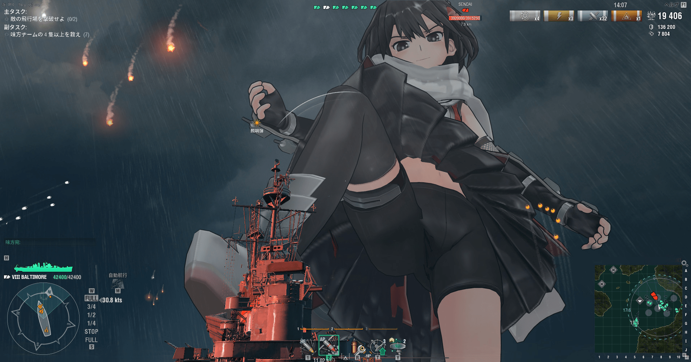
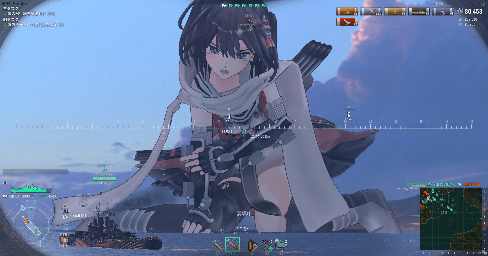
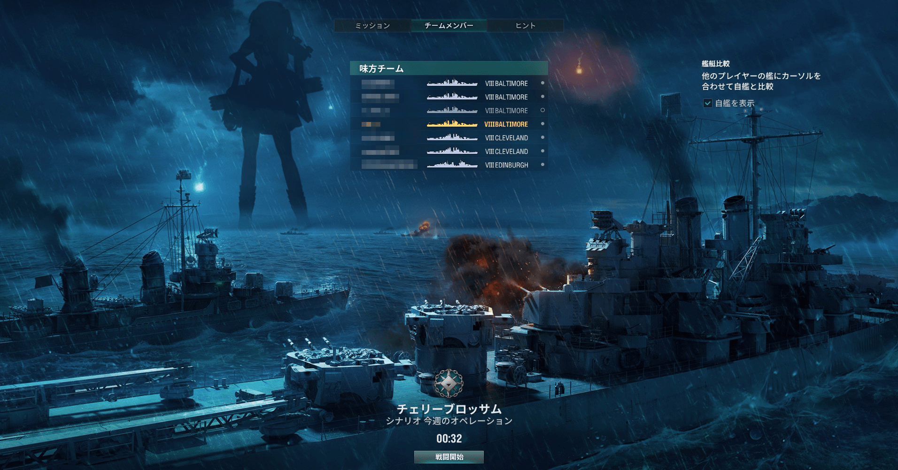
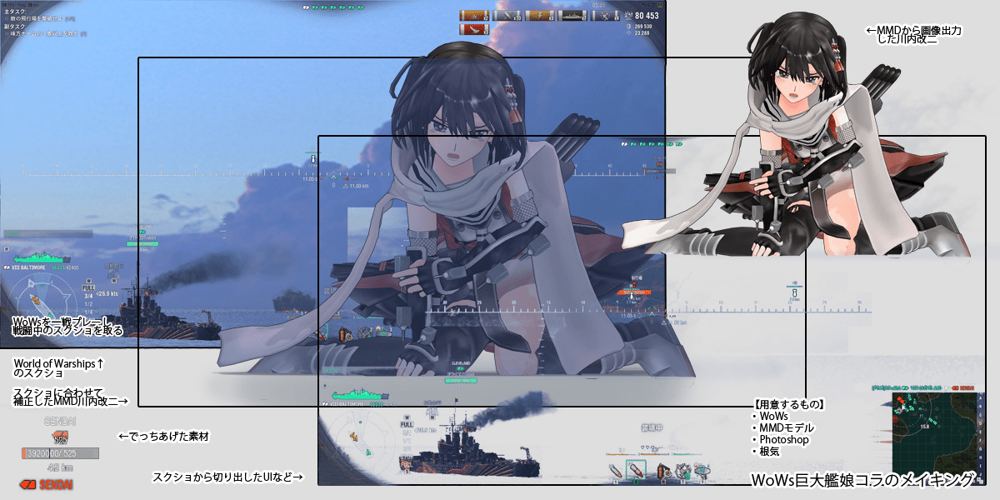
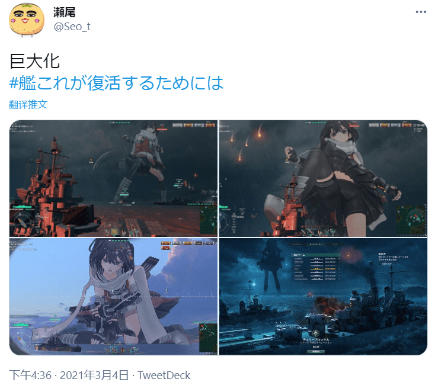

# 我不知道，不要問我

作者：BAss926

TID：30493

<title>1</title> <link href="../Styles/Style.css" type="text/css" rel="stylesheet">

# 1

K島上存來的

<ignore_js_op>

**1614919668518.jpg** *(464.86 KB, 下載次數: 0)*

[下載附件](forum.php?mod=attachment&aid=ODc4MjF8ODYwMjdhMjV8MTY3NDA2NjA4MHwxODIzMHwzMDQ5Mw%3D%3D&nothumb=yes)

2021-3-8 18:42 上傳

<ignore_js_op>

**1614919711126.jpg** *(352.97 KB, 下載次數: 0)*

[下載附件](forum.php?mod=attachment&aid=ODc4MjB8YjE2NjIxNzN8MTY3NDA2NjA4MHwxODIzMHwzMDQ5Mw%3D%3D&nothumb=yes)

2021-3-8 18:42 上傳

<ignore_js_op>

**1614919748656.jpg** *(390.56 KB, 下載次數: 0)*

[下載附件](forum.php?mod=attachment&aid=ODc4MTl8ZmJjYThjZGF8MTY3NDA2NjA4MHwxODIzMHwzMDQ5Mw%3D%3D&nothumb=yes)

2021-3-8 18:42 上傳

<ignore_js_op>

**1614919778963.jpg** *(463.22 KB, 下載次數: 0)*

[下載附件](forum.php?mod=attachment&aid=ODc4MTh8MGNhODYwODl8MTY3NDA2NjA4MHwxODIzMHwzMDQ5Mw%3D%3D&nothumb=yes)

2021-3-8 18:42 上傳

果然這種類型的東西還是大一點比較好
<title>2</title> <link href="../Styles/Style.css" type="text/css" rel="stylesheet">

# 2

这几张图片，是著名画师瀬尾的推特啊 <title>3</title> <link href="../Styles/Style.css" type="text/css" rel="stylesheet">

# 3

 <ignore_js_op>[Evn2sZHUcAAAh_Z.jpg](forum.php?mod=attachment&aid=ODc4MjN8MjZlNTc0MjZ8MTY3NDA2NjA4MHwxODIzMHwzMDQ5Mw%3D%3D&nothumb=yes) *(219.42 KB, 下載次數: 1)*

[下載附件](forum.php?mod=attachment&aid=ODc4MjN8MjZlNTc0MjZ8MTY3NDA2NjA4MHwxODIzMHwzMDQ5Mw%3D%3D&nothumb=yes)

2021-3-8 20:29 上傳  

</ignore_js_op> <ignore_js_op>[QQ截图20210308202732.png](forum.php?mod=attachment&aid=ODc4MjJ8NmZmMmE5MmV8MTY3NDA2NjA4MHwxODIzMHwzMDQ5Mw%3D%3D&nothumb=yes) *(475.77 KB, 下載次數: 1)*

[下載附件](forum.php?mod=attachment&aid=ODc4MjJ8NmZmMmE5MmV8MTY3NDA2NjA4MHwxODIzMHwzMDQ5Mw%3D%3D&nothumb=yes)

2021-3-8 20:29 上傳  

</ignore_js_op> <title>4</title> <link href="../Styles/Style.css" type="text/css" rel="stylesheet">

# 4

绕了一圈圈内喜欢舰娘加战舰本身的似乎就濑尾了，每次看他的本感觉风景和建筑载具什么的比人物更用心。。。他本人的站点上也经常更新各种风景画 <title>5</title> <link href="../Styles/Style.css" type="text/css" rel="stylesheet">

# 5

> [紫色欧石楠 發表於 2021-3-8 21:10](https://giantessnight.cf/gnforum2012/forum.php?mod=redirect&goto=findpost&pid=462367&ptid=30493)
> 绕了一圈圈内喜欢舰娘加战舰本身的似乎就濑尾了，每次看他的本感觉风景和建筑载具什么的比人物更用心。。。 ...

对的，我一直想不起来，我最早接触濑尾这个画师是因为他画的巨大娘还是风景画了。
因为我一直都超级喜欢他画的风景画的。而且的确画风景是个非常细的细活。

相比之下濑尾的巨大娘的风格更多的是随便涂涂……

但是我也很喜欢濑尾随便涂涂的风格​_(:з」∠)_
<title>6</title> <link href="../Styles/Style.css" type="text/css" rel="stylesheet">

# 6

*本帖最後由 吐槽帝阿虚 於 2021-3-9 22:39 編輯*

图感觉很棒啊，我以前就想象过舰娘和真实的战舰作战，终于能看见这种类型的图了。 <title>7</title> <link href="../Styles/Style.css" type="text/css" rel="stylesheet">

# 7

这种舰船+等大舰娘的几年前上推特就有了，但至今仍没有见过有游戏（怨念

濑尾好像本职就是教画背景的，我当时也是因为线条舒服而关注他的</ignore_js_op></ignore_js_op></ignore_js_op></ignore_js_op>