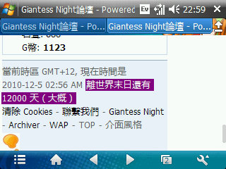

# 我发现一个好玩的

作者：小E

TID：8782

<title>1</title> <link href="../Styles/Style.css" type="text/css" rel="stylesheet">

# 1

在个人资料里面 我接的图 <title>2</title> <link href="../Styles/Style.css" type="text/css" rel="stylesheet">

# 2

 <ignore_js_op>[Screen01.png](forum.php?mod=attachment&aid=MjIwNzl8ZTllMzlkNDd8MTY3NDA2ODgzN3wxODIzMHw4Nzgy&nothumb=yes) *(25.16 KB, 下載次數: 0)*

[下載附件](forum.php?mod=attachment&aid=MjIwNzl8ZTllMzlkNDd8MTY3NDA2ODgzN3wxODIzMHw4Nzgy&nothumb=yes)

2010-12-4 23:15 上傳  

</ignore_js_op> <title>3</title> <link href="../Styles/Style.css" type="text/css" rel="stylesheet">

# 3

哈啊~~不明真相的围观 <title>4</title> <link href="../Styles/Style.css" type="text/css" rel="stylesheet">

# 4

求真相 <title>5</title> <link href="../Styles/Style.css" type="text/css" rel="stylesheet">

# 5

 围观 <title>6</title> <link href="../Styles/Style.css" type="text/css" rel="stylesheet">

# 6

真的不明白……同求真相 <title>7</title> <link href="../Styles/Style.css" type="text/css" rel="stylesheet">

# 7

LZ你下个星期来看会发现还是12000天（大概）
我第一次看到也是很诧异的说..
先是 然后是 第二天是 第三天是 若干天后是 现在是 <title>8</title> <link href="../Styles/Style.css" type="text/css" rel="stylesheet">

# 8

我也觉得很有趣，只是看起末日日期来不像是2012年12月21号 <title>9</title> <link href="../Styles/Style.css" type="text/css" rel="stylesheet">

# 9

我也觉得很有趣，只是看起末日日期不像是2012年12月21号 <title>10</title> <link href="../Styles/Style.css" type="text/css" rel="stylesheet">

# 10

很形象我喜欢 <title>11</title> <link href="../Styles/Style.css" type="text/css" rel="stylesheet">

# 11

LZ到底发的是啥？（在此贴希望小秦看到后回复） <title>12</title> <link href="../Styles/Style.css" type="text/css" rel="stylesheet">

# 12

 嗯......世界末日是指会有GTS出现么？ <title>13</title> <link href="../Styles/Style.css" type="text/css" rel="stylesheet">

# 13

那个 我发的就是世界末日的 感觉好玩嘿嘿 <title>14</title> <link href="../Styles/Style.css" type="text/css" rel="stylesheet">

# 14

LZ的手机很炫啊，赞一个