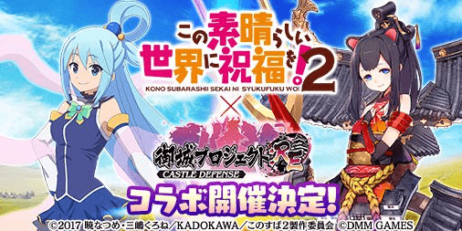
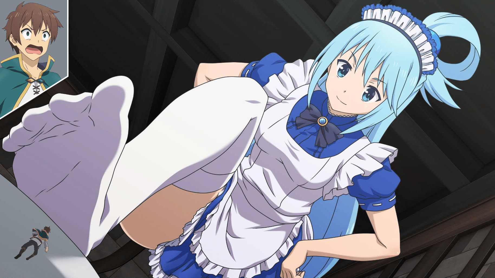
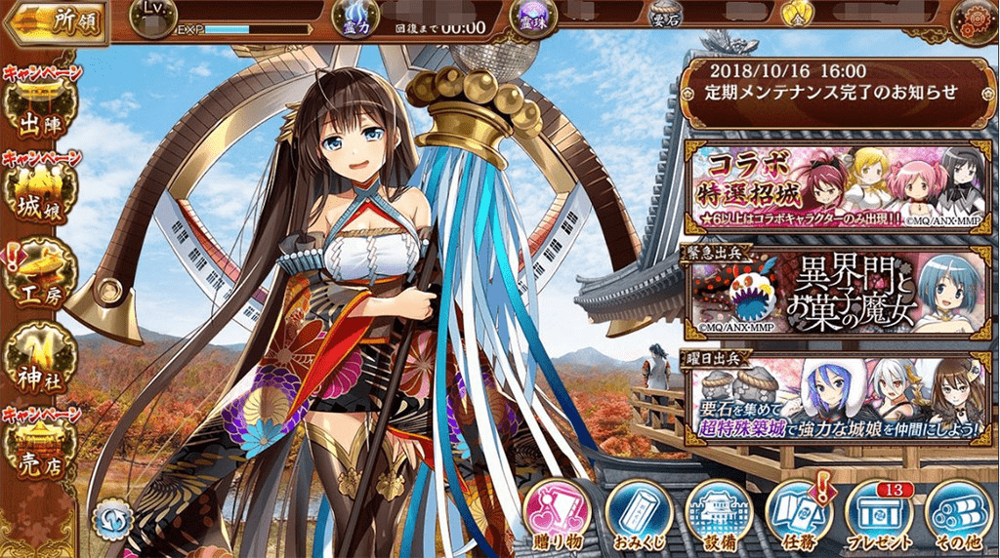

# 我可以期待超大型智障的出現嗎？

作者：cosecant

TID：26055

<title>1</title> <link href="../Styles/Style.css" type="text/css" rel="stylesheet">

# 1

雖然我沒玩過這遊戲就是了

好想在巨大女神體內瘋狂探索ㄛ

<title>2</title> <link href="../Styles/Style.css" type="text/css" rel="stylesheet">

# 2

什麼遊戲，我怎看不到圖片?是我這裡顯示有問題? <title>3</title> <link href="../Styles/Style.css" type="text/css" rel="stylesheet">

# 3

*本帖最後由 萬里風塵 於 2018-11-7 15:54 編輯*

我也没看到图 但是chorme 的Console 来看的话 是为美好的世界献上祝福！x 城娘吗?
补个Console 找到的图好了
看来一般论坛通用的贴图床网址方式会看不到图 先不要用好了 <title>4</title> <link href="../Styles/Style.css" type="text/css" rel="stylesheet">

# 4

 <ignore_js_op>[mbHnYDS.jpg](forum.php?mod=attachment&aid=NzUzNzJ8OTk1MGI2YjF8MTY3NDA2NjkxMHwxODIzMHwyNjA1NQ%3D%3D&nothumb=yes) *(52.09 KB, 下載次數: 2)*

[下載附件](forum.php?mod=attachment&aid=NzUzNzJ8OTk1MGI2YjF8MTY3NDA2NjkxMHwxODIzMHwyNjA1NQ%3D%3D&nothumb=yes)

2018-11-7 15:50 上傳  

</ignore_js_op> <title>5</title> <link href="../Styles/Style.css" type="text/css" rel="stylesheet">

# 5

*本帖最後由 phone2345 於 2018-11-9 21:59 編輯*

從CV到遊戲畫面看不到任何GTS的要素，硬要說的話大概只有「城娘」兩字吧！
補充1：原來還是有的，是我沒認真下載來玩！
補充2：樓主想要的應該是像下圖這樣

補充3：這是另一個遊戲的圖加上PS的成果

<title>6</title> <link href="../Styles/Style.css" type="text/css" rel="stylesheet">

# 6

 <ignore_js_op>[aqua.png](forum.php?mod=attachment&aid=NzUzNzN8NWY5ZmVkMzZ8MTY3NDA2NjkxMHwxODIzMHwyNjA1NQ%3D%3D&nothumb=yes) *(1.16 MB, 下載次數: 3)*

[下載附件](forum.php?mod=attachment&aid=NzUzNzN8NWY5ZmVkMzZ8MTY3NDA2NjkxMHwxODIzMHwyNjA1NQ%3D%3D&nothumb=yes)

2018-11-8 14:56 上傳  

</ignore_js_op> <title>7</title> <link href="../Styles/Style.css" type="text/css" rel="stylesheet">

# 7

「那時說拆帳是因為人家以為只有我會賺大錢嘛」
超級寫實的混蛋 我無法 <title>8</title> <link href="../Styles/Style.css" type="text/css" rel="stylesheet">

# 8

御城我之前有玩過，不過後來想說「城系列有一個就夠了」就沒玩了
猜猜另一個「城系列」是哪個遊戲～

御城確實是有「巨大化」這種東西
不過對於眾網友來說，並沒有你們所謂的"GTS要素"就是了

另外，在主頁時確實是巨大城娘呢(圖來自網路)
<ignore_js_op>

**e3639150.jpg** *(322.54 KB, 下載次數: 0)*

[下載附件](forum.php?mod=attachment&aid=NzUzNzR8OGZmMTYyOTV8MTY3NDA2NjkxMHwxODIzMHwyNjA1NQ%3D%3D&nothumb=yes)

2018-11-7 20:58 上傳

<title>9</title> <link href="../Styles/Style.css" type="text/css" rel="stylesheet">

# 9

你说巨大智障 我还以为是指的巨大爱酱呢，不过爱酱确实巨大化了一次就是了。
<title>10</title> <link href="../Styles/Style.css" type="text/css" rel="stylesheet">

# 10

有人知道这游戏全名叫什么吗？
日文渣，电脑不咋地，没钱，什么都缺，只能去tube上搜搜视频舔舔屏幕了，啧，难受 <title>11</title> <link href="../Styles/Style.css" type="text/css" rel="stylesheet">

# 11

哇……那张阿库娅踩男主的图看起来真的好棒%…… <title>12</title> <link href="../Styles/Style.css" type="text/css" rel="stylesheet">

# 12

> [phone2345 發表於 2018-11-7 18:09](https://giantessnight.cf/gnforum2012/forum.php?mod=redirect&goto=findpost&pid=390623&ptid=26055)
> 從CV到遊戲畫面看不到任何GTS的要素，硬要說的話大概只有「城娘」兩字吧！
> 補充1：原來還是有的，是我沒認 ...

只有这一张么，日语苦手当年玩舰C把脑细胞烧的差不多了
<title>13</title> <link href="../Styles/Style.css" type="text/css" rel="stylesheet">

# 13

> [phone2345 發表於 2018-11-7 18:09](https://giantessnight.cf/gnforum2012/forum.php?mod=redirect&goto=findpost&pid=390623&ptid=26055)
> 從CV到遊戲畫面看不到任何GTS的要素，硬要說的話大概只有「城娘」兩字吧！
> 補充1：原來還是有的，是我沒認 ...

不好意思啊……想问一下这个阿库娅踩男主是出自哪里啊？是御城的城娘么？
<title>14</title> <link href="../Styles/Style.css" type="text/css" rel="stylesheet">

# 14

城娘？我把这个游戏只是看作体型大的手游罢了 <title>15</title> <link href="../Styles/Style.css" type="text/css" rel="stylesheet">

# 15

还以为说的是爱酱。。 <title>16</title> <link href="../Styles/Style.css" type="text/css" rel="stylesheet">

# 16

這是PS4上面的遊戲 賊貴的 還沒有中文版 特典版也沒給啥好東西</ignore_js_op>