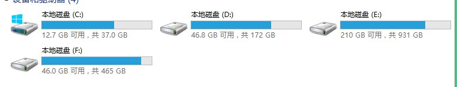
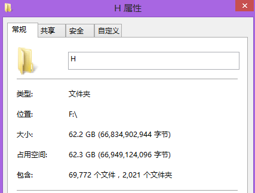

# 我可憐的電腦阿阿阿阿阿阿阿阿阿!!!!!!!!!!!

作者：空白酱

TID：17682

<title>1</title> <link href="../Styles/Style.css" type="text/css" rel="stylesheet">

# 1

小的電腦本身記憶體只有32G，大大們也知道論壇的資源不是一天就可以搜刮完，就算是資深的潛水擋不吐槽只伸手的也要一個星期差不多，所以在GTS資源爆炸的年代，偉大的大大們是如何保存自己的金山，而不用花大錢的呢? <title>2</title> <link href="../Styles/Style.css" type="text/css" rel="stylesheet">

# 2

很简单，不看漫画不看视频。
文字的话来再多也是小case。 <title>3</title> <link href="../Styles/Style.css" type="text/css" rel="stylesheet">

# 3

(´・ω・｀)我有个2T硬盘。【凡是能用钱解决的问题，都不是问题。-by 土豪协会】
(￣y▽￣)说起来以前还认识个网友硬盘容量以PB来计算...不过现在很少联系了...
嗯？没钱？(/▽＼)没钱你玩什么游戏！赶快好好学习去！ <title>4</title> <link href="../Styles/Style.css" type="text/css" rel="stylesheet">

# 4

读卡器+32G的SD卡=无数小型金山 <title>5</title> <link href="../Styles/Style.css" type="text/css" rel="stylesheet">

# 5

*本帖最後由 ssn21 於 2014-8-30 23:23 編輯*

因为一直有搜刮资源的习惯所以现在存放资源的档案夹已经有56GB这么大....
不过很可惜因为没有分类习惯所以杂乱无章基本上记不住标题的都要找上很长时间ORZ
如果资金不充裕的话，USB2.0制式的16/32G随身碟不算贵吧？
资金充裕的话买个500G左右的移动硬碟即可解决大多数问题。
另外，如果网路够快的话，用网络硬碟得了
毕竟各种网络硬碟都是一副贱卖的样子....一旦注册送的空间往往都是以百GB，TB计算，保证不会为空间少而烦恼。
移动设备嫌储存空间小的话，可以试试OTG线接插随身碟，或者有无线传输功能的移动硬碟，非常实用方便。

<title>6</title> <link href="../Styles/Style.css" type="text/css" rel="stylesheet">

# 6

1T硬盘无压力的说 <title>7</title> <link href="../Styles/Style.css" type="text/css" rel="stylesheet">

# 7

。。。先不说资源，32G日常使用难道够吗。。。你该换硬盘了 <title>8</title> <link href="../Styles/Style.css" type="text/css" rel="stylesheet">

# 8

考慮買個隨身碟吧
價位大約2.3百元
或找個類似隨意窩的網站
把資源丟上去
可以設定成只有自己看得到
嘛 放在電腦裡怕被家人發現
放在隨身碟或網站上很方便
不會被家人發現也不用當心當機 <title>9</title> <link href="../Styles/Style.css" type="text/css" rel="stylesheet">

# 9

1.5T + 256MB 都觉得不够用啊 不光H资源 音乐 视频 游戏 这些都是很占空间的 尤其是画面党和金耳朵。。 <ignore_js_op>

**QQ图片20140830230049.jpg** *(20.73 KB, 下載次數: 0)*

[下載附件](forum.php?mod=attachment&aid=NDY0Nzd8NmNiMjIyZjN8MTY3NDA2ODM3NnwxODIzMHwxNzY4Mg%3D%3D&nothumb=yes)

2014-8-31 06:03 上傳

（刚整理完 有过全红的）

只有32G真是不够了 日常使用都不太够吧 WIN8就10几个G
如果这32G是电脑原装的... 那... 够老的了
综上 你真的该换电脑了 嗯....

<ignore_js_op>

**QQ截图20140830230242.png** *(11.65 KB, 下載次數: 0)*

[下載附件](forum.php?mod=attachment&aid=NDY0Nzh8YjQzMDliMTB8MTY3NDA2ODM3NnwxODIzMHwxNzY4Mg%3D%3D&nothumb=yes)

2014-8-31 06:04 上傳

你看我的H资源（不算视频）已经这么多了 我大概伸手了4年吧.. 一定要有个够大的硬盘啊 现在硬盘也不贵...
<title>10</title> <link href="../Styles/Style.css" type="text/css" rel="stylesheet">

# 10

32 GB你确定就算不看gts你够用吗……

换个电脑吧……或买一个随身碟…… <title>11</title> <link href="../Styles/Style.css" type="text/css" rel="stylesheet">

# 11

表示家里台式机4T的容量
还有数不清的U盘和移动硬盘(数据就是生命 <title>12</title> <link href="../Styles/Style.css" type="text/css" rel="stylesheet">

# 12

移动硬盘很方便的，而且现在也不贵，500G的大概在200RMB左右，可以考虑入一个哦。</ignore_js_op></ignore_js_op>