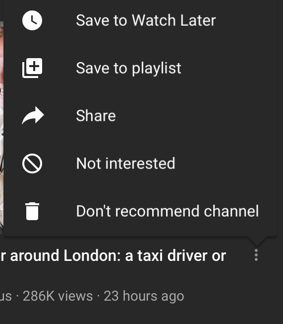
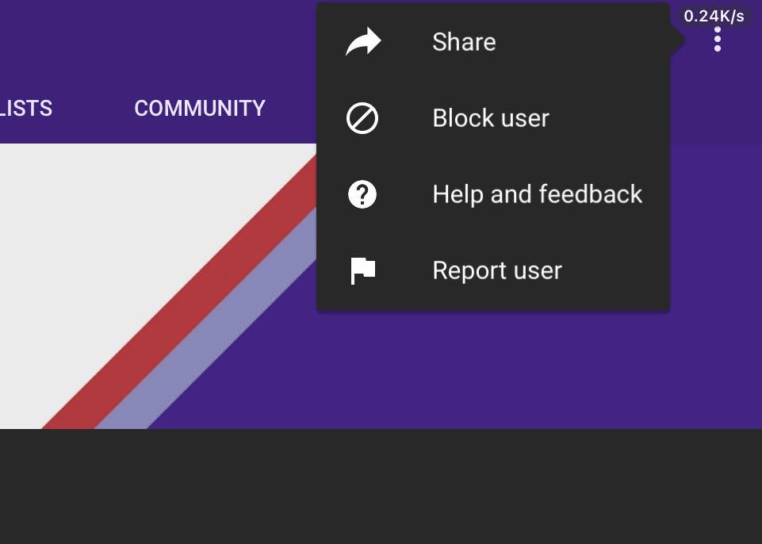

# 我想问一下YouTube怎样能把不喜欢的up主给封锁

作者：乌拉

TID：34553

<title>1</title> <link href="../Styles/Style.css" type="text/css" rel="stylesheet">

# 1

最近YouTube中文老是给我推荐一个我不喜欢的up主在我首页，真的是莫名其妙，我点了好几次踩都没用，倒是那个up每次在它的视频尾声都要说一句： “喜欢记得订阅 不喜欢一定要记得把我封锁”  ，像是故意挑衅我似的，可是我找不到怎样能封锁它的渠道，求助一下见多识广的坛友怎样封锁讨厌的YouTuber，实在困扰我一段时间了，我受不了想发这边求助，问题解决还要麻烦管理把我删帖（多谢） <title>2</title> <link href="../Styles/Style.css" type="text/css" rel="stylesheet">

# 2

每次在YouTube上搜gts，就有那货的视频推荐到我的首页，只是因为我之前点过那人的频道，但是我现在不想它出现在我的首页，我想拉黑它的主页，又找不到渠道，要是能像b站那样直接拉黑看不惯的用户就好了，那样方便多了 <title>3</title> <link href="../Styles/Style.css" type="text/css" rel="stylesheet">

# 3

*本帖最後由 エスト 於 2022-12-11 23:59 編輯*

首页三个点有停止推荐频道吧，点进个人主页也有屏蔽用户 <ignore_js_op>

**53EB5485-6BAE-499E-BD40-C42159CD48EE.jpeg** *(53.1 KB, 下載次數: 0)*

[下載附件](forum.php?mod=attachment&aid=MTAwOTQ2fGE4MWZmZTIwfDE2NzQwNjUyMDJ8MTgyMzB8MzQ1NTM%3D&nothumb=yes)

2022-12-11 23:59 上傳

<ignore_js_op>

**AB21C6F8-A6C4-422A-AE98-E00739C9F11E.jpeg** *(55.43 KB, 下載次數: 0)*

[下載附件](forum.php?mod=attachment&aid=MTAwOTQ3fGM4NDk4ODg4fDE2NzQwNjUyMDJ8MTgyMzB8MzQ1NTM%3D&nothumb=yes)

2022-12-11 23:59 上傳

<title>4</title> <link href="../Styles/Style.css" type="text/css" rel="stylesheet">

# 4

YouTube APP可以直接屏蔽掉的吧 网页不知道 应该也可以 <title>5</title> <link href="../Styles/Style.css" type="text/css" rel="stylesheet">

# 5

管理推荐内容和搜索结果： [https://support.google.com/youtube/answer/6342839?hl=zh-Hans](https://support.google.com/youtube/answer/6342839?hl=zh-Hans) <title>6</title> <link href="../Styles/Style.css" type="text/css" rel="stylesheet">

# 6

> [田棒棒 發表於 2022-12-11 23:59](https://giantessnight.cf/gnforum2012/forum.php?mod=redirect&goto=findpost&pid=521718&ptid=34553)
> 是发gt的那个吧，有说是之前用机器乱发视频的，名字叫giantess的

那个黑人小哥，我只是直接举报。看得我烦
<title>7</title> <link href="../Styles/Style.css" type="text/css" rel="stylesheet">

# 7

是那个死黑鬼对吧，一天用换脸技术发100个视频，感觉他全家都被dts踩死了一样，天天恶心人。
有个youtube插件可以把不喜欢看的作者屏蔽掉，你试试 <title>8</title> <link href="../Styles/Style.css" type="text/css" rel="stylesheet">

# 8

肯定是那个黑人！ 恶心的要死一直发GT <title>9</title> <link href="../Styles/Style.css" type="text/css" rel="stylesheet">

# 9

艹，居然有这样的人。不过这种问题的话。感觉直接上网搜会更快呢</ignore_js_op></ignore_js_op>