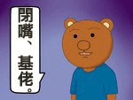

# 我愛巨娘已到瘋狂的程度了...

作者：chennaipeng

TID：14531

<title>1</title> <link href="../Styles/Style.css" type="text/css" rel="stylesheet">

# 1

本人只是一介學生.....不知道其他人知道我喜歡這個他們一定覺得我很變態吧?
我喜歡巨大娘.......但是只能以幻想的方式...
但是能交流的朋友和長老們也很少.....
想當個傳教士但是(被認為是紳士)
我該怎麼辦呢~
希望有些朋友們,同志們
能就協助我
<title>2</title> <link href="../Styles/Style.css" type="text/css" rel="stylesheet">

# 2

这东西现实中确实很难找到聊天的同伴。。。来Q群聊吧。。。 <title>3</title> <link href="../Styles/Style.css" type="text/css" rel="stylesheet">

# 3

請搭上進擊風散播GTS
你知道進擊的巨人吧˙˙
<title>4</title> <link href="../Styles/Style.css" type="text/css" rel="stylesheet">

# 4

楼上的这个方法非常好 而且同人图还挺多的 <title>5</title> <link href="../Styles/Style.css" type="text/css" rel="stylesheet">

# 5

*本文章最後由 xnr 於 2013-6-10 22:39 編輯*

有爱的人就去创作，这是圈内的唯一真理。

愿意投身创作的人，都是爱到疯狂的程度的，我相信你能走到创作这一步。

顺便一说：你头像的原作者是日本的SS，我投身创作就是被他带动起来的。 <title>6</title> <link href="../Styles/Style.css" type="text/css" rel="stylesheet">

# 6

真爱的话肯定会去创作

另外，如果觉得别人会说你变态，可以这么考虑：就算你不是爱gts而是恋足，一样有人说你变态；就算你不恋足只爱萝莉，更会有人报警抓你；就算你什么特殊爱好都没有只是喜欢看女生，一样会被说是色狼；最后的最后你和我一样对女生都没兴趣，又会有人说你是基佬

不变态其实超难的 <title>7</title> <link href="../Styles/Style.css" type="text/css" rel="stylesheet">

# 7

呢 恨自己早出生了100年 100年后也许就有虚拟现实之类的了 <title>8</title> <link href="../Styles/Style.css" type="text/css" rel="stylesheet">

# 8

> 小劍 發表於 2013-6-10 23:37 
> 真爱的话肯定会去创作
> 
> 另外，如果觉得别人会说你变态，可以这么考虑：就算你不是爱gts而是恋足，一样有人 ...

<ignore_js_op>

**12.jpg** *(5.78 KB, 下載次數: 0)*

[下載附件](forum.php?mod=attachment&aid=MzQ2OTl8ZjNmMDMyOGN8MTY3NDA2ODQ3MnwxODIzMHwxNDUzMQ%3D%3D&nothumb=yes)

2013-6-11 00:25 上傳

————————————————————————————————

100年哪够

最少500年起

先永生再说

<title>9</title> <link href="../Styles/Style.css" type="text/css" rel="stylesheet">

# 9

.
這個論壇就是讓你解決這方面煩惱用的。
來多聊一些你對巨大少女的想法吧！多與同好互動能讓你有不孤單的感覺！

不過我對傳教這種事還是持消極意見啦。
我覺得就順其自然，引導那些不管什麼原因而問起巨大少女的人就好囉。
當然最近某當紅作品的熱門程度確實是個助力啦。
儘管我討厭GT，卻也無法否認這點，從過去到現在大概沒有比這時更好推廣的時機了。 <title>10</title> <link href="../Styles/Style.css" type="text/css" rel="stylesheet">

# 10

會嗎XD
我覺得時間會沖淡一切...
我學生時期也很迷 很瘋狂
但踏入社會後為五斗米折腰,就沒那麼多興致了... <title>11</title> <link href="../Styles/Style.css" type="text/css" rel="stylesheet">

# 11

哈哈好像很有道理
<title>12</title> <link href="../Styles/Style.css" type="text/css" rel="stylesheet">

# 12

"想當個傳教士但是(被認為是紳士)
我該怎麼辦呢~
希望有些朋友們,同志們
能就協助我"

我只能说千万别，你可以和别的绅士谈论欧派、大腿，但是gts还是自己喜欢就好咯=v= <title>13</title> <link href="../Styles/Style.css" type="text/css" rel="stylesheet">

# 13

>>不知道其他人知道我喜歡這個   他們一定覺得我很變態吧?
                                                     ↑ 沒必要想這個
推廣非主流的興趣 本來就很難了
我自己也想推  但 就是隨緣的心態 有遇到熟的 能試試看 別期望太大

我覺得 你要學會他們平常的個性怎樣 再想要不要推廣

而且你要推廣一定自己說服力要夠
其中很重要的是自信
自己都不相信自己可以了
那又有誰會相信你?

>>我喜歡巨大娘.......但是只能以幻想的方式...
那又如何 很多喜愛巨大娘的同志也是如此啊~~~~
我自己也是~~
這沒甚麼 不要執著於推廣,先發自內心 做好本分喜愛巨大娘

有看過三個傻瓜嗎? "追求卓越，成功自然會追著你跑"

>>但是能交流的朋友和長老們也很少.....
想當個傳教士但是(被認為是紳士)
我該怎麼辦呢~
希望有些朋友們,同志們
能就協助我

同上 為什麼你一定想著要推廣出去,受挫再來委屈呢?

這裡如此多的同好在,一起分享 交流 是很愉快的事情^^

你能

1\. 私信找我聊 我也超愛巨大娘的喔^^~~~

2.創作  ^^

希望這些對你有幫助~

<title>14</title> <link href="../Styles/Style.css" type="text/css" rel="stylesheet">

# 14

多加同好好友吧，喜爱没有什么错的</ignore_js_op>