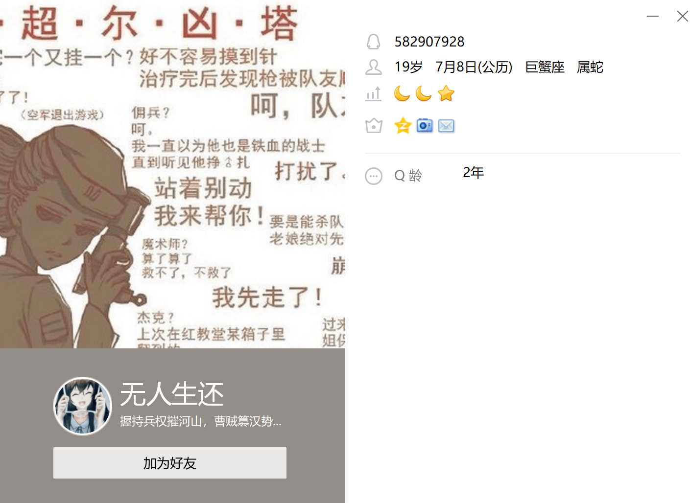
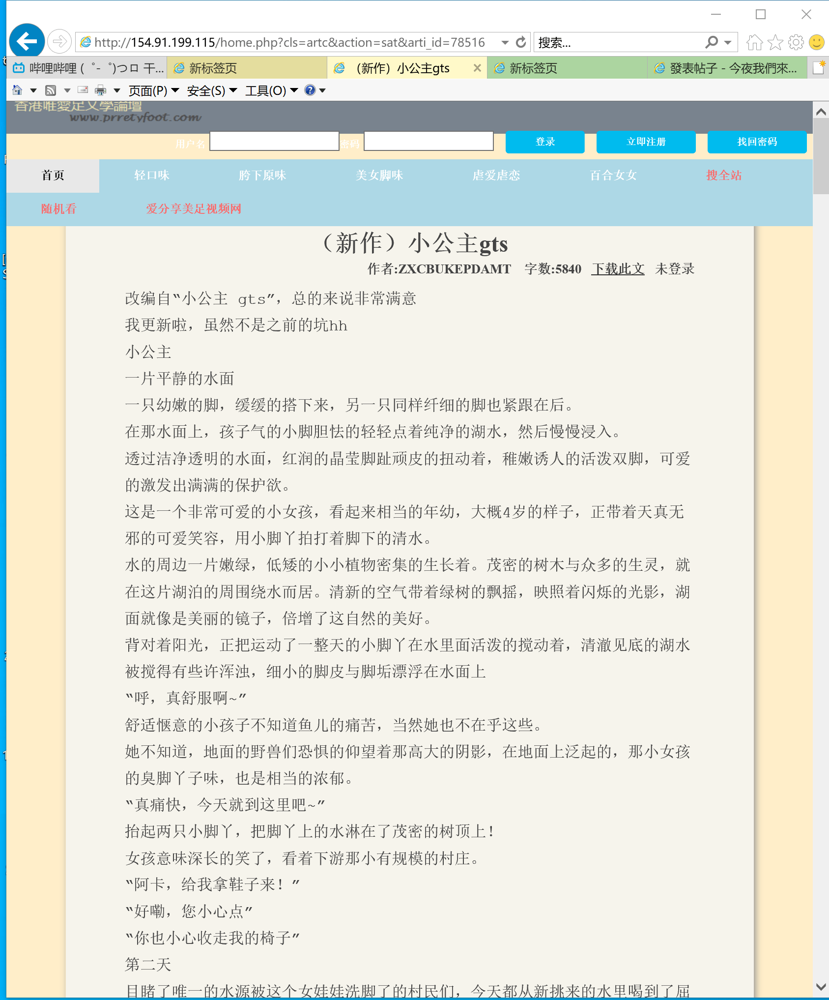
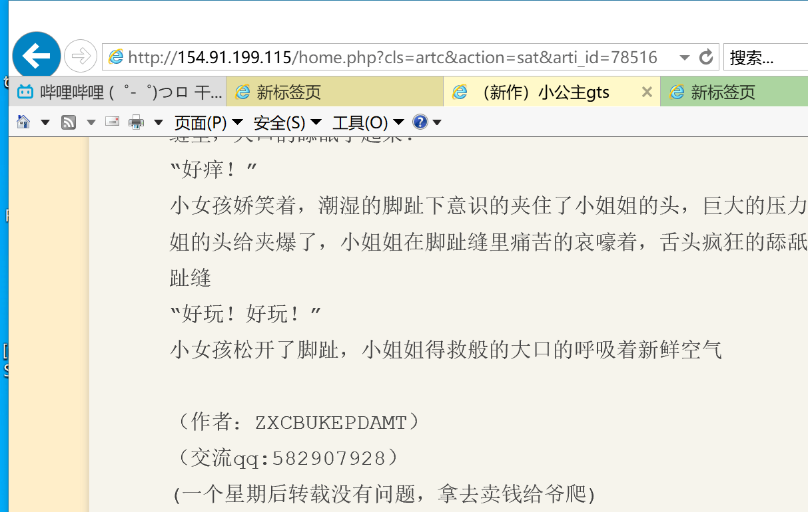

# 我的文章被这个人盗用发在了唯爱足

作者：changliuliu

TID：29194

<title>1</title> <link href="../Styles/Style.css" type="text/css" rel="stylesheet">

# 1

盗用地址 ：   [http://154.91.199.115/home.php?cls=artc&action=sat&arti_id=78516](http://154.91.199.115/home.php?cls=artc&action=sat&arti_id=78516)

盗用人的QQ：
<ignore_js_op>

**QQ图片20200803131859.png** *(661.96 KB, 下載次數: 0)*

[下載附件](forum.php?mod=attachment&aid=ODQyODZ8ODNjZjRlNzZ8MTY3NDA2NjIxOXwxODIzMHwyOTE5NA%3D%3D&nothumb=yes)

2020-8-3 13:20 上傳

盗用页面：
<ignore_js_op>

**QQ图片20200803131849.png** *(329.82 KB, 下載次數: 0)*

[下載附件](forum.php?mod=attachment&aid=ODQyODV8OTZkNWIwMzh8MTY3NDA2NjIxOXwxODIzMHwyOTE5NA%3D%3D&nothumb=yes)

2020-8-3 13:20 上傳

<ignore_js_op>

**QQ图片20200803131854.png** *(103.98 KB, 下載次數: 0)*

[下載附件](forum.php?mod=attachment&aid=ODQyODR8YmQzZDZmZmZ8MTY3NDA2NjIxOXwxODIzMHwyOTE5NA%3D%3D&nothumb=yes)

2020-8-3 13:20 上傳

前面80%是我写的，后面还加了一段，不知道谁写的，强行拼上的

<title>2</title> <link href="../Styles/Style.css" type="text/css" rel="stylesheet">

# 2

啊……这种烦死人了，以前我翻译的也被盗过一次…… <title>3</title> <link href="../Styles/Style.css" type="text/css" rel="stylesheet">

# 3

盗文章可耻，但是，我的破文章还没被盗过，这大概是渣文的优势？？？？？
大概有一天，我的文章被人抄袭了，大概就是水平到家的标志吧
（胡言乱语.jpg) <title>4</title> <link href="../Styles/Style.css" type="text/css" rel="stylesheet">

# 4

有申诉通道吗？这种网站应该是会讲道理的 <title>5</title> <link href="../Styles/Style.css" type="text/css" rel="stylesheet">

# 5

GN官方有沒有義務防止會員文章被盜呢？
之前有兩個帖子再討論干擾碼是否能防盜的問題：
[https://giantessnight.com/gnforu ... iewthread&tid=28767](https://giantessnight.com/gnforum2012/forum.php?mod=viewthread&tid=28767)
[https://giantessnight.com/gnforu ... iewthread&tid=28774](https://giantessnight.com/gnforum2012/forum.php?mod=viewthread&tid=28774)

得到的結論是干擾碼不能防盜，只會干擾正常用戶閱讀。但對於discuz來說，干擾碼已經是最高級別的防盜手段了，比起防右鍵複製只須關掉javascript，這種干擾碼還需要透過插件或是複雜的查找取代才能去除，使用論壇預設功能中最高級別的防盜代表了論壇在防盜文上積極的態度，但即使如此面對魔高一丈的盜文者依然沒有辦法。

如果說防盜措施無效，又會影響正常用戶，是否讓管理宣布不再處理防盜文相關設定，也完全不需對文被盜的事負責，僅事情況道義上聯絡對方管理員告知該站有人盜文即可？或者完全不處理，全由用戶自行與對方溝通比較好呢？ <title>6</title> <link href="../Styles/Style.css" type="text/css" rel="stylesheet">

# 6

瓜啊，你被盗的文可不止这一篇
<title>7</title> <link href="../Styles/Style.css" type="text/css" rel="stylesheet">

# 7

拿去卖钱给爷爬可还行。
<title>8</title> <link href="../Styles/Style.css" type="text/css" rel="stylesheet">

# 8

看到前面说西瓜大佬的文被盗不止一篇了，感觉心里很不是滋味。。还是建议去举报或者申诉，不能不了了之。盗文实在可耻 <title>9</title> <link href="../Styles/Style.css" type="text/css" rel="stylesheet">

# 9

> [phone2345 發表於 2020-8-3 15:59](https://giantessnight.cf/gnforum2012/forum.php?mod=redirect&goto=findpost&pid=443682&ptid=29194)
> GN官方有沒有義務防止會員文章被盜呢？
> 之前有兩個帖子再討論干擾碼是否能防盜的問題：
> https://giantessni ...

其实我自己也直接保存了不少文章……因为已经遇过不少作者（尤其是西方的）直接突然删完全部帖子，然后文就没了，这里是比较少这种事啦，但是也还是有看到喜欢的文章就保存的习惯
代码挺麻烦的
<title>10</title> <link href="../Styles/Style.css" type="text/css" rel="stylesheet">

# 10

这种事情其实没太大的办法,会觉得很奇怪的原因是因为GN是一个较为封闭的社区,所以出现了类似的事情容易引起讨论.
但是如果放到外面,其实就算是商业性的小说也是被人盗到满天飞,毕竟只要能让人看到的东西,是没办法通过技术手段来完全规避盗用问题的.
就算技术真的很高级了完全挡住了所有的非正常手段,但是还有最蠢的方法人肉打字重新给你打出来..... <title>11</title> <link href="../Styles/Style.css" type="text/css" rel="stylesheet">

# 11

盗文章过年买不到车票回家！
<title>12</title> <link href="../Styles/Style.css" type="text/css" rel="stylesheet">

# 12

我唯一能想到的完美杜绝盗文的办法，就是亲自到每一个知名网站上去发自己的文……
目前我就在四个论坛上发我的文，快要累死了……</ignore_js_op></ignore_js_op></ignore_js_op>