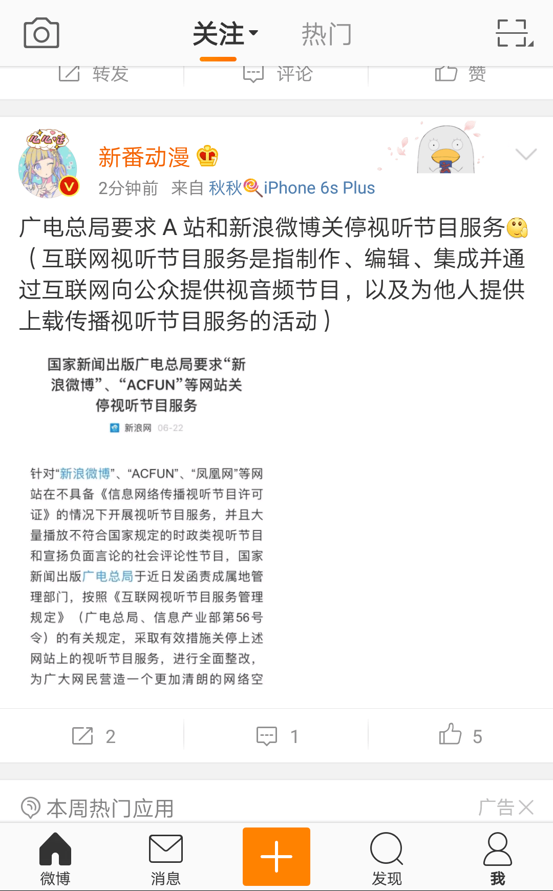

# 所以说，为什么

作者：ZHI

TID：23301

<title>1</title> <link href="../Styles/Style.css" type="text/css" rel="stylesheet">

# 1

<ignore_js_op>

**IMG_20170622_183520.png** *(527.42 KB, 下載次數: 0)*

[下載附件](forum.php?mod=attachment&aid=Njg0MDJ8YzI1NGY5ZDB8MTY3NDA2NzQ1NXwxODIzMHwyMzMwMQ%3D%3D&nothumb=yes)

2017-6-22 18:38 上傳

黑人问号
<title>2</title> <link href="../Styles/Style.css" type="text/css" rel="stylesheet">

# 2

大概是要备案管理吧，问号也没办法，目睹了这么多的变化，也就这样了 <title>3</title> <link href="../Styles/Style.css" type="text/css" rel="stylesheet">

# 3

> [Lanclot 發表於 2017-6-22 19:05](https://giantessnight.cf/gnforum2012/forum.php?mod=redirect&goto=findpost&pid=336557&ptid=23301)
> 大概是要备案管理吧，问号也没办法，目睹了这么多的变化，也就这样了

不是说缺那个什么东西？是不是说只要那些上交了足够的钱办理一个就可以了？ <title>4</title> <link href="../Styles/Style.css" type="text/css" rel="stylesheet">

# 4

多方面吧，政策东西现在慢慢觉得太深奥了 <title>5</title> <link href="../Styles/Style.css" type="text/css" rel="stylesheet">

# 5

*本帖最後由 michael 於 2017-6-22 22:22 編輯*

A站10年了……虽说现在不是最主流的视频站，不过用户流量还是相当可观
应该问题不大吧，是只限制的上传通道？

~~虽说跟我没啥关系，我只去B站~~ <title>6</title> <link href="../Styles/Style.css" type="text/css" rel="stylesheet">

# 6

所以说是不让上传视频了还是禁止原创= =？还是禁止直播什么的.... <title>7</title> <link href="../Styles/Style.css" type="text/css" rel="stylesheet">

# 7

坦白说，其实跟咱们这个爱好关系不大。我们的主要根据地也都不在大陆。
但是作为一个左比五毛，我是真怕这帮子弱智领导开历史倒车，又他妈搞言论管制，这是最可怕的。
天朝上层割裂太严重，正经搞军事的，搞民生的，搞发展的有，还有一帮子手里有点权力不用就闲的卵蛋子疼的。真的气，弱智玩意毁我华夏根基。 <title>8</title> <link href="../Styles/Style.css" type="text/css" rel="stylesheet">

# 8

> [michael 發表於 2017-6-22 22:20](https://giantessnight.cf/gnforum2012/forum.php?mod=redirect&goto=findpost&pid=336585&ptid=23301)
> A站10年了……虽说现在不是最主流的视频站，不过用户流量还是相当可观
> 应该问题不大吧，是只限制的上传通道 ...

所以说，这么久了来这么一出真的好吗？
<title>9</title> <link href="../Styles/Style.css" type="text/css" rel="stylesheet">

# 9

> [o_0MorToy 發表於 2017-6-23 00:00](https://giantessnight.cf/gnforum2012/forum.php?mod=redirect&goto=findpost&pid=336599&ptid=23301)
> 所以说是不让上传视频了还是禁止原创= =？还是禁止直播什么的....

虽然是禁止发布，但是微博不是秒拍吗？我感觉和微博没关系。主要是散发。也就是说，视频和图文分开吧。总之很迷... <title>10</title> <link href="../Styles/Style.css" type="text/css" rel="stylesheet">

# 10

> [Luffy 發表於 2017-6-23 00:28](https://giantessnight.cf/gnforum2012/forum.php?mod=redirect&goto=findpost&pid=336604&ptid=23301)
> 坦白说，其实跟咱们这个爱好关系不大。我们的主要根据地也都不在大陆。
> 但是作为一个左比五毛，我是真怕这 ...

噗，不要激动。我也觉得关系不大。我们只需要吃西瓜就好了。你要西瓜吗？1块钱(｢･ω･)｢嘿 <title>11</title> <link href="../Styles/Style.css" type="text/css" rel="stylesheet">

# 11

下半年有个很重要的会议嘛，五年一次的。。应该是为这事管制言论。。 <title>12</title> <link href="../Styles/Style.css" type="text/css" rel="stylesheet">

# 12

> [FZH19970107 發表於 2017-6-23 15:28](https://giantessnight.cf/gnforum2012/forum.php?mod=redirect&goto=findpost&pid=336659&ptid=23301)
> 下半年有个很重要的会议嘛，五年一次的。。应该是为这事管制言论。。

哈？不是吧，这个只是不能散发视频...音频的规定。文字图片还是能够发的 <title>13</title> <link href="../Styles/Style.css" type="text/css" rel="stylesheet">

# 13

妄议时政，希望楼主赶紧留辫子 <title>14</title> <link href="../Styles/Style.css" type="text/css" rel="stylesheet">

# 14

虽然不怎么逛A站，但A站很多资源都被铲干净了</ignore_js_op>