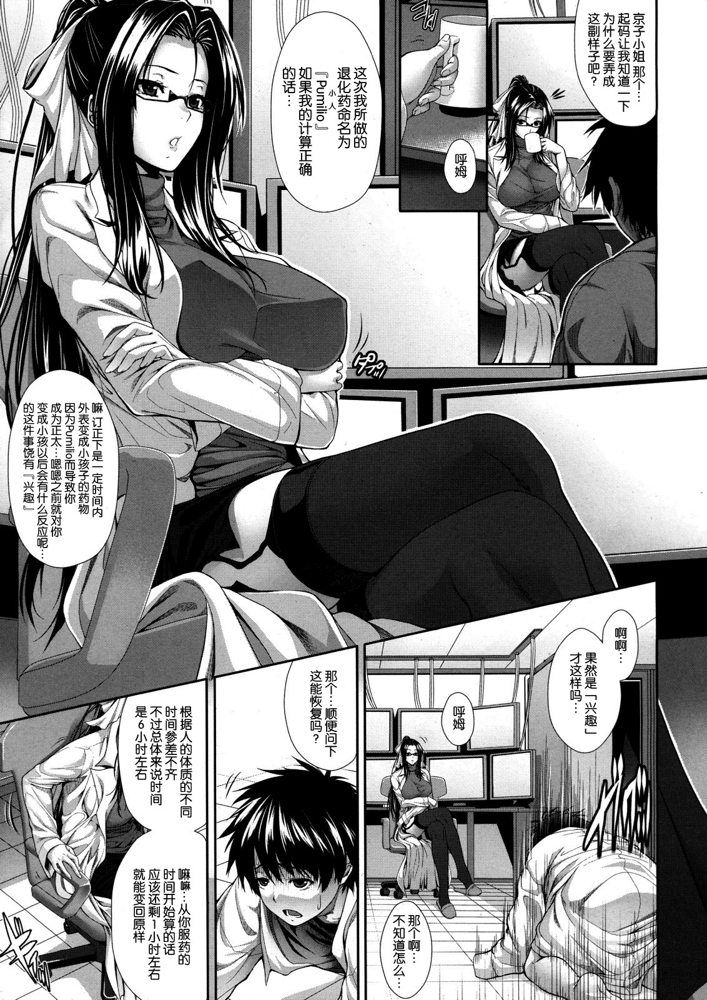

# 扫本时看见的.

作者：sunnygoon

TID：13648

<title>1</title> <link href="../Styles/Style.css" type="text/css" rel="stylesheet">

# 1

今天日常在ex扫本,也并没有刻意去搜索gts相关的.....
到是看到了个擦边的东西...."小人"药..不过只是缩小到正太水平罢了.
漫画:[ズッキーニ] 僕は彼女の実験体！
地址:[http://exhentai.org/g/546038/32b70eeab3/](http://exhentai.org/g/546038/32b70eeab3/)

<title>2</title> <link href="../Styles/Style.css" type="text/css" rel="stylesheet">

# 2

 <ignore_js_op>[005.jpg](forum.php?mod=attachment&aid=MzE3ODV8NzVkNTc3NTJ8MTY3NDA2ODU0NHwxODIzMHwxMzY0OA%3D%3D&nothumb=yes) *(796.93 KB, 下載次數: 12)*

[下載附件](forum.php?mod=attachment&aid=MzE3ODV8NzVkNTc3NTJ8MTY3NDA2ODU0NHwxODIzMHwxMzY0OA%3D%3D&nothumb=yes)

2012-12-4 23:40 上傳  

</ignore_js_op> <title>3</title> <link href="../Styles/Style.css" type="text/css" rel="stylesheet">

# 3

LZ扫本辛苦，话说原来是中文么，向LZ致敬。 <title>4</title> <link href="../Styles/Style.css" type="text/css" rel="stylesheet">

# 4

奇怪，無論怎麼調整設置，我這裡看紳士站一直都是熊貓的說。。。 <title>5</title> <link href="../Styles/Style.css" type="text/css" rel="stylesheet">

# 5

看到熊喵主要是cookie作怪，
先去e-绅士申请一个账号并且登陆，
然后清除浏览器的cookie
然后你就能看到各种触手萝莉和谐物了
(酱紫步骤详细了么……) <title>6</title> <link href="../Styles/Style.css" type="text/css" rel="stylesheet">

# 6

EX我只是去注册了一下就能看了哎.....之前还有攻略说要清除神马神马之类的，结果注册一下就可以看了嘛~是不是要换个浏览器？ <title>7</title> <link href="../Styles/Style.css" type="text/css" rel="stylesheet">

# 7

上不去呀  能从发一下么
<title>8</title> <link href="../Styles/Style.css" type="text/css" rel="stylesheet">

# 8

> 517772499 發表於 2013-1-16 13:42 
> 上不去呀  能从发一下么

[http://giantessnight.com/gnforum ... &extra=page%3D2](http://giantessnight.com/gnforum2012/forum.php?mod=viewthread&tid=13402&extra=page%3D2)
要是你只看到一个熊猫就按照这里面所说的方法，才能上exhentai。
<title>9</title> <link href="../Styles/Style.css" type="text/css" rel="stylesheet">

# 9

传送门阵亡啦